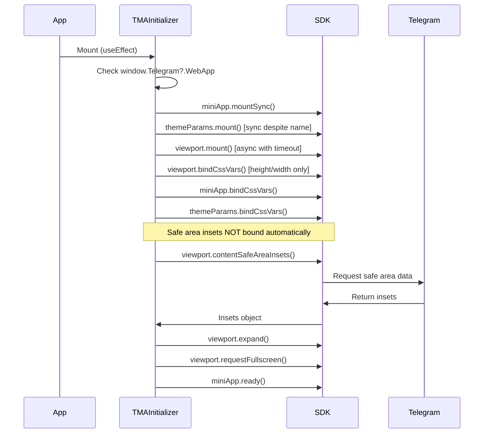
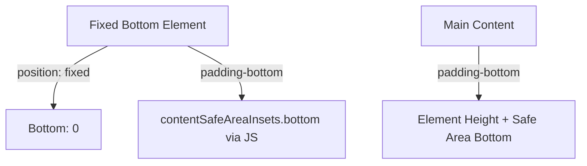
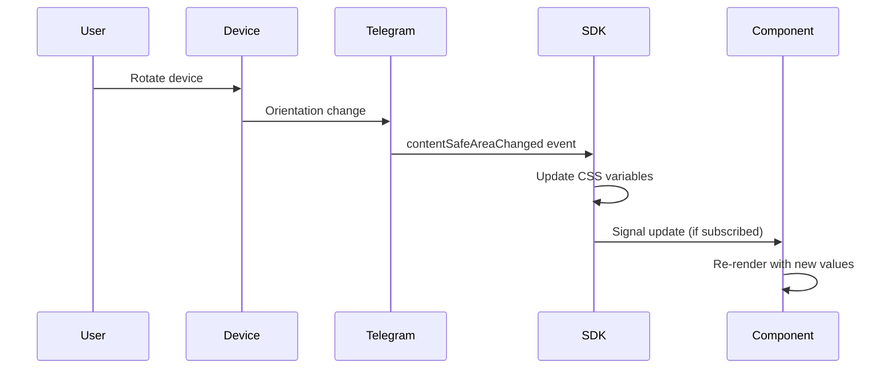

# Telegram Mini App Safe Area Configuration

## Problem Statement

When running the Telegram Mini App in Full Screen (Full Size) mode on iOS devices, the following issues occur:

- Content is rendered underneath the device's status bar
- Telegram's built-in upper UI elements (close button, header, shadows) overlap the application content
- Content may extend underneath the bottom system areas (Home Indicator, navigation buttons)
- Standard CSS environment variables `env(safe-area-inset-*)` return `0` and do not work within Telegram's WebView

The root cause is that in fullscreen mode, the WebView expands to cover the entire screen, but Telegram does not propagate standard iOS safe area values. Instead, Telegram provides its own safe area mechanism through the Telegram Web App API.

## Technical Context

### Technology Stack
- **Framework**: Next.js 15.x with App Router
- **Language**: TypeScript
- **SDK**: @tma.js/sdk
- **Styling**: Tailwind CSS
- **Package Manager**: PNPM

### Safe Area Concepts

| Concept | Description | Use Case |
|---------|-------------|----------|
| **safeAreaInset** | Insets accounting for device-level system areas only (notch, status bar, home indicator) | Basic device boundary protection |
| **contentSafeAreaInset** | Insets accounting for both system areas AND Telegram UI elements (header, bottom controls) | Recommended for fullscreen mode - ensures content is not obscured by any UI |

### Why Standard CSS Variables Don't Work

Standard iOS safe area variables (`env(safe-area-inset-top)`, `env(safe-area-inset-bottom)`) return `0` inside Telegram Mini Apps because:
- The app runs inside Telegram's custom WebView
- Telegram manages safe areas internally and does not expose standard Safari-like environment variables
- Developers must use Telegram-specific APIs (`safeAreaInset` and `contentSafeAreaInset` from `Telegram.WebApp`)

## Solution Design

### Architecture Overview

The solution involves three key layers:

```mermaid
graph TD
    A[Telegram WebView] -->|Provides| B[Safe Area Data]
    B --> C[@tma.js/sdk]
    C -->|Binds| D[CSS Custom Properties]
    C -->|Exposes| E[JavaScript Signals]
    D --> F[SafeAreaProvider Component]
    E --> F
    F --> G[Application Content]
    
    H[Viewport Meta Tag] -->|Enables| I[viewport-fit=cover]
    I --> A
```

### Component Architecture

```mermaid
graph LR
    A[RootLayout] --> B[TMAInitializer]
    A --> C[SafeAreaProvider]
    C --> D[Page Components]
    
    B -->|Initializes SDK| E[@tma.js/sdk]
    B -->|Binds CSS Vars| E
    B -->|Requests Fullscreen| E
    
    C -->|Applies Padding| F[CSS Variables]
    E -->|Updates| F
```

## Implementation Design

### 1. Viewport Configuration

**Objective**: Enable the application to occupy the full screen area, including regions around device notches.

**Approach**: Add viewport meta tag to the root layout with `viewport-fit=cover` parameter.

**Location**: `app/layout.tsx`

**Rationale**: The `viewport-fit=cover` directive instructs the WebView to extend into the unsafe areas, which the application will then control through manual padding adjustments.

### 2. SDK Initialization Component

**Component**: `TMAInitializer`

**Type**: Client-side component

**Critical Understanding**: 
- `viewport.bindCssVars()` ONLY creates viewport dimension variables (`--tg-viewport-height`, `--tg-viewport-width`, `--tg-viewport-stable-height`)
- It does NOT create safe area inset CSS variables
- Safe area insets must be handled via JavaScript signals or manual CSS variable creation

**Responsibilities**:
- Verify Telegram environment via `window.Telegram?.WebApp` check
- Initialize the @tma.js/sdk components (no separate `init()` method in v3.x)
- Mount miniApp module synchronously via `miniApp.mountSync()`
- Mount themeParams synchronously via `themeParams.mount()` (note: synchronous despite method name)
- Mount viewport module asynchronously via `await viewport.mount()` (with timeout protection)
- Bind CSS custom properties for viewport dimensions via `viewport.bindCssVars()`
- Bind CSS custom properties for miniApp via `miniApp.bindCssVars()`
- Bind CSS custom properties for theme via `themeParams.bindCssVars()`
- Optionally create custom CSS variables for safe area insets manually
- Request fullscreen mode if available
- Signal application readiness to Telegram via `miniApp.ready()`

**SDK v3.x Mount Method Changes**:
- `miniApp.mountSync()` - synchronous mount (recommended)
- `themeParams.mount()` - synchronous despite name (no mountSync in v3.x)
- `viewport.mount()` - asynchronous, returns Promise

**Lifecycle**:


**Error Handling**: 
- Wrap all operations in try-catch blocks, as some SDK methods may not be available on all platforms or Telegram versions
- Add timeout protection for `viewport.mount()` - known to hang in some cases (recommended: 5 second timeout)
- Check `viewport.isMounted()` before accessing inset values
- Provide fallback values (0) if safe area APIs are unavailable

### 3. Safe Area Provider Component

**Component**: `SafeAreaProvider`

**Type**: Client-side wrapper component

**Purpose**: Apply safe area insets as padding to ensure content remains within visible boundaries.

**CRITICAL NOTE**: The `viewport.bindCssVars()` method from @tma.js/sdk does NOT automatically create CSS variables for safe area insets. It only creates:
- `--tg-viewport-height`
- `--tg-viewport-width`
- `--tg-viewport-stable-height`

Safe area insets are ONLY available through JavaScript signals and must be handled manually.

**Two Implementation Strategies**:

#### Strategy A: JavaScript Signals with Subscription (Primary Approach)

**How it works**:
- Subscribes to `viewport.contentSafeAreaInsets` signal
- Updates React state when insets change
- Applies padding through inline styles

**API Methods Used**:
- `viewport.contentSafeAreaInsets()` - Returns current insets object
- `viewport.contentSafeAreaInsets.sub(callback)` - Subscribe to reactive updates (returns unsubscribe function)
- `viewport.contentSafeAreaInsets.unsub(callback)` - Alternative unsubscribe method

**CRITICAL**: Use `.sub()` method, NOT `.subscribe()`. The SDK uses abbreviated method names.

**Environment Check**:
Instead of importing `isTMA()` from a separate package, use native Telegram WebApp detection:
```
function isTelegramEnvironment(): boolean {
  return typeof window !== 'undefined' && window.Telegram?.WebApp !== undefined;
}
```

**Benefits**:
- Official SDK-recommended approach
- Automatic reactivity to viewport/orientation changes
- No manual CSS variable management
- Type-safe with TypeScript

**Implementation Pattern**:
- Check if running in Telegram environment via native check: `typeof window !== 'undefined' && window.Telegram?.WebApp`
- Mount synchronous components: `miniApp.mountSync()`, `themeParams.mountSync()`
- Mount viewport asynchronously with timeout protection
- Check `viewport.isMounted()` before accessing insets
- Read initial inset values
- Subscribe to changes using `.sub()` method
- Store unsubscribe function for cleanup
- Update component state on changes
- Apply as inline styles
- Return cleanup function from useEffect
- Call `miniApp.ready()` to signal initialization complete

#### Strategy B: Manual CSS Variables (Alternative Approach)

**How it works**:
- Manually creates CSS custom properties on document root
- Reads values from `viewport.contentSafeAreaInsets()`
- Updates CSS variables when values change
- Allows using CSS-based padding rules

**Benefits**:
- Enables CSS-based layout adjustments
- Separation between logic and styling
- Can be used globally across components

**Drawbacks**:
- Requires manual subscription management
- Extra step of creating and updating CSS variables
- More complex initialization logic

**When to use**: When you prefer CSS-based styling or need safe area values accessible globally in stylesheets.

### 4. Global Styling Strategy

**Objectives**:
- Remove default browser margins/padding
- Prevent body-level scrolling issues
- Ensure proper scroll behavior within the safe area container
- Prevent overscroll bounce effects

**Key CSS Rules**:

| Selector | Property | Value | Rationale |
|----------|----------|-------|-----------|
| `html, body` | `margin, padding` | `0` | Remove default spacing |
| `html, body` | `overflow` | `hidden` | Prevent body-level scroll |
| `html, body` | `overscroll-behavior` | `none` | Prevent bounce/pull-to-refresh |
| `.safe-area-container` | `padding-*` | Applied via inline styles (Strategy A) or manual CSS vars (Strategy B) | Apply safe area insets |
| `.safe-area-container` | `overflow-y` | `auto` | Enable scrolling within safe zone |
| `.safe-area-container` | `box-sizing` | `border-box` | Include padding in height calculations |

**IMPORTANT**: Do NOT rely on CSS variables like `--tg-content-safe-area-inset-*` being automatically available. These must be created manually if using Strategy B.

### 5. Fixed Bottom Elements Handling

**Scenario**: Navigation bars, action buttons, or toolbars that must remain fixed at the bottom.

**Challenge**: These elements must respect the bottom safe area inset (home indicator zone).

**Solution Design**:



**Implementation Pattern**:
- Fixed element receives `padding-bottom` calculated from `viewport.contentSafeAreaInsets().bottom`
- Apply via inline styles or subscribe to inset changes and update CSS variable
- Main scrollable content receives `padding-bottom` equal to fixed element height PLUS safe area bottom inset
- This prevents content from being hidden beneath the fixed element

**For CSS-based approach (Strategy B)**:
- Create `--tg-content-safe-area-inset-bottom` manually
- Update it via subscription
- Reference in CSS: `padding-bottom: var(--tg-content-safe-area-inset-bottom, 0px);`

### 6. Event Handling for Dynamic Changes

**Events to Handle**:
- `safeAreaChanged`: Fired when device safe area changes
- `contentSafeAreaChanged`: Fired when Telegram UI safe area changes
- Orientation changes
- Fullscreen mode transitions

**Handling Strategy**:
- **Strategy A (Signals)**: Subscribe using `viewport.contentSafeAreaInsets.sub(callback)` - receives updates automatically
- **Strategy B (Manual CSS vars)**: Subscribe to signal and update CSS variables via `document.documentElement.style.setProperty()`
- Both strategies require active subscription management with proper cleanup
- **CRITICAL**: Use `.sub()` method, NOT `.subscribe()` - returns unsubscribe function
- **CRITICAL**: `bindCssVars()` does NOT handle safe area inset updates - it only handles viewport height/width
- Always return cleanup function from useEffect to prevent memory leaks

**Event Flow**:


## Configuration Parameters

### Viewport Meta Tag Parameters

| Parameter | Value | Purpose |
|-----------|-------|---------|
| `width` | `device-width` | Match device screen width |
| `initial-scale` | `1` | No initial zoom |
| `maximum-scale` | `1` | Prevent user zoom |
| `user-scalable` | `no` | Disable pinch-to-zoom |
| `shrink-to-fit` | `no` | Prevent viewport shrinking |
| `viewport-fit` | `cover` | **Critical**: Extend into unsafe areas |

### SDK Initialization Options

| Method | Availability Check | Fallback Behavior |
|--------|-------------------|-------------------|
| `miniApp.mountSync()` | `miniApp.mountSync?.isAvailable?.()` | Skip if unavailable |
| `themeParams.mount()` | Synchronous, no availability check needed | Safe to call directly |
| `viewport.mount()` | Always mount asynchronously | Use timeout, continue on failure |
| `viewport.bindCssVars()` | `viewport.bindCssVars?.isAvailable?.()` | Skip (only affects height/width vars) |
| `viewport.contentSafeAreaInsets()` | Check `viewport.isMounted()` first | Return `{top:0, bottom:0, left:0, right:0}` |
| `viewport.expand()` | `viewport.expand?.isAvailable?.()` | Skip if unavailable |
| `viewport.requestFullscreen()` | `viewport.requestFullscreen?.isAvailable?.()` | Catch and ignore errors |
| `miniApp.setHeaderColor()` | Use `.supports('rgb')` or `.supports('color')` for v3.x | Check color format support |

**SDK v3.x Feature Detection**:

New `.supports()` method for checking feature availability:
```
if (miniApp.setHeaderColor.supports('rgb')) {
  miniApp.setHeaderColor('#aabbcc');
} else if (miniApp.setHeaderColor.supports('color')) {
  miniApp.setHeaderColor('bg_color');
}
```

**Timeout Protection for viewport.mount()**:

There is a known issue where `viewport.mount()` can hang indefinitely. Implement race condition with timeout:

```
Race between:
- viewport.mount() promise
- setTimeout reject after 5000ms

If timeout wins: Log error, continue with default values
If mount succeeds: Proceed normally
```

## Additional iOS-Specific Optimizations

### 1. Environment Check

**Purpose**: Ensure code runs only within Telegram Mini App environment.

**Method**: Native check using `window.Telegram?.WebApp`

**Recommendation**: Check before any SDK initialization.

**Pattern**:
```
if (typeof window === 'undefined' || !window.Telegram?.WebApp) {
  console.warn('Not running in Telegram Mini App');
  return; // Exit or use fallback
}
```

**Note**: No external package needed. @tma.js/sdk components handle environment detection internally.

### 2. Header Color Configuration

**Purpose**: Ensure status bar icons and Telegram header elements have proper contrast.

**Method**: `webApp.setHeaderColor(color)`

**Recommendation**: Set to match the background color of the application's top section.

**Effect**: Telegram automatically adjusts text/icon colors for optimal readability.

### 3. Application Ready Signal

**Purpose**: Signal to Telegram that Mini App has finished loading.

**Method**: `miniApp.ready()`

**When to call**: After all initialization is complete, including viewport mounting.

**Critical**: Call even if initialization fails to remove Telegram's loading indicator.

**Effect**: Removes Telegram loading screen and makes app interactive.

### 4. Vertical Swipe Disable (API 7.7+)

**Problem**: On some iOS versions, vertical swipe gestures can collapse the Mini App.

**Solution**: `webApp.disableVerticalSwipes()`

**When to apply**: After SDK initialization, if the app has its own scroll handling.

### 5. Content Scroll Behavior

**Recommendation**: Isolate scrolling to the main content container, not the body.

**Benefits**:
- Prevents white bars appearing during overscroll
- Eliminates jank when keyboard appears/disappears
- Provides more predictable scroll behavior

## Testing and Validation Strategy

### Development Testing

**Debugging CSS Variables**:
- Log `viewport.contentSafeAreaInsets()` values to console
- Verify that `--tg-viewport-height` exists (created by bindCssVars)
- **DO NOT** expect `--tg-content-safe-area-inset-*` to exist automatically
- If using Strategy B, verify manual CSS variables are being set correctly
- Use colored overlays to visualize padding regions

**Example Debug Overlay**:
```
Visual representation: Semi-transparent colored div positioned absolutely
- Top overlay: Red, height = contentSafeAreaInsets().top + 'px'
- Bottom overlay: Blue, height = contentSafeAreaInsets().bottom + 'px'
- Purpose: Confirm that padding matches Telegram's reported values
- Implementation: Use inline styles with values from signal subscription
```

### Device Testing Checklist

| Test Case | Expected Behavior |
|-----------|-------------------|
| Portrait mode, fullscreen | Content stays below Telegram header, above home indicator |
| Landscape mode, fullscreen | Content respects left/right notch areas if present |
| Orientation change | Insets update smoothly, no content jumps |
| Keyboard appearance | Content adjusts without hiding behind keyboard |
| Scroll interaction | No overscroll bounce, smooth scrolling |
| Fixed bottom elements | Always visible, never obscured by system UI |

### Platform-Specific Testing

**iOS Devices to Prioritize**:
- iPhone with notch (iPhone X and later)
- iPhone with Dynamic Island (iPhone 14 Pro and later)
- iPad in both orientations

**Telegram Versions**:
- Ensure Telegram version supports Bot API 8.0+ (November 2024+) for full `contentSafeAreaInset` support

## Migration Path for Existing Applications

### Step-by-Step Migration

1. **Add viewport meta tag** with `viewport-fit=cover`
2. **Install/update @tma.js/sdk** to latest version supporting safe area APIs (Bot API 8.0+)
3. **Create TMAInitializer component** with proper async viewport mounting and timeout protection
4. **Implement SafeAreaProvider** using Strategy A (signal subscription) as primary approach
5. **Update global CSS** to remove body-level padding and ensure container receives padding via inline styles or manual CSS variables
6. **Audit fixed/absolute positioned elements** and apply safe area insets via JavaScript values
7. **Test on physical iOS devices** in fullscreen mode
8. **Verify subscription cleanup** to prevent memory leaks

### Backward Compatibility

**For older Telegram versions** (pre-Bot API 8.0):
- Wrap `viewport.contentSafeAreaInsets()` in try-catch block
- Fallback to `viewport.safeAreaInsets()` if contentSafeAreaInsets throws or unavailable
- Provide default padding values `{top: 0, bottom: 0, left: 0, right: 0}` if both unavailable
- Consider workaround: `100vh - viewport.stableHeight()` for estimating bottom safe area (legacy approach)
- Detect platform and apply iOS-specific rules conditionally
- Note: Events `contentSafeAreaChanged` and `safeAreaChanged` only available in Bot API 8.0+, use signal subscriptions instead

## Risk Mitigation

| Risk | Impact | Mitigation Strategy |
|------|--------|---------------------|
| SDK methods unavailable on older Telegram | Content may overlap UI | Availability checks + fallback padding values |
| `viewport.mount()` hangs indefinitely | App initialization stalls | Implement 5-second timeout with Promise.race |
| Signals not updating | Static incorrect layout | Verify subscription is active, check mount status |
| Fullscreen not supported | App works but not fullscreen | Graceful degradation, continue with expanded viewport |
| Different behavior on Android | Inconsistent UX | Platform detection and conditional logic |
| Misunderstanding of bindCssVars | CSS variables don't exist, layout broken | Document clearly that only viewport dimensions are bound, not safe area insets |

**Common Pitfall**: Expecting `bindCssVars()` to create safe area CSS variables. This is the most critical misconception to avoid.

## Success Criteria

The implementation will be considered successful when:

1. **No content overlap**: Application content does not render underneath status bar, Telegram header, or home indicator
2. **Responsive to orientation**: Safe area insets update correctly when device rotates
3. **Fullscreen mode works**: Application successfully enters and operates in fullscreen mode
4. **Fixed elements positioned correctly**: Bottom navigation/action bars are always visible and properly positioned
5. **No visual glitches**: No white bars, jank, or content jumps during scroll or keyboard interactions
6. **Cross-device compatibility**: Works consistently across different iPhone models (with/without notch)

## File Structure

```
passion/
└── src/
    ├── app/
    │   ├── layout.tsx                    # Root layout with viewport meta
    │   ├── TMAInitializer.tsx            # SDK initialization component
    │   ├── SafeAreaProvider.tsx          # Safe area wrapper component
    │   └── globals.css                   # Global styles with safe area rules
    └── components/
        └── BottomNavigation/             # Example fixed bottom component
            └── BottomNavigation.module.css
```

## Dependencies

| Package | Version Requirement | Purpose |
|---------|---------------------|---------|
| `@tma.js/sdk` | Latest v3.x (with safe area support, Bot API 8.0+) | Telegram Mini App SDK |
| `@tma.js/sdk-react` | Latest (optional) | React hooks for @tma.js/sdk |
| `next` | 15.x | Framework |
| `react` | 18.x | UI library |
| `typescript` | Latest | Type safety |

**Important**: Use ONLY `@tma.js/sdk`. The old `@telegram-apps/*` packages are deprecated and have been renamed to `@tma.js/*`. Do not mix packages from both namespaces.

**Package History**:
- `@telegram-apps/sdk` → deprecated, renamed to `@tma.js/sdk`
- `@telegram-apps/sdk-react` → deprecated, renamed to `@tma.js/sdk-react`
- `@telegram-apps/bridge` → deprecated, renamed to `@tma.js/bridge`

## References

- Telegram Bot API 8.0 (Safe Area Support): November 2024 release
- Telegram Mini Apps Documentation: https://docs.telegram-mini-apps.com/
- @tma.js/sdk Viewport Documentation: https://docs.telegram-mini-apps.com/packages/tma-js-sdk/features/viewport
- @tma.js/sdk v3.x Migration Guide: https://docs.telegram-mini-apps.com/packages/tma-js-sdk/migration/v2-to-v3
- iOS Safe Area Guide: Apple Human Interface Guidelines
- GitHub Repository: https://github.com/Telegram-Mini-Apps/tma.js

## Additional Context and Known Issues

### Critical SDK Behavior Clarifications

**What `viewport.bindCssVars()` Actually Does**:
- ✅ Creates `--tg-viewport-height` (current viewport height)
- ✅ Creates `--tg-viewport-width` (current viewport width)  
- ✅ Creates `--tg-viewport-stable-height` (height excluding keyboard)
- ❌ Does NOT create safe area inset variables
- ❌ Does NOT create content safe area inset variables

**Source of Confusion**:
Many developers expect CSS variables like `--tg-content-safe-area-inset-top` to exist after calling `bindCssVars()`, but the SDK documentation clearly states only viewport dimensions are bound.

**Correct Implementation Path**:
1. Check environment: Verify `window.Telegram?.WebApp` exists (no external utility needed)
2. Mount components: Use `miniApp.mountSync()` and `await viewport.mount()` with timeout
3. Read values: Use `viewport.contentSafeAreaInsets()` wrapped in try-catch
4. Subscribe to updates: Use `viewport.contentSafeAreaInsets.sub(callback)` - returns unsubscribe function
5. Apply values via:
   - Inline styles in React components (recommended), OR
   - Manually create CSS variables via `document.documentElement.style.setProperty()`
6. Cleanup: Return unsubscribe function from useEffect or call `.unsub(callback)`
7. Fallback: Try `viewport.safeAreaInsets()` if contentSafeAreaInsets unavailable (Bot API < 8.0)
8. Always call `miniApp.ready()` after initialization, even if errors occur

### Legacy Workarounds (Pre-Bot API 8.0)

For Telegram versions before November 2024:

**Bottom Safe Area Estimation**:
```
Estimated bottom inset = 100vh - viewport.stableHeight()
```

This is a hacky approach that approximates the bottom safe area but:
- Not accurate for contentSafeAreaInset (doesn't account for Telegram UI)
- Only works for safeAreaInset estimation
- Should only be used as last resort fallback

### Known Bugs and Edge Cases

**viewport.mount() Hanging**:
- Issue: Promise never resolves on some devices/Telegram versions (especially macOS Telegram)
- Impact: App initialization stalls indefinitely
- Solution: Always implement timeout protection (5 seconds recommended)
- GitHub Issues: #694, #79 in @tma.js/sdk repository
- Workaround: Use Promise.race with timeout, call `miniApp.ready()` regardless of success/failure

**Code Pattern for Timeout Protection**:
```
const mountWithTimeout = async () => {
  try {
    await Promise.race([
      viewport.mount(),
      new Promise((_, reject) => 
        setTimeout(() => reject(new Error('Mount timeout')), 5000)
      )
    ]);
    return true;
  } catch (error) {
    console.warn('Viewport mount failed:', error);
    miniApp.ready(); // Call ready anyway
    return false;
  }
};
```

**Subscription Memory Leaks**:
- Issue: Forgetting to unsubscribe from signals
- Impact: Memory accumulation, especially with navigation
- Solution: Always return cleanup function from useEffect
- Pattern: `const unsubscribe = viewport.contentSafeAreaInsets.sub(callback); return unsubscribe;`
- Alternative: Use `viewport.contentSafeAreaInsets.unsub(callback)` in cleanup if storing callback reference

**Race Conditions**:
- Issue: Reading insets before viewport is mounted
- Impact: Returns undefined or throws error
- Solution: Always check `viewport.isMounted()` before accessing inset methods
- Additional check: Verify running in Telegram environment via `window.Telegram?.WebApp`

**macOS Telegram Specific Issues**:
- Issue: `viewport.mount()` hangs on macOS Telegram (GitHub Issues #694, #79)
- Impact: App initialization never completes
- Solution: Implement timeout with graceful degradation, call `miniApp.ready()` even on timeout
- Workaround: Use default insets and continue without viewport if mount fails

## Edge Cases & Production Recommendations

### Critical Production Requirements

**1. Always Handle Initialization Failures**

**Pattern**: Call `miniApp.ready()` regardless of success or failure

**Rationale**: Prevents infinite loading screen if any SDK component fails to mount

**Implementation**:
```
try {
  await viewport.mount();
  // Mount other components
  miniApp.mountSync();
  themeParams.mount(); // Synchronous despite method name (v3.x)
  
  // Bind CSS variables
  if (viewport.bindCssVars?.isAvailable?.()) {
    viewport.bindCssVars();
  }
  miniApp.bindCssVars();
  themeParams.bindCssVars();
  
  // ... other initialization
} catch (error) {
  console.error('Initialization failed:', error);
  // Log to analytics/error tracking
} finally {
  miniApp.ready(); // ALWAYS call - removes Telegram splash screen
}
```

**2. Strict Subscription Cleanup**

**Problem**: Memory leaks from uncleaned signal subscriptions, especially during navigation

**Solution**: Always return unsubscribe function from useEffect

**Correct Pattern**:
```
useEffect(() => {
  if (!viewport.isMounted()) return;
  
  const unsubscribe = viewport.contentSafeAreaInsets.sub((insets) => {
    setInsets(insets);
  });
  
  return unsubscribe; // CRITICAL: cleanup on unmount
}, []);
```

**Warning**: If callback is defined separately, ensure correct reference is passed to `.unsub()`

**3. Environment Detection with Fallbacks**

**Check running environment before any SDK calls**:

```
function isTelegramEnvironment(): boolean {
  return typeof window !== 'undefined' && !!window.Telegram?.WebApp;
}

if (!isTelegramEnvironment()) {
  console.warn('Not running in Telegram - using fallback mode');
  // Show debug indicator
  // Use default safe area values {top:0, bottom:0, left:0, right:0}
  return;
}
```

**4. Safe Area API Availability Checks**

**Always wrap safe area calls in try-catch**:

```
function getSafeAreaInsets() {
  if (!viewport.isMounted()) {
    return { top: 0, bottom: 0, left: 0, right: 0 };
  }
  
  try {
    // Try Bot API 8.0+ method first
    return viewport.contentSafeAreaInsets();
  } catch (error) {
    console.warn('contentSafeAreaInsets unavailable, trying fallback');
    try {
      // Fallback to older API
      return viewport.safeAreaInsets();
    } catch {
      // Ultimate fallback
      return { top: 0, bottom: 0, left: 0, right: 0 };
    }
  }
}
```

**5. Mandatory Timeout for Async Operations**

**Implementation with proper cleanup**:

```
const mountViewportWithTimeout = async (timeoutMs = 5000) => {
  try {
    await Promise.race([
      viewport.mount(),
      new Promise((_, reject) => 
        setTimeout(() => reject(new Error('Mount timeout')), timeoutMs)
      )
    ]);
    return { success: true, error: null };
  } catch (error) {
    console.error('Viewport mount failed:', error);
    // Log to error tracking service (Sentry, etc.)
    return { success: false, error };
  }
};
```

### UX and Maintainability Improvements

**6. Selective Fullscreen Management**

**Do not blindly enable both expand and fullscreen**:

```
// Choose based on UX requirements
if (needsFullscreen) {
  if (viewport.requestFullscreen?.isAvailable?.()) {
    await viewport.requestFullscreen();
  } else {
    // Show user notification: "Fullscreen not available"
    // Fall back to expanded mode
    if (viewport.expand?.isAvailable?.()) {
      viewport.expand();
    }
  }
}
```

**7. Error Logging and Analytics**

**Track SDK failures for debugging**:

```
const logSDKError = (context: string, error: unknown) => {
  const errorData = {
    context,
    error: error instanceof Error ? error.message : String(error),
    timestamp: Date.now(),
    platform: navigator.userAgent,
    telegramVersion: window.Telegram?.WebApp?.version,
  };
  
  console.error('SDK Error:', errorData);
  
  // Send to analytics
  // analytics.track('tma_sdk_error', errorData);
  
  // Send to error tracking
  // Sentry.captureException(error, { extra: errorData });
};
```

**8. Comprehensive Device Testing Matrix**

**Minimum test coverage**:

| Device Category | Specific Models | Key Test Cases |
|----------------|-----------------|----------------|
| iPhone with Notch | iPhone X, 11, 12, 13 | Portrait/landscape safe areas |
| Dynamic Island | iPhone 14 Pro, 15 Pro | Top inset in fullscreen |
| Android Gesture Nav | Pixel, Samsung S-series | Bottom gesture bar handling |
| iPad | Pro 11", 12.9" | Multitasking, orientation changes |
| macOS Telegram | Desktop client | Mount timeout, API availability |
| Old Telegram versions | Bot API < 8.0 | Fallback behavior |
| Keyboard scenarios | All platforms | Viewport height changes, inset updates |

**9. Centralized Platform Utilities**

**Create reusable environment checks**:

```
// utils/telegram.ts
export const TelegramUtils = {
  isTMA(): boolean {
    return typeof window !== 'undefined' && !!window.Telegram?.WebApp;
  },
  
  getVersion(): string | null {
    return window.Telegram?.WebApp?.version ?? null;
  },
  
  supportsBotAPI8(): boolean {
    const version = this.getVersion();
    // Parse version and check >= 8.0
    return version ? parseFloat(version) >= 8.0 : false;
  },
  
  isProduction(): boolean {
    return process.env.NODE_ENV === 'production';
  },
};
```

**Benefits**: Easier testing, mocking, and debugging

**10. Debug Overlay Component**

**Development tool for visualizing safe areas**:

```
Component displays:
- Current safe area inset values (top, bottom, left, right)
- Content safe area inset values
- Viewport dimensions (height, width, stableHeight)
- Mount status of each SDK component
- Telegram Bot API version
- Current platform/device info
- Visual colored overlays showing safe zones

Toggle via: Dev tools, query parameter, or environment variable
```

**11. Separate CSS Variables File (Strategy B)**

**If using manual CSS variables approach**:

```
Create dedicated file: src/styles/telegram-safe-area-vars.css

Benefits:
- Easier to track which variables are set
- Can be inspected in DevTools
- Clear separation from other styles
- Easier to debug when values are incorrect
```

**12. Offline and Desktop Behavior**

**Document expected behavior outside mobile Telegram**:

- **Desktop browsers**: All safe area insets will be `0` - this is expected
- **Offline mode**: SDK components may not mount - use cached/default values
- **Development mode**: Show clear indicators when not in Telegram environment
- **Storybook/Testing**: Mock `window.Telegram.WebApp` object with test data

### Production Checklist

Before deploying to production, verify:

- [ ] Timeout protection on all async mount operations
- [ ] `miniApp.ready()` called in all code paths (success and error)
- [ ] All signal subscriptions have cleanup functions
- [ ] Try-catch blocks around all safe area API calls
- [ ] Fallback values for older Telegram versions (< Bot API 8.0)
- [ ] Environment detection with graceful degradation
- [ ] Error logging integrated with analytics/monitoring service
- [ ] Debug overlay disabled in production builds
- [ ] Tested on minimum device matrix (see table above)
- [ ] Visual testing completed for all safe area scenarios
- [ ] Performance profiling done (no memory leaks from subscriptions)
- [ ] Documentation updated for team (especially `.bindCssVars()` limitations)

### Common Pitfalls to Avoid

**1. Expecting automatic CSS variables for safe areas**
- `viewport.bindCssVars()` does NOT create safe area CSS variables
- Only creates: `--tg-viewport-height`, `--tg-viewport-width`, `--tg-viewport-stable-height`
- Safe area must be handled via signals manually

**2. Not calling `miniApp.ready()` on errors**
- Always call in finally block or both success/error paths
- Prevents infinite loading screen

**3. Forgetting to unsubscribe from signals**
- Most common cause of memory leaks
- Always return cleanup function from useEffect

**4. Not handling Bot API version differences**
- `contentSafeAreaInsets` only in Bot API 8.0+ (November 2024)
- Must have fallback for older versions

**5. Testing only in browser DevTools**
- Safe area behavior differs significantly on real devices
- macOS Telegram has unique bugs
- Always test on physical devices