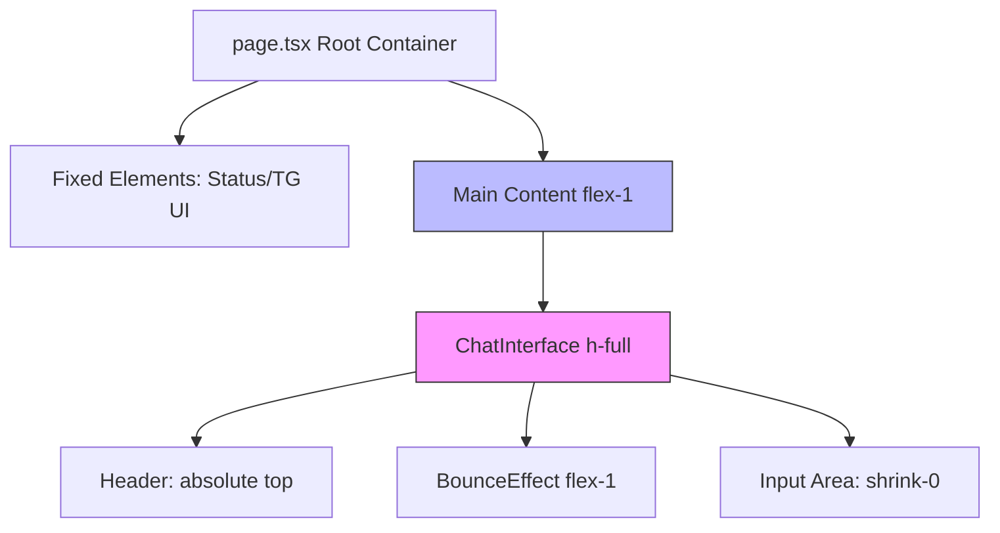
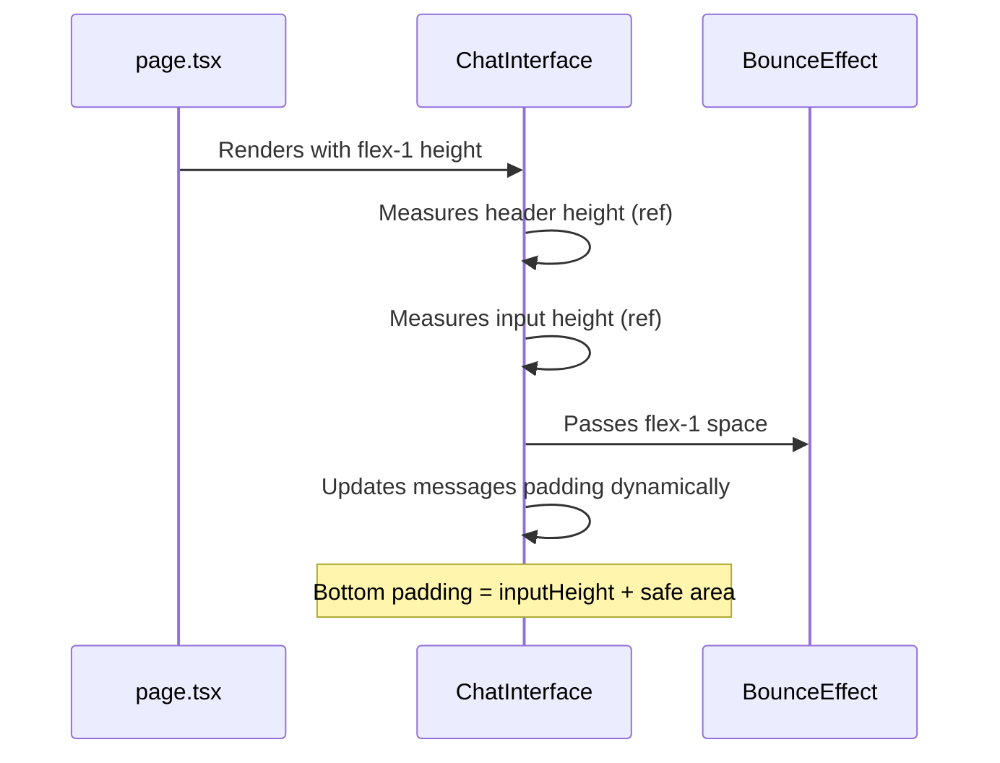

# Chat Interface Layout Fix: Container Height & Spacing Issues

## Problem Statement

The ChatInterface component exhibits multiple layout issues affecting the user experience:

1. **Container Height Discrepancy**: Debug info shows Container H (754px) is 90px shorter than viewport (844px)
2. **Excessive Bottom Spacing**: Large gap visible between input field and home indicator
3. **Missing Header Top Spacing**: Avatar name lost its top padding

## Root Cause Analysis

### Container Height Issue

The parent container in `page.tsx` has accumulated fixed-height elements that consume viewport space before ChatInterface:

| Element | Height | Platform | Cumulative |
|---------|--------|----------|------------|
| Status Bar | 44px | iOS only | 44px |
| Telegram UI | 46px | Both | 90px (iOS) / 46px (Android) |
| Extra spacing | 12px | Android only | 58px (Android) |

The Main Content Area uses `flex-1` to fill remaining space, but the parent container's flex layout combined with these fixed-height siblings creates the 90px deficit.

**Expected behavior**: ChatInterface container should occupy full remaining viewport height
**Actual behavior**: Container is 90px shorter, creating visual gaps and scroll issues

### Bottom Spacing Issue

Multiple padding sources accumulate at the bottom:

| Source | Value | Purpose |
|--------|-------|---------|
| BounceEffect bottom margin | -120px (offset by padding) | Scroll bounce space |
| BounceEffect bottom padding | 120px | Content protection during bounce |
| Messages container bottom padding | 80px | Space for input area |
| Input area bottom padding | `var(--tg-content-safe-area-inset-bottom)` | Safe area (34px iOS, 0px Android) |

The fixed 80px spacing in the messages container does not account for the actual input area height (57px from debug), creating 23px of unnecessary gap.

### Header Spacing Issue

The header uses `paddingTop: var(--tg-content-safe-area-inset-top)` which equals 46px, but the messages container also uses `paddingTop: calc(var(--tg-content-safe-area-inset-top) + 52px)` (98px total).

The discrepancy between header's actual height (87px from debug) and the spacing allocated suggests the header padding may be lost during rendering.

## Design Solution

### Objective

Create a properly constrained ChatInterface that:
- Uses 100% of available viewport height
- Eliminates unnecessary spacing
- Maintains proper safe area insets
- Ensures header and input remain visible

### Layout Architecture



### Component Responsibilities

#### page.tsx (Parent Container)
- **Role**: Viewport space allocation
- **Constraint**: Must pass exact available height to ChatInterface
- **Change**: Ensure Main Content Area properly calculates flex-1 height

#### ChatInterface (Container)
- **Role**: Chat layout orchestration  
- **Constraint**: Must not exceed parent height
- **Height Calculation**: Should be `100%` of parent's flex-1 space
- **Layout**: Flexbox column with absolute header/input, flex-1 messages

#### BounceEffect (Scroll Container)
- **Role**: Scrollable messages area with bounce
- **Constraint**: Must fill space between header and input
- **Height**: Uses `flex-1` to occupy remaining space

### Spacing Strategy

#### Top Safe Area Handling

| Element | Padding Strategy |
|---------|------------------|
| Header | `paddingTop: var(--tg-content-safe-area-inset-top)` + visual spacing (10-12px) |
| Messages container | Account for header total height (87px from debug) |

The messages container should use the measured header height instead of recalculating safe area.

#### Bottom Safe Area Handling

| Element | Padding Strategy |
|---------|------------------|
| Messages container | Use measured input area height dynamically |
| Input area | `paddingBottom: var(--tg-content-safe-area-inset-bottom)` only |

Replace fixed 80px bottom padding in messages with dynamic calculation based on input area's `offsetHeight`.

#### Implementation Flow



### Dynamic Spacing Calculation

The ChatInterface should:
1. Use refs to measure actual header and input area heights after render
2. Update messages container bottom padding dynamically via state or CSS variables
3. Avoid hardcoded pixel values that drift from actual measurements

**Pseudo-logic**:
- On mount and resize: capture `headerRef.current.offsetHeight` and `inputAreaRef.current.offsetHeight`
- Set CSS variable: `--messages-top-spacing: ${headerHeight}px`
- Set CSS variable: `--messages-bottom-spacing: ${inputAreaHeight}px`
- Messages container uses: `paddingTop: var(--messages-top-spacing)` and `paddingBottom: var(--messages-bottom-spacing)`

## Expected Outcome

### Layout Measurements (Post-Fix)

| Metric | Current | Expected |
|--------|---------|----------|
| Container H | 754px | 754px (if parent is 754px) or full viewport minus fixed headers |
| Header H | 87px | ~56-60px (46px safe area + 10px spacing) |
| Input H | 57px | 57px (unchanged) |
| Safe Top | 46px | 46px |
| Safe Bottom | 0px | 0px (Android) / 34px (iOS) |
| Messages bottom padding | 80px | Dynamic (~57px + safe area) |

### Visual Result

- Input area sits directly above home indicator with only safe area spacing
- No visible gap between input and bottom edge
- Header has consistent top spacing matching safe area
- Messages scroll area fills exact space between header bottom and input top
- Container height matches available viewport space

### User Experience

- Smooth scrolling with proper bounce at edges
- Keyboard opening doesn't cause layout shift
- Content visible and accessible in all states
- No unexpected gaps or overlaps

## Diagnostic Logging Strategy

### Purpose

Add comprehensive logging to identify exact layout issues and validate fixes in real-time on device.

### Logging Points

#### 1. Parent Container Measurements (page.tsx)

**Location**: Main Content Area wrapper (line 219)

**When to log**:
- On mount
- On resize
- On chatMode toggle

**What to measure**:

| Metric | Source | Purpose |
|--------|--------|----------|
| Root container height | `document.querySelector('.w-full.h-screen').offsetHeight` | Verify full viewport capture |
| Main Content height | containerRef.offsetHeight | Verify flex-1 calculation |
| Chat wrapper height | wrapperRef.offsetHeight | Verify intermediate wrapper |
| Computed flex-1 value | getComputedStyle().height | Compare expected vs actual |
| Status bar height | Fixed 44px or 0px | Track iOS/Android difference |
| Telegram UI height | Fixed 46px | Track header space consumption |

**Log format**:
```
[PAGE] Container measurements:
  Root: 844px (expected: 844px) ✓
  Status+TG: 90px (iOS) / 46px (Android)
  Main Content: 754px (expected: 754px) ✓
  Chat wrapper: 754px (should match Main Content)
  Discrepancy: 0px
```

#### 2. ChatInterface Container Measurements

**Location**: ChatInterface component (already has containerRef)

**When to log**:
- On mount
- After header/input measurement
- On resize
- After keyboard open/close

**What to measure**:

| Metric | Source | Purpose |
|--------|--------|----------|
| Container total height | containerRef.offsetHeight | Compare with parent |
| Container clientHeight | containerRef.clientHeight | Excluding borders |
| Container scrollHeight | containerRef.scrollHeight | Total scrollable content |
| Available flex space | Calculated | Header + Messages + Input sum |

**Log format**:
```
[CHAT] Container measurements:
  Total height: 754px
  Client height: 754px
  Scroll height: 1200px (content overflows)
  Expected distribution: 87px (header) + 610px (messages) + 57px (input) = 754px
```

#### 3. Header Measurements (Critical)

**Location**: ChatInterface headerRef (line 173)

**When to log**:
- After first render (useLayoutEffect)
- After safe area variables change
- On resize

**What to measure**:

| Metric | Source | Purpose |
|--------|--------|----------|
| Header offsetHeight | headerRef.current.offsetHeight | Total height including padding |
| Header clientHeight | headerRef.current.clientHeight | Content height only |
| Safe area top (CSS var) | getComputedStyle().getPropertyValue('--tg-content-safe-area-inset-top') | Actual applied value |
| Safe area top (parsed) | parseInt() | Numeric value |
| Padding top (computed) | getComputedStyle().paddingTop | Applied padding |
| Padding bottom (computed) | getComputedStyle().paddingBottom | Applied padding |
| Content height | clientHeight - paddingTop - paddingBottom | Text + flexbox |
| Border height | offsetHeight - clientHeight | Border contribution |

**Log format**:
```
[HEADER] Measurements:
  offsetHeight: 87px
  clientHeight: 86px
  Safe area top (var): 46px
  Padding top (computed): 46px ✓
  Padding bottom (computed): 12px ✓
  Content height: 28px
  Border: 1px
  TOTAL: 46 + 28 + 12 + 1 = 87px ✓
```

#### 4. Input Area Measurements (Critical)

**Location**: ChatInterface inputAreaRef (line 226)

**When to log**:
- After first render
- After keyboard events
- On resize
- When input content changes

**What to measure**:

| Metric | Source | Purpose |
|--------|--------|----------|
| Input area offsetHeight | inputAreaRef.current.offsetHeight | Total height |
| Input area clientHeight | inputAreaRef.current.clientHeight | Excluding borders |
| Safe area bottom (CSS var) | getComputedStyle().getPropertyValue('--tg-content-safe-area-inset-bottom') | Actual value |
| Safe area bottom (parsed) | parseInt() | Numeric value |
| Padding bottom (computed) | getComputedStyle().paddingBottom | Applied safe area |
| Inner padding (p-2) | 8px | Known value |
| Input field height | inputRef.current?.offsetHeight | Actual input element |
| Button height | buttonRef?.offsetHeight | Send button |

**Log format**:
```
[INPUT] Measurements:
  offsetHeight: 57px (Android) / 91px (iOS)
  clientHeight: 56px / 90px
  Safe area bottom (var): 0px / 34px
  Padding bottom (computed): 0px / 34px ✓
  Inner container (p-2): 8px * 2 = 16px
  Input field: 40px
  Button: 40px
  TOTAL: 1 + 8 + 40 + 8 + 0/34 = 57/91px ✓
```

#### 5. Messages Container Measurements (Critical)

**Location**: BounceEffect child div (line 188)

**When to log**:
- After header/input measurements
- After dynamic padding update
- On scroll events (throttled)
- After messages added/removed

**What to measure**:

| Metric | Source | Purpose |
|--------|--------|----------|
| Container offsetHeight | messagesContainerRef.offsetHeight | Total height |
| Container scrollHeight | messagesContainerRef.scrollHeight | Total content |
| Padding top (computed) | getComputedStyle().paddingTop | Current applied |
| Padding bottom (computed) | getComputedStyle().paddingBottom | Current applied |
| Padding top (expected) | headerHeight | Should match |
| Padding bottom (expected) | inputHeight | Should match |
| Available message space | scrollHeight - paddingTop - paddingBottom | Content area |
| Message count | messages.length | Number of messages |

**Log format**:
```
[MESSAGES] Container measurements:
  Total height: 1200px (scrollable)
  Padding top: 98px (expected: 87px) ✗ MISMATCH -11px
  Padding bottom: 80px (expected: 57px) ✗ MISMATCH -23px
  Available space: 1022px (should be: 1056px)
  Message count: 15
  Lost space: 34px (11 + 23)
```

#### 6. BounceEffect Internal Measurements

**Location**: BounceEffect containerRef (line 206)

**When to log**:
- On mount
- After children render
- On scroll events
- During pull gesture

**What to measure**:

| Metric | Source | Purpose |
|--------|--------|----------|
| Container offsetHeight | containerRef.offsetHeight | Available scroll area |
| Container scrollHeight | containerRef.scrollHeight | Total content height |
| Padding top (internal) | maxPullDistance (120px) | Buffer zone |
| Padding bottom (internal) | maxPullDistance (120px) | Buffer zone |
| Margin top (offset) | -maxPullDistance (-120px) | Compensation |
| Margin bottom (offset) | -maxPullDistance (-120px) | Compensation |
| Content offsetHeight | contentRef.offsetHeight | Child content |
| Scroll position | scrollTop | Current position |
| Pull distance | currentPullDistance.current | Active gesture |

**Log format**:
```
[BOUNCE] Measurements:
  Container height: 610px
  Scroll height: 1320px (1200px content + 120px buffers)
  Internal padding: 120px top, 120px bottom
  Margin offset: -120px top, -120px bottom
  Content height: 1200px
  Effective height: 610px (120 - 120 cancels out)
  Scroll position: 150px
  Pull distance: 0px (not pulling)
```

#### 7. Safe Area CSS Variables Validation

**Location**: Root level useEffect in ChatInterface or page.tsx

**When to log**:
- On mount
- Every 100ms for first 2 seconds (catch async initialization)
- On viewport changes
- On orientation change

**What to measure**:

| Metric | Source | Purpose |
|--------|--------|----------|
| CSS var top | getComputedStyle(document.documentElement).getPropertyValue() | Applied value |
| CSS var bottom | Same | Applied value |
| env() top | Read from :root | Native value |
| env() bottom | Same | Native value |
| Platform | navigator.userAgent | iOS/Android |
| Telegram SDK viewport | WebApp.viewportStableHeight | SDK value |
| Window inner height | window.innerHeight | Actual viewport |

**Log format**:
```
[SAFE-AREA] CSS Variables:
  Platform: iOS 16.5
  --tg-content-safe-area-inset-top: 46px
  --tg-content-safe-area-inset-bottom: 34px
  env(safe-area-inset-top): 46px ✓
  env(safe-area-inset-bottom): 34px ✓
  Telegram viewport: 844px
  window.innerHeight: 844px ✓
  Variables sync: OK
```

#### 8. Keyboard Event Tracking

**Location**: ChatInterface input focus/blur handlers

**When to log**:
- On input focus
- On input blur
- On viewport resize during keyboard events
- On scroll during keyboard visible

**What to measure**:

| Metric | Source | Purpose |
|--------|--------|----------|
| Viewport height before | Captured on focus | Original height |
| Viewport height after | window.innerHeight | Changed height |
| Height difference | before - after | Keyboard height |
| Input position (top) | inputRef.getBoundingClientRect().top | Distance from top |
| Input visible | top < viewport height | Still visible? |
| Container scroll | containerRef.scrollTop | Scroll adjustment |
| Telegram keyboard | WebApp.isKeyboardVisible | SDK detection |

**Log format**:
```
[KEYBOARD] Event: opened
  Viewport: 844px → 450px (Δ -394px)
  Keyboard height: ~394px
  Input position: 320px from top
  Input visible: YES (320 < 450)
  Container scrolled: 50px
  Telegram SDK keyboard: true ✓
```

#### 9. Layout Shift Detection

**Location**: ResizeObserver on container, header, and input

**When to log**:
- On any size change
- Cumulative shifts tracking

**What to measure**:

| Metric | Source | Purpose |
|--------|--------|----------|
| Element | Target element name | Which changed |
| Previous size | Cached value | Before change |
| New size | Current offsetHeight | After change |
| Delta | new - previous | Amount of shift |
| Timestamp | Date.now() | When occurred |
| Cumulative shifts | Sum of deltas | Total instability |

**Log format**:
```
[LAYOUT-SHIFT] Header changed:
  Previous: 85px
  New: 87px
  Delta: +2px
  Time: 150ms after mount
  Cumulative: +2px
  
[LAYOUT-SHIFT] Input changed:
  Previous: 55px
  New: 57px
  Delta: +2px
  Time: 200ms after mount
  Cumulative: +4px
  
WARNING: Total layout shift 4px may cause visual jank
```

### Implementation Strategy

#### Centralized Logging Utility

Create a logging utility to standardize output:

**Features**:
- Prefix tags for easy filtering: `[PAGE]`, `[CHAT]`, `[HEADER]`, etc.
- Conditional logging (only in development or with debug flag)
- Visual indicators: ✓ for match, ✗ for mismatch, ⚠ for warnings
- Comparison helper: `expected vs actual` formatting
- Timestamp for sequencing
- Color coding in console (green for OK, red for issues)

**Usage pattern**:
```
logLayout('HEADER', {
  offsetHeight: 87,
  expected: 87,
  match: true
});
// Output: [HEADER] offsetHeight: 87px (expected: 87px) ✓
```

#### Logging Lifecycle

1. **Mount phase**: Log all initial measurements
2. **Post-render phase**: Log after CSS applied (useLayoutEffect)
3. **Interaction phase**: Log on user actions (scroll, input, keyboard)
4. **Resize phase**: Log on viewport changes
5. **Comparison phase**: Compare before/after fix measurements

#### Debug Overlay Enhancement

Extend existing debug overlay (line 161-169) to show:
- Real-time mismatch indicators
- Expected vs actual comparisons
- Color-coded health status
- Cumulative layout shift score
- Tap to expand detailed logs

### Expected Diagnostic Output

**Before fix**:
```
[SUMMARY] Layout Issues Detected:
  ✗ Header padding mismatch: 98px reserved, 87px actual (-11px gap)
  ✗ Input padding mismatch: 80px reserved, 57px actual (-23px gap)
  ✗ Total wasted space: 34px
  ✗ Messages area: 576px available (should be 610px)
  ⚠ Layout shifts detected: 4px cumulative
```

**After fix**:
```
[SUMMARY] Layout Validation:
  ✓ Header padding match: 87px reserved, 87px actual
  ✓ Input padding match: 57px reserved, 57px actual
  ✓ Total wasted space: 0px
  ✓ Messages area: 610px available (correct)
  ✓ Layout shifts: 0px (stable)
  ✓ Container height: 754px (matches parent)
```

## Technical Constraints

- Must not use fixed pixel values for spacing (except for visual margins like 10px)
- All safe area calculations must use CSS variables from Telegram SDK
- Dynamic measurements must update on viewport resize
- Layout must work on both iOS and Android with different safe areas
- Logging should be removable via feature flag for production builds
- ResizeObserver must be used for automatic measurement updates

## Critical Issues & Ambiguities Analysis

### Issue 1: Undefined CSS Class

**Problem**: `page.tsx` line 219 uses class `tg-content-safe-area-inset` which is not defined anywhere in CSS files.

**Current code**:
```
<div className="... tg-content-safe-area-inset ...">
```

**Impact**: This class does nothing. The safe area handling relies entirely on inline styles in ChatInterface, not on parent container.

**Resolution needed**: Either:
- Define this CSS class with proper padding rules
- Remove the class if unused
- Clarify if this was intended for future use

### Issue 2: Double Container Wrapper

**Problem**: ChatInterface receives height through double nesting:
```
page.tsx Main Content (flex-1) → 
  div (flex-1 h-full) → 
    ChatInterface (h-full)
```

**Ambiguity**: The intermediate wrapper `<div className="flex-1 h-full">` (line 283) creates potential height calculation conflicts:
- `flex-1` tries to fill parent's flex space
- `h-full` tries to be 100% of parent height
- These can conflict in flex layouts

**Risk**: ChatInterface might not receive expected height due to this double wrapper.

**Resolution needed**: Verify if wrapper is necessary or if ChatInterface can be direct child of Main Content Area.

### Issue 3: Header Absolute Positioning Without Reserved Space

**Problem**: Header uses `position: absolute` but messages container calculates space independently:

```
Header: position absolute, height ~87px (measured)
Messages: paddingTop calc(var(--tg-content-safe-area-inset-top) + 52px)
```

**Mismatch**: 
- 52px is hardcoded assumption
- Actual header height is 87px (46px safe area + 12px bottom padding + ~29px content)
- Calculation: 46px + 52px = 98px ≠ 87px actual header height

**Why this matters**: If header is 87px but we reserve 98px, there's an 11px gap. If we reserve less, header overlaps messages.

**Resolution**: Proposed solution correctly addresses this with dynamic measurement.

### Issue 4: BounceEffect Padding Interference

**Problem**: BounceEffect adds its own padding/margin system:

```
paddingTop: 120px (maxPullDistance)
marginTop: -120px (offset)
paddingBottom: 120px
marginBottom: -120px
```

This creates a virtual 120px buffer zone. Messages container then adds:
```
paddingTop: 98px
paddingBottom: 80px
```

**Total effective padding**:
- Top: 120px (BounceEffect) + 98px (messages) = 218px
- Bottom: 120px (BounceEffect) + 80px (messages) = 200px

**Risk**: When implementing dynamic padding, need to ensure:
1. BounceEffect's internal padding is accounted for
2. New dynamic values don't create double-padding
3. Scroll position calculations remain correct

**Resolution needed**: Clarify if messages container padding should be:
- Additional to BounceEffect padding (current behavior)
- Replacement for BounceEffect padding
- Included in BounceEffect's calculation

### Issue 5: Safe Area Variables on Android

**Problem**: Debug shows `Safe Bottom: 0px` on Android, but code still applies it:

```
paddingBottom: 'var(--tg-content-safe-area-inset-bottom)'
```

**Current behavior**: Works correctly (0px on Android, 34px on iOS)

**Potential issue**: The CSS variables use `env(safe-area-inset-bottom)` which may not be set by Telegram SDK on Android. If Telegram SDK sets these differently, values might be incorrect.

**Resolution needed**: Verify CSS variables are populated by:
- Native `env(safe-area-inset-*)` API
- Telegram SDK's `contentSafeAreaInsets`
- Or a combination

According to project memory: SDK 8.0+ supports `contentSafeAreaInsets`. Need to ensure CSS variables sync with SDK values.

### Issue 6: Input Area Height Measurement Timing

**Problem**: Input area height (57px) includes:
- Border: 1px top
- Padding (p-2): 8px all sides = 16px vertical
- Input field with py-2: another 8px vertical
- Total: ~1 + 16 + input-height

**Ambiguity**: When measuring `inputAreaRef.current.offsetHeight`:
- Will it be measured before or after first render?
- What if content changes (e.g., multi-line input in future)?
- What about keyboard opening affecting measurements?

**Resolution needed**: Implementation should:
1. Measure after initial render (useLayoutEffect or useEffect)
2. Re-measure on resize events
3. Use ResizeObserver for automatic updates when input area changes
4. Set initial padding optimistically to avoid layout shift

### Issue 7: Messages Container `justify-end` Behavior

**Problem**: Messages container uses:
```
min-h-full flex flex-col justify-end
```

With `min-h-full`, container will be at least 100% of BounceEffect's height. With `justify-end`, messages stick to bottom.

**Issue**: When few messages exist:
- Container is exactly BounceEffect height
- Messages at bottom
- Top padding (98px) creates empty space at top
- **But**: User can't scroll up (no overflow)

**When many messages**:
- Container grows beyond BounceEffect height
- User can scroll
- Top padding creates gap before first message

**Ambiguity**: Is top padding meant to:
- Create gap before first message (current behavior)?
- Reserve space so header doesn't overlap first message when scrolled to top?

If the latter, dynamic measurement might still leave gap when scrolled to top.

**Resolution needed**: Clarify intended behavior for top padding when scrolled to top position.

### Issue 8: Container Height Measurement Timing

**Problem**: Debug shows Container H: 754px measured via:
```
containerRef.current?.offsetHeight
```

**Question**: Is 754px the correct height for ChatInterface?

Calculation:
- Viewport: 844px
- Status Bar: 44px (iOS)
- Telegram UI: 46px
- **Expected Main Content**: 844 - 90 = 754px ✓

**Actually**: Container height IS correct! The issue is not container height, but rather how content within uses this space.

**Revised understanding**: 
- Container height 754px is CORRECT
- Problem is padding calculations WITHIN container
- Header (87px) + Messages scrollable + Input (57px) should total 754px
- Currently: 87px + (754 - 87 - 57) + 57 = 87 + 610 + 57 = 754px
- But visible area feels shorter due to excessive padding eating into the 610px messages area

### Issue 9: Proposed Solution Validation

**Current plan**: Measure header/input heights dynamically and use for padding.

**Verification needed**:
1. **Header measurement includes**:
   - Top safe area padding: 46px
   - Bottom padding: 12px
   - Content height: ~29px (text + flexbox)
   - Border: 1px
   - **Total**: ~88px ✓ (matches debug 87px)

2. **Input measurement includes**:
   - Border: 1px top
   - Padding: 8px (p-2)
   - Input height: ~40px
   - Bottom safe area: 0px (Android) / 34px (iOS)
   - **Total**: ~49px (Android) / ~83px (iOS)
   - **Debug shows**: 57px
   - **Discrepancy**: Debug might be Android (0px safe area) → 49px expected vs 57px actual
   - **Check needed**: Is debug measurement including safe area or not?

3. **Implementation risk**: If measurements change after dynamic content loads, need re-measurement strategy.

## Validation Criteria

- [ ] Container height equals available viewport height (844px minus headers)
- [ ] Debug info shows no discrepancy between container and expected height
- [ ] Input area has no excessive bottom gap
- [ ] Header shows avatar name with proper top spacing
- [ ] Messages container padding matches actual header/input heights
- [ ] Layout remains stable during keyboard open/close
- [ ] Bounce effect works at top and bottom without visual glitches
- [ ] Undefined `tg-content-safe-area-inset` class is either defined or removed
- [ ] Double container wrapper necessity is verified
- [ ] Safe area CSS variables sync with Telegram SDK values
- [ ] Input area height measurement accounts for dynamic changes
- [ ] Top padding behavior when scrolled to top is intentional
