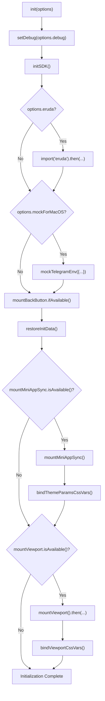
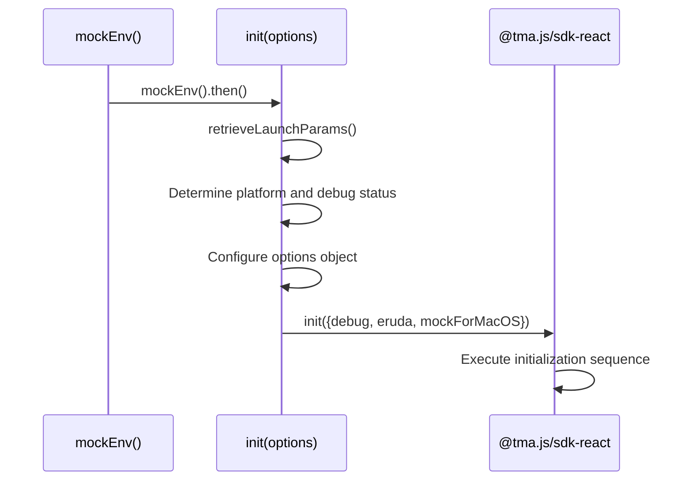

# Initialization API

<cite>
**Referenced Files in This Document**   
- [init.ts](file://passion/src/core/init.ts)
- [instrumentation-client.ts](file://passion/src/instrumentation-client.ts)
- [mockEnv.ts](file://passion/src/mockEnv.ts)
</cite>

## Table of Contents
1. [Function Signature](#function-signature)
2. [Options Parameter](#options-parameter)
3. [Return Type and Asynchronous Behavior](#return-type-and-asynchronous-behavior)
4. [Internal Operation Sequence](#internal-operation-sequence)
5. [Usage Examples](#usage-examples)
6. [Integration with @tma.js/sdk-react](#integration-with-tma.js-sdk-react)
7. [Error Handling](#error-handling)
8. [Guidance on mockForMacOS](#guidance-on-mockformacos)
9. [Performance Implications](#performance-implications)

## Function Signature

The `init` function is an exported asynchronous function from `src/core/init.ts` that configures and initializes the core components of the Telegram Mini App. It accepts a single options object parameter and returns a Promise that resolves when initialization is complete.

**Section sources**
- [init.ts](file://passion/src/core/init.ts#L20-L24)

## Options Parameter

The `init` function accepts an options object with three boolean properties that control different aspects of the initialization process:

- **debug**: When set to `true`, enables debugging output from the SDK. This is useful for development and troubleshooting.
- **eruda**: When set to `true`, dynamically loads the Eruda mobile debugging console, providing a Chrome DevTools-like interface within the mobile app.
- **mockForMacOS**: When set to `true`, applies workarounds for known bugs in the Telegram for macOS client, particularly around theme and safe area events.

These options allow for flexible configuration of the initialization process based on the runtime environment and development needs.

**Section sources**
- [init.ts](file://passion/src/core/init.ts#L20-L24)

## Return Type and Asynchronous Behavior

The `init` function returns `Promise<void>`, indicating that it performs asynchronous operations but does not return a meaningful value upon completion. The function is declared with the `async` keyword, allowing the use of `await` for asynchronous operations within its body. This asynchronous nature is essential for operations like dynamically importing the Eruda library and mounting viewport components that may involve asynchronous initialization.

**Section sources**
- [init.ts](file://passion/src/core/init.ts#L20-L24)

## Internal Operation Sequence

The `init` function follows a specific sequence of operations during initialization:

1. **SDK Initialization**: Sets the debug mode using `setDebug(options.debug)` and initializes the SDK with `initSDK()`.
2. **Conditional Eruda Loading**: If the `eruda` option is enabled, dynamically imports and initializes the Eruda debugging console.
3. **Environment Mocking Setup**: If `mockForMacOS` is true, configures a mock environment to handle known bugs in Telegram for macOS, particularly around theme and safe area events.
4. **Core Component Mounting**: Mounts essential Telegram components including BackButton, MiniApp, and Viewport, while binding their CSS variables.

**Diagram sources**
- [init.ts](file://passion/src/core/init.ts#L25-L81)

**Section sources**
- [init.ts](file://passion/src/core/init.ts#L25-L81)

## Usage Examples

The `init` function is typically invoked in `instrumentation-client.ts`, where it is configured based on the current environment and launch parameters:

**Diagram sources**
- [instrumentation-client.ts](file://passion/src/instrumentation-client.ts#L8-L21)

**Section sources**
- [instrumentation-client.ts](file://passion/src/instrumentation-client.ts#L8-L21)

## Integration with @tma.js/sdk-react

The `init` function integrates closely with the `@tma.js/sdk-react` package, utilizing several of its exported functions:

- **setDebug**: Configures the debug mode of the SDK based on the provided option.
- **initSDK**: Initializes the core SDK functionality.
- **mockTelegramEnv**: Creates a mock environment for handling platform-specific bugs, particularly on macOS.
- **Component Mounting**: Uses `mountBackButton`, `mountMiniAppSync`, and `mountViewport` to attach Telegram UI components to the application.

This integration allows the application to properly initialize and interact with the Telegram Mini Apps platform while providing flexibility for development and debugging.

**Section sources**
- [init.ts](file://passion/src/core/init.ts#L1-L15)

## Error Handling

The `init` function itself does not contain explicit error handling within its implementation, but it is invoked within a try-catch block in `instrumentation-client.ts`. This external error handling catches and logs any exceptions that occur during initialization. For the Eruda loading operation, the function uses the `void` operator with a Promise chain, which means any errors in loading Eruda will not prevent the rest of the initialization from proceeding. This approach ensures that the failure to load the debugging console does not impact the core functionality of the application.

**Section sources**
- [instrumentation-client.ts](file://passion/src/instrumentation-client.ts#L19-L23)

## Guidance on mockForMacOS

The `mockForMacOS` option should be used when the application detects it is running in the Telegram for macOS client. This is typically determined by checking the `tgWebAppPlatform` launch parameter. When enabled, this option addresses two known issues:

1. **Theme Request Handling**: The macOS client may not respond to "web_app_request_theme" method calls. The mock implementation either returns cached theme parameters or falls back to launch parameters.
2. **Safe Area Events**: The client generates incorrect events for "web_app_request_safe_area" method. The mock returns a standardized safe area with zero insets.

This option ensures consistent behavior across platforms despite the bugs in the macOS client implementation.

**Section sources**
- [init.ts](file://passion/src/core/init.ts#L36-L64)

## Performance Implications

Enabling the `debug` or `eruda` options in production has significant performance implications:

- **debug mode**: Increases console output and may enable additional runtime checks within the SDK, potentially impacting performance and exposing sensitive information.
- **eruda**: Dynamically loads a substantial debugging library (approximately 200KB+), which increases bundle size and memory usage. The debugging console itself consumes additional CPU and memory resources.

These options should be restricted to development environments. The implementation in `instrumentation-client.ts` follows this best practice by enabling `eruda` only when `debug` is true and the platform is iOS or Android, preventing accidental activation in production.

**Section sources**
- [init.ts](file://passion/src/core/init.ts#L30-L34)
- [instrumentation-client.ts](file://passion/src/instrumentation-client.ts#L19-L20)