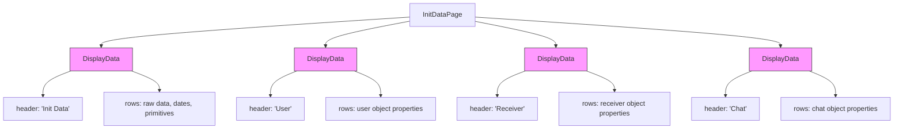

# DisplayData Component

<cite>
**Referenced Files in This Document**   
- [DisplayData.tsx](file://passion/src/components/DisplayData/DisplayData.tsx)
- [DisplayData.css](file://passion/src/components/DisplayData/DisplayData.css)
- [Link.tsx](file://passion/src/components/Link/Link.tsx)
- [RGB.tsx](file://passion/src/components/RGB/RGB.tsx)
- [bem.ts](file://passion/src/css/bem.ts)
- [classnames.ts](file://passion/src/css/classnames.ts)
- [page.tsx](file://passion/src/app/init-data/page.tsx)
- [theme-params/page.tsx](file://passion/src/app/theme-params/page.tsx)
- [launch-params/page.tsx](file://passion/src/app/launch-params/page.tsx)
- [Page.tsx](file://passion/src/components/Page.tsx)
</cite>

## Table of Contents
1. [Introduction](#introduction)
2. [Core Components](#core-components)
3. [Architecture Overview](#architecture-overview)
4. [Detailed Component Analysis](#detailed-component-analysis)
5. [Usage Examples](#usage-examples)
6. [Styling and Theming](#styling-and-theming)
7. [Performance Considerations](#performance-considerations)
8. [Accessibility and Responsive Design](#accessibility-and-responsive-design)

## Introduction
The DisplayData component is a specialized UI element designed to render structured key-value information within Telegram Mini Apps. It serves as a central component for displaying various types of data in a consistent, visually appealing format that aligns with Telegram's native UI patterns. The component is extensively used throughout the application to present user data, theme parameters, and launch parameters in a readable format.

**Section sources**
- [DisplayData.tsx](file://passion/src/components/DisplayData/DisplayData.tsx#L1-L61)

## Core Components
The DisplayData component and its supporting components form a cohesive system for rendering structured data in Telegram Mini Apps. The core functionality revolves around the DisplayData component, which leverages several specialized sub-components and utilities to handle different data types and ensure consistent styling.

**Section sources**
- [DisplayData.tsx](file://passion/src/components/DisplayData/DisplayData.tsx#L1-L61)
- [Link.tsx](file://passion/src/components/Link/Link.tsx#L1-L59)
- [RGB.tsx](file://passion/src/components/RGB/RGB.tsx#L1-L21)

## Architecture Overview
The DisplayData component follows a modular architecture that integrates with Telegram's UI framework while maintaining separation of concerns. It uses composition to combine various UI elements and utilities, creating a flexible system for rendering different data types.


**Diagram sources**
- [DisplayData.tsx](file://passion/src/components/DisplayData/DisplayData.tsx#L1-L61)
- [bem.ts](file://passion/src/css/bem.ts#L1-L49)
- [classnames.ts](file://passion/src/css/classnames.ts#L1-L83)

## Detailed Component Analysis

### DisplayData Component Analysis
The DisplayData component is designed to render structured key-value pairs in a consistent format. It accepts a header, footer, and an array of DisplayDataRow objects, each containing a title and value (or link).

#### Component Structure


**Diagram sources**
- [DisplayData.tsx](file://passion/src/components/DisplayData/DisplayData.tsx#L13-L22)
- [Link.tsx](file://passion/src/components/Link/Link.tsx#L12-L14)
- [RGB.tsx](file://passion/src/components/RGB/RGB.tsx#L11-L13)

#### Data Type Handling
The DisplayData component implements sophisticated type handling to render different value types appropriately:


**Diagram sources**
- [DisplayData.tsx](file://passion/src/components/DisplayData/DisplayData.tsx#L24-L58)

**Section sources**
- [DisplayData.tsx](file://passion/src/components/DisplayData/DisplayData.tsx#L13-L61)

### Supporting Components Analysis

#### Link Component
The Link component extends Next.js's Link component with Telegram-specific functionality, automatically detecting external links and opening them through the Telegram SDK.

```mermaid
sequenceDiagram
participant User
participant Link as Link Component
participant NextLink as Next.js Link
participant TMA as Telegram SDK
User->>Link : Clicks on link
Link->>Link : onClick handler triggered
Link->>Link : Compute target URL
Link->>Link : Compare with current URL
Link->>Link : Determine if external
alt External Link
Link->>TMA : openLink(targetUrl)
TMA-->>User : Opens in Telegram
else Internal Link
Link->>NextLink : Allow default navigation
NextLink-->>User : Navigates internally
end
```

**Diagram sources**
- [Link.tsx](file://passion/src/components/Link/Link.tsx#L22-L48)

#### RGB Component
The RGB component renders RGB color values with both a visual swatch and the textual representation, enhancing user experience when displaying color information.

```mermaid
classDiagram
class RGB {
+color : RGBType
+className : string
}
RGB --> span : "wraps content"
RGB --> i : "color swatch"
i --> style : "backgroundColor : color"
style : backgroundColor : color
```

**Diagram sources**
- [RGB.tsx](file://passion/src/components/RGB/RGB.tsx#L15-L20)

## Usage Examples

### init-data Page Implementation
The init-data page uses DisplayData to present user authentication and session data in a structured format.



**Diagram sources**
- [page.tsx](file://passion/src/app/init-data/page.tsx#L23-L96)

**Section sources**
- [page.tsx](file://passion/src/app/init-data/page.tsx#L23-L96)

### theme-params Page Implementation
The theme-params page uses DisplayData to showcase the current theme configuration, with automatic formatting of property names.


**Diagram sources**
- [theme-params/page.tsx](file://passion/src/app/theme-params/page.tsx#L9-L26)

**Section sources**
- [theme-params/page.tsx](file://passion/src/app/theme-params/page.tsx#L9-L26)

### launch-params Page Implementation
The launch-params page demonstrates mixed content types, including direct values and navigational links.


**Diagram sources**
- [launch-params/page.tsx](file://passion/src/app/launch-params/page.tsx#L9-L33)

**Section sources**
- [launch-params/page.tsx](file://passion/src/app/launch-params/page.tsx#L9-L33)

## Styling and Theming
The DisplayData component uses a combination of CSS modules and BEM naming conventions to ensure consistent, maintainable styling that integrates with Telegram's native UI.

### CSS Module Structure


**Diagram sources**
- [DisplayData.css](file://passion/src/components/DisplayData/DisplayData.css#L1-L16)

### BEM Utility Implementation
The bem utility provides a functional approach to BEM class name generation, ensuring consistency across components.


**Diagram sources**
- [bem.ts](file://passion/src/css/bem.ts#L43-L48)
- [classnames.ts](file://passion/src/css/classnames.ts#L16-L35)

**Section sources**
- [bem.ts](file://passion/src/css/bem.ts#L1-L49)

## Performance Considerations
The DisplayData component is designed with performance in mind, particularly when rendering large datasets within the Telegram WebView environment.

### Rendering Optimization


The init-data page demonstrates proper use of useMemo to optimize row data transformation, preventing unnecessary computations on every render.

**Section sources**
- [page.tsx](file://passion/src/app/init-data/page.tsx#L27-L66)

## Accessibility and Responsive Design
The DisplayData component ensures accessibility and responsive behavior within the Telegram Mini App environment.

### Accessibility Features
- Uses semantic HTML elements (Cell, Section) from Telegram UI
- Proper labeling with subhead properties
- Keyboard navigation support through native Telegram UI components
- Screen reader compatibility via proper ARIA attributes

### Responsive Layout
The component automatically adapts to different screen sizes and orientations within the Telegram WebView, maintaining readability and usability across devices.

**Section sources**
- [DisplayData.tsx](file://passion/src/components/DisplayData/DisplayData.tsx#L48-L57)
- [Page.tsx](file://passion/src/components/Page.tsx#L7-L31)