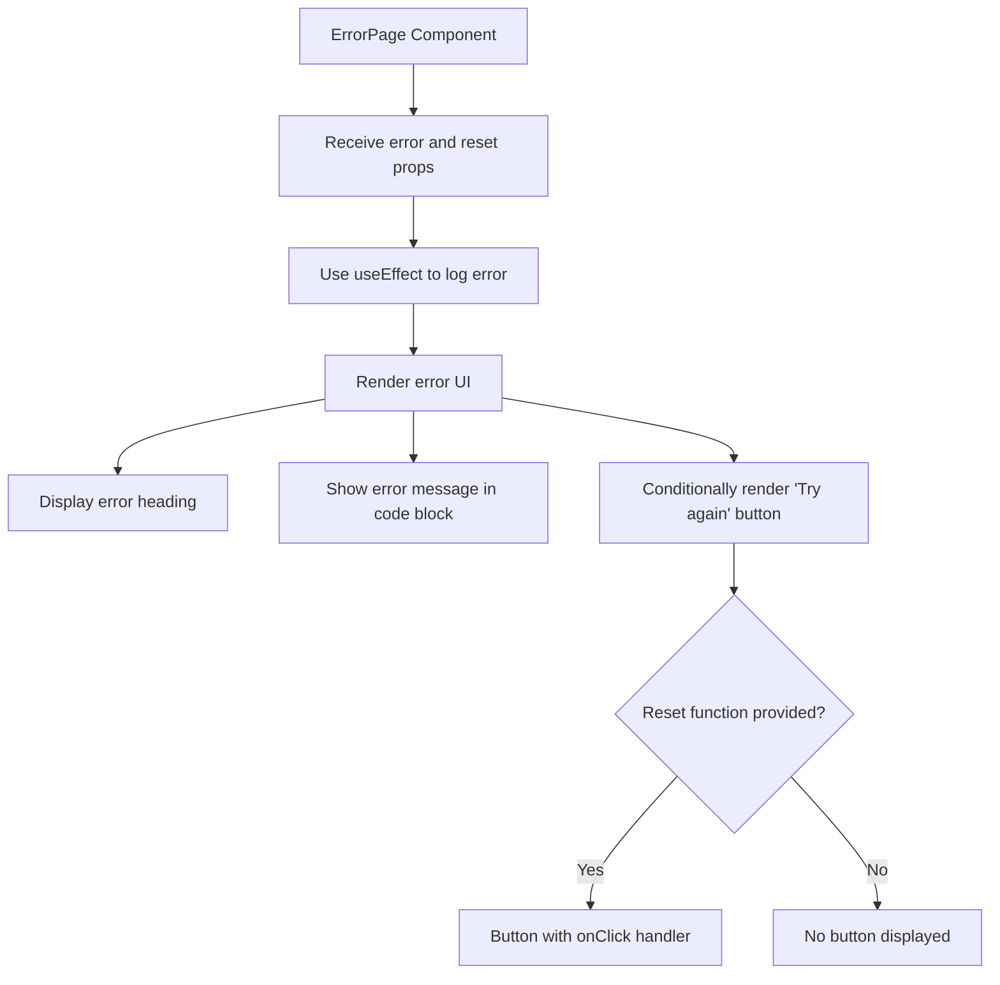
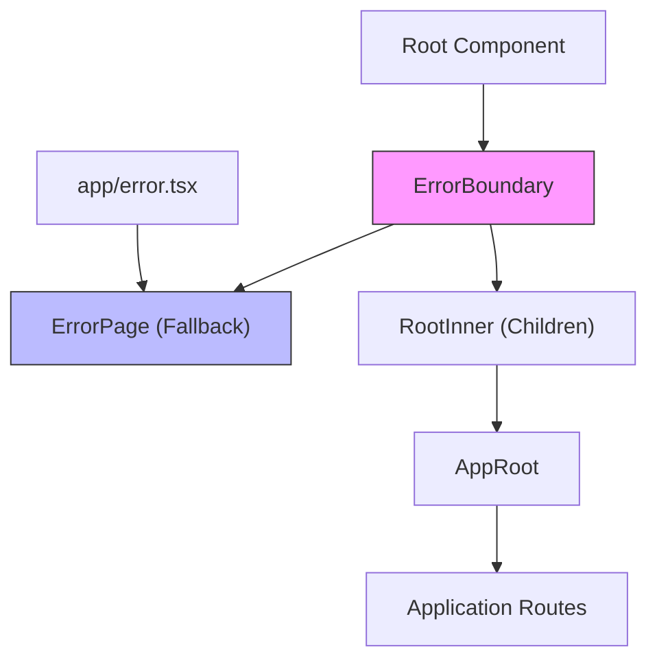

# ErrorBoundary and ErrorPage Components

<cite>
**Referenced Files in This Document**   
- [ErrorBoundary.tsx](file://passion/src/components/ErrorBoundary.tsx)
- [ErrorPage.tsx](file://passion/src/components/ErrorPage.tsx)
- [Root.tsx](file://passion/src/components/Root/Root.tsx)
- [error.tsx](file://passion/src/app/error.tsx)
</cite>

## Table of Contents
1. [Introduction](#introduction)
2. [ErrorBoundary Implementation](#errorboundary-implementation)
3. [ErrorPage Component](#errorpage-component)
4. [Component Relationship and Integration](#component-relationship-and-integration)
5. [Error Scenarios and Handling](#error-scenarios-and-handling)
6. [Telegram Mini Apps Integration](#telegram-mini-apps-integration)
7. [Limitations and Error Logging](#limitations-and-error-logging)
8. [Accessibility and Responsive Design](#accessibility-and-responsive-design)
9. [Conclusion](#conclusion)

## Introduction
The ErrorBoundary and ErrorPage components form the core error handling system in this React application, specifically designed for Telegram Mini Apps. These components work together to gracefully handle runtime errors that occur during component rendering, preventing the entire application from crashing while providing users with meaningful feedback. The ErrorBoundary component leverages React's error boundary lifecycle methods to catch JavaScript errors in child components, while the ErrorPage component serves as the visual representation displayed when errors occur. This documentation details their implementation, integration, and behavior within the Next.js application framework and Telegram's WebView environment.

## ErrorBoundary Implementation

The ErrorBoundary component is implemented as a class component that extends React.Component, utilizing React's error boundary lifecycle methods to catch JavaScript errors in the component tree below it. It implements two key error handling methods: `getDerivedStateFromError` and `componentDidCatch`. The `getDerivedStateFromError` static method is called when an error is thrown in a descendant component, allowing the error boundary to update its state to reflect the error condition. The `componentDidCatch` lifecycle method is invoked after an error has been thrown, providing an opportunity to perform side effects such as error logging. The component maintains an internal state with an optional error property, which determines whether to render the fallback UI or the children components. When an error is caught, the component renders the specified fallback component (ErrorPage) with the error object as a prop; otherwise, it renders the normal children components.

**Section sources**
- [ErrorBoundary.tsx](file://passion/src/components/ErrorBoundary.tsx#L15-L38)
- [ErrorBoundary.tsx](file://passion/src/components/ErrorBoundary.tsx#L7-L9)

## ErrorPage Component

The ErrorPage component serves as the visual fallback UI displayed when errors are caught by the ErrorBoundary. It is implemented as a functional component that receives the error object and an optional reset function as props. The component uses the useEffect hook to log the error to the console, which serves as a basic error reporting mechanism. The visual representation includes a heading indicating that an unhandled error occurred, a blockquote containing the specific error message wrapped in a code element for proper formatting, and an optional "Try again" button that appears when a reset function is provided. This button allows users to attempt to recover from the error state by triggering the reset callback. The component is designed to be simple and informative, providing users with clear feedback about the error while maintaining the application's visual consistency within the Telegram Mini Apps environment.

**Diagram sources**
- [ErrorPage.tsx](file://passion/src/components/ErrorPage.tsx#L2-L25)

**Section sources**
- [ErrorPage.tsx](file://passion/src/components/ErrorPage.tsx#L2-L25)

## Component Relationship and Integration

The ErrorBoundary and ErrorPage components are integrated at the application's root level through the Root component, establishing a comprehensive error handling boundary for the entire application. The Root component wraps the application's content with the ErrorBoundary, specifying ErrorPage as the fallback component. This strategic placement ensures that any JavaScript errors occurring in the component tree below will be caught and handled gracefully. The integration follows Next.js error handling patterns, with the app/error.tsx file serving as the default error page that exports the ErrorPage component. This creates a cohesive error handling system where the ErrorBoundary catches client-side rendering errors, while Next.js handles server-side and routing errors through the same visual component. The relationship between these components creates a robust error handling hierarchy that maintains application stability and provides consistent user experience across different error scenarios.

**Diagram sources**
- [Root.tsx](file://passion/src/components/Root/Root.tsx#L45-L58)
- [error.tsx](file://passion/src/app/error.tsx#L1-L5)

**Section sources**
- [Root.tsx](file://passion/src/components/Root/Root.tsx#L45-L58)
- [error.tsx](file://passion/src/app/error.tsx#L1-L5)

## Error Scenarios and Handling

The ErrorBoundary component is designed to handle various client-side error scenarios that may occur during component rendering and lifecycle execution. These include component crashes due to unhandled exceptions in render methods, rendering failures caused by invalid state or props, and errors in component lifecycle methods. When such errors occur, the ErrorBoundary catches them and transitions to an error state, preventing the error from propagating up the component tree and crashing the entire application. The system handles both synchronous errors during rendering and errors in lifecycle methods, providing a safety net for the application. However, it's important to note that the current implementation does not handle asynchronous errors, such as those occurring in event handlers or within promises, which would require additional error handling mechanisms. The error handling flow follows a clear sequence: error detection, state update, fallback UI rendering, and error logging, ensuring that users are informed of issues while developers receive diagnostic information.

## Telegram Mini Apps Integration

The error handling system is specifically designed to function effectively within the Telegram Mini Apps environment and its WebView container. The integration takes into account the unique constraints and capabilities of Telegram's platform, ensuring that error messages are displayed properly within the WebView while maintaining the application's overall user experience. The ErrorPage component's styling and layout are compatible with Telegram's UI guidelines, ensuring visual consistency with the host application. The error boundary is implemented at the root level after the useDidMount check, which addresses the limitations of Telegram Mini Apps regarding server-side rendering features. This ensures that the error handling system is only active in the client environment where it can function properly. The logging mechanism in ErrorPage provides valuable diagnostic information that can be accessed through the WebView's developer tools, aiding in debugging issues that may arise in the Telegram environment.

## Limitations and Error Logging

While the ErrorBoundary component provides robust error handling for many scenarios, it has certain limitations that developers should be aware of. The component cannot catch errors that occur in event handlers, asynchronous code (such as setTimeout or requestAnimationFrame callbacks), server-side rendering errors, or errors in the error boundary component itself. Additionally, it does not handle syntax errors or errors in external JavaScript files loaded by the application. The current error logging implementation is basic, relying on console.error to log the error object, which may not be sufficient for production environments requiring more sophisticated error reporting and monitoring. For comprehensive error tracking, integration with external error reporting services would be beneficial. The system also lacks detailed error categorization and user feedback mechanisms beyond the basic "Try again" button, which could be enhanced to provide more specific recovery options based on the error type.

**Section sources**
- [ErrorBoundary.tsx](file://passion/src/components/ErrorBoundary.tsx#L19-L24)
- [ErrorPage.tsx](file://passion/src/components/ErrorPage.tsx#L10-L13)

## Accessibility and Responsive Design

The ErrorPage component incorporates basic accessibility features to ensure that error messages are accessible to users with disabilities. The use of semantic HTML elements such as h2 for the error heading and blockquote for the error message helps screen readers interpret the content structure correctly. The error message is presented in a code element, which provides appropriate styling and semantic meaning for technical content. The "Try again" button is implemented as a standard button element with an onClick handler, ensuring keyboard accessibility and proper focus management. The component's design is responsive, adapting to different screen sizes and viewport dimensions within the Telegram Mini Apps environment. The layout uses flexible containers that adjust to the available space, ensuring that error messages remain readable on various device sizes. However, additional accessibility enhancements such as ARIA labels, proper color contrast ratios, and focus trapping within the error state could further improve the component's accessibility compliance.

## Conclusion
The ErrorBoundary and ErrorPage components provide a comprehensive error handling solution for this React application within the Telegram Mini Apps ecosystem. By leveraging React's error boundary lifecycle methods and integrating with Next.js error handling patterns, the system effectively catches and displays client-side errors while maintaining application stability. The strategic placement of the ErrorBoundary at the root level ensures broad coverage of potential error scenarios, while the ErrorPage component provides a consistent and informative user experience when errors occur. While the current implementation addresses the core requirements, opportunities exist for enhancement in areas such as advanced error logging, expanded error handling capabilities for asynchronous operations, and improved accessibility features. The integration with Telegram Mini Apps demonstrates thoughtful consideration of the platform's constraints and requirements, resulting in a robust error handling system that enhances both user experience and developer productivity.