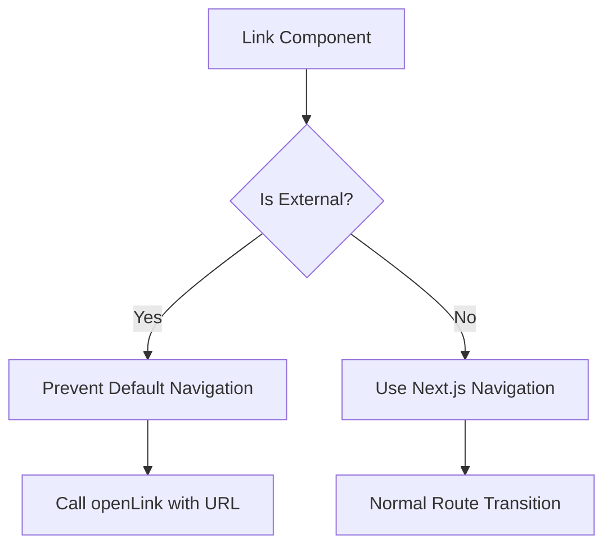
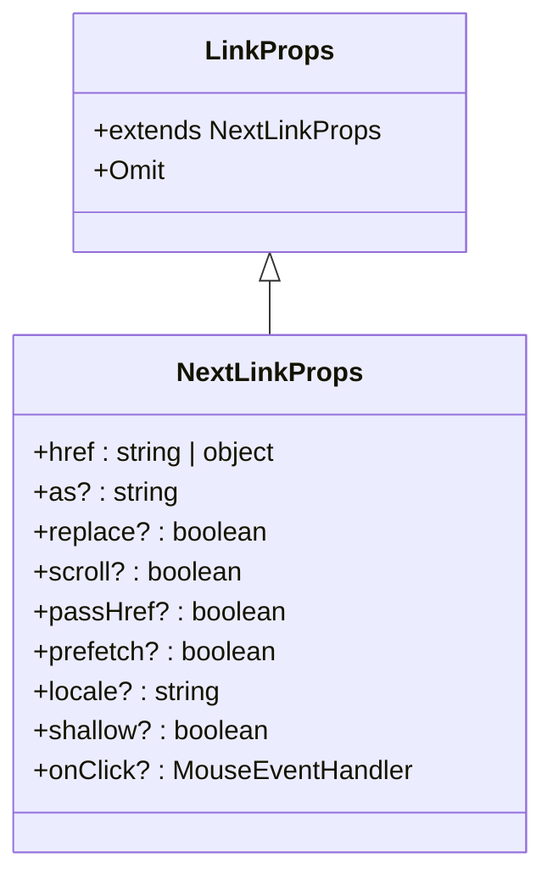
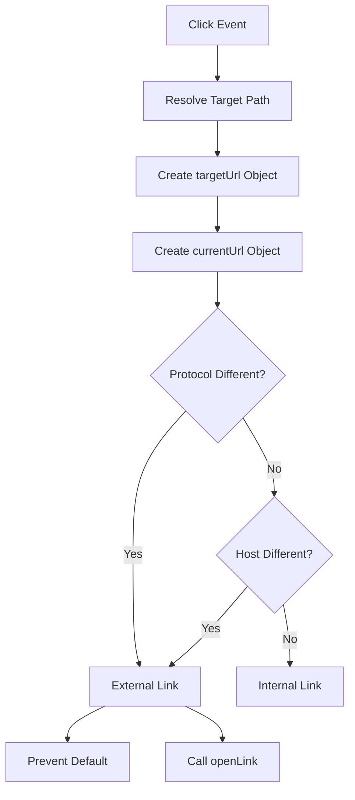
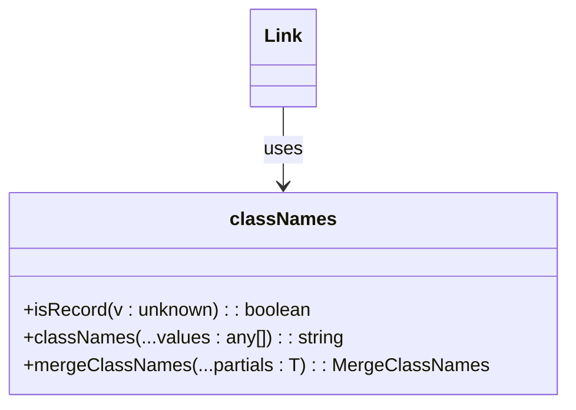

# Link Component

<cite>
**Referenced Files in This Document**   
- [Link.tsx](file://passion/src/components/Link/Link.tsx)
- [Link.css](file://passion/src/components/Link/Link.css)
- [classnames.ts](file://passion/src/css/classnames.ts)
- [page.tsx](file://passion/src/app/page.tsx)
</cite>

## Table of Contents
1. [Introduction](#introduction)
2. [Core Implementation](#core-implementation)
3. [Prop Inheritance and Type Definition](#prop-inheritance-and-type-definition)
4. [External Link Detection Logic](#external-link-detection-logic)
5. [URL Resolution and Navigation Control](#url-resolution-and-navigation-control)
6. [Styling and Classname Integration](#styling-and-classname-integration)
7. [Security Considerations](#security-considerations)
8. [Accessibility and Compatibility](#accessibility-and-compatibility)
9. [Usage Examples](#usage-examples)
10. [Best Practices](#best-practices)

## Introduction
The Link component is a specialized wrapper that extends Next.js's Link component with enhanced functionality for Telegram Mini Apps. It integrates the `openLink` method from `@telegram-apps/sdk-react` to properly handle external URL navigation within the Telegram client environment. This ensures that external links are opened using Telegram's native capabilities rather than default browser navigation, providing a seamless user experience within the Telegram ecosystem.

**Section sources**
- [Link.tsx](file://passion/src/components/Link/Link.tsx#L1-L58)

## Core Implementation
The Link component is implemented as a functional component that wraps Next.js's Link while adding Telegram Mini Apps-specific behavior. It imports the `openLink` function from `@telegram-apps/sdk-react` to handle external URL opening. The component maintains compatibility with Next.js routing for internal links while intercepting external link clicks to use Telegram's native link opening mechanism.

**Diagram sources**
- [Link.tsx](file://passion/src/components/Link/Link.tsx#L22-L48)

**Section sources**
- [Link.tsx](file://passion/src/components/Link/Link.tsx#L1-L58)

## Prop Inheritance and Type Definition
The component defines a `LinkProps` interface that extends Next.js's `LinkProps` while also incorporating all standard HTML anchor attributes (except href). This allows the component to accept any valid anchor tag property such as target, rel, title, and other accessibility attributes while maintaining full compatibility with Next.js Link functionality.

**Diagram sources**
- [Link.tsx](file://passion/src/components/Link/Link.tsx#L12-L14)

**Section sources**
- [Link.tsx](file://passion/src/components/Link/Link.tsx#L12-L14)

## External Link Detection Logic
The component implements a sophisticated external link detection mechanism in its onClick handler. It compares both protocol and host information between the target URL and current location to determine if a link is external. This comparison is performed using the URL constructor to ensure reliable parsing and comparison of URL components.

**Diagram sources**
- [Link.tsx](file://passion/src/components/Link/Link.tsx#L36-L45)

**Section sources**
- [Link.tsx](file://passion/src/components/Link/Link.tsx#L22-L48)

## URL Resolution and Navigation Control
The component handles both string and object forms of href values, converting them to a consistent string path for URL comparison. It uses the URL constructor with the current window location as the base to properly resolve relative URLs. For external links, it prevents the default navigation behavior and uses `openLink` to open the URL within the Telegram client, ensuring proper integration with the Telegram Mini Apps environment.

**Section sources**
- [Link.tsx](file://passion/src/components/Link/Link.tsx#L29-L45)

## Styling and Classname Integration
The component integrates with the project's CSS utility system by using the `classNames` function from `@/css/classnames`. It automatically applies the 'link' CSS class while preserving any custom className passed as a prop. This ensures consistent styling across the application while allowing for component-specific styling when needed.

**Diagram sources**
- [Link.tsx](file://passion/src/components/Link/Link.tsx#L8-L9)
- [classnames.ts](file://passion/src/css/classnames.ts#L1-L83)

**Section sources**
- [Link.tsx](file://passion/src/components/Link/Link.tsx#L55)
- [Link.css](file://passion/src/components/Link/Link.css#L1-L4)

## Security Considerations
The component addresses security concerns by using the URL constructor for reliable URL parsing, which helps prevent injection attacks. The external link detection is based on protocol and host comparison rather than simple string matching, reducing the risk of bypassing the external link handler. The use of `preventDefault()` ensures that external links cannot trigger unintended browser navigation.

**Section sources**
- [Link.tsx](file://passion/src/components/Link/Link.tsx#L36-L45)

## Accessibility and Compatibility
The component maintains accessibility by preserving all standard anchor attributes and click handling. It is compatible with different Telegram client versions through the `@telegram-apps/sdk-react` abstraction layer. The component works correctly in both development and production environments, with proper handling of the Telegram Mini Apps SDK availability.

**Section sources**
- [Link.tsx](file://passion/src/components/Link/Link.tsx#L1-L58)

## Usage Examples
The component is used throughout the application for both internal and external navigation. In the main page, it's used to navigate between different feature sections while maintaining the Telegram Mini Apps context. The component automatically handles the distinction between internal routes and external URLs, providing a consistent interface for developers.

**Section sources**
- [page.tsx](file://passion/src/app/page.tsx#L22-L55)

## Best Practices
When using this component in navigation menus and data displays, developers should:
- Use relative paths for internal navigation
- Provide appropriate accessibility attributes (aria-label, title)
- Test external links in actual Telegram clients
- Ensure all URLs are properly formatted
- Use the component consistently throughout the application
- Leverage the classname merging capability for custom styling

**Section sources**
- [Link.tsx](file://passion/src/components/Link/Link.tsx#L1-L58)
- [page.tsx](file://passion/src/app/page.tsx#L22-L55)