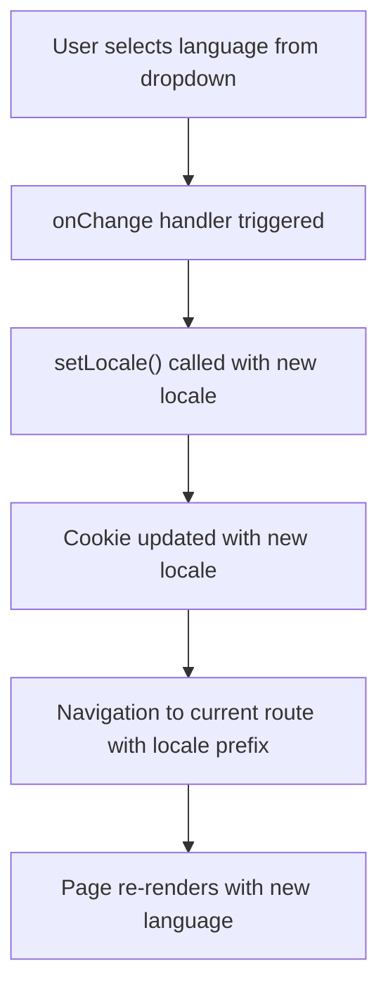
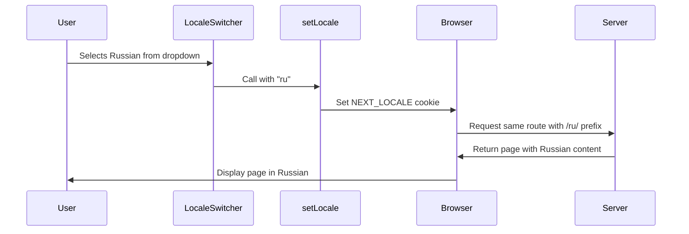
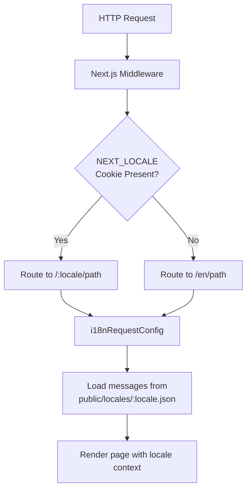
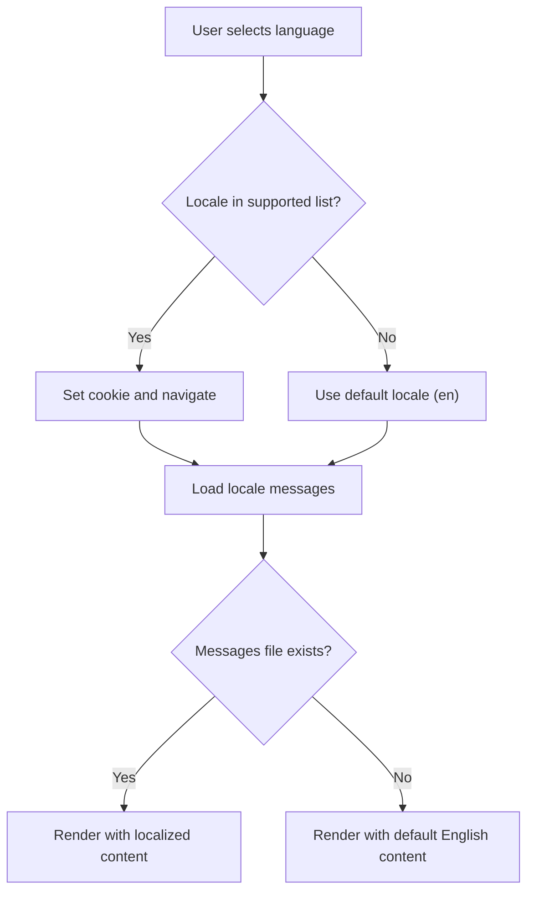
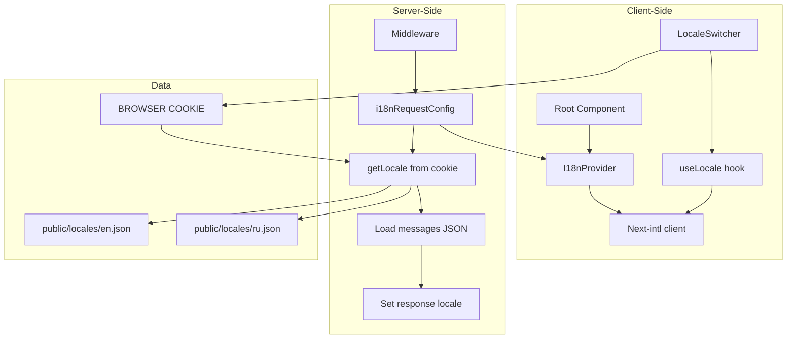

# LocaleSwitcher Component

<cite>
**Referenced Files in This Document**   
- [LocaleSwitcher.tsx](file://passion/src/components/LocaleSwitcher/LocaleSwitcher.tsx)
- [config.ts](file://passion/src/core/i18n/config.ts)
- [locale.ts](file://passion/src/core/i18n/locale.ts)
- [i18n.ts](file://passion/src/core/i18n/i18n.ts)
- [provider.tsx](file://passion/src/core/i18n/provider.tsx)
- [layout.tsx](file://passion/src/app/layout.tsx)
- [en.json](file://passion/public/locales/en.json)
- [ru.json](file://passion/public/locales/ru.json)
- [next.config.ts](file://passion/next.config.ts)
</cite>

## Table of Contents
1. [Introduction](#introduction)
2. [Core Implementation](#core-implementation)
3. [Locale Management System](#locale-management-system)
4. [UI and User Experience](#ui-and-user-experience)
5. [Integration with Next.js i18n Routing](#integration-with-nextjs-i18n-routing)
6. [Accessibility and Responsive Design](#accessibility-and-responsive-design)
7. [Performance Considerations](#performance-considerations)
8. [Error Handling and Validation](#error-handling-and-validation)
9. [Extending with New Languages](#extending-with-new-languages)
10. [Architecture Overview](#architecture-overview)

## Introduction
The LocaleSwitcher component provides a user interface element for switching between available languages in the application, currently supporting English and Russian. It leverages the next-intl library for internationalization, maintaining user language preferences through cookie-based persistence. The component integrates with Next.js middleware and routing to ensure consistent locale handling across page navigations. This documentation details the implementation, integration points, and best practices for maintaining and extending the language switching functionality.

## Core Implementation

The LocaleSwitcher is a client-side React component that renders a dropdown select element allowing users to choose their preferred language. It uses the `useLocale` hook from next-intl to access the current locale and updates the application state by calling `setLocale` when a new language is selected. The component re-renders automatically when the locale changes, triggering a navigation to the current route with the updated locale prefix.



**Diagram sources**
- [LocaleSwitcher.tsx](file://passion/src/components/LocaleSwitcher/LocaleSwitcher.tsx#L11-L26)
- [locale.ts](file://passion/src/core/i18n/locale.ts#L17-L19)

**Section sources**
- [LocaleSwitcher.tsx](file://passion/src/components/LocaleSwitcher/LocaleSwitcher.tsx#L1-L26)

## Locale Management System

The locale management system is built around server-side functions that read and write locale preferences to cookies. The `getLocale` function retrieves the current locale from the NEXT_LOCALE cookie, falling back to 'en' if no preference is set. The `setLocale` function updates the cookie with the user's selection, ensuring persistence across sessions. This approach allows for server-side rendering with the correct locale while maintaining client-side interactivity.

```mermaid
classDiagram
class LocaleSwitcher {
+useLocale()
+onChange(value)
-render Select with options
}
class LocaleManagement {
+getLocale() Promise~string~
+setLocale(locale) Promise~void~
-COOKIE_NAME : string
}
class Config {
+defaultLocale : string
+locales : readonly ["en", "ru"]
+localesMap : Array<{key, title}>
}
LocaleSwitcher --> LocaleManagement : "uses setLocale"
LocaleSwitcher --> Config : "reads localesMap"
LocaleManagement --> Config : "uses defaultLocale"
```

**Diagram sources**
- [locale.ts](file://passion/src/core/i18n/locale.ts#L13-L21)
- [config.ts](file://passion/src/core/i18n/config.ts#L1-L10)

**Section sources**
- [locale.ts](file://passion/src/core/i18n/locale.ts#L1-L21)
- [config.ts](file://passion/src/core/i18n/config.ts#L1-L10)

## UI and User Experience

The LocaleSwitcher uses the Telegram UI Select component to provide a consistent look and feel with the Telegram application ecosystem. The dropdown displays language names in their native scripts (English, Русский), making it intuitive for users to identify their preferred language. When a user selects a new language, the component triggers a navigation to the same route with the updated locale prefix, preserving the user's position in the application while changing the language context.

The component is designed to be placed in the application layout, typically in the header or navigation area, where it remains accessible across all pages. Its implementation ensures that the selected language is immediately reflected in all localized content, providing instant feedback to the user.



**Diagram sources**
- [LocaleSwitcher.tsx](file://passion/src/components/LocaleSwitcher/LocaleSwitcher.tsx#L14-L17)
- [locale.ts](file://passion/src/core/i18n/locale.ts#L17-L19)

## Integration with Next.js i18n Routing

The LocaleSwitcher integrates with Next.js middleware through the next-intl plugin configured in next.config.ts. The plugin uses the i18n.ts configuration to determine locale handling, reading the locale from cookies via the getLocale function. When a request is received, the middleware checks for the NEXT_LOCALE cookie and routes the request to the appropriate locale-prefixed path, falling back to the default English locale if necessary.

The I18nProvider component wraps the application content in layout.tsx, providing the current locale and messages to all components through context. This ensures that all localized content is rendered correctly based on the user's language preference, which is synchronized between the client and server.



**Diagram sources**
- [i18n.ts](file://passion/src/core/i18n/i18n.ts#L7-L19)
- [provider.tsx](file://passion/src/core/i18n/provider.tsx#L7-L16)
- [layout.tsx](file://passion/src/app/layout.tsx#L17-L29)
- [next.config.ts](file://passion/next.config.ts#L4-L8)

**Section sources**
- [i18n.ts](file://passion/src/core/i18n/i18n.ts#L1-L19)
- [provider.tsx](file://passion/src/core/i18n/provider.tsx#L1-L18)
- [layout.tsx](file://passion/src/app/layout.tsx#L1-L30)

## Accessibility and Responsive Design

The LocaleSwitcher component inherits accessibility features from the Telegram UI Select component, including proper ARIA attributes and keyboard navigation support. The language options are displayed using their native names, which is a best practice for language selectors as it allows users to easily identify their native language. The component automatically adapts to different screen sizes through the responsive design of the Telegram UI library.

For screen reader users, the select element is properly labeled and announces language changes appropriately. The use of standard HTML select and option elements ensures compatibility with assistive technologies. The component should be placed in a consistent location in the UI, such as the header, to help users with disabilities easily locate the language switching functionality.

The responsive design ensures the component displays correctly on various device sizes, from mobile phones to desktop computers. In constrained spaces, the select dropdown provides an efficient way to present multiple language options without consuming excessive screen real estate.

## Performance Considerations

The LocaleSwitcher implementation is optimized for performance by leveraging Next.js server-side rendering and client-side navigation. When a user changes the language, the component triggers a navigation rather than attempting to re-render all content client-side. This approach ensures that the server can deliver the appropriate localized content directly, reducing client-side processing overhead.

The use of cookie-based persistence eliminates the need for API calls to store or retrieve user preferences, resulting in faster language switching. Locale data is statically imported from JSON files in the public/locales directory, allowing for efficient bundling and caching. The next-intl plugin configured in next.config.ts optimizes the routing process by handling locale detection at the middleware level.

Potential performance implications include the need to re-fetch and re-render page content when switching languages, which is inherent to the server-side rendering approach. However, this is generally preferable to client-side translation as it ensures SEO friendliness and consistent initial load performance.

## Error Handling and Validation

The locale system includes built-in validation to handle unsupported locales gracefully. The getLocale function in locale.ts defaults to 'en' if no valid locale is found in the cookie, preventing application errors due to missing or invalid locale data. The i18n.ts configuration includes a check to ensure that only supported locales (defined in config.ts) are used, falling back to the default locale for any unrecognized values.

When importing locale messages, the system uses conditional logic to load the appropriate JSON file from public/locales, with a fallback to the default English messages if the requested locale file is not available. This prevents runtime errors when adding new languages or if locale files are temporarily missing.

The type system enforces valid locale values through the Locale type definition, which is derived from the readonly locales array in config.ts. This prevents invalid locale strings from being used in the application code, catching potential errors at compile time.



**Diagram sources**
- [i18n.ts](file://passion/src/core/i18n/i18n.ts#L13-L15)
- [locale.ts](file://passion/src/core/i18n/locale.ts#L13-L15)
- [config.ts](file://passion/src/core/i18n/config.ts#L5-L10)

**Section sources**
- [i18n.ts](file://passion/src/core/i18n/i18n.ts#L1-L19)
- [locale.ts](file://passion/src/core/i18n/locale.ts#L1-L21)

## Extending with New Languages

Adding new languages to the system requires updates to several components. First, the locales array in config.ts must be updated to include the new locale code. Then, a corresponding JSON file must be created in the public/locales directory with the appropriate translations. The localesMap array should be extended with the new language's display name in its native script.

For example, to add French support:
1. Update `locales` in config.ts: `[defaultLocale, 'ru', 'fr'] as const`
2. Add `{ key: 'fr', title: 'Français' }` to `localesMap`
3. Create `public/locales/fr.json` with translated messages
4. Ensure all message keys from en.json and ru.json are present in the new file

The type system will automatically recognize the new locale through the union type derived from the locales array, ensuring type safety throughout the application. No changes to the LocaleSwitcher component itself are required, as it dynamically renders options based on the localesMap configuration.

## Architecture Overview

The LocaleSwitcher component is part of a comprehensive internationalization architecture that spans client and server components. The system uses a cookie-based persistence mechanism to maintain user preferences across sessions, with server-side middleware handling locale detection and routing. Client-side components access the current locale through React hooks, while server-side rendering ensures SEO-friendly localized content delivery.



**Diagram sources**
- [LocaleSwitcher.tsx](file://passion/src/components/LocaleSwitcher/LocaleSwitcher.tsx#L1-L26)
- [locale.ts](file://passion/src/core/i18n/locale.ts#L1-L21)
- [i18n.ts](file://passion/src/core/i18n/i18n.ts#L1-L19)
- [provider.tsx](file://passion/src/core/i18n/provider.tsx#L1-L18)
- [layout.tsx](file://passion/src/app/layout.tsx#L1-L30)