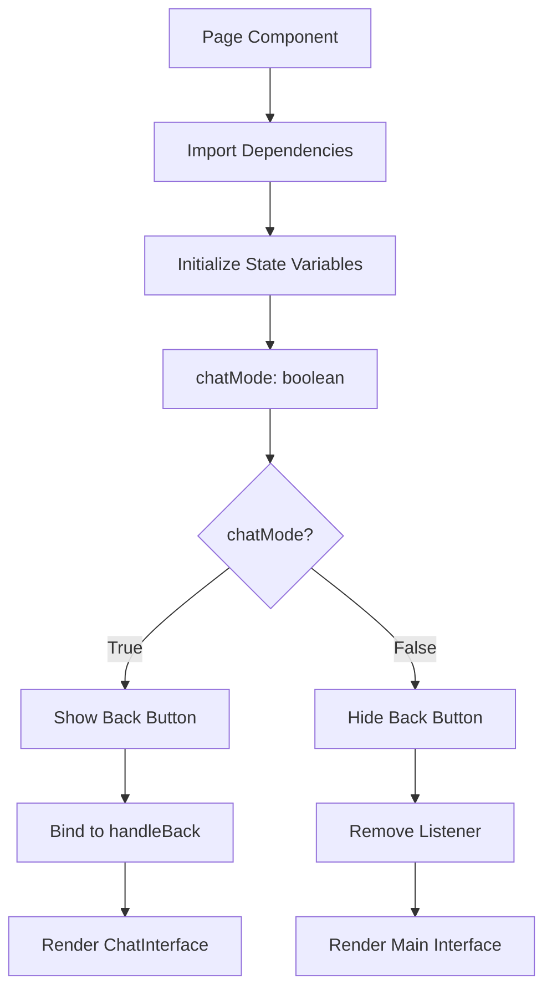
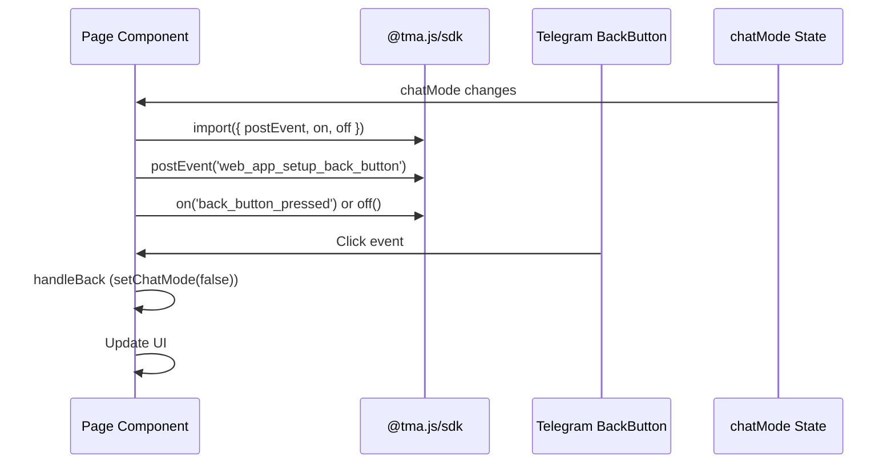
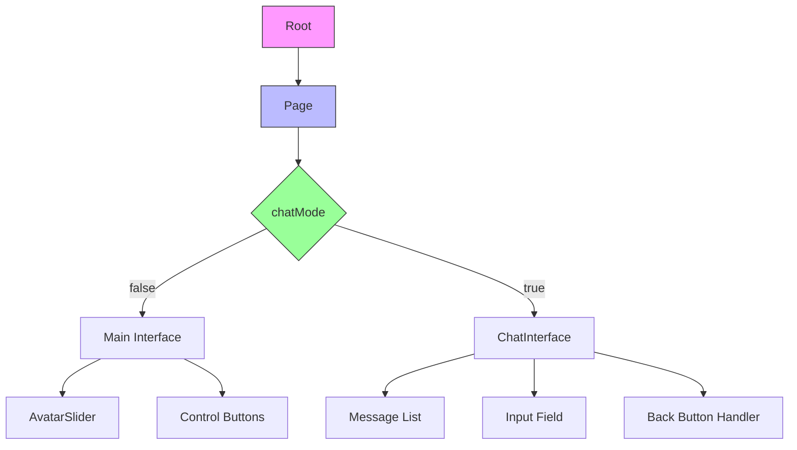
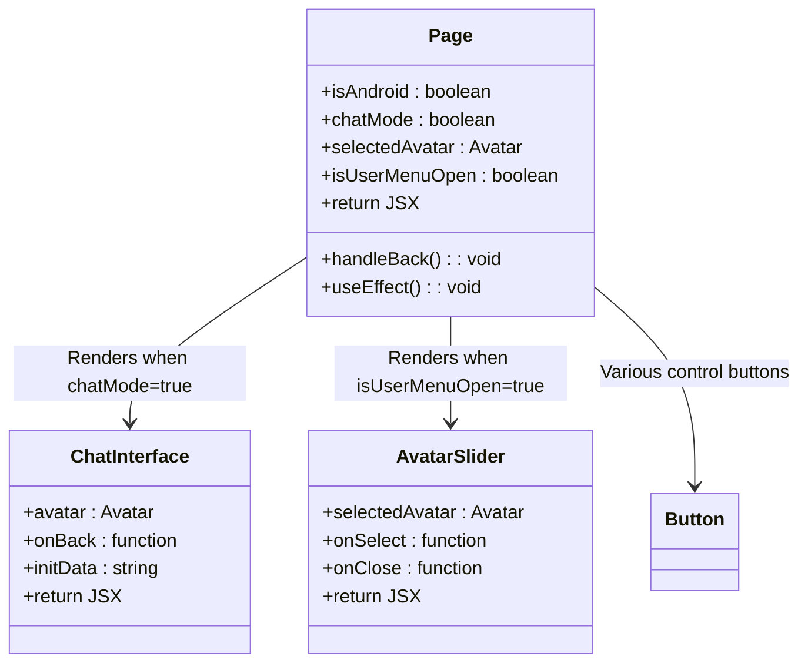

# Page Component

<cite>
**Referenced Files in This Document**   
- [page.tsx](file://passion/app/page.tsx) - *Updated to use low-level SDK methods for back button control*
- [useHaptic.ts](file://passion/src/hooks/useHaptic.ts) - *Haptic feedback integration*
- [ChatInterface.tsx](file://passion/src/components/ChatInterface.tsx) - *Chat mode integration*
- [AvatarSlider.tsx](file://passion/src/components/AvatarSlider.tsx) - *User interface component*
- [Root.tsx](file://passion/src/components/Root/Root.tsx) - *Application root provider*
- [layout.tsx](file://passion/app/layout.tsx) - *Viewport configuration*
</cite>

## Update Summary
**Changes Made**   
- Updated documentation to reflect new implementation of Telegram Back Button using low-level `postEvent` and `on/off` methods from `@tma.js/sdk`
- Removed references to deprecated `back` prop in Page component as navigation is now controlled by `chatMode` state
- Added documentation for dynamic back button visibility control during chat mode
- Updated code examples and implementation details to match current `app/page.tsx` implementation
- Removed outdated sections about Page component props and lifecycle management
- Added new section on chat mode integration and back button behavior

## Table of Contents
1. [Introduction](#introduction)
2. [Core Implementation](#core-implementation)
3. [Navigation Control](#navigation-control)
4. [Integration Patterns](#integration-patterns)
5. [Lifecycle Management](#lifecycle-management)
6. [Usage Examples](#usage-examples)
7. [Best Practices](#best-practices)

## Introduction
The Page component serves as the main layout wrapper in Telegram Mini Apps, managing navigation behavior through direct integration with Telegram's Web App API. Unlike the previous implementation that used a dedicated Page component with a `back` prop, the current implementation directly manages the back button visibility and events within the main page component using low-level SDK methods. This approach provides more granular control over navigation, particularly for dynamic states like chat mode.

**Section sources**
- [page.tsx](file://passion/app/page.tsx#L80-L295)

## Core Implementation
The Page component is implemented as a React functional component within `app/page.tsx` that directly integrates with the Telegram Mini App SDK. Instead of using a separate Page component with props, navigation is controlled through the `chatMode` state variable. The component uses `useEffect` hooks to manage the back button's visibility and event listeners, leveraging the low-level `postEvent`, `on`, and `off` methods from `@tma.js/sdk`. This implementation allows for dynamic control of the back button based on the application state, particularly when entering and exiting chat mode.

**Diagram sources**
- [page.tsx](file://passion/app/page.tsx#L114-L132)

**Section sources**
- [page.tsx](file://passion/app/page.tsx#L80-L295)

## Navigation Control
The Page component manages navigation through direct integration with Telegram's Web App API using low-level methods. The back button visibility is dynamically controlled based on the `chatMode` state. When `chatMode` is true, the component calls `postEvent('web_app_setup_back_button', { is_visible: true })` to show the back button and binds the `back_button_pressed` event to the `handleBack` function using the `on()` method. When `chatMode` is false, the back button is hidden and the event listener is removed using the `off()` method. This approach replaces the previous prop-based system with a state-driven model that responds to the application's current mode.

**Diagram sources**
- [page.tsx](file://passion/app/page.tsx#L114-L132)

**Section sources**
- [page.tsx](file://passion/app/page.tsx#L114-L132)

## Integration Patterns
The Page component integrates with other core components to create the application's user interface. It uses the `Root` component as a provider for SDK and context management. The main content area conditionally renders either the main interface (with avatar selection and controls) or the `ChatInterface` component based on the `chatMode` state. The `ChatInterface` component receives the `onBack` callback to handle back navigation, creating a seamless integration between the chat functionality and the main navigation system. The layout also incorporates platform-specific adjustments for Android and iOS through the `isAndroid` state variable.

**Diagram sources**
- [page.tsx](file://passion/app/page.tsx#L221-L282)
- [ChatInterface.tsx](file://passion/src/components/ChatInterface.tsx#L40-L274)
- [AvatarSlider.tsx](file://passion/src/components/AvatarSlider.tsx#L11-L144)

**Section sources**
- [page.tsx](file://passion/app/page.tsx#L221-L282)
- [ChatInterface.tsx](file://passion/src/components/ChatInterface.tsx#L40-L274)
- [AvatarSlider.tsx](file://passion/src/components/AvatarSlider.tsx#L11-L144)

## Lifecycle Management
The Page component properly manages the lifecycle of back button event listeners through React's `useEffect` hooks. The effect that handles back button visibility and events includes a cleanup function that removes the event listener when the component unmounts or when dependencies change. This ensures no memory leaks occur and that event handlers are properly cleaned up. The effect depends on both `chatMode` and `handleBack`, ensuring it re-runs whenever the chat mode changes or the back handler is updated. The dynamic import of SDK methods within the effect prevents SSR issues while ensuring the SDK is available in the client environment.

**Section sources**
- [page.tsx](file://passion/app/page.tsx#L114-L132)

## Usage Examples
The Page component is used as the main entry point for the application, with its navigation behavior controlled by the `chatMode` state. In the main interface, the back button is hidden, and a toggle button activates chat mode. When chat mode is active, the back button appears and is bound to the `handleBack` function, which sets `chatMode` to false when triggered. This pattern is used throughout the application to manage navigation between different views, particularly for the chat functionality. The component also integrates haptic feedback through the `useHaptic` hook for enhanced user interaction.

**Diagram sources**
- [page.tsx](file://passion/app/page.tsx#L80-L295)
- [ChatInterface.tsx](file://passion/src/components/ChatInterface.tsx#L40-L274)
- [AvatarSlider.tsx](file://passion/src/components/AvatarSlider.tsx#L11-L144)

**Section sources**
- [page.tsx](file://passion/app/page.tsx#L80-L295)

## Best Practices
When implementing navigation in Telegram Mini Apps, consider using state-driven back button control rather than prop-based systems for more dynamic behavior. Use the low-level `postEvent`, `on`, and `off` methods from `@tma.js/sdk` for precise control over the back button's visibility and event handling. Ensure proper cleanup of event listeners in useEffect cleanup functions to prevent memory leaks. Test navigation behavior across different Telegram clients and device types, accounting for platform-specific differences in UI elements. The current implementation demonstrates how to abstract Telegram-specific UI controls while maintaining compatibility with Next.js App Router through direct integration in the page component.

**Section sources**
- [page.tsx](file://passion/app/page.tsx#L114-L132)
- [useHaptic.ts](file://passion/src/hooks/useHaptic.ts#L7-L64)