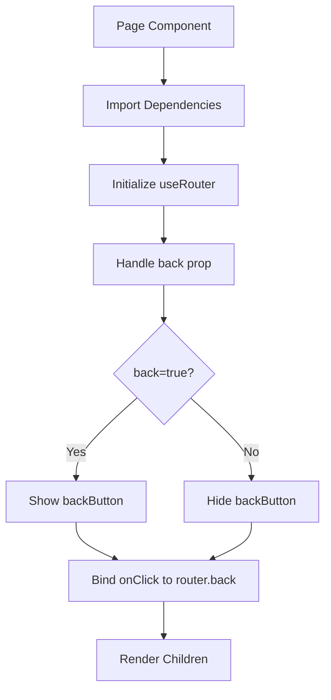
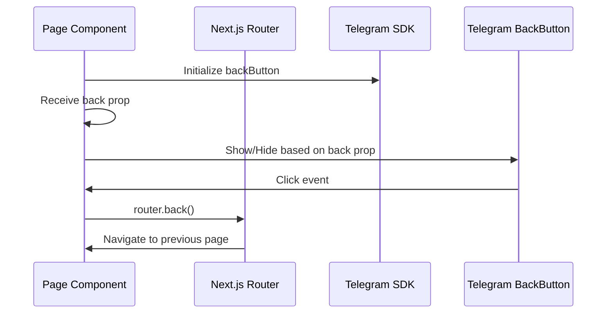
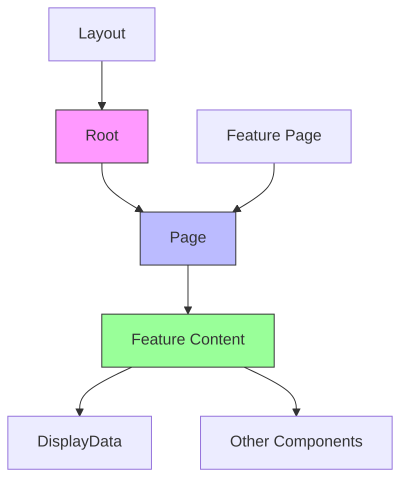
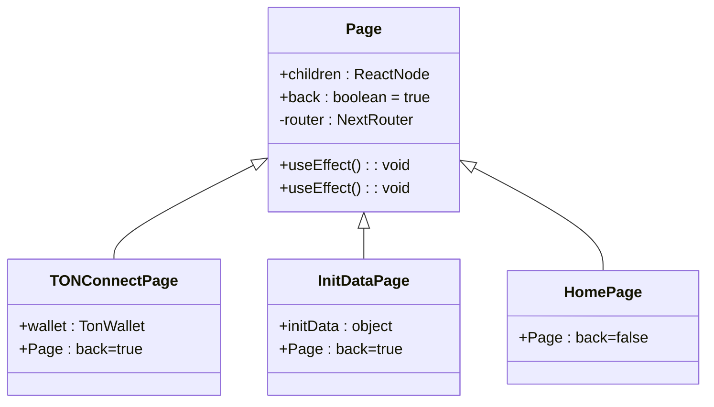

# Page Component

<cite>
**Referenced Files in This Document**   
- [Page.tsx](file://passion/src/components/Page.tsx)
- [Root.tsx](file://passion/src/components/Root.tsx)
- [DisplayData.tsx](file://passion/src/components/DisplayData/DisplayData.tsx)
- [layout.tsx](file://passion/src/app/layout.tsx)
- [ton-connect/page.tsx](file://passion/src/app/ton-connect/page.tsx)
- [init-data/page.tsx](file://passion/src/app/init-data/page.tsx)
</cite>

## Table of Contents
1. [Introduction](#introduction)
2. [Core Implementation](#core-implementation)
3. [Navigation Control](#navigation-control)
4. [Integration Patterns](#integration-patterns)
5. [Lifecycle Management](#lifecycle-management)
6. [Usage Examples](#usage-examples)
7. [Best Practices](#best-practices)

## Introduction
The Page component serves as a foundational layout wrapper in Telegram Mini Apps, bridging Next.js App Router navigation with Telegram's native UI controls. It abstracts the complexity of managing Telegram's backButton API while maintaining seamless integration with the application's routing system. This component ensures consistent navigation behavior across different feature pages within the Telegram Mini App ecosystem.

**Section sources**
- [Page.tsx](file://passion/src/components/Page.tsx#L1-L31)

## Core Implementation
The Page component is implemented as a React functional component that leverages Next.js router and Telegram SDK's backButton API. It accepts children as content and an optional back prop (defaulting to true) to control backButton visibility. The component uses useEffect hooks to synchronize its state with both the router and Telegram's backButton, ensuring proper lifecycle management.

**Diagram sources**
- [Page.tsx](file://passion/src/components/Page.tsx#L1-L31)

**Section sources**
- [Page.tsx](file://passion/src/components/Page.tsx#L1-L31)

## Navigation Control
The Page component manages navigation through two primary mechanisms: backButton visibility control and click event binding. When the back prop is true (default), it shows Telegram's native backButton and binds its onClick event to Next.js router.back(). When back is false, it hides the backButton, preventing navigation. This abstraction allows feature pages to declaratively control navigation behavior without directly interacting with Telegram's SDK.

**Diagram sources**
- [Page.tsx](file://passion/src/components/Page.tsx#L1-L31)

**Section sources**
- [Page.tsx](file://passion/src/components/Page.tsx#L1-L31)

## Integration Patterns
The Page component integrates with other core components like Root and DisplayData to create cohesive feature pages. It wraps content within the Root component's context, ensuring proper theming and error boundary handling. Feature pages use Page as a container for DisplayData components, creating structured information displays with consistent navigation controls.

**Diagram sources**
- [Root.tsx](file://passion/src/components/Root/Root.tsx#L1-L59)
- [layout.tsx](file://passion/src/app/layout.tsx#L1-L30)
- [DisplayData.tsx](file://passion/src/components/DisplayData/DisplayData.tsx#L1-L61)

**Section sources**
- [Root.tsx](file://passion/src/components/Root/Root.tsx#L1-L59)
- [layout.tsx](file://passion/src/app/layout.tsx#L1-L30)
- [DisplayData.tsx](file://passion/src/components/DisplayData/DisplayData.tsx#L1-L61)

## Lifecycle Management
The Page component properly manages the lifecycle of backButton event listeners through React's useEffect hooks. The first effect handles backButton visibility based on the back prop, while the second effect binds the onClick handler to router.back() and automatically cleans up the listener when the component unmounts. This ensures no memory leaks and proper event handling throughout the component's lifecycle.

**Section sources**
- [Page.tsx](file://passion/src/components/Page.tsx#L1-L31)

## Usage Examples
The Page component is used across various feature pages in the application, demonstrating different usage patterns. In the /ton-connect page, it provides navigation for wallet connection flows. The /init-data page uses it to navigate through user and chat information. The main page uses back={false} to prevent navigation from the home screen, creating a natural entry point.

**Diagram sources**
- [ton-connect/page.tsx](file://passion/src/app/ton-connect/page.tsx#L1-L107)
- [init-data/page.tsx](file://passion/src/app/init-data/page.tsx#L1-L96)
- [page.tsx](file://passion/src/app/page.tsx#L1-L63)

**Section sources**
- [ton-connect/page.tsx](file://passion/src/app/ton-connect/page.tsx#L1-L107)
- [init-data/page.tsx](file://passion/src/app/init-data/page.tsx#L1-L96)

## Best Practices
When using the Page component, consider the user experience and navigation flow. Use back={false} for entry points to prevent unnecessary navigation. Ensure all interactive elements are accessible through both the backButton and in-app navigation. Test responsiveness across different Telegram clients and screen sizes. The component abstracts Telegram-specific UI controls while maintaining compatibility with Next.js App Router, allowing developers to focus on feature implementation rather than platform-specific navigation details.

**Section sources**
- [Page.tsx](file://passion/src/components/Page.tsx#L1-L31)
- [ton-connect/page.tsx](file://passion/src/app/ton-connect/page.tsx#L1-L107)
- [init-data/page.tsx](file://passion/src/app/init-data/page.tsx#L1-L96)