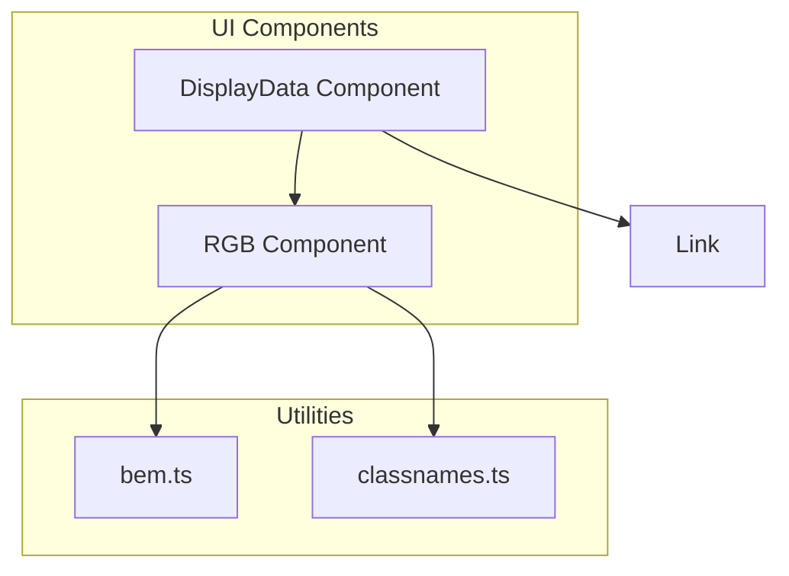
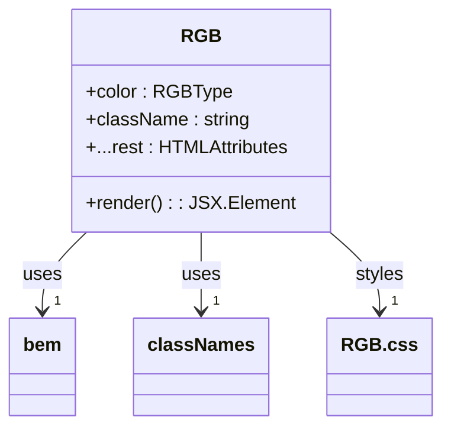
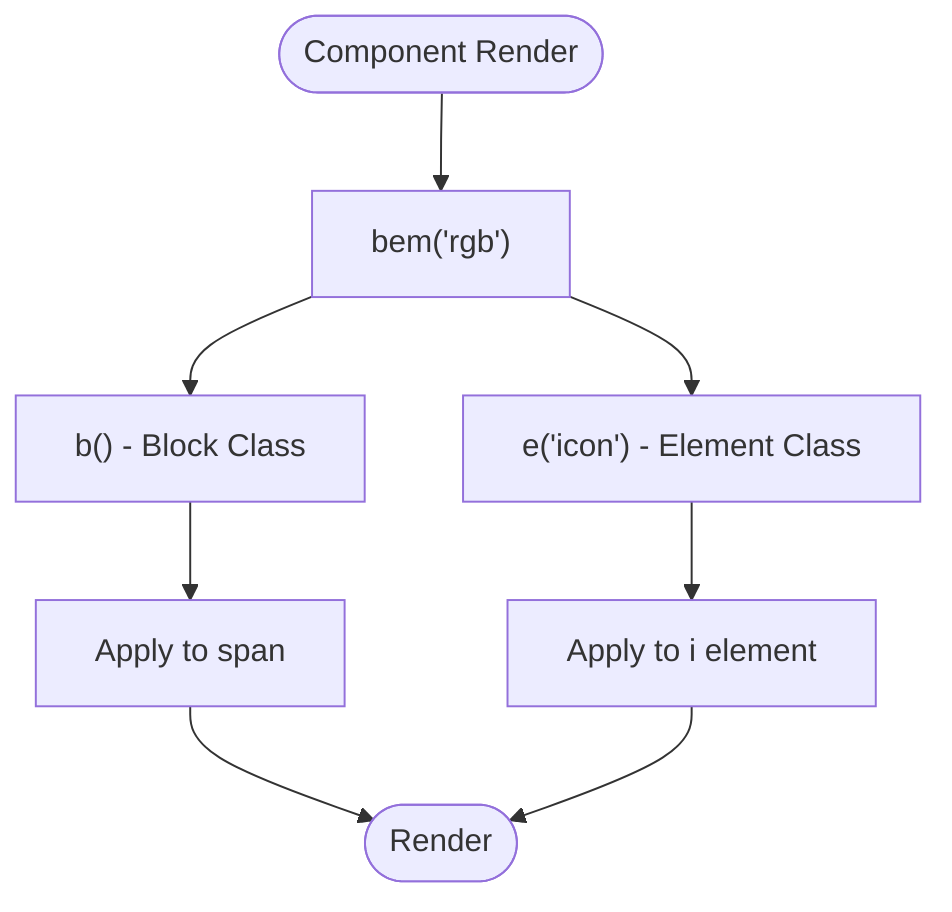
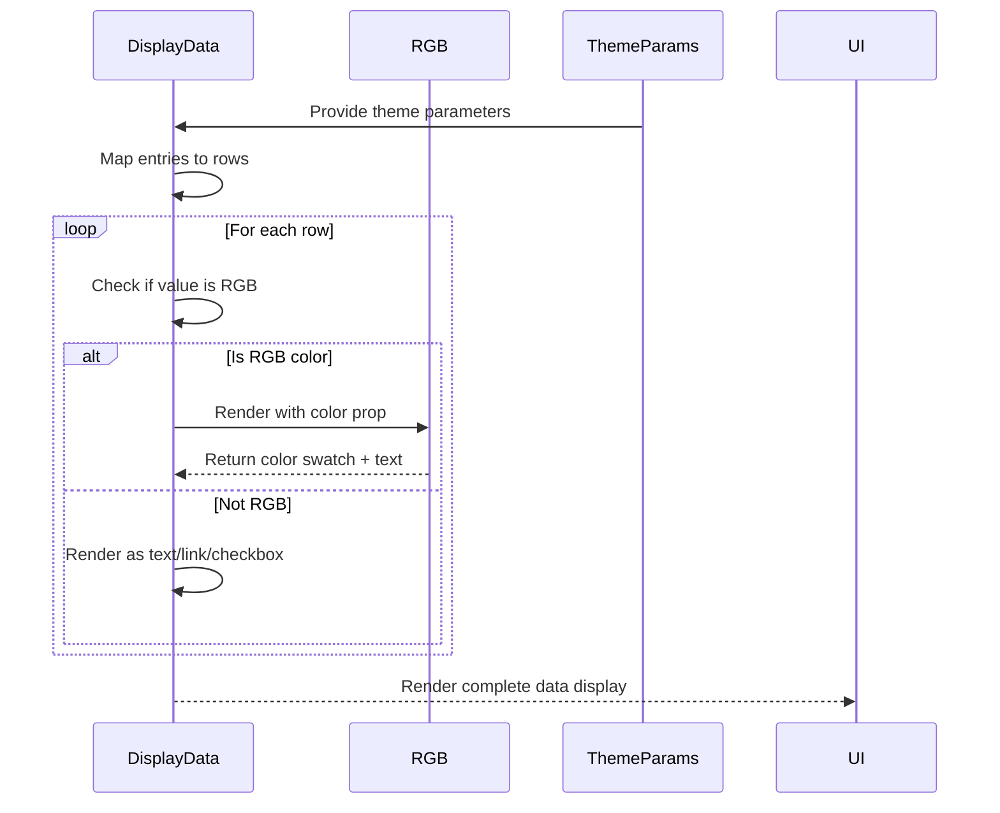

# RGB Component

<cite>
**Referenced Files in This Document**  
- [RGB.tsx](file://passion/src/components/RGB/RGB.tsx)
- [RGB.css](file://passion/src/components/RGB/RGB.css)
- [DisplayData.tsx](file://passion/src/components/DisplayData/DisplayData.tsx)
- [page.tsx](file://passion/src/app/theme-params/page.tsx)
- [bem.ts](file://passion/src/css/bem.ts)
</cite>

## Table of Contents
1. [Introduction](#introduction)
2. [Core Components](#core-components)
3. [Architecture Overview](#architecture-overview)
4. [Detailed Component Analysis](#detailed-component-analysis)
5. [Integration Patterns](#integration-patterns)
6. [Accessibility and Responsive Design](#accessibility-and-responsive-design)
7. [Usage Examples](#usage-examples)
8. [Conclusion](#conclusion)

## Introduction

The RGB component is a lightweight UI element designed to visually represent color values in the application, particularly for theme parameter visualization. It renders both a textual representation of the color value (in hex or RGB format) and a small circular color swatch preview. This dual representation enhances user experience by providing immediate visual feedback for color values, making it easier to understand and verify theme configurations. The component is primarily used in conjunction with Telegram SDK's theme parameters and integrates seamlessly with other UI components like DisplayData for structured data presentation.

**Section sources**
- [RGB.tsx](file://passion/src/components/RGB/RGB.tsx#L1-L21)

## Core Components

The RGB component is implemented as a functional React component that accepts a color value of type RGBType from the Telegram SDK. It supports all standard HTML div attributes through JSX.IntrinsicElements, allowing for flexible integration into various layouts. The component uses BEM (Block Element Modifier) methodology for consistent CSS class naming, ensuring styling consistency across the application. The color swatch is rendered using an inline style to dynamically set the background color, while the textual value is displayed alongside it.

**Section sources**
- [RGB.tsx](file://passion/src/components/RGB/RGB.tsx#L11-L21)
- [RGB.css](file://passion/src/components/RGB/RGB.css#L1-L13)

## Architecture Overview

The RGB component follows a simple yet effective architecture that separates concerns between presentation and functionality. It leverages the BEM methodology through a utility function to generate consistent CSS class names. The component is designed to be lightweight and reusable, with minimal dependencies on external libraries. It integrates with the broader application architecture through the DisplayData component, which handles the presentation of various data types, including colors.

**Diagram sources**
- [RGB.tsx](file://passion/src/components/RGB/RGB.tsx)
- [DisplayData.tsx](file://passion/src/components/DisplayData/DisplayData.tsx)
- [bem.ts](file://passion/src/css/bem.ts)

## Detailed Component Analysis

### RGB Component Implementation

The RGB component is implemented as a functional component that accepts a color prop of type RGBType and optional className and other div attributes. It renders a span element containing a small circular icon with the specified background color and the textual representation of the color value.

#### Component Structure

**Diagram sources**
- [RGB.tsx](file://passion/src/components/RGB/RGB.tsx#L15-L20)
- [RGB.css](file://passion/src/components/RGB/RGB.css#L1-L13)

#### BEM Implementation
The component uses the BEM utility to generate CSS class names following the BEM methodology. The block is named 'rgb', with an element 'icon' for the color swatch. This ensures consistent styling and prevents CSS conflicts.

**Diagram sources**
- [RGB.tsx](file://passion/src/components/RGB/RGB.tsx#L9-L10)
- [bem.ts](file://passion/src/css/bem.ts#L43-L47)

**Section sources**
- [RGB.tsx](file://passion/src/components/RGB/RGB.tsx#L1-L21)
- [bem.ts](file://passion/src/css/bem.ts#L1-L49)

## Integration Patterns

The RGB component is primarily integrated through the DisplayData component, which automatically detects color values and renders them using the RGB component. This integration pattern allows for consistent presentation of theme parameters and other color values throughout the application.

### DisplayData Integration

**Diagram sources**
- [DisplayData.tsx](file://passion/src/components/DisplayData/DisplayData.tsx#L35-L36)
- [RGB.tsx](file://passion/src/components/RGB/RGB.tsx)

**Section sources**
- [DisplayData.tsx](file://passion/src/components/DisplayData/DisplayData.tsx#L1-L61)

## Accessibility and Responsive Design

The RGB component is designed with accessibility in mind, ensuring that color values are represented in a way that is compatible with screen readers. The textual representation of the color value provides semantic meaning that can be interpreted by assistive technologies. The component's responsive design ensures that color swatches are displayed appropriately in different layouts, maintaining visual consistency across various screen sizes and device types.

The circular color swatch has sufficient size (18px) and border contrast to be easily distinguishable, even for users with color vision deficiencies. The 5px gap between the swatch and text ensures adequate spacing for readability. The component's inline-flex display with center alignment ensures proper vertical alignment with surrounding text.

**Section sources**
- [RGB.css](file://passion/src/components/RGB/RGB.css#L1-L13)

## Usage Examples

The RGB component is used in the theme-params page to display Telegram theme colors. When the DisplayData component receives theme parameters, it automatically detects color values and renders them using the RGB component. This provides a clear visual representation of the theme's color scheme, making it easy to understand and verify.

In the theme-params implementation, the page uses the useSignal hook to subscribe to theme parameters state changes. The DisplayData component then maps each theme parameter to a row, with color values automatically rendered as RGB components. This pattern demonstrates how the RGB component integrates seamlessly into the application's data visualization system.

**Section sources**
- [page.tsx](file://passion/src/app/theme-params/page.tsx#L1-L27)

## Conclusion

The RGB component plays a crucial role in enhancing the user experience by providing visual feedback for color values in the application. Its simple yet effective design, combined with BEM-based styling and seamless integration with DisplayData, makes it an essential component for theme parameter visualization. By rendering both a color swatch and textual value, it caters to both visual and semantic understanding of color information, ensuring accessibility and clarity. The component's lightweight implementation and flexible API make it easy to use and maintain, contributing to the overall consistency and quality of the application's UI.