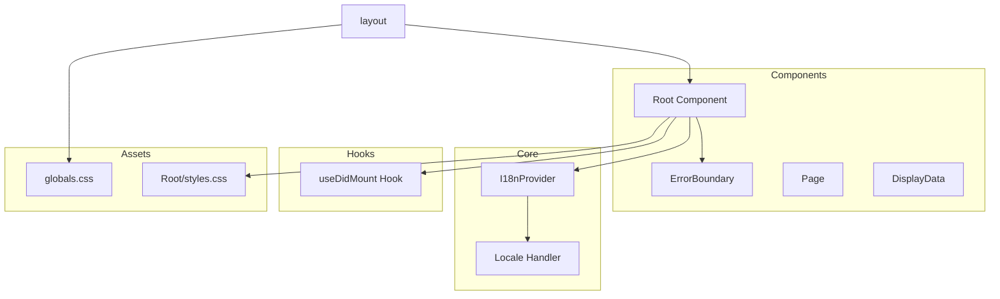
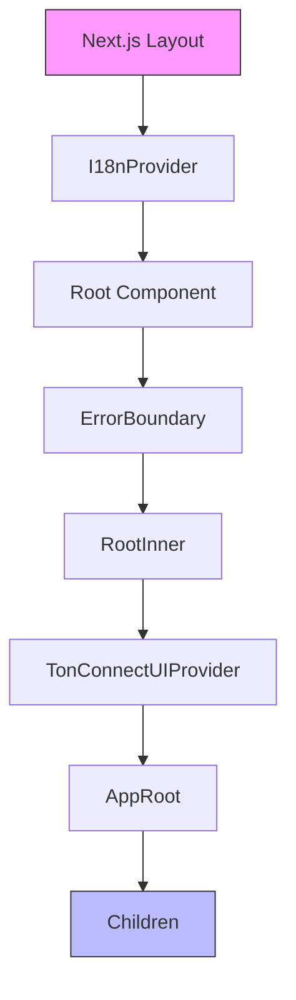
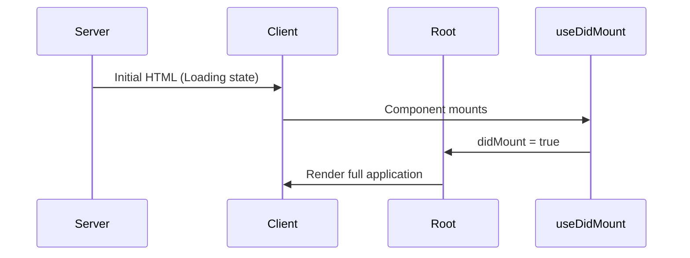
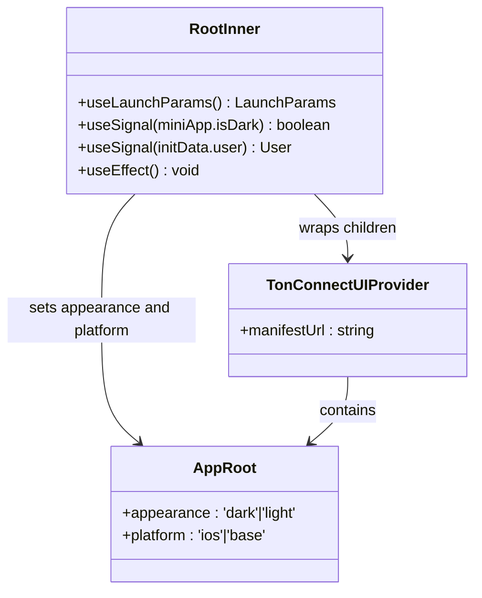
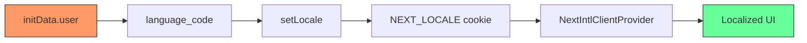
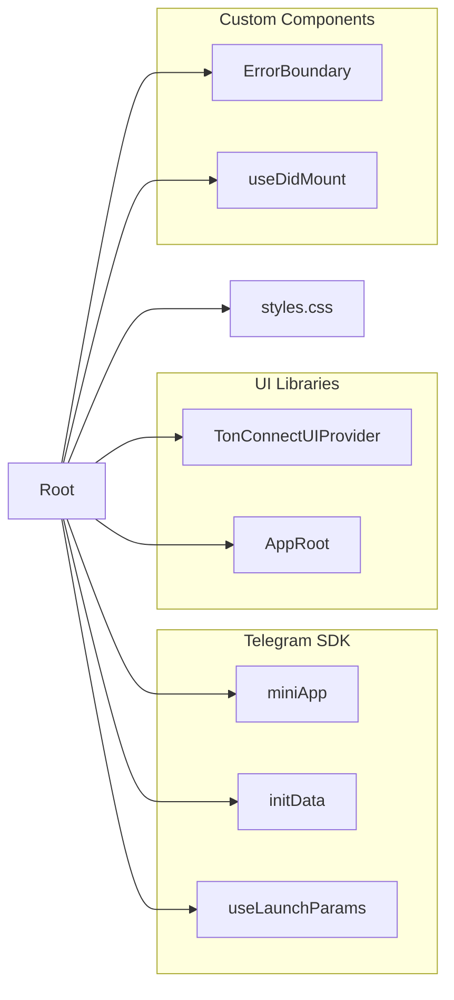

# Root Component

<cite>
**Referenced Files in This Document**   
- [Root.tsx](file://passion/src/components/Root/Root.tsx)
- [styles.css](file://passion/src/components/Root/styles.css)
- [layout.tsx](file://passion/src/app/layout.tsx)
- [provider.tsx](file://passion/src/core/i18n/provider.tsx)
- [locale.ts](file://passion/src/core/i18n/locale.ts)
- [useDidMount.ts](file://passion/src/hooks/useDidMount.ts)
- [globals.css](file://passion/src/app/_assets/globals.css)
- [mockEnv.ts](file://passion/src/mockEnv.ts)
</cite>

## Table of Contents
1. [Introduction](#introduction)
2. [Project Structure](#project-structure)
3. [Core Components](#core-components)
4. [Architecture Overview](#architecture-overview)
5. [Detailed Component Analysis](#detailed-component-analysis)
6. [Dependency Analysis](#dependency-analysis)
7. [Performance Considerations](#performance-considerations)
8. [Troubleshooting Guide](#troubleshooting-guide)
9. [Conclusion](#conclusion)

## Introduction
The Root component serves as the top-level container for the application's user interface, orchestrating theme synchronization with Telegram, internationalization support, and error handling. It ensures visual consistency with the Telegram client by binding Telegram theme parameters to CSS variables and integrates with the i18n provider to support multilingual functionality. This document provides a comprehensive analysis of its implementation, architecture, and integration patterns.

## Project Structure
The project follows a modular structure with clear separation of concerns. The Root component resides in the components directory and is integrated into the Next.js application layout. It interacts with core modules for internationalization and hooks for lifecycle management.

**Diagram sources**
- [Root.tsx](file://passion/src/components/Root/Root.tsx)
- [layout.tsx](file://passion/src/app/layout.tsx)
- [provider.tsx](file://passion/src/core/i18n/provider.tsx)

**Section sources**
- [Root.tsx](file://passion/src/components/Root/Root.tsx)
- [layout.tsx](file://passion/src/app/layout.tsx)

## Core Components
The Root component acts as a foundational wrapper that enables Telegram theme integration, error boundary protection, and client-side mounting detection. It wraps all children with necessary providers and handles the transition from server to client rendering through a loading state.

**Section sources**
- [Root.tsx](file://passion/src/components/Root/Root.tsx#L45-L57)
- [useDidMount.ts](file://passion/src/hooks/useDidMount.ts)

## Architecture Overview
The Root component sits at the heart of the application's rendering pipeline, positioned between the Next.js layout and the page content. It ensures proper initialization of Telegram-specific features and internationalization before rendering the main application.

**Diagram sources**
- [layout.tsx](file://passion/src/app/layout.tsx#L17-L28)
- [Root.tsx](file://passion/src/components/Root/Root.tsx#L20-L42)

## Detailed Component Analysis

### Root Component Analysis
The Root component implements a two-phase rendering strategy to handle the limitations of Telegram Mini Apps regarding server-side rendering. It uses the useDidMount hook to detect when the component has mounted on the client side.

#### Client-Side Mounting Detection

**Diagram sources**
- [Root.tsx](file://passion/src/components/Root/Root.tsx#L45-L57)
- [useDidMount.ts](file://passion/src/hooks/useDidMount.ts)

#### Theme Integration and Appearance Management
The RootInner component subscribes to Telegram's theme signals and propagates appearance settings to the AppRoot component from Telegram UI.

**Diagram sources**
- [Root.tsx](file://passion/src/components/Root/Root.tsx#L20-L42)

**Section sources**
- [Root.tsx](file://passion/src/components/Root/Root.tsx#L20-L42)
- [mockEnv.ts](file://passion/src/mockEnv.ts#L9-L23)

### Internationalization Integration
The Root component works in conjunction with the I18nProvider to ensure language settings are properly synchronized with Telegram user data.

**Diagram sources**
- [Root.tsx](file://passion/src/components/Root/Root.tsx#L27-L29)
- [locale.ts](file://passion/src/core/i18n/locale.ts#L16-L18)
- [provider.tsx](file://passion/src/core/i18n/provider.tsx)

**Section sources**
- [Root.tsx](file://passion/src/components/Root/Root.tsx#L16)
- [locale.ts](file://passion/src/core/i18n/locale.ts)

## Dependency Analysis
The Root component has well-defined dependencies that enable its core functionality while maintaining separation of concerns.

**Diagram sources**
- [Root.tsx](file://passion/src/components/Root/Root.tsx)
- [go.mod](file://passion/package.json)

**Section sources**
- [Root.tsx](file://passion/src/components/Root/Root.tsx)
- [package.json](file://passion/package.json)

## Performance Considerations
The Root component implements several performance optimizations:

1. **Conditional Rendering**: Uses useDidMount to prevent premature rendering
2. **Signal-based Updates**: Leverages Telegram SDK's useSignal for efficient theme updates
3. **Lazy Initialization**: Defers full initialization until client-side mounting
4. **Minimal Re-renders**: Theme and platform props are derived from stable signals

The loading state prevents hydration mismatches while ensuring a smooth transition from server to client rendering. The useEffect hook for locale setting is properly memoized to avoid unnecessary executions.

**Section sources**
- [Root.tsx](file://passion/src/components/Root/Root.tsx#L27-L29)
- [useDidMount.ts](file://passion/src/hooks/useDidMount.ts)

## Troubleshooting Guide
Common issues and their solutions when working with the Root component:

1. **Theme Not Updating**: Ensure Telegram environment is properly initialized
2. **Language Not Changing**: Verify initData is available and user object contains language_code
3. **Loading State Persists**: Check useDidMount implementation and client-side execution
4. **CSS Variables Not Applied**: Confirm globals.css is imported in layout.tsx

The component includes error boundary protection to gracefully handle runtime exceptions, with ErrorPage as the fallback UI.

**Section sources**
- [Root.tsx](file://passion/src/components/Root/Root.tsx#L52-L54)
- [ErrorBoundary.tsx](file://passion/src/components/ErrorBoundary.tsx)
- [ErrorPage.tsx](file://passion/src/components/ErrorPage.tsx)

## Conclusion
The Root component effectively serves as the foundation for the Telegram Mini App, providing essential services for theme synchronization, internationalization, and error handling. Its architecture balances the constraints of server-side rendering with the requirements of client-side Telegram integration, using a clean composition pattern that allows for extensibility. The implementation demonstrates best practices in React component design, state management, and third-party library integration.