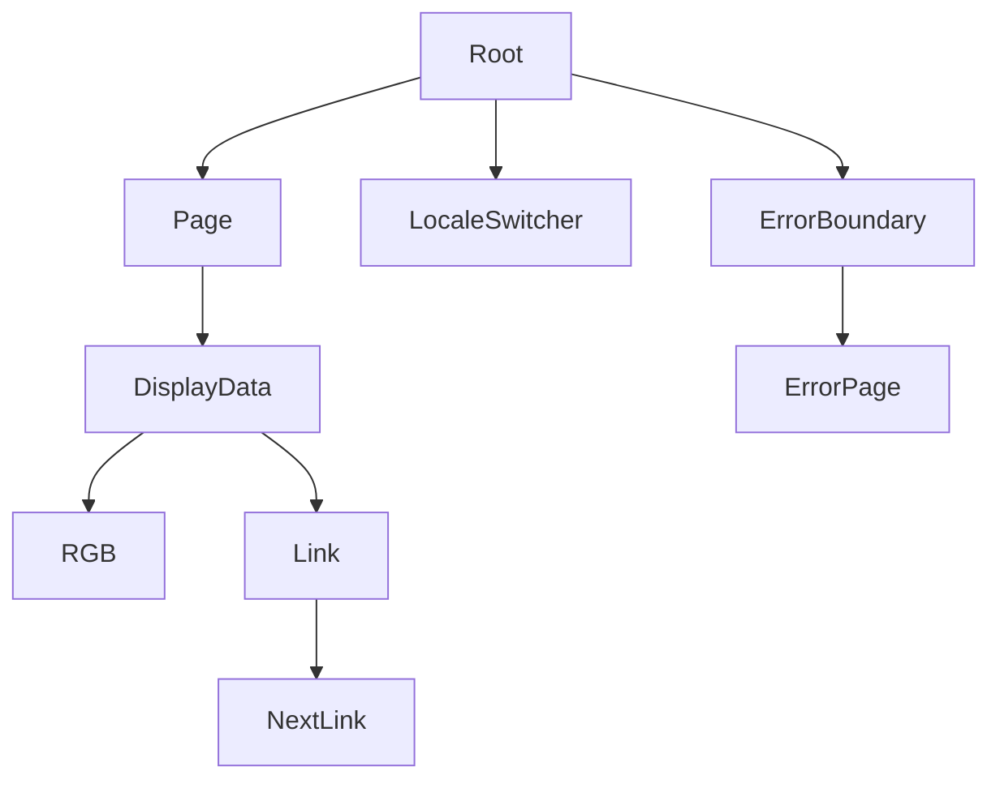
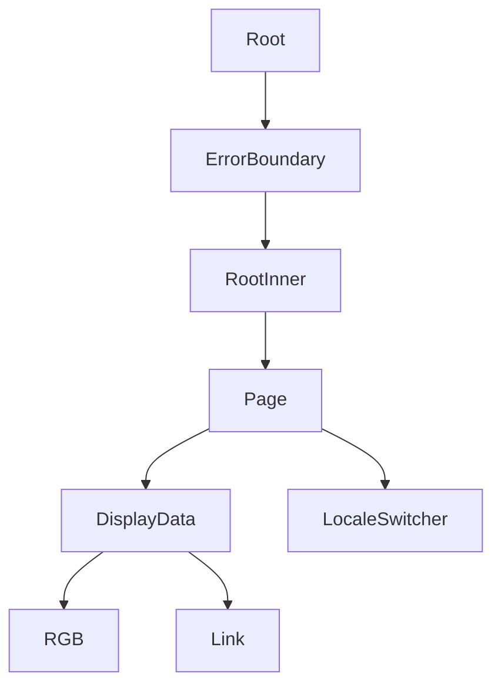

# UI Components

<cite>
**Referenced Files in This Document**   
- [Page.tsx](file://passion/src/components/Page.tsx)
- [DisplayData.tsx](file://passion/src/components/DisplayData/DisplayData.tsx)
- [DisplayData.css](file://passion/src/components/DisplayData/DisplayData.css)
- [Link.tsx](file://passion/src/components/Link/Link.tsx)
- [Link.css](file://passion/src/components/Link/Link.css)
- [RGB.tsx](file://passion/src/components/RGB/RGB.tsx)
- [RGB.css](file://passion/src/components/RGB/RGB.css)
- [Root.tsx](file://passion/src/components/Root/Root.tsx)
- [styles.css](file://passion/src/components/Root/styles.css)
- [LocaleSwitcher.tsx](file://passion/src/components/LocaleSwitcher/LocaleSwitcher.tsx)
- [ErrorBoundary.tsx](file://passion/src/components/ErrorBoundary.tsx)
- [ErrorPage.tsx](file://passion/src/components/ErrorPage.tsx)
- [config.ts](file://passion/src/core/i18n/config.ts)
- [locale.ts](file://passion/src/core/i18n/locale.ts)
- [types.ts](file://passion/src/core/i18n/types.ts)
- [bem.ts](file://passion/src/css/bem.ts)
- [classnames.ts](file://passion/src/css/classnames.ts)
- [page.tsx](file://passion/src/app/page.tsx)
- [theme-params/page.tsx](file://passion/src/app/theme-params/page.tsx)
</cite>

## Table of Contents
1. [Introduction](#introduction)
2. [Core Components Overview](#core-components-overview)
3. [Page Component](#page-component)
4. [DisplayData Component](#displaydata-component)
5. [Link Component](#link-component)
6. [RGB Component](#rgb-component)
7. [Root Component](#root-component)
8. [LocaleSwitcher Component](#localeswitcher-component)
9. [ErrorBoundary and ErrorPage Components](#errorboundary-and-errorpage-components)
10. [Component Composition Examples](#component-composition-examples)
11. [Styling and Theming System](#styling-and-theming-system)
12. [Accessibility and Responsive Behavior](#accessibility-and-responsive-behavior)
13. [Best Practices and Extensibility](#best-practices-and-extensibility)

## Introduction
This document provides comprehensive documentation for all UI components in the `src/components` directory of the Passion-bot-2 application. The components are designed to work within a Telegram Mini App environment, leveraging the Telegram Apps SDK and Next.js framework. The documentation covers component props, types, styling mechanisms, usage patterns, accessibility, theming, and integration with external systems such as i18n and error handling.

**Section sources**
- [Page.tsx](file://passion/src/components/Page.tsx#L1-L31)
- [Root.tsx](file://passion/src/components/Root/Root.tsx#L1-L59)

## Core Components Overview
The UI component library consists of reusable, modular components designed for consistency and integration within Telegram Mini Apps. These components follow a structured architecture that emphasizes accessibility, theming, and internationalization. Key components include layout wrappers (Page, Root), data display utilities (DisplayData, RGB), navigation elements (Link), and utility components (LocaleSwitcher, ErrorBoundary).

**Diagram sources**
- [Root.tsx](file://passion/src/components/Root/Root.tsx#L1-L59)
- [Page.tsx](file://passion/src/components/Page.tsx#L1-L31)
- [DisplayData.tsx](file://passion/src/components/DisplayData/DisplayData.tsx#L1-L61)
- [Link.tsx](file://passion/src/components/Link/Link.tsx#L1-L59)

## Page Component
The `Page` component serves as a layout wrapper that manages navigation behavior within Telegram Mini Apps. It controls the visibility of the back button in the Telegram interface and handles navigation using Next.js routing.

### Props
- `children`: ReactNode - Content to be rendered within the page
- `back`: boolean (optional, default: true) - Controls whether the back button should be displayed

### Functionality
When `back` is true, the component shows the Telegram back button and attaches a click handler that triggers `router.back()`. When false, the back button is hidden. This enables fine-grained control over navigation flow in multi-page applications.

### Integration
The `Page` component integrates with `Root` as the root container and can contain `DisplayData` for structured information presentation. It is used in all main application pages to ensure consistent navigation behavior.

**Section sources**
- [Page.tsx](file://passion/src/components/Page.tsx#L1-L31)
- [page.tsx](file://passion/src/app/page.tsx#L1-L64)

## DisplayData Component
The `DisplayData` component renders structured key-value pairs in a clean, consistent format using Telegram UI components.

### Props
- `header`: ReactNode (optional) - Header content for the section
- `footer`: ReactNode (optional) - Footer content for the section
- `rows`: DisplayDataRow[] - Array of data rows, each containing:
  - `title`: string - Label for the data row
  - `value`: ReactNode | string | boolean | undefined - Value to display
  - `type`: 'link' (optional) - Special handling for link-type values

### Value Rendering Logic
The component intelligently renders different value types:
- Strings that are valid RGB colors are rendered using the `RGB` component
- Boolean values are displayed as disabled checkboxes
- Undefined values show as "empty"
- Links are rendered with appropriate navigation behavior

### Styling
Uses CSS modules with BEM naming convention (`display-data__line`, `display-data__line-value`). Styles are defined in `DisplayData.css` and leverage Telegram theme variables like `--tg-theme-subtitle-text-color`.

**Section sources**
- [DisplayData.tsx](file://passion/src/components/DisplayData/DisplayData.tsx#L1-L61)
- [DisplayData.css](file://passion/src/components/DisplayData/DisplayData.css#L1-L16)
- [theme-params/page.tsx](file://passion/src/app/theme-params/page.tsx#L1-L27)

## Link Component
The `Link` component provides navigation with intelligent handling of internal and external URLs.

### Props
Extends Next.js `LinkProps` and HTML anchor attributes:
- `href`: string | UrlObject - Destination URL
- `className`: string (optional) - Additional CSS classes
- All standard anchor element props (onClick, target, etc.)

### Navigation Logic
The component automatically detects external links by comparing protocol and host with the current URL. External links are opened using `@tma.js/sdk-react`'s `openLink` function to ensure proper behavior within Telegram, while preventing default anchor behavior.

### Styling
Applies the `link` CSS class which removes text decoration and uses `--tg-theme-link-color` for consistent theming with the Telegram interface.

**Section sources**
- [Link.tsx](file://passion/src/components/Link/Link.tsx#L1-L59)
- [Link.css](file://passion/src/components/Link/Link.css#L1-L4)

## RGB Component
The `RGB` component displays color values with both visual swatch and textual representation.

### Props
- `color`: RGBType - Color value in RGB format
- `className`: string (optional) - Additional CSS classes
- All standard div element props

### Visual Representation
Renders a small circular swatch with the specified background color followed by the color value text. Uses BEM methodology with classes `rgb` and `rgb__icon`.

### Theming Support
The component directly uses the provided color value for the swatch background, ensuring accurate color representation that respects Telegram's theming system through CSS variables.

**Section sources**
- [RGB.tsx](file://passion/src/components/RGB/RGB.tsx#L1-L21)
- [RGB.css](file://passion/src/components/RGB/RGB.css#L1-L13)

## Root Component
The `Root` component serves as the root container for the entire application, providing essential context and error handling.

### Functionality
- Integrates with Telegram Mini Apps SDK to access launch parameters and theme information
- Sets up `TonConnectUIProvider` for wallet connectivity
- Applies appropriate appearance (light/dark) based on Telegram theme
- Handles server-side rendering limitations by showing a loading state initially
- Wraps the application in an `ErrorBoundary` for robust error handling

### Theming
Binds CSS variables to Telegram theme parameters through `AppRoot` component, automatically adapting to user's Telegram theme preferences.

### State Management
Uses `useSignal` from Telegram SDK to reactively respond to theme changes and user data updates.

**Section sources**
- [Root.tsx](file://passion/src/components/Root/Root.tsx#L1-L59)
- [styles.css](file://passion/src/components/Root/styles.css#L1-L10)

## LocaleSwitcher Component
The `LocaleSwitcher` component enables language switching with persistence.

### Implementation
- Uses `next-intl` hooks for locale detection and management
- Displays a select dropdown with available languages (English, Russian)
- Updates the locale using `setLocale` function which persists the selection via cookies
- Reads available locales from `core/i18n/config`

### Persistence
Language preferences are stored in a cookie named `NEXT_LOCALE` using Next.js headers API, ensuring the selection persists across sessions.

### Accessibility
The select element provides standard keyboard navigation and screen reader support.

**Section sources**
- [LocaleSwitcher.tsx](file://passion/src/components/LocaleSwitcher/LocaleSwitcher.tsx#L1-L27)
- [config.ts](file://passion/src/core/i18n/config.ts#L1-L11)
- [locale.ts](file://passion/src/core/i18n/locale.ts#L1-L22)
- [types.ts](file://passion/src/core/i18n/types.ts#L1-L6)

## ErrorBoundary and ErrorPage Components
These components provide a robust error handling system for the application.

### ErrorBoundary
- Class component that implements React's error boundary pattern
- Catches JavaScript errors in child components
- Accepts a `fallback` prop specifying the component to render when an error occurs
- Uses `getDerivedStateFromError` to update state and `componentDidCatch` for error logging

### ErrorPage
- Functional component that renders when an error occurs
- Displays the error message in a formatted block
- Includes a "Try again" button if a reset function is provided
- Logs errors to the console for debugging

### Integration
The `ErrorBoundary` wraps the `RootInner` component, ensuring all application-level errors are caught and handled gracefully.

**Section sources**
- [ErrorBoundary.tsx](file://passion/src/components/ErrorBoundary.tsx#L1-L40)
- [ErrorPage.tsx](file://passion/src/components/ErrorPage.tsx#L1-L26)

## Component Composition Examples
The components are designed to work together in various combinations to create rich user interfaces.

### Home Page Composition
The home page demonstrates typical component composition:
- `Root` provides the application container
- `Page` with `back={false}` creates the main layout
- `List` and `Section` from Telegram UI organize content
- `Link` components with `Cell` create navigable items
- `LocaleSwitcher` is integrated in a dedicated section

### Theme Parameters Page
Demonstrates data display composition:
- `Page` provides layout
- `DisplayData` renders theme parameters as key-value pairs
- Automatically converts RGB values using `isRGB` detection
- Shows "empty" for undefined values

**Diagram sources**
- [page.tsx](file://passion/src/app/page.tsx#L1-L64)
- [theme-params/page.tsx](file://passion/src/app/theme-params/page.tsx#L1-L27)

## Styling and Theming System
The application uses a multi-layered styling approach that integrates with Telegram's theming system.

### CSS Modules and BEM
Components use CSS modules with BEM naming convention for predictable, scoped styles. The `bem.ts` utility generates class names following the block__element--modifier pattern.

### Theme Integration
Components consume Telegram theme parameters via CSS variables:
- `--tg-theme-link-color` for link colors
- `--tg-theme-subtitle-text-color` for secondary text
- Automatic light/dark mode detection through `miniApp.isDark`

### Utility Functions
The `classnames.ts` file provides utilities for conditional class application and merging class names from multiple sources.

### Tailwind CSS
While not explicitly shown in the code, the project configuration suggests Tailwind is available for utility-first styling where appropriate.

**Section sources**
- [bem.ts](file://passion/src/css/bem.ts#L1-L49)
- [classnames.ts](file://passion/src/css/classnames.ts#L1-L83)
- [Link.css](file://passion/src/components/Link/Link.css#L1-L4)
- [RGB.css](file://passion/src/components/RGB/RGB.css#L1-L13)

## Accessibility and Responsive Behavior
The components are designed with accessibility and responsiveness as core principles.

### Keyboard Navigation
All interactive elements support keyboard navigation:
- Links are focusable and operable via keyboard
- Select elements in `LocaleSwitcher` follow standard accessibility patterns
- ErrorPage includes a focusable retry button

### Screen Reader Support
Semantic HTML elements are used where appropriate:
- `Section` and `List` provide document structure
- Labels and titles provide context
- ARIA attributes are inherited from Telegram UI components

### Responsive Design
Components automatically adapt to different screen sizes:
- Telegram UI components are mobile-first
- Flexbox and CSS grid ensure proper layout
- Text wrapping is handled by `word-break: break-word`

### Touch Targets
Interactive elements maintain appropriate touch target sizes (minimum 44px) as required for mobile interfaces.

**Section sources**
- [Link.tsx](file://passion/src/components/Link/Link.tsx#L1-L59)
- [LocaleSwitcher.tsx](file://passion/src/components/LocaleSwitcher/LocaleSwitcher.tsx#L1-L27)
- [DisplayData.tsx](file://passion/src/components/DisplayData/DisplayData.tsx#L1-L61)

## Best Practices and Extensibility
The component library follows several best practices to ensure maintainability and reusability.

### Component Design Principles
- Single Responsibility: Each component has a focused purpose
- Composability: Components are designed to work together
- Type Safety: Extensive TypeScript usage with clear interfaces
- Reusability: Generic components can be used in multiple contexts

### Extending Components
To create new components:
1. Follow the existing file structure (component directory with .tsx and .css files)
2. Use BEM naming for CSS classes
3. Leverage existing utilities (`bem`, `classNames`)
4. Integrate with Telegram theme variables when appropriate
5. Ensure proper TypeScript typing

### Internationalization
New components requiring text should:
- Use `next-intl` hooks for translations
- Support all configured locales
- Store language data in `public/locales`

### Error Handling
Custom components should:
- Be wrapped in `ErrorBoundary` when appropriate
- Handle edge cases gracefully
- Provide meaningful error messages
- Follow the existing error logging pattern

### Performance Considerations
- Use `useMemo` and `useCallback` for expensive calculations
- Implement proper dependency arrays in hooks
- Avoid unnecessary re-renders
- Leverage Telegram SDK signals for reactive updates

**Section sources**
- [Page.tsx](file://passion/src/components/Page.tsx#L1-L31)
- [Root.tsx](file://passion/src/components/Root/Root.tsx#L1-L59)
- [bem.ts](file://passion/src/css/bem.ts#L1-L49)
- [classnames.ts](file://passion/src/css/classnames.ts#L1-L83)