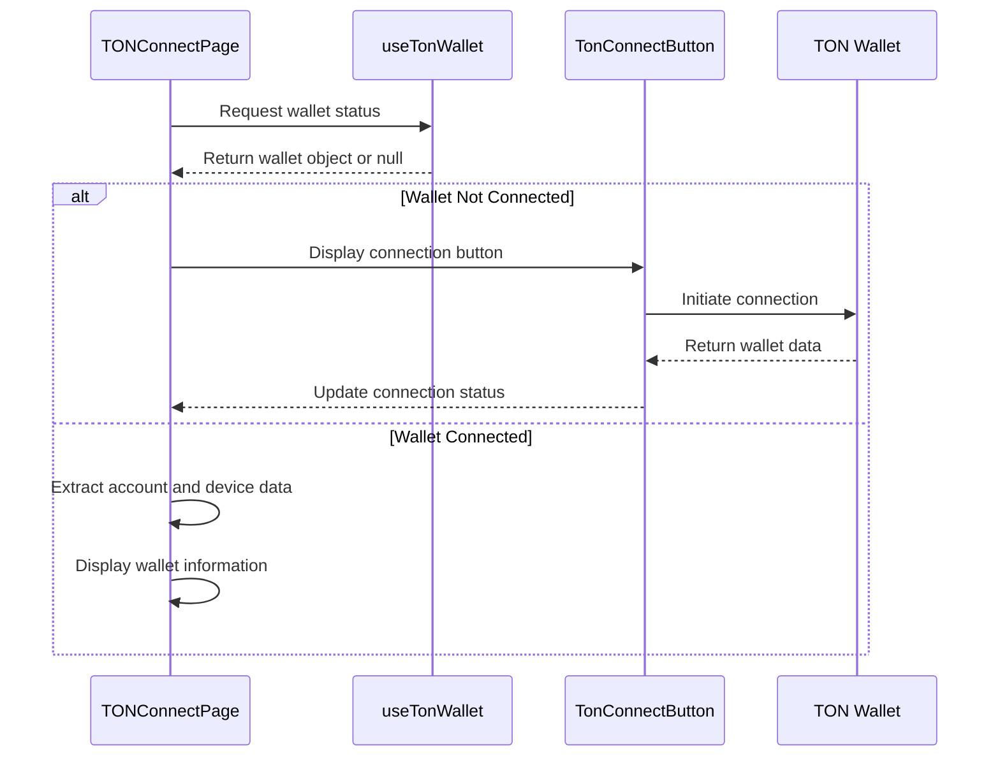
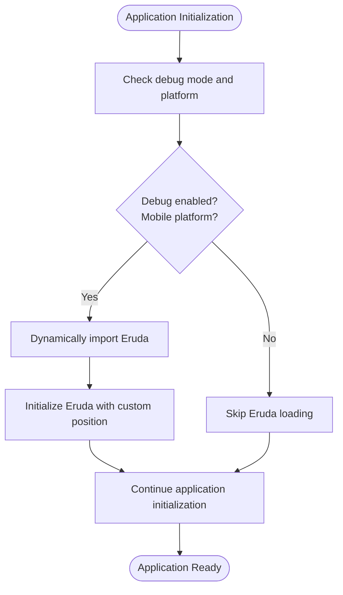

# Best Practices

<cite>
**Referenced Files in This Document**   
- [mockEnv.ts](file://passion/src/mockEnv.ts)
- [init.ts](file://passion/src/core/init.ts)
- [ErrorBoundary.tsx](file://passion/src/components/ErrorBoundary.tsx)
- [ErrorPage.tsx](file://passion/src/components/ErrorPage.tsx)
- [Root.tsx](file://passion/src/components/Root/Root.tsx)
- [useDidMount.ts](file://passion/src/hooks/useDidMount.ts)
- [i18n.ts](file://passion/src/core/i18n/i18n.ts)
- [locale.ts](file://passion/src/core/i18n/locale.ts)
- [config.ts](file://passion/src/core/i18n/config.ts)
- [init-data/page.tsx](file://passion/src/app/init-data/page.tsx)
- [ton-connect/page.tsx](file://passion/src/app/ton-connect/page.tsx)
- [instrumentation-client.ts](file://passion/src/instrumentation-client.ts)
- [next.config.ts](file://passion/next.config.ts)
- [README.md](file://passion/README.md)
</cite>

## Table of Contents
1. [Security Considerations](#security-considerations)
2. [Performance Optimization](#performance-optimization)
3. [Error Handling Strategies](#error-handling-strategies)
4. [Accessibility Practices](#accessibility-practices)
5. [Development Workflows](#development-workflows)
6. [Internationalization Best Practices](#internationalization-best-practices)
7. [Code Organization Patterns](#code-organization-patterns)
8. [Testing and Debugging](#testing-and-debugging)

## Security Considerations

### Never Use mockTelegramEnv in Production
The `mockTelegramEnv` function is designed exclusively for development purposes and should never be used in production environments. The implementation in `mockEnv.ts` includes safeguards to prevent its use outside development mode through conditional execution based on `process.env.NODE_ENV !== 'development'`. This ensures the mock environment is tree-shaken during production builds, preventing accidental exposure.

**Section sources**
- [mockEnv.ts](file://passion/src/mockEnv.ts#L1-L82)

### Properly Handle initData Authentication
When handling initData authentication, it is crucial to preserve the original parameter order as received from Telegram to avoid validation failures on the server side. The mock environment in `mockEnv.ts` demonstrates proper initialization with realistic but testable data, including auth_date, hash, signature, and user parameters. Developers should use real initData from their application during testing rather than relying on the default mock values.

**Section sources**
- [mockEnv.ts](file://passion/src/mockEnv.ts#L59-L72)

### Secure Wallet Connections Through TON Connect
The TON Connect implementation follows security best practices by using the official `@tonconnect/ui-react` library and referencing the manifest file from a secure location (`/tonconnect-manifest.json`). The wallet connection flow properly handles both connected and disconnected states, with appropriate UI feedback. The implementation in `ton-connect/page.tsx` demonstrates secure access to wallet account information including chain, public key, and address.



**Diagram sources**
- [ton-connect/page.tsx](file://passion/src/app/ton-connect/page.tsx#L23-L106)

## Performance Optimization

### Conditional Loading of Debug Tools (Eruda)
The application implements conditional loading of the Eruda debugging tool based on both debug mode and platform. In `init.ts`, the Eruda library is dynamically imported only when debug mode is enabled and the platform is mobile (iOS or Android). This prevents unnecessary loading of debug tools in production or on desktop platforms, optimizing bundle size and performance.



**Diagram sources**
- [init.ts](file://passion/src/core/init.ts#L30-L34)
- [instrumentation-client.ts](file://passion/src/instrumentation-client.ts#L1-L25)

### Efficient Signal Usage for Reactivity
The application leverages signal-based reactivity through the `@tma.js/sdk-react` library to optimize rendering performance. Components use `useSignal` to subscribe only to specific parts of the application state, ensuring that re-renders occur only when relevant data changes. For example, in `init-data/page.tsx`, `useSignal` is used to track `initDataRaw` and `initDataState`, minimizing unnecessary re-renders when other parts of the application state change.

**Section sources**
- [init-data/page.tsx](file://passion/src/app/init-data/page.tsx#L23-L24)
- [Root.tsx](file://passion/src/components/Root/Root.tsx#L23-L24)

### Minimizing Re-renders
The application employs several techniques to minimize re-renders. The `useMemo` hook is used extensively to memoize computed values, such as in `init-data/page.tsx` where `initDataRows`, `userRows`, `receiverRows`, and `chatRows` are all memoized based on their dependencies. This prevents expensive recalculations on every render. Additionally, the component hierarchy separates presentational components from logic, reducing the scope of re-renders.

**Section sources**
- [init-data/page.tsx](file://passion/src/app/init-data/page.tsx#L26-L44)

## Error Handling Strategies

### Using ErrorBoundary for Graceful Error Recovery
The application implements a robust error boundary pattern using the `ErrorBoundary` component. This higher-order component catches JavaScript errors anywhere in the child component tree, logs them, and displays a fallback UI instead of crashing the entire application. The `ErrorBoundary` is implemented as a class component with `getDerivedStateFromError` and `componentDidCatch` lifecycle methods to handle both rendering and lifecycle errors.

```mermaid
classDiagram
class ErrorBoundary {
+state : ErrorBoundaryState
+static getDerivedStateFromError(error) : ErrorBoundaryState
+componentDidCatch(error : Error)
+render()
}
class ErrorBoundaryProps {
+children : ReactNode
+fallback : ComponentType<{ error : Error }>
}
class ErrorBoundaryState {
-error? : Error
}
ErrorBoundary --> ErrorBoundaryProps : "implements"
ErrorBoundary --> ErrorBoundaryState : "manages"
```

**Diagram sources**
- [ErrorBoundary.tsx](file://passion/src/components/ErrorBoundary.tsx#L1-L39)

### Proper SDK Initialization Checks
The application performs comprehensive SDK initialization checks through the `init` function in `core/init.ts`. This function configures the application environment based on runtime conditions, including debug mode detection from launch parameters or development environment. It also handles platform-specific issues, such as mocking the Telegram environment on macOS where the native implementation has known bugs.

**Section sources**
- [init.ts](file://passion/src/core/init.ts#L20-L24)

## Accessibility Practices

### Proper Contrast Ratios
The application maintains proper contrast ratios through its theme system, which adapts to the user's Telegram app theme. The mock environment in `mockEnv.ts` defines a comprehensive set of theme parameters with appropriate color values that ensure sufficient contrast between text and background colors. The dark theme uses `#f5f5f5` for text on a `#17212b` background, providing excellent contrast for readability.

**Section sources**
- [mockEnv.ts](file://passion/src/mockEnv.ts#L10-L23)

### Keyboard Navigation
While specific keyboard navigation implementations are not visible in the provided code, the application uses standard UI components from `@telegram-apps/telegram-ui` that are designed with accessibility in mind. Components like `Cell`, `Button`, and `Link` inherently support keyboard navigation and screen reader accessibility. The application structure with clear semantic HTML elements and proper focus management through the UI library ensures good keyboard navigation support.

## Development Workflows

### Using HTTPS for Telegram Testing
For testing within Telegram, developers should use HTTPS as required by @BotFather. The project provides a `dev:https` script that runs the application with a self-signed SSL certificate, enabling HTTPS on localhost. This allows developers to test the application in a realistic environment that matches Telegram's security requirements. After starting with `pnpm run dev:https`, the application can be accessed at `https://localhost:3000` and registered with @BotFather using the `https://127.0.0.1:3000` URL.

**Section sources**
- [README.md](file://passion/README.md#L98-L122)

### Leveraging the Mock Environment Effectively
The mock environment in `mockEnv.ts` is a powerful tool for development, simulating the Telegram environment when the application is not running within Telegram. It mocks essential Telegram Mini Apps methods like `web_app_request_theme`, `web_app_request_viewport`, and `web_app_request_safe_area`. Developers can extend this mock environment with realistic launch parameters and theme configurations to test various scenarios without needing to launch the app in Telegram.

**Section sources**
- [mockEnv.ts](file://passion/src/mockEnv.ts#L1-L82)

## Internationalization Best Practices

### Multi-language Support Implementation
The application implements internationalization using the `next-intl` library with a well-structured configuration. Language files are organized in `public/locales/` with JSON files for each supported language (en.json, ru.json). The i18n configuration in `core/i18n/` manages locale detection, message loading, and cookie-based locale persistence. The `LocaleSwitcher` component provides a user interface for language selection.

```mermaid
graph TB
subgraph "Locale Configuration"
A[defaultLocale: 'en']
B[timeZone: 'Europe/Amsterdam']
C[locales: ['en', 'ru']]
D[localesMap: {key, title}]
end
subgraph "Locale Management"
E[getLocale: reads from cookies]
F[setLocale: writes to cookies]
end
subgraph "Locale Components"
G[LocaleSwitcher: UI for language selection]
H[I18nProvider: wraps application with locale context]
end
A --> E
D --> G
E --> H
F --> H
```

**Diagram sources**
- [config.ts](file://passion/src/core/i18n/config.ts#L1-L10)
- [locale.ts](file://passion/src/core/i18n/locale.ts#L1-L21)
- [i18n.ts](file://passion/src/core/i18n/i18n.ts#L1-L20)

### Locale Detection and Persistence
Locale detection is implemented server-side using cookies, with a fallback to the default locale. The `getLocale` function in `locale.ts` retrieves the user's preferred language from cookies, while `setLocale` updates the cookie when the user changes the language. This ensures that the user's language preference is preserved across sessions. The Next.js middleware configuration in `next.config.ts` integrates the i18n system with the application routing.

**Section sources**
- [locale.ts](file://passion/src/core/i18n/locale.ts#L1-L21)
- [next.config.ts](file://passion/next.config.ts#L1-L9)

## Code Organization Patterns

### Separation of Concerns Between Core Logic and UI Components
The application follows a clear separation of concerns with distinct directories for different types of components:
- `core/`: Contains business logic, initialization code, and i18n configuration
- `components/`: Contains reusable UI components with minimal logic
- `app/`: Contains page-level components and routing
- `hooks/`: Contains custom React hooks for reusable logic

This separation ensures that UI components remain focused on presentation, while core logic is centralized and testable. For example, the `Root` component manages application initialization and error boundaries, while delegating rendering to `RootInner`.

**Section sources**
- [Root.tsx](file://passion/src/components/Root/Root.tsx#L1-L58)

## Testing and Debugging

### Debugging Production Issues
For debugging production issues, the application provides several mechanisms. The `instrumentation-client.ts` file is designed for setting up analytics and monitoring services. Error boundaries capture and display errors gracefully, while the `ErrorPage` component logs errors to the console for debugging. In development, the conditional loading of Eruda provides a comprehensive debugging console for mobile testing.

**Section sources**
- [instrumentation-client.ts](file://passion/src/instrumentation-client.ts#L1-L25)
- [ErrorPage.tsx](file://passion/src/components/ErrorPage.tsx#L1-L26)

### Testing Strategies
The application structure supports comprehensive testing through its modular design. Unit tests can target individual components like `DisplayData` and `ErrorBoundary`, while integration tests can verify the interaction between the Telegram SDK and UI components. The clear separation between mock environment code and production code ensures that tests can run in both mocked and real Telegram environments.