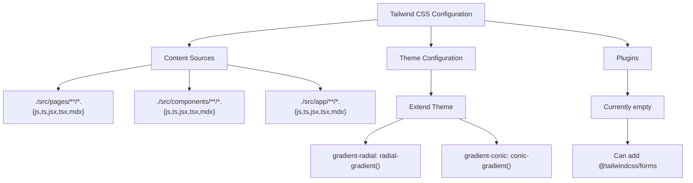
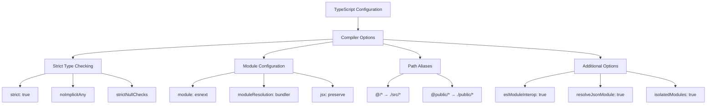

# Configuration

<cite>
**Referenced Files in This Document**   
- [next.config.ts](file://passion/next.config.ts)
- [tailwind.config.ts](file://passion/tailwind.config.ts)
- [tsconfig.json](file://passion/tsconfig.json)
- [postcss.config.mjs](file://passion/postcss.config.mjs)
- [src/mockEnv.ts](file://passion/src/mockEnv.ts)
- [src/core/i18n/config.ts](file://passion/src/core/i18n/config.ts)
- [src/core/i18n/i18n.ts](file://passion/src/core/i18n/i18n.ts)
- [src/core/i18n/locale.ts](file://passion/src/core/i18n/locale.ts)
- [src/components/LocaleSwitcher/LocaleSwitcher.tsx](file://passion/src/components/LocaleSwitcher/LocaleSwitcher.tsx)
- [pnpm-lock.yaml](file://passion/pnpm-lock.yaml)
</cite>

## Table of Contents
1. [Introduction](#introduction)
2. [Next.js Configuration](#nextjs-configuration)
3. [Tailwind CSS Configuration](#tailwind-css-configuration)
4. [TypeScript Configuration](#typescript-configuration)
5. [PostCSS and Autoprefixer Setup](#postcss-and-autoprefixer-setup)
6. [Environment Variable Handling](#environment-variable-handling)
7. [Dependency Management](#dependency-management)
8. [Configuration Modification Guide](#configuration-modification-guide)
9. [Conclusion](#conclusion)

## Introduction
This document provides comprehensive documentation for the project's configuration files. It details the setup and integration of key tools including Next.js, Tailwind CSS, TypeScript, PostCSS, and environment variable management. The configuration supports internationalization with English and Russian locales, responsive UI styling, strict type checking, and efficient build processes. This guide explains how these configurations work together and provides guidance for customizing them to meet specific project requirements.

## Next.js Configuration

The Next.js configuration is defined in `next.config.ts` and integrates with the `next-intl` library for internationalization support. The configuration sets up routing and localization for multiple languages, specifically English (en) and Russian (ru), with English as the default locale.

The configuration uses the `next-intl/plugin` to enable internationalized routing, pointing to the i18n setup file located at `./src/core/i18n/i18n.ts`. This plugin automatically configures Next.js to handle locale-specific routes and ensures proper message loading based on the user's language preference.

The i18n system is implemented through several core files that work together to manage language settings. The `config.ts` file defines the available locales and default language, while `locale.ts` handles reading and writing the user's language preference via cookies. The `i18n.ts` file serves as the main configuration entry point, determining which language file to load based on the current locale.

Language switching is implemented through the `LocaleSwitcher` component, which provides a user interface for changing between available languages. When a user selects a different language, the `setLocale` function updates the `NEXT_LOCALE` cookie, which persists the user's preference across sessions.

**Section sources**
- [next.config.ts](file://passion/next.config.ts#L1-L9)
- [src/core/i18n/config.ts](file://passion/src/core/i18n/config.ts#L1-L11)
- [src/core/i18n/i18n.ts](file://passion/src/core/i18n/i18n.ts#L1-L20)
- [src/core/i18n/locale.ts](file://passion/src/core/i18n/locale.ts#L1-L22)
- [src/components/LocaleSwitcher/LocaleSwitcher.tsx](file://passion/src/components/LocaleSwitcher/LocaleSwitcher.tsx#L1-L27)

## Tailwind CSS Configuration

The Tailwind CSS configuration is defined in `tailwind.config.ts` and provides a utility-first approach to styling the application. The configuration specifies content sources to ensure all relevant files are scanned for Tailwind classes, preventing unused styles from being included in the final build.

The content configuration includes file patterns for pages, components, and app directory files, covering all possible locations where Tailwind classes might be used. This ensures comprehensive style coverage while maintaining build efficiency.

The theme configuration extends the default Tailwind theme with custom gradient patterns, including radial and conic gradients. These extensions provide additional design capabilities without requiring custom CSS, enabling developers to create visually rich interfaces using utility classes.

The configuration currently does not include any plugins, but the structure is in place to easily add plugins such as `@tailwindcss/forms` for form styling consistency across browsers. The theme extension system allows for adding custom colors, spacing, typography, and other design tokens as needed.

**Diagram sources**
- [tailwind.config.ts](file://passion/tailwind.config.ts#L1-L21)

**Section sources**
- [tailwind.config.ts](file://passion/tailwind.config.ts#L1-L21)

## TypeScript Configuration

The TypeScript configuration is defined in `tsconfig.json` and enables strict type checking throughout the codebase. This configuration ensures type safety, improves developer experience with better IntelliSense, and catches potential bugs during development rather than at runtime.

The configuration includes several key settings that enhance type safety and development workflow. The `strict: true` option enables all strict type-checking options, including `noImplicitAny`, `strictNullChecks`, and `strictFunctionTypes`. This ensures that all variables have explicit types and prevents common JavaScript errors related to null and undefined values.

Module resolution is configured with `moduleResolution: "bundler"`, which aligns with modern bundler behavior and supports features like optional chaining and nullish coalescing. The `jsx: "preserve"` setting ensures that JSX syntax is preserved for processing by the Next.js framework rather than being transformed by TypeScript.

Path aliases are configured to simplify imports throughout the application. The `@/*` alias maps to the `src/*` directory, allowing for cleaner import statements that don't rely on relative paths. Similarly, `@public/*` provides easy access to public assets. These aliases improve code readability and reduce the risk of broken imports when files are moved.

**Diagram sources**
- [tsconfig.json](file://passion/tsconfig.json#L1-L29)

**Section sources**
- [tsconfig.json](file://passion/tsconfig.json#L1-L29)

## PostCSS and Autoprefixer Setup

The PostCSS configuration is defined in `postcss.config.mjs` and integrates Tailwind CSS into the build process. This configuration ensures that Tailwind's utility classes are processed and transformed into standard CSS that can be understood by all browsers.

The configuration is minimal, containing only the `tailwindcss` plugin. This plugin processes the Tailwind directives (`@tailwind base`, `@tailwind components`, `@tailwind utilities`) in the CSS files and generates the corresponding utility classes. The plugin automatically handles the generation of responsive variants, pseudo-class variants, and other Tailwind features.

While not explicitly configured in this file, Autoprefixer functionality is typically included as part of the Next.js build process. Autoprefixer automatically adds vendor prefixes to CSS rules based on browser support requirements, ensuring consistent styling across different browsers without requiring manual prefixing.

The configuration uses the `.mjs` extension, indicating it's an ES module rather than a CommonJS module. This aligns with modern JavaScript module standards and ensures compatibility with the rest of the toolchain.

**Section sources**
- [postcss.config.mjs](file://passion/postcss.config.mjs#L1-L9)

## Environment Variable Handling

Environment variable handling is implemented through a combination of Next.js built-in support and custom mocking functionality. The `mockEnv.ts` file provides development-time environment mocking, specifically for Telegram Mini Apps integration.

The environment mocking is conditionally applied only in development mode, ensuring that production builds use the actual Telegram environment without interference. When enabled, the mock environment simulates Telegram's web app interface by intercepting specific events and returning predefined responses.

Key aspects of the mocked environment include:
- Theme parameters that simulate Telegram's dark theme
- Viewport information that reflects the current window dimensions
- Safe area insets that simulate mobile device screen notches
- Launch parameters that provide mock user data and app configuration

The mock implementation includes comprehensive console logging to inform developers when the environment is being mocked, helping to prevent confusion between development and production behavior. The mock data is designed to closely resemble real Telegram Mini Apps data, including properly formatted theme parameters and launch parameters.

This approach allows developers to test the application's behavior in a Telegram-like environment without requiring deployment to the Telegram platform, significantly improving development efficiency.

**Section sources**
- [src/mockEnv.ts](file://passion/src/mockEnv.ts#L1-L82)

## Dependency Management

Dependency management is handled through PNPM, with the `pnpm-lock.yaml` file providing a deterministic installation of all project dependencies. This lock file ensures consistent dependency versions across all development and production environments.

The project includes a comprehensive set of dependencies for building a Telegram Mini App with internationalization and responsive design capabilities. Key dependencies include:

- **Next.js**: The core framework providing server-side rendering, routing, and API routes
- **next-intl**: Internationalization library for multi-language support
- **Tailwind CSS**: Utility-first CSS framework for styling
- **@tma.js/sdk-react**: React integration for Telegram Mini Apps features
- **@tma.js/telegram-ui**: UI components designed to match Telegram's native interface

The lock file captures exact versions of all dependencies, including transitive dependencies, preventing unexpected updates that could introduce breaking changes. PNPM's efficient dependency management approach uses hard links to reduce disk usage and improve installation speed compared to other package managers.

Development dependencies include tools for type checking (TypeScript), linting (ESLint), and CSS processing (PostCSS), ensuring code quality and consistency throughout the development process.

**Section sources**
- [pnpm-lock.yaml](file://passion/pnpm-lock.yaml#L1-L800)
- [package.json](file://passion/package.json#L1-L33)

## Configuration Modification Guide

This section provides guidance on modifying the project configurations for custom needs. The configurations are designed to be extensible and adaptable to various requirements.

### Adding New Locales
To add a new language locale:
1. Add the locale code to the `locales` array in `src/core/i18n/config.ts`
2. Create a corresponding JSON file in `public/locales/` with the same name (e.g., `es.json` for Spanish)
3. Add the locale to `localesMap` with appropriate display title
4. Create translation entries in the new JSON file matching the structure of existing locale files

### Changing UI Themes
To modify the UI theme:
1. Extend the `theme` section in `tailwind.config.ts` with custom colors, spacing, or typography
2. Add new gradient patterns or modify existing ones in the `extend` section
3. Include additional plugins such as `@tailwindcss/forms` for form styling consistency
4. Update content paths if new component directories are created

### Adjusting Build Optimizations
To customize build behavior:
1. Modify `tsconfig.json` settings for different strictness levels or module resolution
2. Add custom PostCSS plugins in `postcss.config.mjs` for additional CSS processing
3. Configure Next.js build optimizations in `next.config.ts` for code splitting or image optimization
4. Adjust path aliases in `tsconfig.json` to accommodate new directory structures

### Environment Configuration
To extend environment handling:
1. Modify the mock environment in `src/mockEnv.ts` to simulate different Telegram configurations
2. Add new environment variables in `.env` files for different deployment environments
3. Update the conditional logic to support additional mock scenarios
4. Extend the theme parameters to match different Telegram client themes

These modifications should be tested thoroughly to ensure they don't introduce compatibility issues with the existing codebase.

## Conclusion
The project's configuration files provide a robust foundation for building a multi-language Telegram Mini App with responsive design and type safety. The integration of Next.js, Tailwind CSS, TypeScript, and internationalization libraries creates a cohesive development environment that balances flexibility with structure.

The configuration supports easy customization for adding new languages, modifying UI themes, and adjusting build optimizations. The environment mocking system enables efficient development without requiring constant deployment to the Telegram platform.

By following the patterns established in these configuration files, developers can extend the application's capabilities while maintaining code quality and consistency. The combination of strict type checking, utility-first CSS, and internationalization support makes this configuration well-suited for building modern web applications with a focus on user experience and developer productivity.