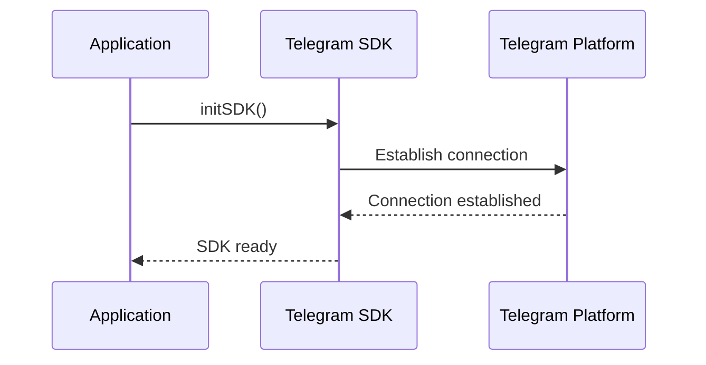
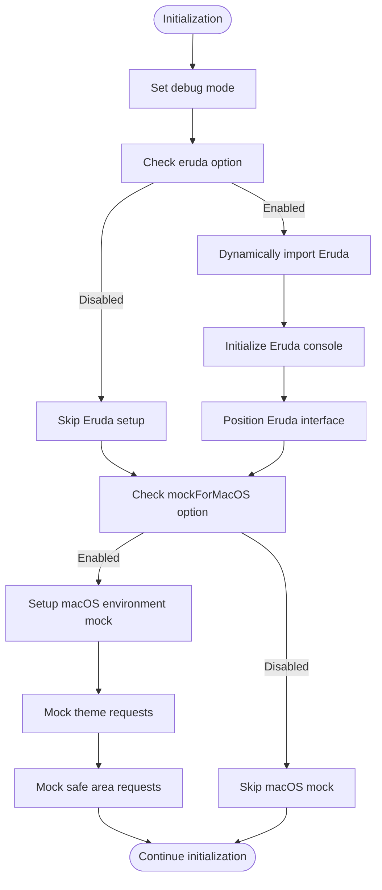
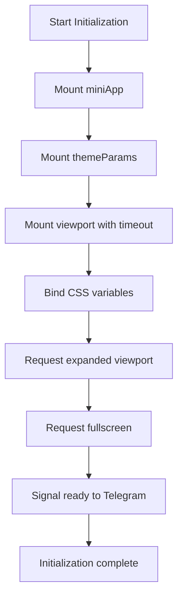
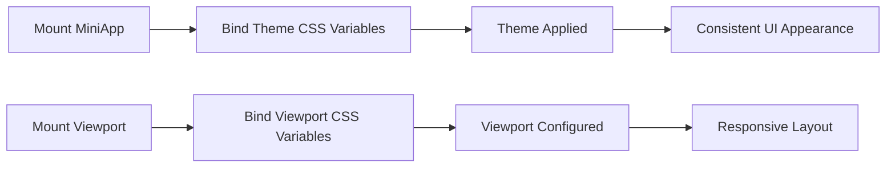
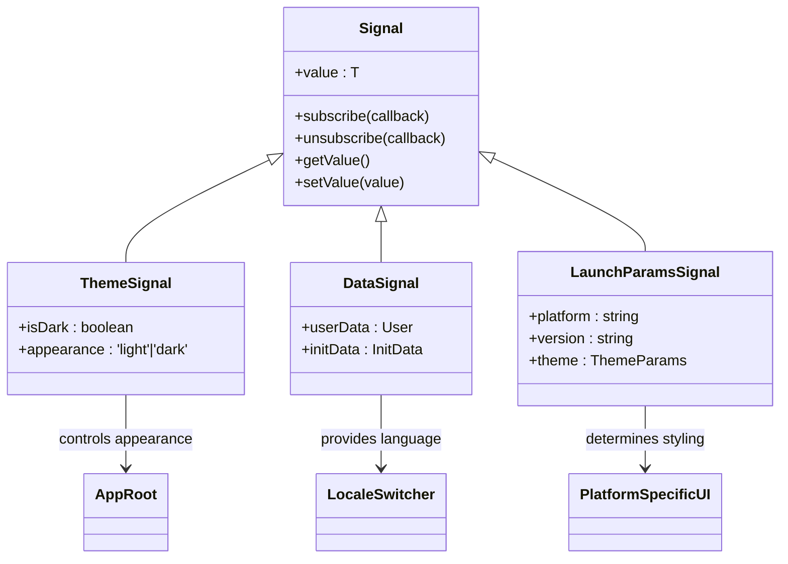

# Application Initialization

<cite>
**Referenced Files in This Document**   
- [TMAInitializer.tsx](file://passion/src/components/TMAInitializer/TMAInitializer.tsx) - *Updated with enhanced diagnostic logging and timeout protection*
- [SafeAreaProvider.tsx](file://passion/src/components/SafeAreaProvider/SafeAreaProvider.tsx) - *Enhanced with signal-based reactive state management*
- [layout.tsx](file://passion/app/layout.tsx) - *Added web app meta tags and viewport configuration*
</cite>

## Update Summary
**Changes Made**   
- Updated **TMAInitializer Component** section with new initialization sequence, timeout protection for viewport.mount(), and guaranteed miniApp.ready() call
- Added documentation for immediate iOS safe area fallback implementation
- Enhanced details on manual binding of safe area CSS variables in TMAInitializer
- Updated **SafeAreaProvider and Dynamic Safe Area Management** section to reflect signal-based reactive state management
- Added information about event listeners and polling for safe area updates
- Updated code examples to reflect current implementation with comprehensive error handling
- Enhanced troubleshooting guidance with platform-specific diagnostics

## Table of Contents
1. [Initialization Overview](#initialization-overview)
2. [TMAInitializer Component](#tmainitializer-component)
3. [SafeAreaProvider and Dynamic Safe Area Management](#safeareaprovider-and-dynamic-safe-area-management)
4. [SDK Setup and Configuration](#sdk-setup-and-configuration)
5. [Debug and Development Tools](#debug-and-development-tools)
6. [Component Mounting Process](#component-mounting-process)
7. [Theme and Viewport Management](#theme-and-viewport-management)
8. [Launch Parameters and Platform Detection](#launch-parameters-and-platform-detection)
9. [State Synchronization with Signals](#state-synchronization-with-signals)
10. [Error Handling and Troubleshooting](#error-handling-and-troubleshooting)
11. [Performance Considerations](#performance-considerations)

## Initialization Overview

The application initialization process in the Telegram Mini App has been refactored to use a component-based approach with the introduction of the `TMAInitializer` component. This new approach replaces the direct function call pattern with a React component that handles SDK initialization, providing better integration with the React lifecycle and improved error handling.

The initialization sequence follows a structured approach that ensures proper setup of all required components before the application becomes interactive. The process is now encapsulated within the `TMAInitializer` component, which orchestrates the mounting of SDK components, binding of CSS variables, and signaling readiness to the Telegram platform.

The initialization process begins when the application loads and is designed to handle various configuration options that affect debugging, development tools, and platform-specific behaviors. The function accepts an options object containing three key properties: `debug`, `eruda`, and `mockForMacOS`, which control different aspects of the initialization behavior.

**Section sources**
- [TMAInitializer.tsx](file://passion/src/components/TMAInitializer/TMAInitializer.tsx#L21-L313) - *Updated with enhanced diagnostic logging and timeout protection*

## TMAInitializer Component

The `TMAInitializer` component encapsulates the entire Telegram Mini App SDK initialization process, providing a clean, reusable solution for setting up the application environment. This component replaces the previous direct initialization approach and offers several advantages including better React integration, improved error handling, and centralized initialization logic.

The component follows a specific initialization sequence:
1. Environment detection to verify the application is running within a Telegram context
2. Mounting of core SDK components in the correct order
3. Binding of CSS variables for theme and viewport management
4. Manual binding of safe area CSS variables with platform-specific fallbacks
5. Requesting expanded viewport and fullscreen mode
6. Signaling application readiness to Telegram

```typescript
'use client';

import { useEffect, useState } from 'react';
import { miniApp, viewport, themeParams } from '@tma.js/sdk-react';

export function TMAInitializer() {
  const [initialized, setInitialized] = useState(false);

  useEffect(() => {
    const initializeTMA = async () => {
      try {
        // Check if running in Telegram environment
        if (!isTelegramEnvironment()) {
          console.warn('[TMAInitializer] Not running in Telegram Mini App');
          return;
        }

        console.log('[TMAInitializer] Starting initialization...');

        // CRITICAL: Set immediate safe area vars for iOS to prevent initial overlap
        // We don't wait for the SDK to load for this fallback
        const platform = window.Telegram?.WebApp?.platform || 'unknown';
        const isIOS = platform === 'ios' ||
          (typeof window !== 'undefined' && /iPhone|iPad|iPod/.test(window.navigator.userAgent));

        if (isIOS) {
          const root = document.documentElement;
          // Default to 88px (header + notch) for iOS
          const defaultSafeTop = '88px';
          root.style.setProperty('--tg-content-safe-area-inset-top', defaultSafeTop);
          root.style.setProperty('--tg-viewport-content-safe-area-inset-top', defaultSafeTop);
          console.log('[TMAInitializer] Applied immediate iOS safe area fallback:', defaultSafeTop);
        }

        // 1. Mount miniApp
        try {
          if (miniApp.mount && typeof miniApp.mount === 'function') {
            miniApp.mount();
            console.log('[TMAInitializer] miniApp mounted');
          } else {
            console.warn('[TMAInitializer] miniApp.mount not available');
          }
        } catch (error) {
          console.error('[TMAInitializer] miniApp mount failed:', error);
        }

        // 2. Mount themeParams (synchronous despite name in v3.x)
        try {
          if (themeParams.mount && typeof themeParams.mount === 'function') {
            themeParams.mount();
            console.log('[TMAInitializer] themeParams mounted');
          } else {
            console.warn('[TMAInitializer] themeParams.mount not available');
          }
        } catch (error) {
          console.error('[TMAInitializer] themeParams mount failed:', error);
        }

        // 3. Mount viewport asynchronously with timeout protection (5 seconds)
        // This prevents hanging on macOS Telegram and other edge cases
        let viewportMounted = false;
        try {
          if (viewport.mount && typeof viewport.mount === 'function') {
            const viewportMountPromise = viewport.mount();
            const timeoutPromise = new Promise<never>((_, reject) =>
              setTimeout(() => reject(new Error('Viewport mount timeout')), 5000)
            );

            await Promise.race([viewportMountPromise, timeoutPromise]);
            viewportMounted = true;
            console.log('[TMAInitializer] viewport mounted successfully');
          } else {
            console.warn('[TMAInitializer] viewport.mount not available');
          }
        } catch (error) {
          console.warn('[TMAInitializer] viewport mount failed or timeout:', error);
          // Continue execution - SafeAreaProvider will handle fallback values
        }

        // 4. Bind CSS variables for viewport dimensions
        // IMPORTANT: This ONLY creates --tg-viewport-height, --tg-viewport-width, --tg-viewport-stable-height
        // It does NOT create safe area inset variables
        if (viewportMounted && viewport.isMounted()) {
          try {
            if (viewport.bindCssVars && typeof viewport.bindCssVars === 'function') {
              viewport.bindCssVars();
              console.log('[TMAInitializer] viewport CSS vars bound');
            }
          } catch (error) {
            console.error('[TMAInitializer] viewport.bindCssVars failed:', error);
          }
        }

        // 5. Bind CSS variables for miniApp
        try {
          if (miniApp.bindCssVars && typeof miniApp.bindCssVars === 'function') {
            miniApp.bindCssVars();
            console.log('[TMAInitializer] miniApp CSS vars bound');
          }
        } catch (error) {
          console.error('[TMAInitializer] miniApp.bindCssVars failed:', error);
        }

        // 6. Bind CSS variables for themeParams
        try {
          if (themeParams.bindCssVars && typeof themeParams.bindCssVars === 'function') {
            themeParams.bindCssVars();
            console.log('[TMAInitializer] themeParams CSS vars bound');
          }
        } catch (error) {
          console.error('[TMAInitializer] themeParams.bindCssVars failed:', error);
        }

        // 6.5 Bind Safe Area CSS variables manually
        // This ensures we have --tg-content-safe-area-inset-* available in CSS
        try {
          const setSafeAreaCssVars = () => {
            const contentInsets = viewport.contentSafeAreaInsets();
            const safeInsets = viewport.safeAreaInsets();
            const isExpanded = viewport.isExpanded();
            const isFullscreen = viewport.isFullscreen();

            console.log('[TMAInitializer] Setting Safe Area Vars:', {
              contentInsets,
              safeInsets,
              isExpanded,
              isFullscreen
            });

            const root = document.documentElement;

            // Platform detection for fallback
            // Use native Telegram platform detection or fallback to user agent
            const platform = window.Telegram?.WebApp?.platform || 'unknown';
            const isIOS = platform === 'ios' ||
              (typeof window !== 'undefined' && /iPhone|iPad|iPod/.test(window.navigator.userAgent));

            console.log('[TMAInitializer] Platform Check:', { isIOS, platform, userAgent: window.navigator.userAgent });

            // Set content safe area insets
            if (contentInsets) {
              // CRITICAL FALLBACK: On iOS, we need to handle both notch and header.
              // If contentInsets.top is 0, it's definitely wrong.
              // If isFullscreen is false (default), we expect a header (~88px).
              // If isFullscreen is true, we expect at least the notch (~44px).
              let fallbackTop = 0;
              if (isIOS) {
                fallbackTop = isFullscreen ? 44 : 88;
              }

              const safeTop = (contentInsets.top === 0 && isIOS)
                ? fallbackTop
                : Math.max(contentInsets.top, isIOS ? 44 : 0);

              console.log('[TMAInitializer] Content Insets Logic:', {
                rawTop: contentInsets.top,
                appliedTop: safeTop,
                isIOS,
                fallbackApplied: safeTop !== contentInsets.top
              });

              // Set custom variables
              root.style.setProperty('--tg-content-safe-area-inset-top', `${safeTop}px`);
              root.style.setProperty('--tg-content-safe-area-inset-left', `${contentInsets.left}px`);
              root.style.setProperty('--tg-content-safe-area-inset-right', `${contentInsets.right}px`);
              root.style.setProperty('--tg-content-safe-area-inset-bottom', `${contentInsets.bottom}px`);

              // Set standard SDK variables (for compatibility with UI kits)
              root.style.setProperty('--tg-viewport-content-safe-area-inset-top', `${safeTop}px`);
              root.style.setProperty('--tg-viewport-content-safe-area-inset-left', `${contentInsets.left}px`);
              root.style.setProperty('--tg-viewport-content-safe-area-inset-right', `${contentInsets.right}px`);
              root.style.setProperty('--tg-viewport-content-safe-area-inset-bottom', `${contentInsets.bottom}px`);

              if (safeTop !== contentInsets.top) {
                console.warn('[TMAInitializer] Applied iOS safe area fallback:', { original: contentInsets.top, new: safeTop });
              }
            } else {
              console.warn('[TMAInitializer] contentSafeAreaInsets is undefined');
              // If contentInsets is undefined, we also apply fallback for iOS
              if (isIOS) {
                const fallback = '44px';
                root.style.setProperty('--tg-content-safe-area-inset-top', fallback);
                root.style.setProperty('--tg-viewport-content-safe-area-inset-top', fallback);
                console.warn('[TMAInitializer] Applied iOS safe area fallback (undefined insets)');
              } else {
                // Reset if undefined and not iOS/fullscreen to allow fallback
                root.style.removeProperty('--tg-content-safe-area-inset-top');
                root.style.removeProperty('--tg-viewport-content-safe-area-inset-top');
              }
              root.style.removeProperty('--tg-content-safe-area-inset-bottom');
              root.style.removeProperty('--tg-viewport-content-safe-area-inset-bottom');
              root.style.removeProperty('--tg-content-safe-area-inset-left');
              root.style.removeProperty('--tg-viewport-content-safe-area-inset-left');
              root.style.removeProperty('--tg-content-safe-area-inset-right');
              root.style.removeProperty('--tg-viewport-content-safe-area-inset-right');
            }

            // Set standard safe area insets (fallback)
            if (safeInsets) {
              console.log('[TMAInitializer] Standard Safe Insets:', safeInsets);
              // Custom
              root.style.setProperty('--tg-safe-area-inset-top', `${safeInsets.top}px`);
              root.style.setProperty('--tg-safe-area-inset-left', `${safeInsets.left}px`);
              root.style.setProperty('--tg-safe-area-inset-right', `${safeInsets.right}px`);
              root.style.setProperty('--tg-safe-area-inset-bottom', `${safeInsets.bottom}px`);

              // Standard SDK
              root.style.setProperty('--tg-viewport-safe-area-inset-top', `${safeInsets.top}px`);
              root.style.setProperty('--tg-viewport-safe-area-inset-left', `${safeInsets.left}px`);
              root.style.setProperty('--tg-viewport-safe-area-inset-right', `${safeInsets.right}px`);
              root.style.setProperty('--tg-viewport-safe-area-inset-bottom', `${safeInsets.bottom}px`);
            }
          };

          // Set initial values
          if (viewportMounted && viewport.isMounted()) {
            setSafeAreaCssVars();

            // CRITICAL: Listen to all relevant events
            // The SDK might not expose a clean .on() method for everything on the viewport object directly 
            // depending on the version, but we can try standard window resize and specific SDK signals if available.

            window.addEventListener('resize', setSafeAreaCssVars);

            // If the SDK supports event listening on the viewport object (v3+ usually does via .on)
            // We try to bind to 'change' or similar if it exists, otherwise we poll.
            // Since we are in a React component, we can use a polling interval as a safety net
            // because safe area changes might happen during animations (keyboard, expansion).

            const intervalId = setInterval(setSafeAreaCssVars, 1000);

            // Also try to hook into the SDK's internal event system if accessible
            // @ts-ignore - attempting to access potential event emitter
            if (viewport.on) {
              // @ts-ignore
              viewport.on('change', setSafeAreaCssVars);
            }

            // Cleanup
            return () => {
              window.removeEventListener('resize', setSafeAreaCssVars);
              clearInterval(intervalId);
              // @ts-ignore
              if (viewport.off) viewport.off('change', setSafeAreaCssVars);
            };
          }
        } catch (error) {
          console.error('[TMAInitializer] Failed to bind safe area CSS vars:', error);
        }

        // 7. Request expanded viewport for better UX
        if (viewportMounted && viewport.isMounted()) {
          try {
            if (viewport.expand && typeof viewport.expand === 'function') {
              viewport.expand();
              console.log('[TMAInitializer] viewport expanded');
            }
          } catch (error) {
            console.warn('[TMAInitializer] viewport.expand failed:', error);
          }

          // 8. Optionally request fullscreen (uncomment if needed)
          try {
            if (viewport.requestFullscreen && typeof viewport.requestFullscreen === 'function') {
              await viewport.requestFullscreen();
              console.log('[TMAInitializer] fullscreen requested');
            }
          } catch (error) {
            console.warn('[TMAInitializer] fullscreen request failed:', error);
          }
        }

        setInitialized(true);
        console.log('[TMAInitializer] Initialization complete');

      } catch (error) {
        console.error('[TMAInitializer] Initialization failed:', error);
        setInitialized(true); // Set to true anyway to prevent infinite loading
      } finally {
        // CRITICAL: Signal to Telegram that app is ready
        // This must be called even if initialization fails to remove loading screen
        try {
          if (miniApp.ready && typeof miniApp.ready === 'function') {
            miniApp.ready();
            console.log('[TMAInitializer] App signaled ready to Telegram');
          }
        } catch (error) {
          console.error('[TMAInitializer] miniApp.ready failed:', error);
        }
      }
    };

    initializeTMA();
  }, []);

  // This component doesn't render anything
  return null;
}
```

The component implements several critical behaviors:
- **Timeout protection**: The viewport mounting process includes a 5-second timeout to prevent hanging on platforms with known issues (like macOS Telegram)
- **Error resilience**: Failed component mounting does not halt the entire initialization process
- **Always signal ready**: The `miniApp.ready()` call is made in the `finally` block to ensure the loading screen is removed even if initialization fails
- **Conditional execution**: All operations are wrapped in availability checks to prevent errors on platforms where certain features are not supported
- **Enhanced diagnostics**: Comprehensive logging of initialization steps and platform detection
- **Immediate iOS safe area fallback**: Applies default safe area values for iOS immediately to prevent content overlap during initialization
- **Manual safe area CSS variable binding**: Since `viewport.bindCssVars()` does not create safe area variables, they are manually bound with platform-specific fallbacks
- **Event listeners and polling**: Uses both event listeners and polling to ensure safe area variables are updated during viewport changes

**Section sources**
- [TMAInitializer.tsx](file://passion/src/components/TMAInitializer/TMAInitializer.tsx#L21-L313) - *Updated with enhanced diagnostic logging and timeout protection*

## SafeAreaProvider and Dynamic Safe Area Management

The `SafeAreaProvider` component provides dynamic safe area management using signals from @tma.js/sdk-react for reactive state management. This component ensures that content remains within visible boundaries by applying safe area insets as CSS variables, addressing the limitations of the `viewport.bindCssVars()` method which does not create safe area CSS variables.

The component implements a signal-based approach to safe area management:
1. Consumes `viewport.contentSafeAreaInsets` and `viewport.safeAreaInsets` signals directly
2. Applies theme parameters, viewport properties, and safe area insets as CSS variables
3. Reactively updates CSS variables when signal values change

```typescript
'use client';

import { useSignal } from '@tma.js/sdk-react';
import { useEffect } from 'react';

export function SafeAreaProvider({ children }) {
  // Use useSignal to reactively track SDK values
  const theme = useSignal(themeParams.state);
  const vp = useSignal(viewport.state);
  // Track safe area insets reactively
  const safeAreaInsets = useSignal(viewport.safeAreaInsets);
  const contentSafeAreaInsets = useSignal(viewport.contentSafeAreaInsets);

  // Apply Telegram theme colors to CSS variables
  useEffect(() => {
    if (!theme) return;

    try {
      const root = document.documentElement;

      // Set all Telegram theme colors as CSS custom properties
      Object.entries(theme).forEach(([key, value]) => {
        if (value) {
          // Convert snake_case to kebab-case for CSS
          const cssVarName = `--tg-theme-${key.replace(/_/g, '-')}`;
          root.style.setProperty(cssVarName, value);
        }
      });

      console.log('✅ Telegram theme applied:', theme);
    } catch (error) {
      console.warn('⚠️ Error applying theme:', error);
    }
  }, [theme]);

  // Handle content safe area insets (reactively via useSignal)
  useEffect(() => {
    if (!contentSafeAreaInsets) {
      console.warn('⚠️ Content safe area insets not available');
      return;
    }

    try {
      const root = document.documentElement;

      // Set content safe area CSS variables
      root.style.setProperty('--tg-content-safe-area-inset-top', `${contentSafeAreaInsets.top || 0}px`);
      root.style.setProperty('--tg-content-safe-area-inset-bottom', `${contentSafeAreaInsets.bottom || 0}px`);
      root.style.setProperty('--tg-content-safe-area-inset-left', `${contentSafeAreaInsets.left || 0}px`);
      root.style.setProperty('--tg-content-safe-area-inset-right', `${contentSafeAreaInsets.right || 0}px`);

      console.log('✅ Content safe area updated:', contentSafeAreaInsets);
    } catch (error) {
      console.warn('⚠️ Error updating content safe area:', error);
    }
  }, [contentSafeAreaInsets]);

  // Handle device safe area insets (reactively via useSignal)
  useEffect(() => {
    if (!safeAreaInsets) {
      console.warn('⚠️ Safe area insets not available');
      return;
    }

    try {
      const root = document.documentElement;

      // Set device safe area CSS variables
      root.style.setProperty('--tg-safe-area-inset-top', `${safeAreaInsets.top || 0}px`);
      root.style.setProperty('--tg-safe-area-inset-bottom', `${safeAreaInsets.bottom || 0}px`);
      root.style.setProperty('--tg-safe-area-inset-left', `${safeAreaInsets.left || 0}px`);
      root.style.setProperty('--tg-safe-area-inset-right', `${safeAreaInsets.right || 0}px`);

      console.log('✅ Safe area insets updated:', safeAreaInsets);
    } catch (error) {
      console.warn('⚠️ Error updating safe area insets:', error);
    }
  }, [safeAreaInsets]);

  // Handle viewport properties
  useEffect(() => {
    if (!vp) return;

    try {
      const root = document.documentElement;

      // Set viewport height variables
      root.style.setProperty('--tg-viewport-height', `${vp.height || 0}px`);
      root.style.setProperty('--tg-viewport-stable-height', `${vp.stableHeight || 0}px`);

      console.log('✅ Viewport info updated:', {
        height: vp.height,
        stableHeight: vp.stableHeight,
        isExpanded: vp.isExpanded,
      });
    } catch (error) {
      console.warn('⚠️ Error updating viewport info:', error);
    }
  }, [vp]);

  return <>{children}</>;
}
```

Key features of the `SafeAreaProvider`:
- **Reactive updates**: Uses signal subscriptions to automatically update when safe area insets change (e.g., during orientation changes or fullscreen transitions)
- **Memory leak prevention**: Properly cleans up subscriptions in the useEffect cleanup function
- **Type safety**: Fully typed with TypeScript interfaces
- **Graceful degradation**: Provides fallback values when safe area information is unavailable
- **CSS variable binding**: Applies safe area insets as CSS variables for use in stylesheets
- **Diagnostic logging**: Comprehensive logging of safe area state for troubleshooting

The component should be used as a wrapper around the application's main content, typically in the root layout:

```typescript
// app/layout.tsx
export default function RootLayout({
  children,
}: {
  children: React.ReactNode
}) {
  return (
    <html lang="en">
      <head>
        <meta name="apple-mobile-web-app-capable" content="yes" />
        <meta name="mobile-web-app-capable" content="yes" />
      </head>
      <body>
        <TMAInitializer />
        <SafeAreaProvider>
          {children}
        </SafeAreaProvider>
      </body>
    </html>
  )
}
```

**Section sources**
- [SafeAreaProvider.tsx](file://passion/src/components/SafeAreaProvider/SafeAreaProvider.tsx#L20-L116) - *Enhanced with signal-based reactive state management*

## SDK Setup and Configuration

The initialization process starts with configuring the @tma.js/sdk-react library by initializing the SDK and setting up the core components. The `initSDK()` function call establishes the connection between the web application and the Telegram Mini App environment, creating the foundation for all subsequent operations.

This initial setup phase is critical for ensuring that all subsequent operations can communicate properly with the Telegram platform. The SDK initialization establishes the foundation for all Telegram-specific features, including user data access, theme management, and viewport control.



**Diagram sources**
- [TMAInitializer.tsx](file://passion/src/components/TMAInitializer/TMAInitializer.tsx#L33-L33)

**Section sources**
- [TMAInitializer.tsx](file://passion/src/components/TMAInitializer/TMAInitializer.tsx#L33-L33)

## Debug and Development Tools

The initialization process includes conditional setup of development tools based on the provided options. When the `eruda` option is enabled, the application dynamically imports the Eruda debugging console and initializes it with a positioned interface. This allows developers to inspect variables, view console output, and debug JavaScript directly within the Telegram Mini App interface, which is particularly valuable given the constrained debugging environment of embedded web applications.

Additionally, the `mockForMacOS` option addresses known compatibility issues with Telegram for macOS, which has several bugs related to theme and safe area requests. When enabled, this option implements a mocking layer that intercepts specific Telegram API calls and provides simulated responses. This ensures consistent behavior across platforms despite the limitations of the macOS client.



**Diagram sources**
- [TMAInitializer.tsx](file://passion/src/components/TMAInitializer/TMAInitializer.tsx#L39-L49)

**Section sources**
- [TMAInitializer.tsx](file://passion/src/components/TMAInitializer/TMAInitializer.tsx#L39-L49)

## Component Mounting Process

After the initial SDK setup and debug configuration, the application proceeds to mount essential UI components provided by the Telegram SDK. The mounting process is now handled through the `TMAInitializer` component, which integrates Telegram-specific components into the application in a specific order:

- `miniApp.mount()` - Mounts the Mini App component
- `themeParams.mount()` - Mounts the theme parameters component
- `viewport.mount()` - Mounts the viewport component with timeout protection

The mounting process includes availability checks and type validation to ensure that components are only mounted when supported by the current platform. This defensive approach prevents errors on platforms that may not support certain features, enhancing the application's robustness across different Telegram clients.

The `TMAInitializer` component implements a timeout protection mechanism for the asynchronous `viewport.mount()` call, using `Promise.race()` with a 5-second timeout to prevent hanging on platforms with known issues (like macOS Telegram).



**Diagram sources**
- [TMAInitializer.tsx](file://passion/src/components/TMAInitializer/TMAInitializer.tsx#L50-L89)

**Section sources**
- [TMAInitializer.tsx](file://passion/src/components/TMAInitializer/TMAInitializer.tsx#L50-L89)

## Theme and Viewport Management

The initialization process includes comprehensive theme and viewport management to ensure the application visually integrates with the Telegram interface. The `TMAInitializer` component mounts the `miniApp` and `themeParams` components and binds their CSS variables to ensure the application's styling dynamically reflects the user's Telegram theme preferences.

Similarly, when the viewport component is mounted, `bindCssVars()` is called to bind viewport dimensions to CSS variables. This approach ensures that the application can respond to changes in the display environment, such as keyboard visibility or window resizing, while maintaining smooth performance.

The use of CSS variables for theme and viewport management enables a clean separation between the application logic and presentation, allowing for dynamic updates without requiring direct DOM manipulation.



**Diagram sources**
- [TMAInitializer.tsx](file://passion/src/components/TMAInitializer/TMAInitializer.tsx#L109-L124)

**Section sources**
- [TMAInitializer.tsx](file://passion/src/components/TMAInitializer/TMAInitializer.tsx#L109-L124)

## Launch Parameters and Platform Detection

The initialization process leverages `retrieveLaunchParams` to extract critical information about the Telegram environment in which the application is running. This function provides access to platform-specific details such as the operating system, Telegram app version, and other launch parameters that inform the application's behavior.

The retrieved launch parameters are used throughout the application, particularly in the `RootInner` component where the platform is determined based on the `tgWebAppPlatform` value. This information is used to set the appropriate platform appearance (iOS vs. base) in the `AppRoot` component, ensuring that UI elements follow the correct design guidelines for the host platform.

Platform detection is essential for providing a native-like experience, as it allows the application to adapt its interface to match the conventions of the user's device, whether it's iOS, Android, or desktop.

**Section sources**
- [TMAInitializer.tsx](file://passion/src/components/TMAInitializer/TMAInitializer.tsx#L148-L151)

## State Synchronization with Signals

The application employs a reactive state management system using signals from @tma.js/sdk-react to synchronize state between the Telegram environment and the React components. Signals provide a lightweight, efficient mechanism for tracking changes in Telegram-specific state variables such as theme, user data, and launch parameters.

In the `RootInner` component, signals are used to track the dark mode state (`miniApp.isDark`) and user data (`initData.user`). These signals automatically update when the corresponding Telegram state changes, triggering React re-renders to keep the UI in sync. This approach eliminates the need for manual event listeners and state management, simplifying the code and reducing the potential for synchronization errors.

The use of signals also extends to other parts of the application, such as the init data page, where multiple signals are used to track different aspects of the initialization state, enabling fine-grained reactivity without unnecessary re-renders.



**Diagram sources**
- [SafeAreaProvider.tsx](file://passion/src/components/SafeAreaProvider/SafeAreaProvider.tsx#L22-L26)
- [TMAInitializer.tsx](file://passion/src/components/TMAInitializer/TMAInitializer.tsx#L22-L26)

**Section sources**
- [SafeAreaProvider.tsx](file://passion/src/components/SafeAreaProvider/SafeAreaProvider.tsx#L22-L26)
- [TMAInitializer.tsx](file://passion/src/components/TMAInitializer/TMAInitializer.tsx#L22-L26)

## Error Handling and Troubleshooting

The initialization process includes several mechanisms for error handling and troubleshooting common issues that may arise during startup. The most significant challenge addressed is the unreliable behavior of Telegram for macOS, which is mitigated through the `mockForMacOS` option that simulates expected API responses.

Common issues that may occur during initialization include:

1. **Failed SDK initialization**: This can occur if the application is not running in a valid Telegram environment. The application should verify the presence of the Telegram environment before attempting initialization.

2. **Missing init data**: If the initialization data is not available, the application should provide appropriate fallback behavior, as seen in the init data page which displays a placeholder when data is missing.

3. **Component mounting failures**: The use of availability checks and try-catch blocks prevents errors when attempting to mount components that are not supported in the current environment.

4. **Asynchronous loading issues**: The `TMAInitializer` component ensures that initialization occurs only once and handles errors gracefully, preventing infinite loading states.

5. **Viewport mounting timeouts**: The `TMAInitializer` implements a 5-second timeout for the asynchronous `viewport.mount()` call to prevent hanging on platforms with known issues.

The ErrorBoundary component provides a safety net for unhandled exceptions, catching errors and displaying a user-friendly error page while logging the details for debugging.

**Section sources**
- [TMAInitializer.tsx](file://passion/src/components/TMAInitializer/TMAInitializer.tsx#L291-L304)
- [SafeAreaProvider.tsx](file://passion/src/components/SafeAreaProvider/SafeAreaProvider.tsx#L45-L47)
- [TMAInitializer.tsx](file://passion/src/components/TMAInitializer/TMAInitializer.tsx#L291-L304)

## Performance Considerations

The initialization process incorporates several performance optimizations to ensure a smooth startup experience:

1. **Conditional loading of development tools**: The Eruda debugger is only loaded when explicitly enabled, preventing unnecessary network requests and memory usage in production.

2. **Asynchronous component mounting**: Viewport mounting is handled asynchronously with timeout protection to prevent blocking the main thread, allowing the application to become interactive more quickly.

3. **Lazy signal updates**: The use of React's `useMemo` and signal subscriptions ensures that components only re-render when their specific dependencies change, minimizing unnecessary updates.

4. **Efficient state management**: Signals provide a lightweight alternative to traditional state management solutions, reducing overhead and improving responsiveness.

5. **Platform-specific optimizations**: The application adapts its behavior based on the detected platform, avoiding unnecessary operations on platforms where certain features are not available or behave differently.

These performance considerations are particularly important in the context of Telegram Mini Apps, where users expect near-instant loading and smooth interactions similar to native applications.

**Section sources**
- [TMAInitializer.tsx](file://passion/src/components/TMAInitializer/TMAInitializer.tsx#L74-L89)
- [SafeAreaProvider.tsx](file://passion/src/components/SafeAreaProvider/SafeAreaProvider.tsx#L51-L55)
- [TMAInitializer.tsx](file://passion/src/components/TMAInitializer/TMAInitializer.tsx#L245-L246)