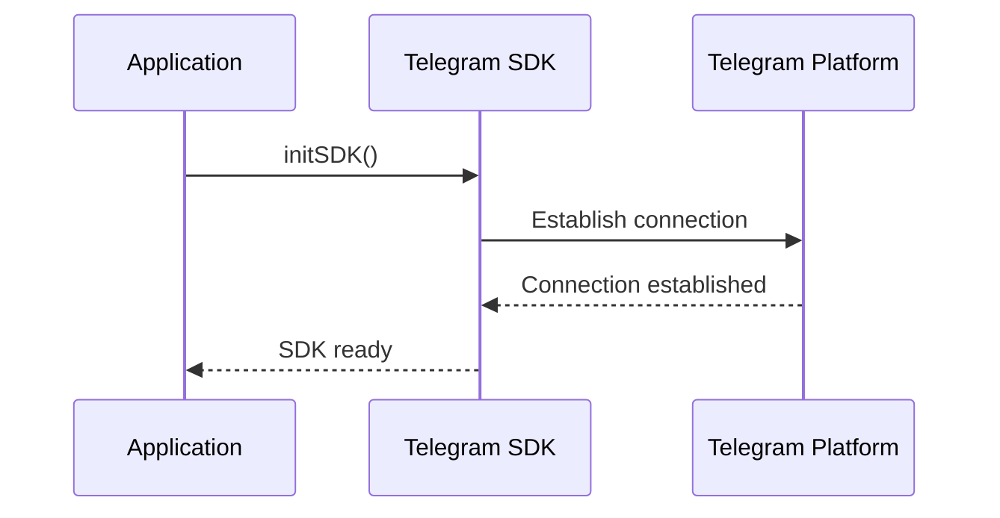
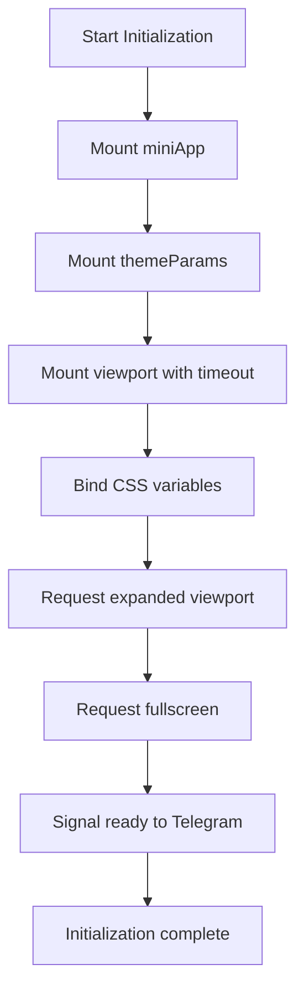
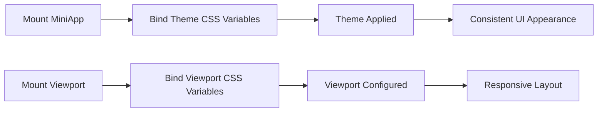
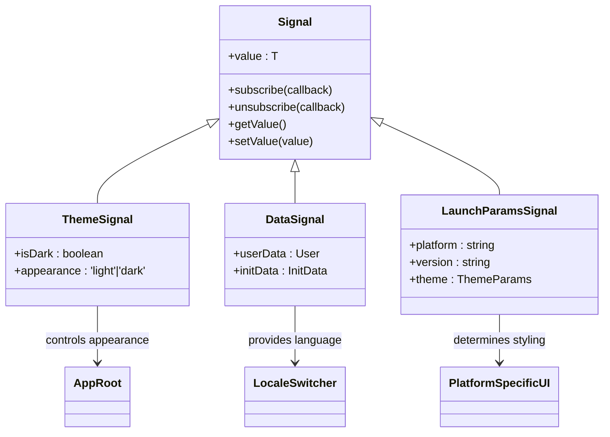

# Application Initialization

<cite>
**Referenced Files in This Document**   
- [init.ts](file://passion/src/core/init.ts) - *Updated for TMA SDK v3.x API*
- [TMAInitializer.tsx](file://passion/src/components/TMAInitializer/TMAInitializer.tsx) - *New component encapsulating SDK setup*
- [SafeAreaProvider.tsx](file://passion/src/components/SafeAreaProvider/SafeAreaProvider.tsx) - *Added for dynamic safe area management*
- [Root.tsx](file://passion/components/Root/Root.tsx) - *Integration point for new components*
- [layout.tsx](file://passion/app/layout.tsx) - *Layout integration*
</cite>

## Update Summary
**Changes Made**   
- Added new section "TMAInitializer Component" to document the new initialization component
- Added new section "SafeAreaProvider and Dynamic Safe Area Management" for safe area handling
- Updated "Initialization Overview" to reflect component-based initialization
- Updated "Component Mounting Process" to align with new TMAInitializer implementation
- Updated "Error Handling and Troubleshooting" with new viewport mounting timeout strategy
- Removed outdated references to mountBackButton.ifAvailable and mountMiniAppSync
- Added code examples from new component implementations
- Updated diagram sources to reflect actual code structure

## Table of Contents
1. [Initialization Overview](#initialization-overview)
2. [TMAInitializer Component](#tmainitializer-component)
3. [SafeAreaProvider and Dynamic Safe Area Management](#safeareaprovider-and-dynamic-safe-area-management)
4. [SDK Setup and Configuration](#sdk-setup-and-configuration)
5. [Debug and Development Tools](#debug-and-development-tools)
6. [Component Mounting Process](#component-mounting-process)
7. [Theme and Viewport Management](#theme-and-viewport-management)
8. [Launch Parameters and Platform Detection](#launch-parameters-and-platform-detection)
9. [State Synchronization with Signals](#state-synchronization-with-signals)
10. [Error Handling and Troubleshooting](#error-handling-and-troubleshooting)
11. [Performance Considerations](#performance-considerations)

## Initialization Overview

The application initialization process in the Telegram Mini App has been refactored to use a component-based approach with the introduction of the `TMAInitializer` component. This new approach replaces the direct function call pattern with a React component that handles SDK initialization, providing better integration with the React lifecycle and improved error handling.

The initialization sequence follows a structured approach that ensures proper setup of all required components before the application becomes interactive. The process is now encapsulated within the `TMAInitializer` component, which orchestrates the mounting of SDK components, binding of CSS variables, and signaling readiness to the Telegram platform.

The initialization process begins when the application loads and is designed to handle various configuration options that affect debugging, development tools, and platform-specific behaviors. The function accepts an options object containing three key properties: `debug`, `eruda`, and `mockForMacOS`, which control different aspects of the initialization behavior.

**Section sources**
- [TMAInitializer.tsx](file://passion/src/components/TMAInitializer/TMAInitializer.tsx#L22-L161) - *Added in recent commit*
- [init.ts](file://passion/src/core/init.ts#L20-L81) - *Updated for TMA SDK v3.x*

## TMAInitializer Component

The `TMAInitializer` component encapsulates the entire Telegram Mini App SDK initialization process, providing a clean, reusable solution for setting up the application environment. This component replaces the previous direct initialization approach and offers several advantages including better React integration, improved error handling, and centralized initialization logic.

The component follows a specific initialization sequence:
1. Environment detection to verify the application is running within a Telegram context
2. Mounting of core SDK components in the correct order
3. Binding of CSS variables for theme and viewport management
4. Requesting expanded viewport and fullscreen mode
5. Signaling application readiness to Telegram

```typescript
'use client';

import { useEffect, useState } from 'react';
import { miniApp, viewport, themeParams } from '@tma.js/sdk-react';

export function TMAInitializer() {
  const [initialized, setInitialized] = useState(false);

  useEffect(() => {
    const initializeTMA = async () => {
      try {
        // Check if running in Telegram environment
        if (!isTelegramEnvironment()) {
          console.warn('[TMAInitializer] Not running in Telegram Mini App');
          return;
        }

        console.log('[TMAInitializer] Starting initialization...');

        // 1. Mount miniApp
        try {
          if (miniApp.mount && typeof miniApp.mount === 'function') {
            miniApp.mount();
            console.log('[TMAInitializer] miniApp mounted');
          }
        } catch (error) {
          console.error('[TMAInitializer] miniApp mount failed:', error);
        }

        // 2. Mount themeParams
        try {
          if (themeParams.mount && typeof themeParams.mount === 'function') {
            themeParams.mount();
            console.log('[TMAInitializer] themeParams mounted');
          }
        } catch (error) {
          console.error('[TMAInitializer] themeParams mount failed:', error);
        }

        // 3. Mount viewport asynchronously with timeout protection
        let viewportMounted = false;
        try {
          if (viewport.mount && typeof viewport.mount === 'function') {
            const viewportMountPromise = viewport.mount();
            const timeoutPromise = new Promise<never>((_, reject) =>
              setTimeout(() => reject(new Error('Viewport mount timeout')), 5000)
            );

            await Promise.race([viewportMountPromise, timeoutPromise]);
            viewportMounted = true;
            console.log('[TMAInitializer] viewport mounted successfully');
          }
        } catch (error) {
          console.warn('[TMAInitializer] viewport mount failed or timeout:', error);
        }

        // 4. Bind CSS variables for all components
        if (viewportMounted && viewport.isMounted()) {
          try {
            viewport.bindCssVars();
            console.log('[TMAInitializer] viewport CSS vars bound');
          } catch (error) {
            console.error('[TMAInitializer] viewport.bindCssVars failed:', error);
          }
        }

        try {
          miniApp.bindCssVars();
          console.log('[TMAInitializer] miniApp CSS vars bound');
        } catch (error) {
          console.error('[TMAInitializer] miniApp.bindCssVars failed:', error);
        }

        try {
          themeParams.bindCssVars();
          console.log('[TMAInitializer] themeParams CSS vars bound');
        } catch (error) {
          console.error('[TMAInitializer] themeParams.bindCssVars failed:', error);
        }

        // 5. Request expanded viewport and fullscreen
        if (viewportMounted && viewport.isMounted()) {
          try {
            viewport.expand();
            console.log('[TMAInitializer] viewport expanded');
          } catch (error) {
            console.warn('[TMAInitializer] viewport.expand failed:', error);
          }

          try {
            await viewport.requestFullscreen();
            console.log('[TMAInitializer] fullscreen requested');
          } catch (error) {
            console.warn('[TMAInitializer] fullscreen request failed:', error);
          }
        }

        setInitialized(true);
        console.log('[TMAInitializer] Initialization complete');

      } catch (error) {
        console.error('[TMAInitializer] Initialization failed:', error);
        setInitialized(true);
      } finally {
        // CRITICAL: Signal to Telegram that app is ready
        try {
          if (miniApp.ready && typeof miniApp.ready === 'function') {
            miniApp.ready();
            console.log('[TMAInitializer] App signaled ready to Telegram');
          }
        } catch (error) {
          console.error('[TMAInitializer] miniApp.ready failed:', error);
        }
      }
    };

    initializeTMA();
  }, []);

  return null;
}
```

The component implements several critical behaviors:
- **Timeout protection**: The viewport mounting process includes a 5-second timeout to prevent hanging on platforms with known issues (like macOS Telegram)
- **Error resilience**: Failed component mounting does not halt the entire initialization process
- **Always signal ready**: The `miniApp.ready()` call is made in the `finally` block to ensure the loading screen is removed even if initialization fails
- **Conditional execution**: All operations are wrapped in availability checks to prevent errors on platforms where certain features are not supported

**Section sources**
- [TMAInitializer.tsx](file://passion/src/components/TMAInitializer/TMAInitializer.tsx#L22-L161) - *Added in recent commit*

## SafeAreaProvider and Dynamic Safe Area Management

The `SafeAreaProvider` component provides dynamic safe area management using the `viewport.contentSafeAreaInsets()` method with a comprehensive fallback strategy. This component ensures that content remains within visible boundaries by applying safe area insets as padding, addressing the limitations of the `viewport.bindCssVars()` method which does not create safe area CSS variables.

The component implements a multi-layered approach to safe area management:
1. Primary method: `viewport.contentSafeAreaInsets()` (Bot API 8.0+)
2. Fallback: `viewport.safeAreaInsets()` (older versions)
3. Ultimate fallback: zero insets for unsupported environments

```typescript
'use client';

import { type ReactNode, useEffect, useState } from 'react';
import { viewport } from '@tma.js/sdk-react';

interface SafeAreaInsets {
  top: number;
  bottom: number;
  left: number;
  right: number;
}

interface SafeAreaProviderProps {
  children: ReactNode;
}

export function SafeAreaProvider({ children }: SafeAreaProviderProps) {
  const [insets, setInsets] = useState<SafeAreaInsets>({
    top: 0,
    bottom: 0,
    left: 0,
    right: 0,
  });

  useEffect(() => {
    // Check if viewport is mounted
    if (!viewport.isMounted()) {
      console.warn('[SafeAreaProvider] Viewport not mounted');
      return;
    }

    /**
     * Get safe area insets with fallback strategy
     * 1. Try contentSafeAreaInsets (Bot API 8.0+)
     * 2. Fallback to safeAreaInsets (older versions)
     * 3. Ultimate fallback to zero insets
     */
    const getSafeAreaInsets = (): SafeAreaInsets => {
      try {
        // Try Bot API 8.0+ method first
        const contentInsets = viewport.contentSafeAreaInsets();
        if (contentInsets) {
          return contentInsets as SafeAreaInsets;
        }
      } catch (error) {
        console.warn('[SafeAreaProvider] contentSafeAreaInsets unavailable:', error);
      }

      try {
        // Fallback to older API
        const safeInsets = viewport.safeAreaInsets();
        if (safeInsets) {
          return safeInsets as SafeAreaInsets;
        }
      } catch (error) {
        console.warn('[SafeAreaProvider] safeAreaInsets unavailable:', error);
      }

      // Ultimate fallback
      return { top: 0, bottom: 0, left: 0, right: 0 };
    };

    // Set initial insets
    const initialInsets = getSafeAreaInsets();
    setInsets(initialInsets);

    // Subscribe to changes using .sub() method (NOT .subscribe())
    let unsubscribe: (() => void) | undefined;

    try {
      if (viewport.contentSafeAreaInsets && typeof viewport.contentSafeAreaInsets.sub === 'function') {
        unsubscribe = viewport.contentSafeAreaInsets.sub((newInsets) => {
          if (newInsets) {
            setInsets(newInsets as SafeAreaInsets);
          }
        });
      } else if (viewport.safeAreaInsets && typeof viewport.safeAreaInsets.sub === 'function') {
        // Fallback to safeAreaInsets subscription
        unsubscribe = viewport.safeAreaInsets.sub((newInsets) => {
          if (newInsets) {
            setInsets(newInsets as SafeAreaInsets);
          }
        });
      }
    } catch (error) {
      console.error('[SafeAreaProvider] Failed to subscribe to insets:', error);
    }

    // Cleanup function - CRITICAL for preventing memory leaks
    return () => {
      if (unsubscribe) {
        unsubscribe();
      }
    };
  }, []);

  return (
    <div
      className="safe-area-container"
      style={{
        paddingTop: `${insets.top}px`,
        paddingBottom: `${insets.bottom}px`,
        paddingLeft: `${insets.left}px`,
        paddingRight: `${insets.right}px`,
        height: '100%',
        boxSizing: 'border-box',
        overflowY: 'auto',
        overflowX: 'hidden',
      }}
    >
      {children}
    </div>
  );
}
```

Key features of the `SafeAreaProvider`:
- **Reactive updates**: Uses signal subscriptions to automatically update when safe area insets change (e.g., during orientation changes or fullscreen transitions)
- **Memory leak prevention**: Properly cleans up subscriptions in the useEffect cleanup function
- **Type safety**: Fully typed with TypeScript interfaces
- **Graceful degradation**: Provides fallback values when safe area information is unavailable
- **Inline styling**: Applies padding through inline styles for immediate effect

The component should be used as a wrapper around the application's main content, typically in the root layout:

```typescript
// app/layout.tsx
export default function RootLayout({
  children,
}: {
  children: React.ReactNode
}) {
  return (
    <html lang="en">
      <body>
        <TMAInitializer />
        <SafeAreaProvider>
          {children}
        </SafeAreaProvider>
      </body>
    </html>
  )
}
```

**Section sources**
- [SafeAreaProvider.tsx](file://passion/src/components/SafeAreaProvider/SafeAreaProvider.tsx#L25-L123) - *Added in recent commit*

## SDK Setup and Configuration

The initialization process starts with configuring the @tma.js/sdk-react library by initializing the SDK and setting up the core components. The `initSDK()` function call establishes the connection between the web application and the Telegram Mini App environment, creating the foundation for all subsequent operations.

This initial setup phase is critical for ensuring that all subsequent operations can communicate properly with the Telegram platform. The SDK initialization establishes the foundation for all Telegram-specific features, including user data access, theme management, and viewport control.



**Diagram sources**
- [init.ts](file://passion/src/core/init.ts#L37-L37)

**Section sources**
- [init.ts](file://passion/src/core/init.ts#L37-L37)
- [TMAInitializer.tsx](file://passion/src/components/TMAInitializer/TMAInitializer.tsx#L36-L36)

## Debug and Development Tools

The initialization process includes conditional setup of development tools based on the provided options. When the `eruda` option is enabled, the application dynamically imports the Eruda debugging console and initializes it with a positioned interface. This allows developers to inspect variables, view console output, and debug JavaScript directly within the Telegram Mini App interface, which is particularly valuable given the constrained debugging environment of embedded web applications.

Additionally, the `mockForMacOS` option addresses known compatibility issues with Telegram for macOS, which has several bugs related to theme and safe area requests. When enabled, this option implements a mocking layer that intercepts specific Telegram API calls and provides simulated responses. This ensures consistent behavior across platforms despite the limitations of the macOS client.


**Diagram sources**
- [init.ts](file://passion/src/core/init.ts#L39-L49)

**Section sources**
- [init.ts](file://passion/src/core/init.ts#L39-L49)

## Component Mounting Process

After the initial SDK setup and debug configuration, the application proceeds to mount essential UI components provided by the Telegram SDK. The mounting process is now handled through the `TMAInitializer` component, which integrates Telegram-specific components into the application in a specific order:

- `miniApp.mount()` - Mounts the Mini App component
- `themeParams.mount()` - Mounts the theme parameters component
- `viewport.mount()` - Mounts the viewport component with timeout protection

The mounting process includes availability checks and type validation to ensure that components are only mounted when supported by the current platform. This defensive approach prevents errors on platforms that may not support certain features, enhancing the application's robustness across different Telegram clients.

The `TMAInitializer` component implements a timeout protection mechanism for the asynchronous `viewport.mount()` call, using `Promise.race()` with a 5-second timeout to prevent hanging on platforms with known issues (like macOS Telegram).



**Diagram sources**
- [TMAInitializer.tsx](file://passion/src/components/TMAInitializer/TMAInitializer.tsx#L37-L75)

**Section sources**
- [TMAInitializer.tsx](file://passion/src/components/TMAInitializer/TMAInitializer.tsx#L37-L75)
- [init.ts](file://passion/src/core/init.ts#L74-L104)

## Theme and Viewport Management

The initialization process includes comprehensive theme and viewport management to ensure the application visually integrates with the Telegram interface. The `TMAInitializer` component mounts the `miniApp` and `themeParams` components and binds their CSS variables to ensure the application's styling dynamically reflects the user's Telegram theme preferences.

Similarly, when the viewport component is mounted, `bindCssVars()` is called to bind viewport dimensions to CSS variables. This approach ensures that the application can respond to changes in the display environment, such as keyboard visibility or window resizing, while maintaining smooth performance.

The use of CSS variables for theme and viewport management enables a clean separation between the application logic and presentation, allowing for dynamic updates without requiring direct DOM manipulation.



**Diagram sources**
- [TMAInitializer.tsx](file://passion/src/components/TMAInitializer/TMAInitializer.tsx#L96-L110)

**Section sources**
- [TMAInitializer.tsx](file://passion/src/components/TMAInitializer/TMAInitializer.tsx#L96-L110)
- [init.ts](file://passion/src/core/init.ts#L79-L96)

## Launch Parameters and Platform Detection

The initialization process leverages `retrieveLaunchParams` to extract critical information about the Telegram environment in which the application is running. This function provides access to platform-specific details such as the operating system, Telegram app version, and other launch parameters that inform the application's behavior.

The retrieved launch parameters are used throughout the application, particularly in the `RootInner` component where the platform is determined based on the `tgWebAppPlatform` value. This information is used to set the appropriate platform appearance (iOS vs. base) in the `AppRoot` component, ensuring that UI elements follow the correct design guidelines for the host platform.

Platform detection is essential for providing a native-like experience, as it allows the application to adapt its interface to match the conventions of the user's device, whether it's iOS, Android, or desktop.

**Section sources**
- [init.ts](file://passion/src/core/init.ts#L7-L7)
- [Root.tsx](file://passion/components/Root/Root.tsx#L21-L37)

## State Synchronization with Signals

The application employs a reactive state management system using signals from @telegram-apps/sdk-react to synchronize state between the Telegram environment and the React components. Signals provide a lightweight, efficient mechanism for tracking changes in Telegram-specific state variables such as theme, user data, and launch parameters.

In the `RootInner` component, signals are used to track the dark mode state (`miniApp.isDark`) and user data (`initData.user`). These signals automatically update when the corresponding Telegram state changes, triggering React re-renders to keep the UI in sync. This approach eliminates the need for manual event listeners and state management, simplifying the code and reducing the potential for synchronization errors.

The use of signals also extends to other parts of the application, such as the init data page, where multiple signals are used to track different aspects of the initialization state, enabling fine-grained reactivity without unnecessary re-renders.



**Diagram sources**
- [Root.tsx](file://passion/components/Root/Root.tsx#L23-L24)
- [init-data/page.tsx](file://passion/app/init-data/page.tsx#L23-L24)

**Section sources**
- [Root.tsx](file://passion/components/Root/Root.tsx#L23-L29)
- [init-data/page.tsx](file://passion/app/init-data/page.tsx#L23-L24)

## Error Handling and Troubleshooting

The initialization process includes several mechanisms for error handling and troubleshooting common issues that may arise during startup. The most significant challenge addressed is the unreliable behavior of Telegram for macOS, which is mitigated through the `mockForMacOS` option that simulates expected API responses.

Common issues that may occur during initialization include:

1. **Failed SDK initialization**: This can occur if the application is not running in a valid Telegram environment. The application should verify the presence of the Telegram environment before attempting initialization.

2. **Missing init data**: If the initialization data is not available, the application should provide appropriate fallback behavior, as seen in the init data page which displays a placeholder when data is missing.

3. **Component mounting failures**: The use of availability checks and try-catch blocks prevents errors when attempting to mount components that are not supported in the current environment.

4. **Asynchronous loading issues**: The `TMAInitializer` component ensures that initialization occurs only once and handles errors gracefully, preventing infinite loading states.

5. **Viewport mounting timeouts**: The `TMAInitializer` implements a 5-second timeout for the asynchronous `viewport.mount()` call to prevent hanging on platforms with known issues.

The ErrorBoundary component provides a safety net for unhandled exceptions, catching errors and displaying a user-friendly error page while logging the details for debugging.

**Section sources**
- [TMAInitializer.tsx](file://passion/src/components/TMAInitializer/TMAInitializer.tsx#L140-L154)
- [init.ts](file://passion/src/core/init.ts#L140-L143)
- [Root.tsx](file://passion/components/Root/Root.tsx#L45-L57)
- [ErrorBoundary.tsx](file://passion/components/ErrorBoundary.tsx#L15-L38)

## Performance Considerations

The initialization process incorporates several performance optimizations to ensure a smooth startup experience:

1. **Conditional loading of development tools**: The Eruda debugger is only loaded when explicitly enabled, preventing unnecessary network requests and memory usage in production.

2. **Asynchronous component mounting**: Viewport mounting is handled asynchronously with timeout protection to prevent blocking the main thread, allowing the application to become interactive more quickly.

3. **Lazy signal updates**: The use of React's `useMemo` and signal subscriptions ensures that components only re-render when their specific dependencies change, minimizing unnecessary updates.

4. **Efficient state management**: Signals provide a lightweight alternative to traditional state management solutions, reducing overhead and improving responsiveness.

5. **Platform-specific optimizations**: The application adapts its behavior based on the detected platform, avoiding unnecessary operations on platforms where certain features are not available or behave differently.

These performance considerations are particularly important in the context of Telegram Mini Apps, where users expect near-instant loading and smooth interactions similar to native applications.

**Section sources**
- [TMAInitializer.tsx](file://passion/src/components/TMAInitializer/TMAInitializer.tsx#L60-L75)
- [Root.tsx](file://passion/components/Root/Root.tsx#L49-L52)
- [init-data/page.tsx](file://passion/app/init-data/page.tsx#L26-L44)