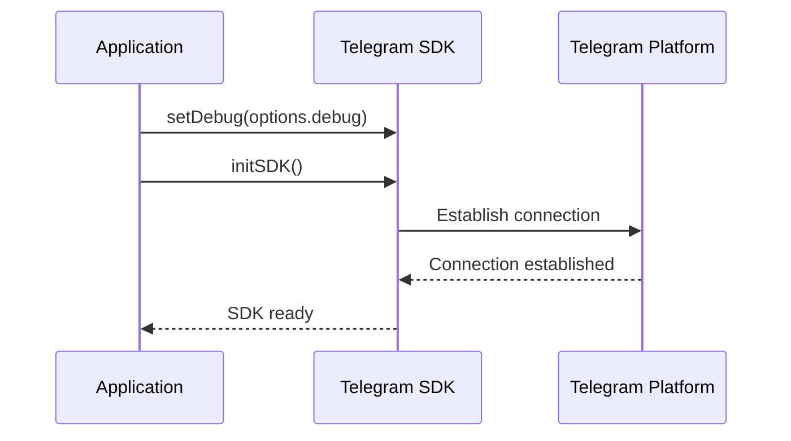
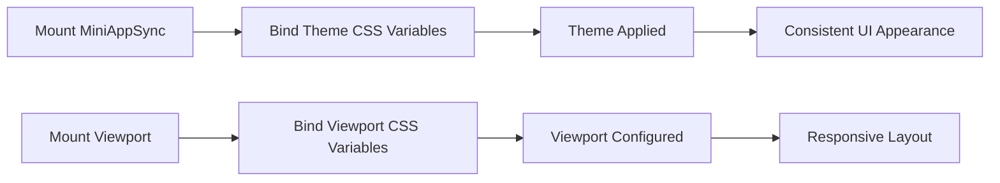
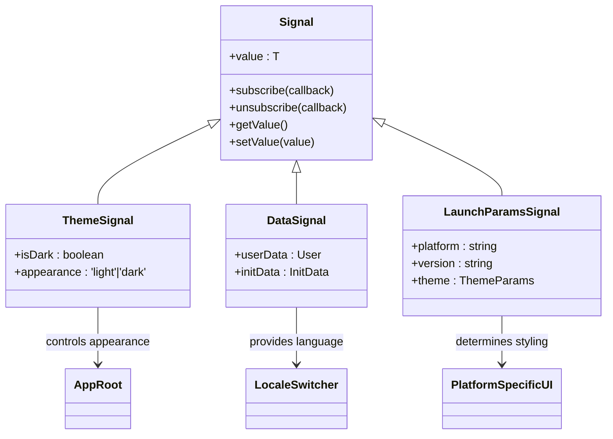

# Application Initialization

<cite>
**Referenced Files in This Document**   
- [init.ts](file://passion/src/core/init.ts)
- [Root.tsx](file://passion/components/Root/Root.tsx)
- [layout.tsx](file://passion/app/layout.tsx)
- [provider.tsx](file://passion/src/core/i18n/provider.tsx)
</cite>

## Table of Contents
1. [Initialization Overview](#initialization-overview)
2. [SDK Setup and Configuration](#sdk-setup-and-configuration)
3. [Debug and Development Tools](#debug-and-development-tools)
4. [Component Mounting Process](#component-mounting-process)
5. [Theme and Viewport Management](#theme-and-viewport-management)
6. [Launch Parameters and Platform Detection](#launch-parameters-and-platform-detection)
7. [State Synchronization with Signals](#state-synchronization-with-signals)
8. [Error Handling and Troubleshooting](#error-handling-and-troubleshooting)
9. [Performance Considerations](#performance-considerations)

## Initialization Overview

The application initialization process in the Telegram Mini App is orchestrated through the `init` function located in `src/core/init.ts`. This function serves as the central entry point for configuring the application environment, setting up the Telegram Mini App SDK, and preparing the UI components for interaction. The initialization sequence follows a structured approach that ensures proper setup of all required components before the application becomes interactive.

The initialization process begins when the application loads and is designed to handle various configuration options that affect debugging, development tools, and platform-specific behaviors. The function accepts an options object containing three key properties: `debug`, `eruda`, and `mockForMacOS`, which control different aspects of the initialization behavior.

**Section sources**
- [init.ts](file://passion/src/core/init.ts#L20-L81)

## SDK Setup and Configuration

The initialization process starts with configuring the @telegram-apps/sdk-react library by setting the debug mode and initializing the SDK. The `setDebug(options.debug)` function call enables or disables debug logging based on the provided configuration, which is essential for troubleshooting during development. Following this, `initSDK()` is called to initialize the core SDK functionality, establishing the connection between the web application and the Telegram Mini App environment.

This initial setup phase is critical for ensuring that all subsequent operations can communicate properly with the Telegram platform. The SDK initialization establishes the foundation for all Telegram-specific features, including user data access, theme management, and viewport control.

**Diagram sources**
- [init.ts](file://passion/src/core/init.ts#L25-L27)

**Section sources**
- [init.ts](file://passion/src/core/init.ts#L25-L27)

## Debug and Development Tools

The initialization process includes conditional setup of development tools based on the provided options. When the `eruda` option is enabled, the application dynamically imports the Eruda debugging console and initializes it with a positioned interface. This allows developers to inspect variables, view console output, and debug JavaScript directly within the Telegram Mini App interface, which is particularly valuable given the constrained debugging environment of embedded web applications.

Additionally, the `mockForMacOS` option addresses known compatibility issues with Telegram for macOS, which has several bugs related to theme and safe area requests. When enabled, this option implements a mocking layer that intercepts specific Telegram API calls and provides simulated responses. This ensures consistent behavior across platforms despite the limitations of the macOS client.

**Diagram sources**
- [init.ts](file://passion/src/core/init.ts#L30-L65)

**Section sources**
- [init.ts](file://passion/src/core/init.ts#L30-L65)

## Component Mounting Process

After the initial SDK setup and debug configuration, the application proceeds to mount essential UI components provided by the Telegram SDK. The mounting process is handled through a series of dedicated functions that integrate Telegram-specific components into the application:

- `mountBackButton.ifAvailable()` - Mounts the back button component if available in the current environment
- `restoreInitData()` - Restores initialization data from the Telegram environment
- `mountMiniAppSync()` - Mounts the Mini App component with synchronization capabilities
- `mountViewport()` - Mounts the viewport component to manage display dimensions

The mounting process includes availability checks to ensure that components are only mounted when supported by the current platform. This defensive approach prevents errors on platforms that may not support certain features, enhancing the application's robustness across different Telegram clients.

**Section sources**
- [init.ts](file://passion/src/core/init.ts#L68-L81)

## Theme and Viewport Management

The initialization process includes comprehensive theme and viewport management to ensure the application visually integrates with the Telegram interface. When `mountMiniAppSync` is available, it is mounted and immediately followed by `bindThemeParamsCssVars()`, which binds theme parameters to CSS variables. This allows the application's styling to dynamically reflect the user's Telegram theme preferences, including colors and appearance settings.

Similarly, when the viewport component is available, `mountViewport()` is called asynchronously, and upon completion, `bindViewportCssVars()` is executed to bind viewport dimensions to CSS variables. This asynchronous approach ensures that the application can respond to changes in the display environment, such as keyboard visibility or window resizing, while maintaining smooth performance.

The use of CSS variables for theme and viewport management enables a clean separation between the application logic and presentation, allowing for dynamic updates without requiring direct DOM manipulation.

**Diagram sources**
- [init.ts](file://passion/src/core/init.ts#L72-L80)

**Section sources**
- [init.ts](file://passion/src/core/init.ts#L72-L80)

## Launch Parameters and Platform Detection

The initialization process leverages `retrieveLaunchParams` to extract critical information about the Telegram environment in which the application is running. This function provides access to platform-specific details such as the operating system, Telegram app version, and other launch parameters that inform the application's behavior.

The retrieved launch parameters are used throughout the application, particularly in the `RootInner` component where the platform is determined based on the `tgWebAppPlatform` value. This information is used to set the appropriate platform appearance (iOS vs. base) in the `AppRoot` component, ensuring that UI elements follow the correct design guidelines for the host platform.

Platform detection is essential for providing a native-like experience, as it allows the application to adapt its interface to match the conventions of the user's device, whether it's iOS, Android, or desktop.

**Section sources**
- [init.ts](file://passion/src/core/init.ts#L13-L13)
- [Root.tsx](file://passion/components/Root/Root.tsx#L21-L37)

## State Synchronization with Signals

The application employs a reactive state management system using signals from @telegram-apps/sdk-react to synchronize state between the Telegram environment and the React components. Signals provide a lightweight, efficient mechanism for tracking changes in Telegram-specific state variables such as theme, user data, and launch parameters.

In the `RootInner` component, signals are used to track the dark mode state (`miniApp.isDark`) and user data (`initData.user`). These signals automatically update when the corresponding Telegram state changes, triggering React re-renders to keep the UI in sync. This approach eliminates the need for manual event listeners and state management, simplifying the code and reducing the potential for synchronization errors.

The use of signals also extends to other parts of the application, such as the init data page, where multiple signals are used to track different aspects of the initialization state, enabling fine-grained reactivity without unnecessary re-renders.

**Diagram sources**
- [Root.tsx](file://passion/components/Root/Root.tsx#L23-L24)
- [init-data/page.tsx](file://passion/app/init-data/page.tsx#L23-L24)

**Section sources**
- [Root.tsx](file://passion/components/Root/Root.tsx#L23-L29)
- [init-data/page.tsx](file://passion/app/init-data/page.tsx#L23-L24)

## Error Handling and Troubleshooting

The initialization process includes several mechanisms for error handling and troubleshooting common issues that may arise during startup. The most significant challenge addressed is the unreliable behavior of Telegram for macOS, which is mitigated through the `mockForMacOS` option that simulates expected API responses.

Common issues that may occur during initialization include:

1. **Failed SDK initialization**: This can occur if the application is not running in a valid Telegram environment. The application should verify the presence of the Telegram environment before attempting initialization.

2. **Missing init data**: If the initialization data is not available, the application should provide appropriate fallback behavior, as seen in the init data page which displays a placeholder when data is missing.

3. **Component mounting failures**: The use of `.ifAvailable()` and `.isAvailable()` checks prevents errors when attempting to mount components that are not supported in the current environment.

4. **Asynchronous loading issues**: The `useDidMount` hook ensures that certain components are only rendered after the application has fully mounted, preventing hydration mismatches in Next.js.

The ErrorBoundary component provides a safety net for unhandled exceptions, catching errors and displaying a user-friendly error page while logging the details for debugging.

**Section sources**
- [init.ts](file://passion/src/core/init.ts#L69-L78)
- [Root.tsx](file://passion/components/Root/Root.tsx#L45-L57)
- [ErrorBoundary.tsx](file://passion/components/ErrorBoundary.tsx#L15-L38)

## Performance Considerations

The initialization process incorporates several performance optimizations to ensure a smooth startup experience:

1. **Conditional loading of development tools**: The Eruda debugger is only loaded when explicitly enabled, preventing unnecessary network requests and memory usage in production.

2. **Asynchronous component mounting**: Viewport mounting is handled asynchronously to prevent blocking the main thread, allowing the application to become interactive more quickly.

3. **Lazy signal updates**: The use of React's `useMemo` and signal subscriptions ensures that components only re-render when their specific dependencies change, minimizing unnecessary updates.

4. **Efficient state management**: Signals provide a lightweight alternative to traditional state management solutions, reducing overhead and improving responsiveness.

5. **Platform-specific optimizations**: The application adapts its behavior based on the detected platform, avoiding unnecessary operations on platforms where certain features are not available or behave differently.

These performance considerations are particularly important in the context of Telegram Mini Apps, where users expect near-instant loading and smooth interactions similar to native applications.

**Section sources**
- [init.ts](file://passion/src/core/init.ts#L77-L80)
- [Root.tsx](file://passion/components/Root/Root.tsx#L49-L52)
- [init-data/page.tsx](file://passion/app/init-data/page.tsx#L26-L44)