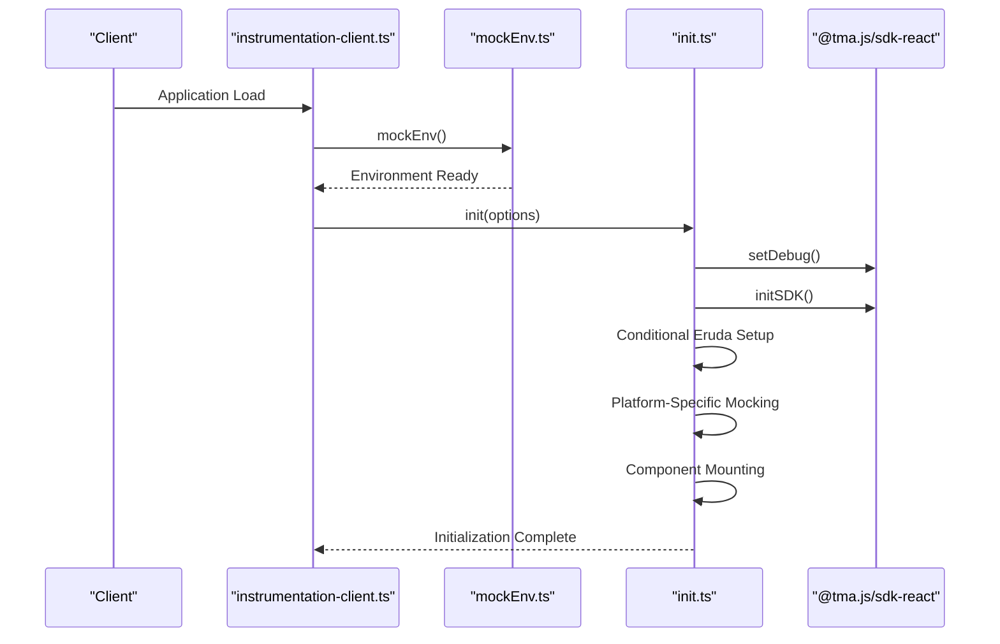
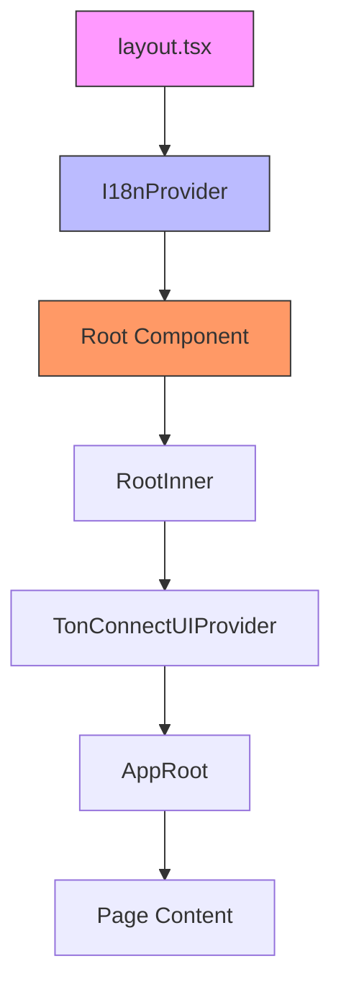
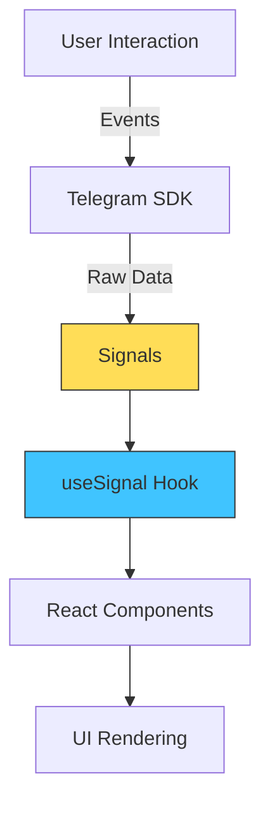

# Core Architecture

<cite>
**Referenced Files in This Document**   
- [instrumentation-client.ts](file://passion/src/instrumentation-client.ts)
- [init.ts](file://passion/src/core/init.ts)
- [layout.tsx](file://passion/src/app/layout.tsx)
- [Root.tsx](file://passion/src/components/Root/Root.tsx)
- [mockEnv.ts](file://passion/src/mockEnv.ts)
- [provider.tsx](file://passion/src/core/i18n/provider.tsx)
- [useDidMount.ts](file://passion/src/hooks/useDidMount.ts)
</cite>

## Table of Contents
1. [Introduction](#introduction)
2. [Initialization Sequence](#initialization-sequence)
3. [Component Hierarchy and Layout](#component-hierarchy-and-layout)
4. [Data Flow and State Management](#data-flow-and-state-management)
5. [Theme and Viewport Parameter Binding](#theme-and-viewport-parameter-binding)
6. [Platform Inconsistency Handling](#platform-inconsistency-handling)
7. [Architectural Decisions](#architectural-decisions)
8. [Conclusion](#conclusion)

## Introduction

This document provides comprehensive architectural documentation for the core application structure of the Telegram Mini App. The system is built on Next.js with TypeScript and leverages the @telegram-apps SDK to create a seamless integration with the Telegram platform. The architecture centers around client-side initialization, component mounting, and responsive design patterns that adapt to various Telegram client environments. The application follows a modular structure with clear separation of concerns between initialization logic, internationalization, and UI components.

## Initialization Sequence

The application boot process begins with `instrumentation-client.ts`, which serves as the entry point for client-side initialization. This file orchestrates the entire startup sequence by first invoking the environment mocking functionality and then triggering the core initialization process.

**Diagram sources**
- [instrumentation-client.ts](file://passion/src/instrumentation-client.ts#L1-L25)
- [init.ts](file://passion/src/core/init.ts#L20-L82)
- [mockEnv.ts](file://passion/src/mockEnv.ts#L5-L81)

**Section sources**
- [instrumentation-client.ts](file://passion/src/instrumentation-client.ts#L1-L25)
- [init.ts](file://passion/src/core/init.ts#L20-L82)

The initialization sequence follows a precise order:
1. Environment preparation through `mockEnv()` which detects if the app is running within a Telegram context
2. Retrieval of launch parameters from the Telegram SDK
3. Determination of debug mode based on URL parameters or development environment
4. Configuration and execution of the `init` function with appropriate options

The `init` function in `src/core/init.ts` accepts three configuration options: `debug`, `eruda`, and `mockForMacOS`. These options enable conditional behavior based on the runtime environment, allowing developers to enable debugging tools and platform-specific workarounds only when needed.

## Component Hierarchy and Layout

The application's component structure is organized around a hierarchical layout system that ensures consistent rendering across all pages. The root of this hierarchy is established in `layout.tsx`, which serves as the universal wrapper for all application routes.

**Diagram sources**
- [layout.tsx](file://passion/src/app/layout.tsx#L1-L30)
- [Root.tsx](file://passion/src/components/Root/Root.tsx#L1-L58)

**Section sources**
- [layout.tsx](file://passion/src/app/layout.tsx#L1-L30)
- [Root.tsx](file://passion/src/components/Root/Root.tsx#L1-L58)

The layout structure implements several key architectural patterns:
- **Internationalization Wrapper**: The `I18nProvider` wraps all content to enable localization support
- **Root Component**: The `Root` component handles client-side mounting and error boundaries
- **Telegram UI Integration**: The `AppRoot` component from Telegram UI provides platform-specific styling
- **Loading State Management**: The `useDidMount` hook ensures proper handling of server-side rendering limitations

The `Root` component employs a critical pattern for Telegram Mini Apps: it displays a loading state on the server side and only renders the full application once mounted on the client. This addresses the platform's limitations with server-side rendering while maintaining a smooth user experience.

## Data Flow and State Management

The application implements a reactive data flow pattern using signals from the @tma.js/sdk-react package. This approach enables efficient state management by creating observable references to Telegram SDK data that automatically update when the underlying values change.

**Diagram sources**
- [Root.tsx](file://passion/src/components/Root/Root.tsx#L3-L45)
- [useDidMount.ts](file://passion/src/hooks/useDidMount.ts#L1-L14)

**Section sources**
- [Root.tsx](file://passion/src/components/Root/Root.tsx#L3-L45)
- [provider.tsx](file://passion/src/core/i18n/provider.tsx#L1-L19)

The data flow operates as follows:
1. The Telegram SDK maintains internal state for various platform parameters
2. Signals create reactive references to these SDK values
3. The `useSignal` hook subscribes to these signals in React components
4. Components automatically re-render when signal values change
5. User interactions trigger events that propagate back to the SDK

This pattern eliminates the need for manual state synchronization and reduces boilerplate code. For example, the `isDark` variable in `RootInner` uses `useSignal(miniApp.isDark)` to automatically reflect theme changes from the Telegram client without additional event listeners or state management code.

## Theme and Viewport Parameter Binding

The application implements a sophisticated system for binding Telegram platform parameters to CSS variables, enabling dynamic theming and responsive layout adjustments. This functionality is primarily handled by the `bindThemeParamsCssVars` and `bindViewportCssVars` functions called during initialization.

The theme parameters from Telegram (such as `bg_color`, `text_color`, `accent_text_color`) are automatically mapped to CSS custom properties (variables) on the document root. This allows the application's stylesheets to reference these variables directly, ensuring visual consistency with the host Telegram client's theme.

For example, the global CSS file uses `var(--tg-theme-secondary-bg-color, white)` to set the background, falling back to white if the Telegram variable is not available. This approach enables seamless theme integration while maintaining design integrity across different Telegram clients.

The viewport binding system similarly maps viewport dimensions and expansion state to CSS variables, allowing responsive design adjustments based on the Mini App's current display state (expanded or collapsed). This is particularly important for mobile interfaces where screen real estate is limited and dynamic.

## Platform Inconsistency Handling

The architecture includes comprehensive strategies for handling platform inconsistencies, particularly for problematic environments like Telegram for macOS. The `init` function implements targeted workarounds for known platform bugs through conditional logic based on the detected platform.

When `mockForMacOS` is enabled, the system intercepts specific Telegram API requests that are known to be unreliable on macOS. For instance, it mocks responses for `web_app_request_theme` and `web_app_request_safe_area` methods, providing consistent values regardless of the actual client behavior. This ensures a stable user experience even when the underlying platform implementation is flawed.

The environment mocking system in `mockEnv.ts` serves a dual purpose: it enables development outside the Telegram client by simulating the necessary API surface, and it provides a mechanism for testing edge cases. This mocking is automatically disabled in production builds, ensuring that the application interacts with the real Telegram SDK in the final deployment.

## Architectural Decisions

Several key architectural decisions shape the application's design:

**Client-Side Only Execution**: The application is designed to execute exclusively on the client side, acknowledging Telegram Mini Apps' limitations with server-side rendering. This decision simplifies state management and ensures compatibility with the platform's execution model.

**Separation of Initialization Logic**: The initialization process is cleanly separated into distinct concerns: environment preparation (`mockEnv`), core configuration (`init`), and component mounting. This modularity enhances testability and maintains clear responsibility boundaries.

**Progressive Enhancement**: The architecture follows a progressive enhancement approach, where core functionality is available even if certain Telegram features are unavailable, and additional capabilities are layered on top when supported.

**Development/Production Parity**: The conditional mocking system ensures that development and production environments have minimal differences, reducing the risk of environment-specific bugs while still allowing convenient local development.

These decisions collectively create a robust foundation that balances developer experience with production reliability, enabling efficient development while maintaining high-quality user experiences.

## Conclusion

The core architecture of this Telegram Mini App demonstrates a thoughtful approach to building applications within platform constraints. By leveraging the @telegram-apps SDK effectively, implementing reactive data flow patterns, and addressing platform inconsistencies proactively, the system provides a solid foundation for feature development. The clear separation of concerns, thoughtful initialization sequence, and responsive design patterns create an architecture that is both maintainable and scalable. Future development can build upon this foundation with confidence, knowing that the core infrastructure handles the complexities of Telegram integration while providing a clean interface for application logic.