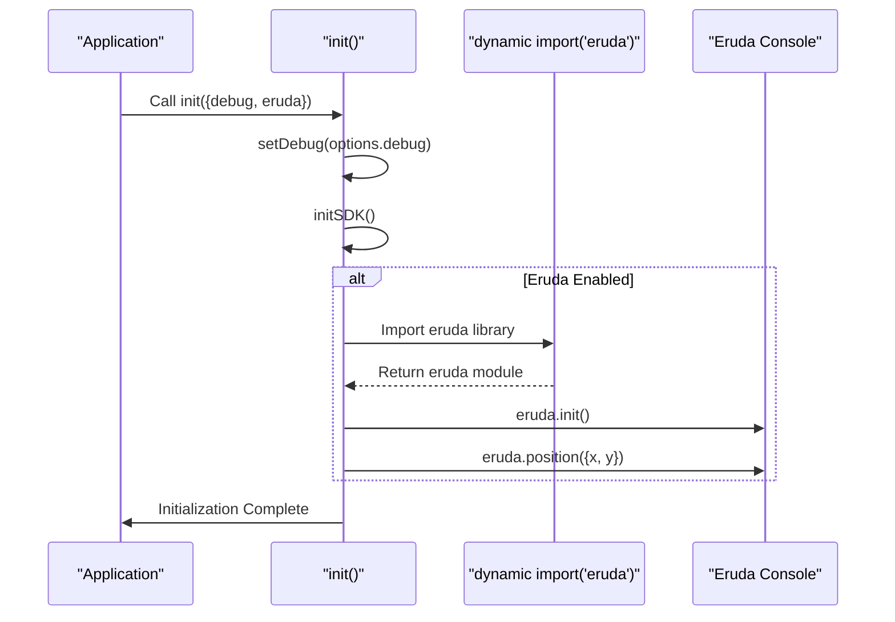
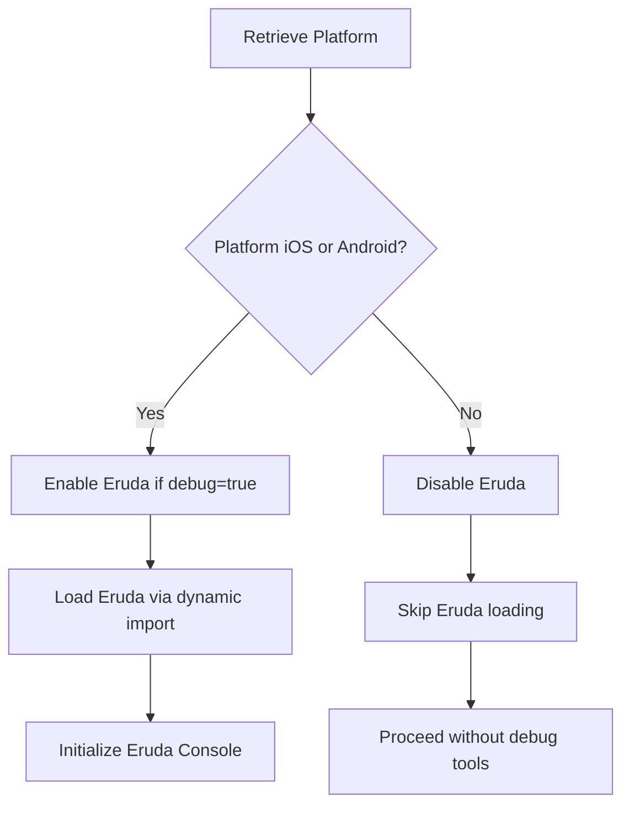

# Debugging Tools

<cite>
**Referenced Files in This Document**   
- [instrumentation-client.ts](file://passion/src/instrumentation-client.ts)
- [init.ts](file://passion/src/core/init.ts)
</cite>

## Table of Contents
1. [Introduction](#introduction)
2. [Debug Mode Activation](#debug-mode-activation)
3. [Eruda Console Integration](#eruda-console-integration)
4. [Platform Detection and Conditional Loading](#platform-detection-and-conditional-loading)
5. [Positioning Logic](#positioning-logic)
6. [Use Cases for Mobile Debugging](#use-cases-for-mobile-debugging)
7. [Common Issues and Solutions](#common-issues-and-solutions)
8. [Security Considerations](#security-considerations)
9. [Best Practices](#best-practices)

## Introduction
This document details the debugging tools implemented in the application, focusing on the integration and conditional loading of the Eruda console. Eruda is a powerful mobile web debugging tool designed specifically for debugging web applications within mobile environments, particularly in contexts where standard browser developer tools are unavailable or limited, such as Telegram WebViews. The implementation leverages dynamic import, platform detection, and runtime configuration to ensure debug tools are only available when explicitly needed and appropriate.

**Section sources**
- [instrumentation-client.ts](file://passion/src/instrumentation-client.ts#L1-L25)
- [init.ts](file://passion/src/core/init.ts#L1-L83)

## Debug Mode Activation
Debug mode in the application is activated through two primary mechanisms: launch parameters and environment detection. The debug flag is derived from the `tgWebAppStartParam` parameter passed during application launch. If this parameter contains the string "debug", the debug mode is enabled. Additionally, debug mode is automatically activated when the application runs in a development environment, as determined by the `NODE_ENV` environment variable. This dual mechanism ensures developers can easily enable debugging during development while also providing a way to activate it in production-like environments for troubleshooting.

```mermaid
flowchart TD
Start([Application Start]) --> RetrieveParams["Retrieve Launch Parameters"]
RetrieveParams --> ExtractParam["Extract tgWebAppStartParam"]
ExtractParam --> CheckDebugParam{"Param includes 'debug'?}
CheckDebugParam --> |Yes| EnableDebug["Set debug = true"]
CheckDebugParam --> |No| CheckEnv["Check NODE_ENV"]
CheckEnv --> IsDevelopment{"NODE_ENV === 'development'?}
IsDevelopment --> |Yes| EnableDebug
IsDevelopment --> |No| DisableDebug["Set debug = false"]
EnableDebug --> ConfigureInit["Pass debug flag to init()"]
DisableDebug --> ConfigureInit
ConfigureInit --> End([Initialization Complete])
```

**Diagram sources**
- [instrumentation-client.ts](file://passion/src/instrumentation-client.ts#L12-L14)

**Section sources**
- [instrumentation-client.ts](file://passion/src/instrumentation-client.ts#L8-L25)

## Eruda Console Integration
The Eruda console is integrated into the application through a dynamic import mechanism within the `init` function. This approach ensures that the Eruda library is only loaded when explicitly required, minimizing bundle size and performance impact in non-debug scenarios. The integration occurs conditionally based on the `eruda` flag passed to the `init` function. When enabled, the code uses `import('eruda')` to asynchronously load the library and initialize it. This dynamic loading pattern is essential for maintaining optimal performance in production environments while still providing powerful debugging capabilities when needed.



**Diagram sources**
- [init.ts](file://passion/src/core/init.ts#L29-L34)

**Section sources**
- [init.ts](file://passion/src/core/init.ts#L29-L34)

## Platform Detection and Conditional Loading
The application implements sophisticated platform detection to determine when and where to load the Eruda console. The debug tools are conditionally loaded only on iOS and Android platforms, as specified by the `tgWebAppPlatform` launch parameter. This restriction is implemented in the `instrumentation-client.ts` file, where the `eruda` flag is set to `true` only if both the debug mode is active AND the platform is either 'ios' or 'android'. This design decision acknowledges that desktop browsers already have robust developer tools, making Eruda redundant in those environments. By limiting Eruda to mobile platforms, the application optimizes resource usage and avoids unnecessary complexity in desktop contexts.



**Diagram sources**
- [instrumentation-client.ts](file://passion/src/instrumentation-client.ts#L19-L20)

**Section sources**
- [instrumentation-client.ts](file://passion/src/instrumentation-client.ts#L11-L20)

## Positioning Logic
Once initialized, the Eruda console is positioned in the top-right corner of the screen using the `eruda.position()` method. The positioning logic calculates the x-coordinate as `window.innerWidth - 50`, placing the console button 50 pixels from the right edge of the viewport, while setting the y-coordinate to 0 to align it with the top edge. This placement ensures the debug button is easily accessible without obstructing the main application interface. The positioning is applied immediately after initialization, providing consistent placement across different devices and screen sizes. This strategic positioning makes the debug tool readily available while minimizing interference with the user interface.

**Section sources**
- [init.ts](file://passion/src/core/init.ts#L33-L34)

## Use Cases for Mobile Debugging
The Eruda integration addresses critical debugging challenges in mobile web applications, particularly within Telegram WebViews. Standard browser developer tools are often inaccessible or severely limited in embedded web views, making it difficult to diagnose issues related to JavaScript execution, network requests, or console logging. Eruda provides a comprehensive debugging interface directly within the mobile application, enabling developers to inspect variables, monitor network activity, view console output, and debug JavaScript in real-time. This capability is invaluable for troubleshooting platform-specific issues, verifying API interactions, and ensuring proper functionality across different mobile environments.

## Common Issues and Solutions
A common issue developers may encounter is the Eruda console not loading on desktop environments. This behavior is intentional, as the application logic specifically restricts Eruda to iOS and Android platforms. Developers expecting to see the debug console on desktop browsers may误interpret this as a bug. The solution is to test debug functionality on actual mobile devices or mobile emulators. Another potential issue is failing to activate debug mode, which can occur if the 'debug' start parameter is not properly passed or if the environment is not set to development. Ensuring correct launch parameters and environment configuration resolves these issues.

## Security Considerations
Exposing debug tools in production environments poses significant security risks, including potential information disclosure and increased attack surface. The application mitigates these risks through multiple layers of protection. First, debug mode requires an explicit 'debug' parameter in the launch URL, making it difficult to accidentally enable. Second, the Eruda console is only loaded on mobile platforms, reducing exposure in more vulnerable desktop environments. Third, the dynamic import ensures the debug library is not bundled with the main application code, preventing it from being easily discovered through static analysis. These measures collectively ensure that debugging capabilities remain available for development and troubleshooting while minimizing security risks in production.

## Best Practices
The implementation demonstrates several best practices for conditional debugging:
1. **Environment-aware configuration**: Using `NODE_ENV` to automatically enable debug features in development
2. **Parameter-based activation**: Allowing debug mode to be toggled via URL parameters for flexible testing
3. **Platform-specific loading**: Restricting debug tools to platforms where they provide the most value
4. **Dynamic imports**: Loading debug libraries only when needed to optimize performance
5. **Centralized initialization**: Managing all debug configuration through a single initialization function
6. **Clear separation of concerns**: Keeping debug logic isolated in initialization files rather than scattered throughout the codebase

These practices ensure that debugging capabilities are powerful when needed but invisible and non-intrusive in normal operation.