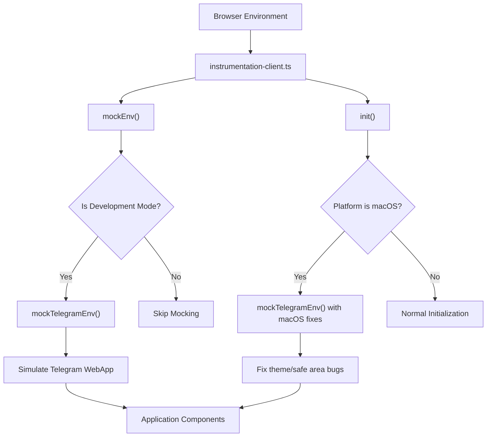
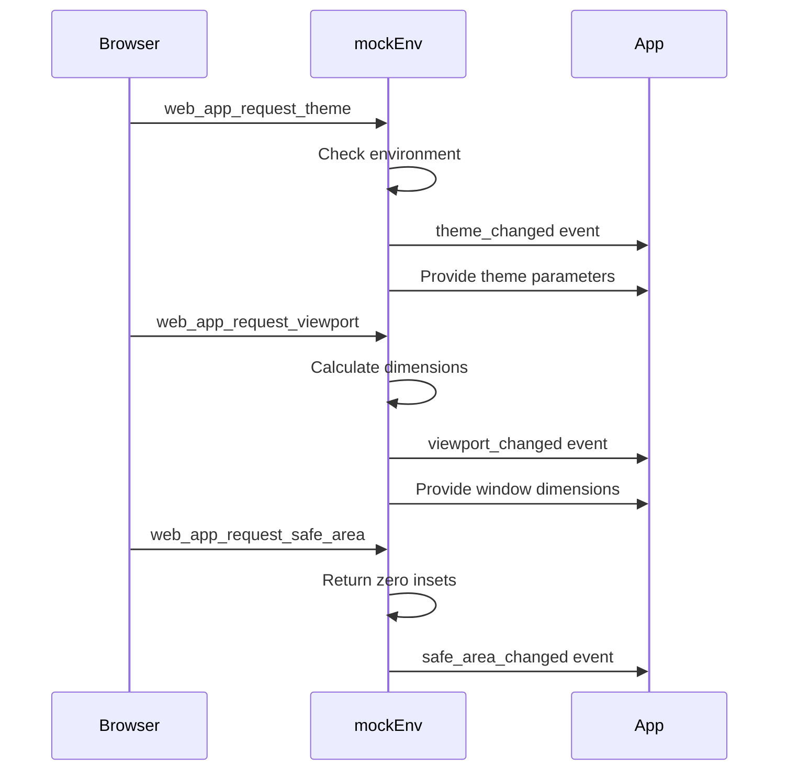
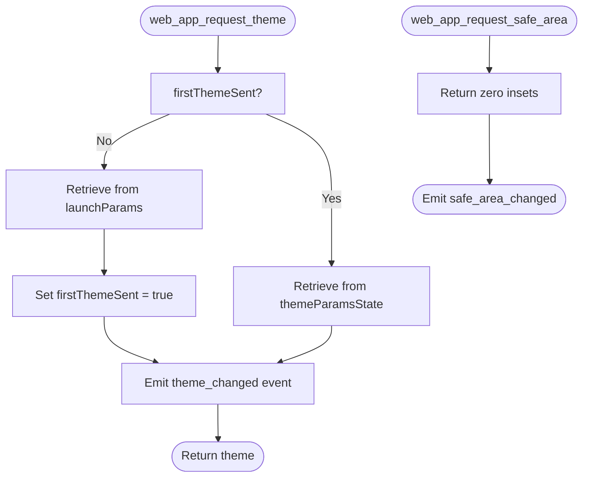
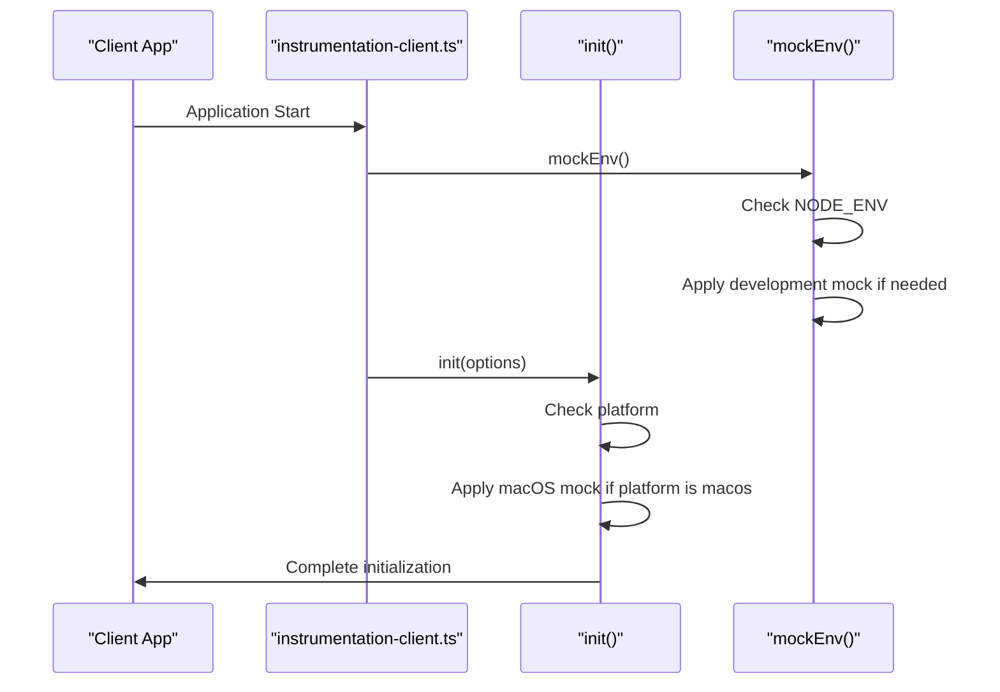

# Environment Mocking

<cite>
**Referenced Files in This Document**   
- [mockEnv.ts](file://passion/src/mockEnv.ts)
- [init.ts](file://passion/src/core/init.ts)
- [instrumentation-client.ts](file://passion/src/instrumentation-client.ts)
- [README.md](file://passion/README.md)
</cite>

## Table of Contents
1. [Introduction](#introduction)
2. [Core Components](#core-components)
3. [Architecture Overview](#architecture-overview)
4. [Detailed Component Analysis](#detailed-component-analysis)
5. [Development Workflow and Integration](#development-workflow-and-integration)
6. [Troubleshooting Guide](#troubleshooting-guide)
7. [Conclusion](#conclusion)

## Introduction

The environment mocking system is a critical development tool designed to simulate Telegram's WebApp environment when building applications outside the native Telegram client. This system is particularly important for macOS users, as the Telegram desktop client for macOS has known bugs that affect theme and safe area requests. The mocking system enables developers to reliably test and develop their Telegram Mini Apps in standard browser environments during the development phase, while ensuring these mocks are automatically excluded from production builds through tree-shaking.

**Section sources**
- [README.md](file://passion/README.md#L53-L86)

## Core Components

The environment mocking system consists of two primary components: the global development mock in `mockEnv.ts` and the macOS-specific mock in `init.ts`. The `mockEnv.ts` file provides a general environment simulation for non-Telegram environments during development, while `init.ts` contains targeted fixes for known issues in the Telegram macOS client. These components work together to ensure consistent behavior across development, testing, and production environments.

**Section sources**
- [mockEnv.ts](file://passion/src/mockEnv.ts#L1-L82)
- [init.ts](file://passion/src/core/init.ts#L1-L83)

## Architecture Overview

**Diagram sources**
- [instrumentation-client.ts](file://passion/src/instrumentation-client.ts#L8-L25)
- [init.ts](file://passion/src/core/init.ts#L20-L83)
- [mockEnv.ts](file://passion/src/mockEnv.ts#L5-L82)

## Detailed Component Analysis

### Global Development Mock Analysis

The `mockEnv.ts` file implements a development-only environment mock that simulates the Telegram WebApp environment when the application is not running within an actual Telegram client. This mock is conditionally applied only in development mode, ensuring it is automatically removed from production builds through tree-shaking.

The mock intercepts critical Telegram WebApp methods and provides simulated responses. When a `web_app_request_theme` event is received, it emits a `theme_changed` event with predefined theme parameters that match Telegram's dark theme. Similarly, viewport and safe area requests are handled by returning appropriate simulated values based on the current window dimensions or zero insets.

**Diagram sources**
- [mockEnv.ts](file://passion/src/mockEnv.ts#L27-L46)

**Section sources**
- [mockEnv.ts](file://passion/src/mockEnv.ts#L1-L82)

### macOS-Specific Mock Analysis

The macOS-specific mock implemented in `init.ts` addresses known bugs in the Telegram desktop client for macOS. These bugs include failure to respond to `web_app_request_theme` method calls and generating incorrect events for `web_app_request_safe_area`.

The mock uses a `firstThemeSent` flag to manage theme initialization state. On the first request for theme information, it retrieves theme parameters from launch parameters. On subsequent requests, it returns the current theme state from the application's theme state management system. This ensures consistent theme behavior even when the native client fails to respond appropriately.

For safe area requests, the mock intercepts `web_app_request_safe_area` calls and returns zero insets, overriding the incorrect values that might be generated by the buggy macOS client.

**Diagram sources**
- [init.ts](file://passion/src/core/init.ts#L39-L63)

**Section sources**
- [init.ts](file://passion/src/core/init.ts#L36-L66)

## Development Workflow and Integration

The mocking system is integrated into the application's initialization process through `instrumentation-client.ts`, which serves as the entry point for client-side initialization. This file first calls `mockEnv()` to establish the base development environment mock, then proceeds with application initialization.

The system detects the macOS platform by checking the `tgWebAppPlatform` launch parameter and conditionally enables the macOS-specific mock. This detection occurs during initialization, allowing the application to adapt its behavior based on the runtime environment.

**Diagram sources**
- [instrumentation-client.ts](file://passion/src/instrumentation-client.ts#L8-L25)
- [init.ts](file://passion/src/core/init.ts#L17-L83)

**Section sources**
- [instrumentation-client.ts](file://passion/src/instrumentation-client.ts#L1-L26)
- [init.ts](file://passion/src/core/init.ts#L20-L24)

## Troubleshooting Guide

Common issues with the environment mocking system include outdated mock data and incorrect mock activation. Developers should ensure that theme parameters in `mockEnv.ts` are updated to reflect current Telegram design standards. The launch parameters in the mock should also be reviewed periodically to maintain compatibility with current Telegram WebApp specifications.

A frequent issue occurs when the mock is accidentally enabled in production environments. This is prevented by the conditional check on `NODE_ENV`, but developers should verify their build configurations to ensure proper tree-shaking of development-only code.

Another potential issue is the mock not activating when expected. This can occur if the environment detection logic fails or if there are timing issues in the initialization sequence. Developers should check the console output for the warning message emitted by `mockEnv.ts` to confirm that the mock is being applied correctly.

**Section sources**
- [mockEnv.ts](file://passion/src/mockEnv.ts#L76-L78)
- [README.md](file://passion/README.md#L80-L86)

## Conclusion

The environment mocking system provides essential functionality for developing Telegram Mini Apps, particularly addressing the specific challenges of the macOS platform. By simulating the Telegram WebApp environment during development and providing targeted fixes for known client bugs, this system enables reliable cross-platform development and testing. The architecture ensures that mocks are only active in appropriate contexts, preventing accidental use in production while providing robust development capabilities.

The integration of multiple mock layers—general development mock and platform-specific fixes—demonstrates a thoughtful approach to environment simulation that balances flexibility with reliability. This system significantly improves developer experience by reducing platform-specific issues during the development process.

**Section sources**
- [mockEnv.ts](file://passion/src/mockEnv.ts#L3-L8)
- [init.ts](file://passion/src/core/init.ts#L36-L38)