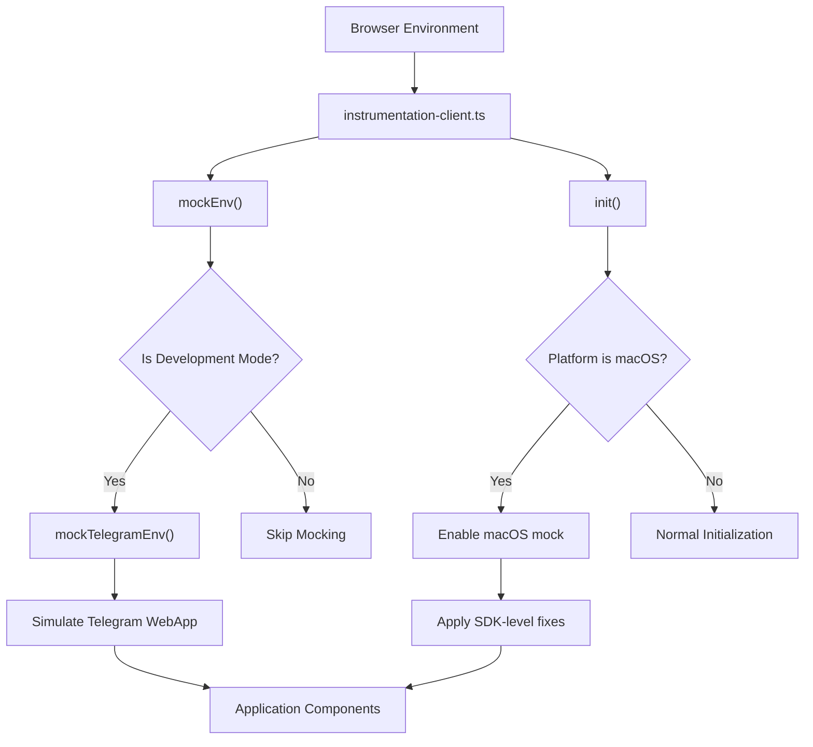
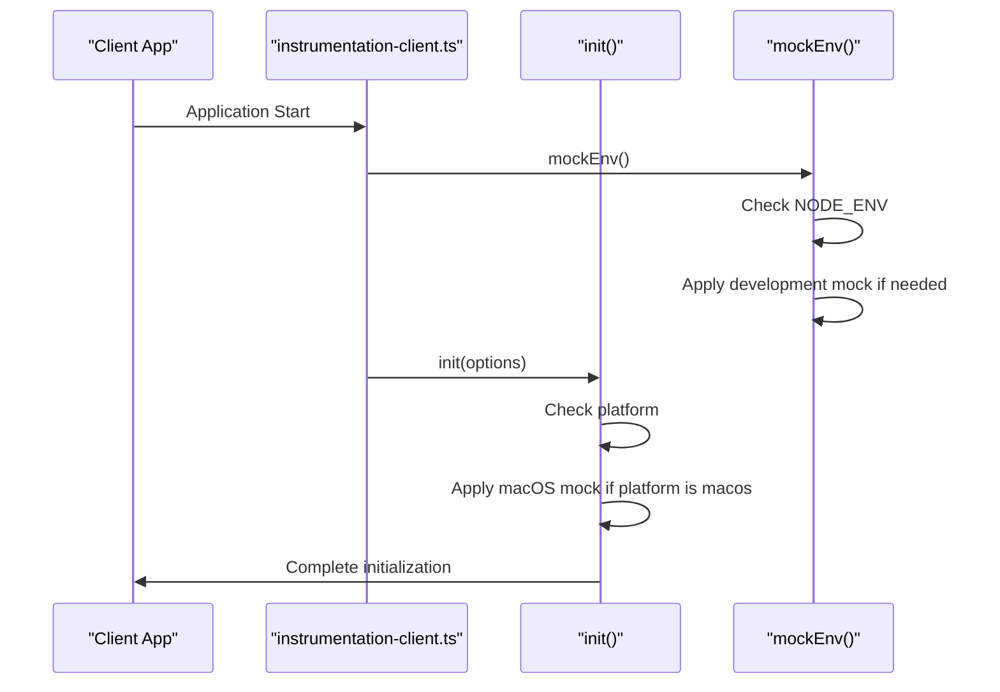

# Environment Mocking

<cite>
**Referenced Files in This Document**   
- [mockEnv.ts](file://passion/src/mockEnv.ts) - *Updated to use internal mockTelegramEnv handling*
- [init.ts](file://passion/src/core/init.ts) - *Simplified macOS-specific mocking logic*
- [instrumentation-client.ts](file://passion/src/instrumentation-client.ts) - *Integration point for mocking system*
- [README.md](file://passion/README.md) - *General setup and usage guidance*
</cite>

## Update Summary
**Changes Made**   
- Updated documentation to reflect removal of deprecated event handling in `mockEnv.ts`
- Removed outdated descriptions of manual `web_app_request_theme` and `web_app_request_safe_area` interception
- Simplified architecture overview and component analysis to align with updated implementation
- Removed obsolete sequence and flow diagrams related to deprecated event handling
- Updated section sources to reflect current file structure and changes

## Table of Contents
1. [Introduction](#introduction)
2. [Core Components](#core-components)
3. [Architecture Overview](#architecture-overview)
4. [Detailed Component Analysis](#detailed-component-analysis)
5. [Development Workflow and Integration](#development-workflow-and-integration)
6. [Troubleshooting Guide](#troubleshooting-guide)
7. [Conclusion](#conclusion)

## Introduction

The environment mocking system is a critical development tool designed to simulate Telegram's WebApp environment when building applications outside the native Telegram client. This system is particularly important for macOS users, as the Telegram desktop client for macOS has known bugs that affect theme and safe area requests. The mocking system enables developers to reliably test and develop their Telegram Mini Apps in standard browser environments during the development phase, while ensuring these mocks are automatically excluded from production builds through tree-shaking.

With the recent update, the `mockEnv.ts` file has been simplified by removing deprecated manual handling of `web_app_request_theme` and `web_app_request_safe_area` events. These are now handled internally by `mockTelegramEnv` from `@tma.js/sdk-react`, reducing code complexity and improving maintainability.

**Section sources**
- [README.md](file://passion/README.md#L53-L86)

## Core Components

The environment mocking system consists of two primary components: the global development mock in `mockEnv.ts` and the macOS-specific mock in `init.ts`. The `mockEnv.ts` file provides a general environment simulation for non-Telegram environments during development, leveraging the `mockTelegramEnv` function from `@tma.js/sdk-react` to handle all necessary event mocking internally. The `init.ts` file contains targeted activation of mocking for known issues in the Telegram macOS client. These components work together to ensure consistent behavior across development, testing, and production environments.

**Section sources**
- [mockEnv.ts](file://passion/src/mockEnv.ts#L1-L62)
- [init.ts](file://passion/src/core/init.ts#L1-L155)

## Architecture Overview



**Diagram sources**
- [instrumentation-client.ts](file://passion/src/instrumentation-client.ts#L8-L25)
- [init.ts](file://passion/src/core/init.ts#L20-L83)
- [mockEnv.ts](file://passion/src/mockEnv.ts#L5-L62)

## Detailed Component Analysis

### Global Development Mock Analysis

The `mockEnv.ts` file implements a development-only environment mock that simulates the Telegram WebApp environment when the application is not running within an actual Telegram client. This mock is conditionally applied only in development mode, ensuring it is automatically removed from production builds through tree-shaking.

The mock now relies entirely on `mockTelegramEnv` from `@tma.js/sdk-react` to handle all event simulations internally. It no longer manually intercepts `web_app_request_theme` or `web_app_request_safe_area` events, as these are now managed by the SDK. Instead, it configures the mock environment with predefined launch parameters, including theme configuration and platform information.

The `themeParams` object defines a comprehensive set of color values matching Telegram's dark theme, ensuring visual consistency during development. The `noInsets` constant is passed to the SDK's internal mock system to ensure safe area requests return zero values when appropriate.

```typescript
const themeParams = {
  accent_text_color: '#6ab2f2',
  bg_color: '#17212b',
  button_color: '#5288c1',
  button_text_color: '#ffffff',
  destructive_text_color: '#ec3942',
  header_bg_color: '#17212b',
  hint_color: '#708499',
  link_color: '#6ab3f3',
  secondary_bg_color: '#232e3c',
  section_bg_color: '#17212b',
  section_header_text_color: '#6ab3f3',
  subtitle_text_color: '#708499',
  text_color: '#f5f5f5',
} as const;
const noInsets = { left: 0, top: 0, bottom: 0, right: 0 } as const;
```

**Section sources**
- [mockEnv.ts](file://passion/src/mockEnv.ts#L1-L62)

### macOS-Specific Mock Analysis

The macOS-specific mock implemented in `init.ts` addresses known bugs in the Telegram desktop client for macOS. These bugs include failure to respond to `web_app_request_theme` method calls and generating incorrect events for `web_app_request_safe_area`.

The implementation has been simplified to directly call `mockTelegramEnv()` when the platform is detected as `macos`. This leverages the internal event handling of the SDK rather than implementing custom interception logic. The `mockForMacOS` option is passed from `instrumentation-client.ts` based on the `tgWebAppPlatform` launch parameter.

This approach eliminates the need for maintaining a `firstThemeSent` flag or manually managing theme state, as these concerns are now handled by the SDK's internal implementation. The mock ensures consistent behavior across platforms by providing a reliable fallback when the native client fails to respond appropriately.

```typescript
if (options.mockForMacOS) {
  mockTelegramEnv();
}
```

**Section sources**
- [init.ts](file://passion/src/core/init.ts#L47-L49)

## Development Workflow and Integration

The mocking system is integrated into the application's initialization process through `instrumentation-client.ts`, which serves as the entry point for client-side initialization. This file first calls `mockEnv()` to establish the base development environment mock, then proceeds with application initialization.

The system detects the macOS platform by checking the `tgWebAppPlatform` launch parameter and conditionally enables the macOS-specific mock. This detection occurs during initialization, allowing the application to adapt its behavior based on the runtime environment.



**Diagram sources**
- [instrumentation-client.ts](file://passion/src/instrumentation-client.ts#L8-L25)
- [init.ts](file://passion/src/core/init.ts#L17-L83)

**Section sources**
- [instrumentation-client.ts](file://passion/src/instrumentation-client.ts#L1-L26)
- [init.ts](file://passion/src/core/init.ts#L20-L24)

## Troubleshooting Guide

Common issues with the environment mocking system include outdated mock data and incorrect mock activation. Developers should ensure that theme parameters in `mockEnv.ts` are updated to reflect current Telegram design standards. The launch parameters in the mock should also be reviewed periodically to maintain compatibility with current Telegram WebApp specifications.

A frequent issue occurs when the mock is accidentally enabled in production environments. This is prevented by the conditional check on `NODE_ENV`, but developers should verify their build configurations to ensure proper tree-shaking of development-only code.

Another potential issue is the mock not activating when expected. This can occur if the environment detection logic fails or if there are timing issues in the initialization sequence. Developers should check the console output for the warning message emitted by `mockEnv.ts` to confirm that the mock is being applied correctly.

With the simplification of the mocking system, developers should no longer attempt to manually handle `web_app_request_theme` or `web_app_request_safe_area` events, as these are now managed internally by `@tma.js/sdk-react`.

**Section sources**
- [mockEnv.ts](file://passion/src/mockEnv.ts#L56-L58)
- [README.md](file://passion/README.md#L80-L86)

## Conclusion

The environment mocking system provides essential functionality for developing Telegram Mini Apps, particularly addressing the specific challenges of the macOS platform. By simulating the Telegram WebApp environment during development and leveraging the internal capabilities of `@tma.js/sdk-react` for event handling, this system enables reliable cross-platform development and testing. The recent simplification of `mockEnv.ts` reduces code complexity and maintenance overhead while maintaining the same level of functionality.

The architecture ensures that mocks are only active in appropriate contexts, preventing accidental use in production while providing robust development capabilities. The integration of SDK-level mocking demonstrates a move toward more maintainable and standardized solutions for common development challenges in the Telegram Mini Apps ecosystem.

**Section sources**
- [mockEnv.ts](file://passion/src/mockEnv.ts#L3-L8)
- [init.ts](file://passion/src/core/init.ts#L36-L38)