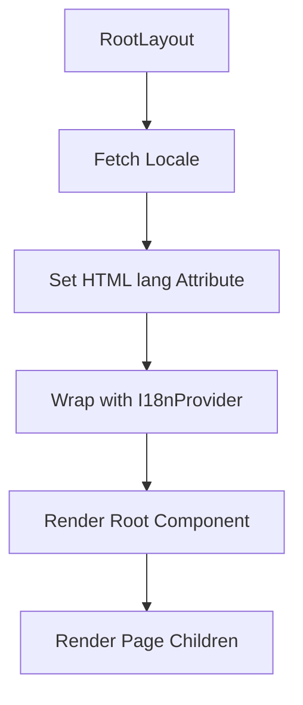
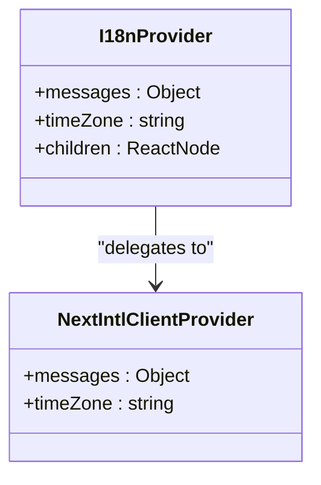
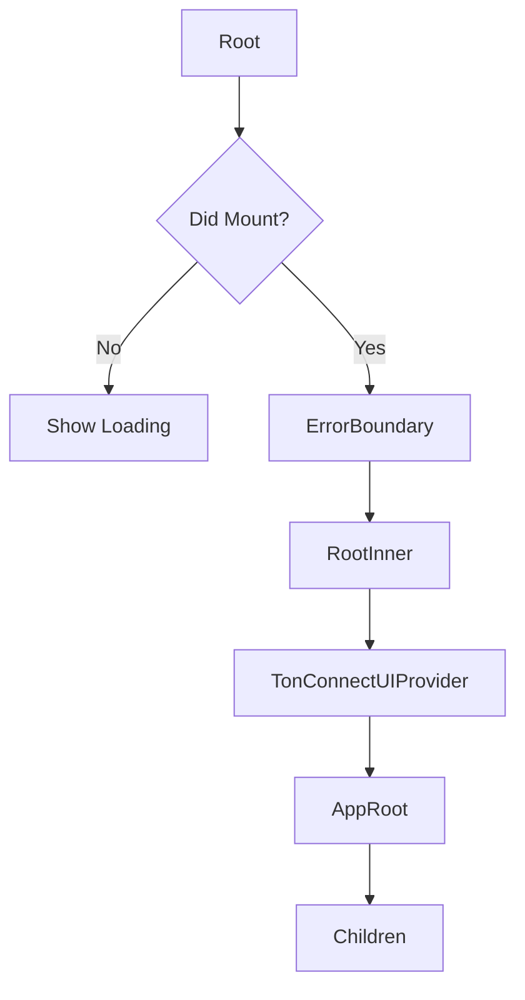

# Layout Structure

<cite>
**Referenced Files in This Document**   
- [layout.tsx](file://passion/src/app/layout.tsx) - *Updated with viewportFit: 'cover' and TMAInitializer integration*
- [Root.tsx](file://passion/src/components/Root/Root.tsx) - *Updated with SafeAreaProvider and TMAInitializer components*
- [TMAInitializer.tsx](file://passion/src/components/TMAInitializer/TMAInitializer.tsx) - *New component for SDK initialization*
- [SafeAreaProvider.tsx](file://passion/src/components/SafeAreaProvider/SafeAreaProvider.tsx) - *Updated with signal-based reactive state management*
- [provider.tsx](file://passion/src/core/i18n/provider.tsx)
- [globals.css](file://passion/src/app/_assets/globals.css)
- [config.ts](file://passion/src/core/i18n/config.ts)
- [locale.ts](file://passion/src/core/i18n/locale.ts)
- [styles.css](file://passion/src/components/Root/styles.css)
</cite>

## Update Summary
**Changes Made**   
- Updated **TMAInitializer and SafeAreaProvider Components** section to reflect migration from useState to useSignal
- Added detailed explanation of signal-based reactive state management using @tma.js/sdk-react
- Enhanced safe area calculation logic with Math.max fallback between contentSafeAreaInsets and safeAreaInsets
- Updated component rendering strategy from padding-based to absolute positioning
- Added diagnostic logging details for viewport state including isExpanded, isFullscreen, and both inset types
- Updated diagram to reflect new signal usage pattern
- Revised section sources to reflect updated implementation in SafeAreaProvider.tsx

## Table of Contents
1. [Introduction](#introduction)
2. [RootLayout Component Overview](#rootlayout-component-overview)
3. [Internationalization with I18nProvider](#internationalization-with-i18nprovider)
4. [CSS Integration and Global Styling](#css-integration-and-global-styling)
5. [Root Component and Telegram UI Integration](#root-component-and-telegram-ui-integration)
6. [Async Locale Resolution](#async-locale-resolution)
7. [HTML Structure and Hydration Control](#html-structure-and-hydration-control)
8. [Accessibility and SEO Considerations](#accessibility-and-seo-considerations)
9. [Performance Implications of CSS Loading](#performance-implications-of-css-loading)
10. [Customization for Themes and Locales](#customization-for-themes-and-locales)
11. [Viewport Configuration and Safe Area Support](#viewport-configuration-and-safe-area-support)
12. [TMAInitializer and SafeAreaProvider Components](#tmainitializer-and-safeareaprovider-components)

## Introduction
The layout structure of this Next.js application is designed to support Telegram Mini Apps with internationalization, responsive design, and platform-specific UI adaptations. The core layout file `layout.tsx` serves as the root wrapper for all pages, establishing the foundational UI structure, internationalization context, and global styling. This document details how the layout components work together to create a consistent, accessible, and performant user experience across different locales and Telegram client environments.

## RootLayout Component Overview
The `RootLayout` component serves as the universal wrapper for all application pages, ensuring consistent rendering of internationalization providers, global styles, and UI wrappers. It is implemented as an async server component that resolves the current locale before rendering, enabling locale-aware content delivery from the initial render.



**Section sources**
- [layout.tsx](file://passion/src/app/layout.tsx#L26-L38)

## Internationalization with I18nProvider
The `I18nProvider` component wraps all page content to enable internationalization throughout the application. It leverages the `next-intl` library to provide translation messages to all child components via React context. The provider fetches localized messages based on the resolved locale and makes them available to all components through the `NextIntlClientProvider`.

The internationalization system is configured to support English (`en`) and Russian (`ru`) locales, with English as the default. Translation files are stored in `public/locales/` as JSON files, following the structure expected by `next-intl`. The `getLocale()` function reads the user's preferred language from a cookie named `NEXT_LOCALE`, falling back to the default locale if no preference is set.



**Section sources**
- [provider.tsx](file://passion/src/core/i18n/provider.tsx#L6-L15)
- [locale.ts](file://passion/src/core/i18n/locale.ts#L13-L15)
- [config.ts](file://passion/src/core/i18n/config.ts#L1-L11)

## CSS Integration and Global Styling
The application integrates multiple CSS sources to ensure consistent styling across different environments. The layout imports three distinct CSS files: Telegram UI's default styles, Normalize.css for cross-browser consistency, and custom global styles from `globals.css`.

Telegram UI styles provide native-looking components that match the Telegram client's appearance, while Normalize.css ensures consistent baseline styling across different browsers. The custom `globals.css` file sets the background color using CSS variables provided by Telegram (`--tg-theme-secondary-bg-color`), ensuring the application blends seamlessly with the host client's theme.

```css
body {
  background: var(--tg-theme-secondary-bg-color, white);
  padding: 0;
  margin: 0;
}
```

This layered approach to CSS allows the application to maintain visual consistency with Telegram while providing custom styling where needed. The global styles are minimal by design, relying primarily on Telegram UI components for the majority of the visual presentation.

**Section sources**
- [layout.tsx](file://passion/src/app/layout.tsx#L8-L10)
- [globals.css](file://passion/src/app/_assets/globals.css#L1-L6)

## Root Component and Telegram UI Integration
The `Root` component serves as a specialized wrapper for Telegram Mini Apps, handling platform-specific considerations and providing a consistent UI foundation. It addresses the limitations of Server Side Rendering in Telegram environments by implementing a mount detection system that shows a loading state during server rendering and only renders the full application after client-side mounting.

The component uses the `useDidMount` hook to detect when the component has mounted on the client, preventing hydration mismatches. Before mounting, it displays a simple loading indicator. After mounting, it wraps content with `ErrorBoundary` for robust error handling and `RootInner` for Telegram-specific configuration.

`RootInner` configures the `AppRoot` component from Telegram UI with the appropriate appearance (dark/light) based on the user's theme preference and sets the platform type based on the client (iOS vs. other platforms). It also integrates `TonConnectUIProvider` for TON blockchain connectivity, demonstrating how multiple context providers can be composed within the layout.



**Section sources**
- [Root.tsx](file://passion/src/components/Root/Root.tsx#L44-L57)
- [styles.css](file://passion/src/components/Root/styles.css#L1-L10)

## Async Locale Resolution
The layout implements an async/await pattern to resolve the current locale before rendering the application shell. The `getLocale()` function is called at the beginning of the `RootLayout` component, returning a promise that resolves to the user's preferred language code.

This server-side locale resolution ensures that the HTML `lang` attribute is correctly set from the initial render, improving accessibility and SEO. The async operation is non-blocking for the rest of the rendering pipeline, allowing other components to proceed with rendering once the locale is known.

The locale resolution system is designed to be flexible, reading preferences from cookies but easily extensible to other sources such as URL parameters, user profiles, or geolocation. The `setLocale()` function allows dynamic locale changes during user interaction, such as through the `LocaleSwitcher` component.

**Section sources**
- [layout.tsx](file://passion/src/app/layout.tsx#L18-L18)
- [locale.ts](file://passion/src/core/i18n/locale.ts#L13-L15)

## HTML Structure and Hydration Control
The HTML structure generated by the layout follows best practices for React applications while addressing Telegram Mini App specific requirements. The `html` element includes the `lang` attribute set to the resolved locale, providing important accessibility information to screen readers and assistive technologies.

The `suppressHydrationWarning` attribute is applied to the `html` element to address known limitations in Telegram Mini Apps' support for Server Side Rendering. This attribute prevents React from emitting hydration mismatch warnings when there are differences between server-rendered and client-rendered content, which can occur due to Telegram's dynamic environment.

The body contains a minimal structure, wrapping children in the internationalization and UI providers without adding unnecessary DOM elements that could interfere with Telegram's layout expectations. This lean structure ensures optimal performance and compatibility with the Telegram client.

**Section sources**
- [layout.tsx](file://passion/src/app/layout.tsx#L21-L27)

## Accessibility and SEO Considerations
The layout structure incorporates several accessibility and SEO best practices. The dynamic `lang` attribute on the HTML element helps screen readers select the appropriate pronunciation rules and assists search engines in understanding the content language.

The metadata configuration provides essential information for search engines and social media platforms, including a title and description that should be customized for the specific application. These values are defined as constants in the layout file but could be made dynamic based on route or user context.

Error boundaries are implemented at the root level to ensure that UI failures do not result in complete application crashes, maintaining accessibility even when parts of the application encounter errors. The loading state provides feedback during the initial mount, preventing blank screens that could confuse users.

The use of semantic HTML elements through Telegram UI components ensures that the application maintains proper document structure and keyboard navigation patterns, critical for accessibility compliance.

**Section sources**
- [layout.tsx](file://passion/src/app/layout.tsx#L12-L15)
- [Root.tsx](file://passion/src/components/Root/Root.tsx#L52-L54)

## Performance Implications of CSS Loading
The CSS loading strategy balances performance and functionality by importing critical styles directly in the layout. The three imported CSS files serve distinct purposes:

1. **Telegram UI styles**: Provide native-looking components, ~15KB gzipped
2. **Normalize.css**: Ensures cross-browser consistency, ~1.2KB gzipped  
3. **globals.css**: Application-specific overrides, <1KB

These styles are loaded synchronously, which can block rendering but ensures visual consistency from the first paint. For production applications, consider optimizing this approach by:

- Inlining critical styles directly in the document
- Deferring non-critical CSS
- Using CSS subsetting to reduce Telegram UI bundle size
- Implementing lazy loading for non-essential themes

The current approach prioritizes visual fidelity with Telegram's native interface over optimal loading performance, which is generally appropriate for Mini Apps that are typically accessed within the Telegram client's cached environment.

**Section sources**
- [layout.tsx](file://passion/src/app/layout.tsx#L8-L10)

## Customization for Themes and Locales
The layout system supports customization for different themes and locales through several mechanisms. The `LocaleSwitcher` component allows users to change languages dynamically, updating the `NEXT_LOCALE` cookie and triggering a re-render with the new language.

Theme adaptation is handled automatically through Telegram's theme parameters, with the `RootInner` component binding CSS variables to the current theme. Developers can extend this system by:

1. Adding support for additional locales in `config.ts`
2. Creating new translation files in `public/locales/`
3. Customizing the `AppRoot` platform detection for new client types
4. Extending the `setLocale` function to persist preferences to backend services

For theme customization, developers can:
- Add custom CSS variables that respond to Telegram's theme parameters
- Implement theme-specific styles using media queries
- Create custom components that adapt to dark/light appearance
- Extend the platform detection logic for specialized layouts

The modular architecture makes it straightforward to adapt the layout to specific requirements while maintaining the core functionality.

**Section sources**
- [config.ts](file://passion/src/core/i18n/config.ts#L1-L11)
- [locale.ts](file://passion/src/core/i18n/locale.ts#L17-L19)
- [Root.tsx](file://passion/src/components/Root/Root.tsx#L34-L37)

## Viewport Configuration and Safe Area Support
The application now includes critical viewport configuration to support safe area handling in Telegram Mini Apps. The `viewport` export in `layout.tsx` has been updated with the `viewportFit: 'cover'` property, which allows the application to extend into unsafe areas around device notches and status bars.

This configuration is essential for fullscreen mode on iOS devices, where the WebView expands to cover the entire screen. The `viewportFit: 'cover'` directive enables the application to occupy the full screen area, including regions around device notches, while the application itself controls the safe area insets through manual padding adjustments.

The complete viewport configuration includes:
- `width: 'device-width'` - Match device screen width
- `initialScale: 1` - No initial zoom
- `maximumScale: 1` - Prevent user zoom
- `userScalable: false` - Disable pinch-to-zoom
- `viewportFit: 'cover'` - **Critical**: Extend into unsafe areas

This configuration works in conjunction with the `SafeAreaProvider` component to ensure content remains within visible boundaries and does not render underneath status bars or system UI elements.

**Section sources**
- [layout.tsx](file://passion/src/app/layout.tsx#L18-L24)

## TMAInitializer and SafeAreaProvider Components
The Root component has been enhanced with two new client-side components: `TMAInitializer` and `SafeAreaProvider`. These components work together to initialize the Telegram Mini App SDK and manage safe area insets for proper content positioning.

The `TMAInitializer` component handles the initialization of the @tma.js/sdk, including:
- Mounting the miniApp, themeParams, and viewport modules
- Binding CSS variables for viewport dimensions and theme parameters
- Requesting expanded viewport and fullscreen mode
- Signaling application readiness to Telegram

The `SafeAreaProvider` component has been significantly updated to use signals from @tma.js/sdk-react for reactive state management. Key changes include:

**Signal-Based Reactive State Management**
- Replaced `useState` with `useSignal` for direct signal consumption
- Transitioned from subscription model to automatic signal updates
- Directly consumes `viewport.contentSafeAreaInsets` and `viewport.safeAreaInsets` signals

**Enhanced Safe Area Calculation**
- Implements `Math.max` fallback between `contentSafeAreaInsets` and `safeAreaInsets`
- Ensures reliability when `contentSafeAreaInsets.bottom` is 0 on certain Telegram versions
- Uses both inset types to provide maximum compatibility across Telegram versions

**Positioning Strategy Update**
- Changed from padding-based layout to absolute positioning
- Uses `top`, `bottom`, `left`, `right` CSS properties for precise boundary control
- Maintains a small bottom padding (8px) for improved spacing

**Diagnostic Logging**
- Added comprehensive logging of viewport state
- Logs include: `contentInsets`, `fallbackInsets`, `isExpanded`, `isFullscreen`
- Includes diagnostic flags: `usingContentInsets`, `insetsAreSame`

```mermaid
graph LR
A[RootLayout] --> B[TMAInitializer]
A --> C[SafeAreaProvider]
C --> D[Page Components]
B --> |Initializes SDK| E[@tma.js/sdk]
B --> |Binds CSS Vars| E
B --> |Requests Fullscreen| E
C --> |Uses Signals| F[contentSafeAreaInsets]
C --> |Uses Signals| G[safeAreaInsets]
F --> |Reactive Updates| C
G --> |Reactive Updates| C
```

**Diagram sources**
- [SafeAreaProvider.tsx](file://passion/src/components/SafeAreaProvider/SafeAreaProvider.tsx#L25-L90) - *Updated with signal-based reactive state management*
- [TMAInitializer.tsx](file://passion/src/components/TMAInitializer/TMAInitializer.tsx) - *New component for SDK initialization*
- [Root.tsx](file://passion/src/components/Root/Root.tsx#L42-L44) - *Integration of updated components*

**Section sources**
- [SafeAreaProvider.tsx](file://passion/src/components/SafeAreaProvider/SafeAreaProvider.tsx#L25-L90) - *Updated with signal-based reactive state management*
- [TMAInitializer.tsx](file://passion/src/components/TMAInitializer/TMAInitializer.tsx)
- [Root.tsx](file://passion/src/components/Root/Root.tsx#L42-L44)