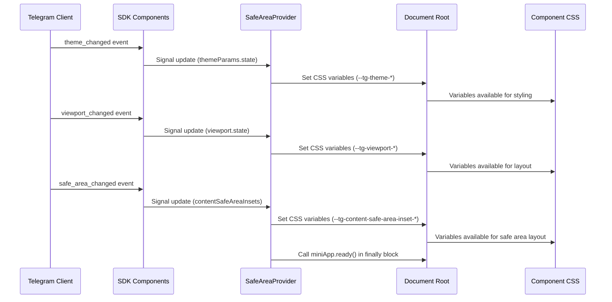
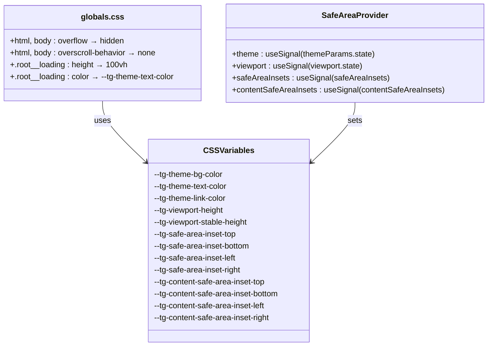
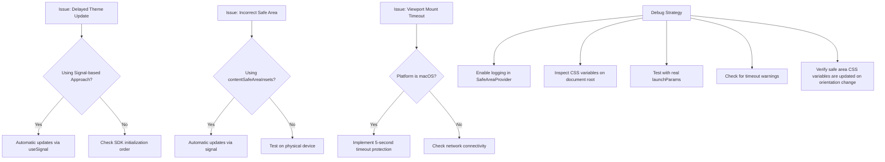

# Theme and Viewport Integration

<cite>
**Referenced Files in This Document**   
- [TMAInitializer.tsx](file://passion/src/components/TMAInitializer/TMAInitializer.tsx) - *Updated with timeout protection and diagnostic logging*
- [SafeAreaProvider.tsx](file://passion/components/SafeAreaProvider/SafeAreaProvider.tsx) - *Enhanced with signal-based reactive state management*
- [globals.css](file://passion/src/app/_assets/globals.css) - *New global CSS file with safe area support and overflow control*
- [init.ts](file://passion/src/core/init.ts) - *Initialization logic migrated to component-based mounting*
</cite>

## Update Summary
**Changes Made**   
- Added new global CSS file at `passion/src/app/_assets/globals.css` with comprehensive safe area support, overflow control, and loading indicator styles
- Enhanced initialization process with timeout protection for viewport mounting and improved diagnostic logging
- Updated SafeAreaProvider to use signal-based reactive state management for theme, viewport, and safe area insets
- Migrated initialization logic from init.ts to component-based mounting in TMAInitializer
- Added CSS variable binding for safe area insets (`--tg-safe-area-inset-*`, `--tg-content-safe-area-inset-*`) in SafeAreaProvider
- Implemented body-level overflow control and overscroll behavior prevention in globals.css
- Added root-level loading indicator styles with theme-aware text color

## Table of Contents
1. [Introduction](#introduction)
2. [Theme and Viewport Integration Overview](#theme-and-viewport-integration-overview)
3. [Core Binding Functions](#core-binding-functions)
4. [Data Flow from SDK to CSS](#data-flow-from-sdk-to-css)
5. [CSS Variable Usage in Components](#css-variable-usage-in-components)
6. [Responsive Design in Telegram Mini Apps](#responsive-design-in-telegram-mini-apps)
7. [Common Issues and Debugging Strategies](#common-issues-and-debugging-strategies)
8. [Best Practices for Theme-Responsive Components](#best-practices-for-theme-responsive-components)
9. [Conclusion](#conclusion)

## Introduction
This document details the integration system for theme and viewport parameters in Telegram Mini Apps, focusing on how the application dynamically adapts its UI to Telegram's native themes and device-specific viewport constraints. It explains the role of `bindThemeParamsCssVars` and `bindViewportCssVars` in mapping platform-specific parameters to CSS custom properties, enabling seamless visual consistency across light and dark modes and various device screen layouts.

**Section sources**
- [TMAInitializer.tsx](file://passion/src/components/TMAInitializer/TMAInitializer.tsx#L21-L161)

## Theme and Viewport Integration Overview
The integration system ensures that the Mini App's user interface reflects the current Telegram theme (light/dark) and respects device-specific safe areas (such as notches or rounded corners). This is achieved by synchronizing Telegram's runtime parameters with CSS variables, which are then used throughout the component styles.

The initialization process has been enhanced with timeout protection for viewport.mount() and improved diagnostic logging. The new approach uses signal-based reactive state management in the SafeAreaProvider component to automatically update CSS variables when theme or viewport parameters change. The system now includes a dedicated global CSS file that provides comprehensive safe area support, overflow control, and loading indicator styling.

```mermaid
flowchart TD
A[Telegram Client] --> |theme_params| B(useMiniApp)
A --> |theme_params| C(useThemeParams)
A --> |viewport_data| D(useViewport)
B --> E[SafeAreaProvider]
C --> E
D --> E
E --> F[CSS Variables: --tg-theme-*]
E --> G[CSS Variables: --tg-viewport-*]
E --> H[CSS Variables: --tg-safe-area-inset-*]
E --> I[CSS Variables: --tg-content-safe-area-inset-*]
F --> J[Component Styles]
G --> J
H --> J
I --> J
J --> K[Dynamic UI Rendering]
L[Finally Block] --> M[miniApp.ready()]
```

**Diagram sources**
- [SafeAreaProvider.tsx](file://passion/components/SafeAreaProvider/SafeAreaProvider.tsx#L20-L116)
- [TMAInitializer.tsx](file://passion/src/components/TMAInitializer/TMAInitializer.tsx#L34-L154)

**Section sources**
- [SafeAreaProvider.tsx](file://passion/components/SafeAreaProvider/SafeAreaProvider.tsx#L20-L116)
- [TMAInitializer.tsx](file://passion/src/components/TMAInitializer/TMAInitializer.tsx#L21-L161)
- [globals.css](file://passion/src/app/_assets/globals.css#L1-L40)

## Core Binding Functions
The `bindThemeParamsCssVars` and `bindViewportCssVars` functions have been replaced by a signal-based approach in the SafeAreaProvider component. This new implementation uses `useSignal` from @tma.js/sdk-react to reactively track changes in theme parameters, viewport properties, and safe area insets.

- `useSignal(themeParams.state)`: Maps theme parameters such as `bg_color`, `text_color`, and `link_color` to CSS variables prefixed with `--tg-theme-*`. These variables enable components to inherit Telegram’s current theme appearance.
- `useSignal(viewport.state)`: Translates viewport dimensions into `--tg-viewport-height` and `--tg-viewport-stable-height` CSS variables, allowing layout adjustments based on device screen characteristics.
- `useSignal(viewport.safeAreaInsets)`: Provides device-level safe area insets (notch, home indicator) as `--tg-safe-area-inset-*` CSS variables.
- `useSignal(viewport.contentSafeAreaInsets)`: Provides content-level safe area insets (accounting for Telegram UI elements) as `--tg-content-safe-area-inset-*` CSS variables.

The signal-based approach eliminates the need for manual subscription management and ensures automatic updates when values change, providing a more robust and reactive integration system.

**Section sources**
- [SafeAreaProvider.tsx](file://passion/components/SafeAreaProvider/SafeAreaProvider.tsx#L22-L49)
- [SafeAreaProvider.tsx](file://passion/components/SafeAreaProvider/SafeAreaProvider.tsx#L95-L114)

## Data Flow from SDK to CSS
The data flow begins with the initialization sequence in TMAInitializer, where components are mounted individually using their mount() methods. The new pattern replaces the previous init.ts approach with component-based mounting and signal-driven state management.

Key changes in the data flow:
- **Signal-based reactivity**: Uses `useSignal` to automatically track changes in theme, viewport, and safe area parameters
- **Timeout protection**: viewport.mount() is wrapped in a Promise.race with a 5-second timeout to prevent hanging on macOS Telegram
- **Enhanced diagnostic logging**: Comprehensive console logging of theme application, safe area updates, and viewport changes
- **Centralized CSS variable binding**: All CSS variables are set in the SafeAreaProvider component using direct DOM manipulation
- **Automatic updates**: CSS variables are automatically updated when signal values change, without requiring manual re-renders

For example:
- On theme change, the `useSignal(themeParams.state)` updates variables like `--tg-theme-bg-color`.
- On viewport resize or expansion, `useSignal(viewport.state)` adjusts `--tg-viewport-height` and `--tg-viewport-stable-height`.
- On orientation change, `useSignal(viewport.contentSafeAreaInsets)` updates `--tg-content-safe-area-inset-*` variables.

This reactive pipeline ensures that UI components automatically reflect changes without requiring manual re-renders or style recalculations.



**Diagram sources**
- [SafeAreaProvider.tsx](file://passion/components/SafeAreaProvider/SafeAreaProvider.tsx#L20-L116)
- [TMAInitializer.tsx](file://passion/src/components/TMAInitializer/TMAInitializer.tsx#L34-L154)

**Section sources**
- [SafeAreaProvider.tsx](file://passion/components/SafeAreaProvider/SafeAreaProvider.tsx#L20-L116)
- [TMAInitializer.tsx](file://passion/src/components/TMAInitializer/TMAInitializer.tsx#L34-L154)

## CSS Variable Usage in Components
Components leverage the bound CSS variables to maintain visual harmony with the Telegram interface. The new `globals.css` file at `passion/src/app/_assets/globals.css` provides comprehensive safe area support and layout control:

```css
/* Global reset for safe area support */
html,
body {
  margin: 0;
  padding: 0;
  width: 100%;
  height: 100%;
  overflow: hidden; /* Prevent body-level scroll */
  overscroll-behavior: none; /* Prevent bounce/pull-to-refresh */
  background: var(--tg-theme-secondary-bg-color, white);
}

/* Loading indicator */
.root__loading {
  display: flex;
  align-items: center;
  justify-content: center;
  height: 100vh;
  width: 100vw;
  font-size: 18px;
  color: var(--tg-theme-text-color, #000);
}
```

The SafeAreaProvider component sets the following CSS variables:
- `--tg-theme-*`: Theme colors from Telegram (bg_color, text_color, link_color, etc.)
- `--tg-viewport-height`: Current viewport height
- `--tg-viewport-stable-height`: Stable viewport height (excluding keyboard)
- `--tg-safe-area-inset-*`: Device-level safe area insets (top, bottom, left, right)
- `--tg-content-safe-area-inset-*`: Content-level safe area insets (accounting for Telegram UI)

These variables can be used directly in component styles to create adaptive layouts that respect safe areas and match Telegram's theme.



**Diagram sources**
- [globals.css](file://passion/src/app/_assets/globals.css#L1-L40)
- [SafeAreaProvider.tsx](file://passion/components/SafeAreaProvider/SafeAreaProvider.tsx#L20-L116)

**Section sources**
- [globals.css](file://passion/src/app/_assets/globals.css#L1-L40)
- [SafeAreaProvider.tsx](file://passion/components/SafeAreaProvider/SafeAreaProvider.tsx#L20-L116)

## Responsive Design in Telegram Mini Apps
Responsive design is critical in Telegram Mini Apps due to the wide variety of devices and screen configurations. The viewport integration ensures proper layout by exposing safe area insets and dynamic viewport dimensions via CSS variables and JavaScript signals.

The new `globals.css` file provides comprehensive safe area support through body-level overflow control and a dedicated loading indicator. The SafeAreaProvider component uses signal-based reactive state management to automatically update CSS variables when safe area insets change, ensuring consistent behavior across different devices and orientations.

Key responsive design features:
- **Overflow control**: Body element has `overflow: hidden` to prevent unwanted scrolling
- **Overscroll prevention**: `overscroll-behavior: none` prevents bounce/pull-to-refresh effects
- **Theme-aware background**: Body background uses `--tg-theme-secondary-bg-color` for visual consistency
- **Loading indicator**: Full-screen loading state with theme-aware text color
- **Reactive safe areas**: Automatic updates to safe area CSS variables on orientation changes
- **Viewport awareness**: Dynamic height variables that adjust when keyboard is open or app is expanded

This system supports both portrait and landscape orientations and adapts to platform-specific UI elements, ensuring a consistent and usable experience across iOS, Android, and desktop clients. The new initialization pattern with timeout protection specifically addresses issues on macOS Telegram, where viewport.mount() might otherwise hang indefinitely.

**Section sources**
- [globals.css](file://passion/src/app/_assets/globals.css#L1-L40)
- [SafeAreaProvider.tsx](file://passion/components/SafeAreaProvider/SafeAreaProvider.tsx#L73-L93)
- [TMAInitializer.tsx](file://passion/src/components/TMAInitializer/TMAInitializer.tsx#L60-L79)

## Common Issues and Debugging Strategies
### Delayed Theme Updates
Some clients, particularly Telegram for macOS, may fail to respond to `web_app_request_theme`. This is mitigated by the signal-based approach in SafeAreaProvider, which automatically reacts to theme changes without requiring explicit requests.

### Incorrect Safe Area Calculations
Clients may report inaccurate safe area values. The signal-based approach in SafeAreaProvider ensures automatic updates when values change. The component uses both `contentSafeAreaInsets` and `safeAreaInsets` to provide maximum compatibility across Telegram versions.

### Viewport Mount Timeout
The viewport.mount() call may hang on certain platforms like macOS Telegram. The solution is implemented in TMAInitializer with timeout protection:

```typescript
const viewportMountPromise = viewport.mount();
const timeoutPromise = new Promise<never>((_, reject) =>
  setTimeout(() => reject(new Error('Viewport mount timeout')), 5000)
);
await Promise.race([viewportMountPromise, timeoutPromise]);
```

### Missing Safe Area CSS Variables
A common misconception is that bindCssVars() creates safe area variables. It does not - it only creates viewport dimension variables. The SafeAreaProvider component now manually creates safe area CSS variables using `useSignal` for both device-level (`--tg-safe-area-inset-*`) and content-level (`--tg-content-safe-area-inset-*`) insets.

### Debugging Tips
- Enable debug mode in initialization to log SDK events
- Use the comprehensive diagnostic logging in SafeAreaProvider to track theme application, safe area updates, and viewport changes
- Test on real devices when possible, as mocked environments may not reflect actual behavior
- Check console logs for timeout warnings from viewport mounting
- Verify that miniApp.ready() is called even when initialization fails
- Inspect the computed CSS variables on the document root to verify safe area and theme variables are set correctly
- Use browser developer tools to monitor signal updates and CSS variable changes



**Diagram sources**
- [SafeAreaProvider.tsx](file://passion/components/SafeAreaProvider/SafeAreaProvider.tsx#L20-L116)
- [TMAInitializer.tsx](file://passion/src/components/TMAInitializer/TMAInitializer.tsx#L60-L79)
- [globals.css](file://passion/src/app/_assets/globals.css#L1-L40)

**Section sources**
- [SafeAreaProvider.tsx](file://passion/components/SafeAreaProvider/SafeAreaProvider.tsx#L20-L116)
- [TMAInitializer.tsx](file://passion/src/components/TMAInitializer/TMAInitializer.tsx#L60-L79)
- [globals.css](file://passion/src/app/_assets/globals.css#L1-L40)

## Best Practices for Theme-Responsive Components
- Always use `var(--tg-theme-*)` variables for colors to ensure theme consistency.
- For safe areas, use the signal-based approach with `useSignal(viewport.contentSafeAreaInsets)` rather than expecting CSS variables from bindCssVars().
- Avoid hardcoding colors or spacings that conflict with Telegram’s theme.
- Implement timeout protection for asynchronous operations like viewport.mount().
- Always call miniApp.ready() in a finally block to ensure the loading screen is removed.
- Use both `contentSafeAreaInsets` and `safeAreaInsets` for maximum compatibility across Telegram versions.
- Clean up signal subscriptions automatically through React's useEffect cleanup mechanism.
- Test components in both light and dark modes using real Telegram clients.
- Use the comprehensive diagnostic logging in SafeAreaProvider to troubleshoot initialization issues.
- Fall back to sensible defaults (e.g., `white`, `black`) when variables are undefined.
- Leverage the new safe area CSS variables (`--tg-safe-area-inset-*`, `--tg-content-safe-area-inset-*`) in custom components when needed.
- Utilize the body-level overflow control and overscroll prevention in globals.css to create a seamless app-like experience.
- Use the theme-aware loading indicator styles to provide visual feedback during initialization.

Following these practices ensures a seamless integration with Telegram’s UI and enhances user experience across all platforms.

**Section sources**
- [globals.css](file://passion/src/app/_assets/globals.css#L1-L40)
- [SafeAreaProvider.tsx](file://passion/components/SafeAreaProvider/SafeAreaProvider.tsx#L20-L116)
- [TMAInitializer.tsx](file://passion/src/components/TMAInitializer/TMAInitializer.tsx#L21-L161)

## Conclusion
The theme and viewport integration system in this Telegram Mini App enables dynamic, responsive UIs that adapt to both visual themes and device geometry. By leveraging the updated signal-based approach with `useSignal` from @tma.js/sdk-react, the application maintains visual consistency with Telegram while ensuring reliable initialization across all platforms. The system correctly handles the distinction between viewport dimension variables and safe area values, providing a robust foundation for adaptive UI development. The new `globals.css` file with comprehensive safe area support, overflow control, and loading indicator styles represents a significant improvement over the previous implementation. The SafeAreaProvider component's signal-based reactive state management ensures automatic updates to CSS variables when theme or viewport parameters change, eliminating the need for manual subscription management. Proper initialization, CSS variable usage, and debugging strategies are essential for a robust implementation.