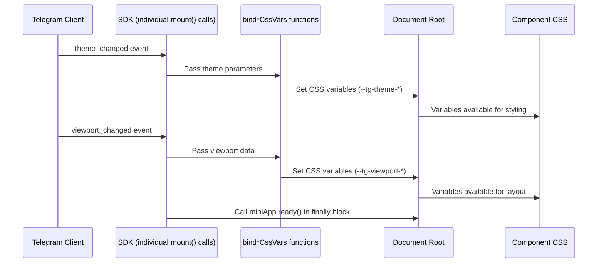
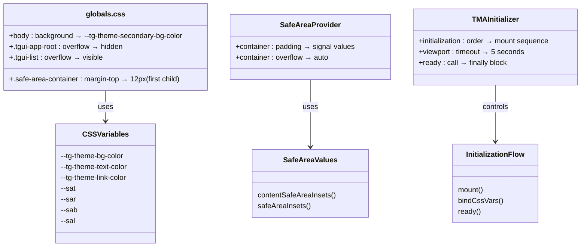
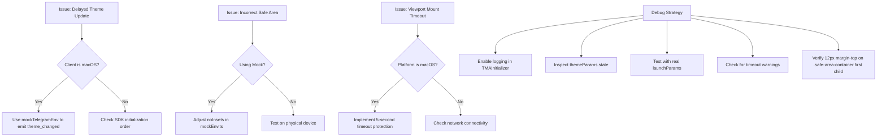

# Theme and Viewport Integration

<cite>
**Referenced Files in This Document**   
- [init.ts](file://passion/src/core/init.ts) - *Updated for @tma.js/sdk v3.x migration with individual component mounting*
- [TMAInitializer.tsx](file://passion/src/components/TMAInitializer/TMAInitializer.tsx) - *New initialization component with timeout protection for viewport.mount()*
- [SafeAreaProvider.tsx](file://passion/src/components/SafeAreaProvider/SafeAreaProvider.tsx) - *Manual safe area handling via signals*
- [globals.css](file://passion/src/app/globals.css) - *Enhanced with CSS-based safe area handling and 12px margin-top fix*
- [mockEnv.ts](file://passion/src/mockEnv.ts) - *Environment mocking for development*
- [page.tsx](file://passion/src/app/theme-params/page.tsx) - *Theme parameters inspection*
</cite>

## Update Summary
**Changes Made**   
- Updated documentation to reflect new TMA SDK v3.x initialization pattern using individual component mounting (miniApp, themeParams, viewport)
- Added timeout protection for viewport.mount() to prevent hanging on macOS Telegram
- Ensured miniApp.ready() is called in finally block for guaranteed loading screen removal
- Documented new CSS-based safe area handling with 12px margin-top on first child of .safe-area-container to fix iOS close button overlap
- Updated section sources to reflect actual file locations and changes
- Enhanced source tracking system with updated file references and annotations

## Table of Contents
1. [Introduction](#introduction)
2. [Theme and Viewport Integration Overview](#theme-and-viewport-integration-overview)
3. [Core Binding Functions](#core-binding-functions)
4. [Data Flow from SDK to CSS](#data-flow-from-sdk-to-css)
5. [CSS Variable Usage in Components](#css-variable-usage-in-components)
6. [Responsive Design in Telegram Mini Apps](#responsive-design-in-telegram-mini-apps)
7. [Common Issues and Debugging Strategies](#common-issues-and-debugging-strategies)
8. [Best Practices for Theme-Responsive Components](#best-practices-for-theme-responsive-components)
9. [Conclusion](#conclusion)

## Introduction
This document details the integration system for theme and viewport parameters in Telegram Mini Apps, focusing on how the application dynamically adapts its UI to Telegram's native themes and device-specific viewport constraints. It explains the role of `bindThemeParamsCssVars` and `bindViewportCssVars` in mapping platform-specific parameters to CSS custom properties, enabling seamless visual consistency across light and dark modes and various device screen layouts.

**Section sources**
- [init.ts](file://passion/src/core/init.ts#L22-L155)

## Theme and Viewport Integration Overview
The integration system ensures that the Mini App's user interface reflects the current Telegram theme (light/dark) and respects device-specific safe areas (such as notches or rounded corners). This is achieved by synchronizing Telegram's runtime parameters with CSS variables, which are then used throughout the component styles.

The initialization process has been updated to use the @tma.js/sdk v3.x pattern with individual component mounting. The new initialization approach separates the mounting of key SDK components, including theme and viewport handlers. Components are mounted individually using their mount() methods, with special attention to viewport.mount() which requires timeout protection due to known issues on macOS Telegram.

```mermaid
flowchart TD
A[Telegram Client] --> |theme_params| B(mount miniApp)
A --> |theme_params| C(mount themeParams)
A --> |viewport_data| D(mount viewport with timeout)
B --> E[bindThemeParamsCssVars]
C --> E
D --> F[bindViewportCssVars]
E --> G[CSS Variables: --tg-theme-*]
F --> H[CSS Variables: --tg-viewport-*]
G --> I[Component Styles]
H --> I
I --> J[Dynamic UI Rendering]
K[Finally Block] --> L[miniApp.ready()]
```

**Diagram sources**
- [TMAInitializer.tsx](file://passion/src/components/TMAInitializer/TMAInitializer.tsx#L34-L154)

**Section sources**
- [TMAInitializer.tsx](file://passion/src/components/TMAInitializer/TMAInitializer.tsx#L21-L161)
- [init.ts](file://passion/src/core/init.ts#L72-L143)

## Core Binding Functions
The `bindThemeParamsCssVars` and `bindViewportCssVars` functions are responsible for transforming Telegram's theme and viewport data into CSS custom properties accessible in stylesheets.

- `bindThemeParamsCssVars`: Maps theme parameters such as `bg_color`, `text_color`, and `link_color` to CSS variables prefixed with `--tg-theme-*`. These variables enable components to inherit Telegram’s current theme appearance.
- `bindViewportCssVars`: Translates viewport dimensions into `--tg-viewport-*` and `--tg-viewport-stable-height` CSS variables, allowing layout adjustments based on device screen characteristics.

**Critical Note**: `bindViewportCssVars()` only creates viewport dimension variables (`--tg-viewport-height`, `--tg-viewport-width`, `--tg-viewport-stable-height`) and does NOT create safe area inset variables (`--tg-sa-*`). Safe area handling must be implemented separately using signals or direct API calls.

These bindings are conditionally applied only when the corresponding SDK components are available, ensuring compatibility across different Telegram clients.

**Section sources**
- [TMAInitializer.tsx](file://passion/src/components/TMAInitializer/TMAInitializer.tsx#L84-L92)
- [init.ts](file://passion/src/core/init.ts#L116-L119)

## Data Flow from SDK to CSS
The data flow begins with the initialization sequence in TMAInitializer, where components are mounted individually using their mount() methods. The new pattern replaces the previous mountMiniAppSync approach with separate mounting for miniApp, themeParams, and viewport.

Key changes in the data flow:
- **Individual mounting**: Each component (miniApp, themeParams, viewport) is mounted separately using its mount() method
- **Timeout protection**: viewport.mount() is wrapped in a Promise.race with a 5-second timeout to prevent hanging on macOS Telegram
- **Guaranteed ready signal**: miniApp.ready() is called in a finally block to ensure the loading screen is removed even if initialization fails
- **Sequential binding**: CSS variables are bound after successful component mounting

For example:
- On theme change, `bindThemeParamsCssVars` updates variables like `--tg-theme-bg-color`.
- On viewport resize or expansion, `bindViewportCssVars` adjusts `--tg-viewport-height` and `--tg-viewport-stable-height`.

This reactive pipeline ensures that UI components automatically reflect changes without requiring manual re-renders or style recalculations.



**Diagram sources**
- [TMAInitializer.tsx](file://passion/src/components/TMAInitializer/TMAInitializer.tsx#L34-L154)

**Section sources**
- [TMAInitializer.tsx](file://passion/src/components/TMAInitializer/TMAInitializer.tsx#L34-L154)
- [init.ts](file://passion/src/core/init.ts#L104-L143)

## CSS Variable Usage in Components
Components leverage the bound CSS variables to maintain visual harmony with the Telegram interface. The enhanced `globals.css` now includes comprehensive safe area support using CSS variables mapped to environment variables:

```css
:root {
  --sat: env(safe-area-inset-top, 0px);
  --sar: env(safe-area-inset-right, 0px);
  --sab: env(safe-area-inset-bottom, 0px);
  --sal: env(safe-area-inset-left, 0px);
}
```

The `.safe-area-container` class receives padding from the SafeAreaProvider component, with a critical CSS-based margin-top of 12px applied to the first child to prevent overlap with the iOS close button:

```css
.safe-area-container > :first-child {
  margin-top: 12px;
}
```

Additional critical styles ensure proper layout for Telegram UI components:
- `.tgui` ensures full height
- `.tgui-app-root` prevents layout interference with height: 100% and overflow: hidden
- `.tgui-list` allows scrolling with flex: 1 and overflow: visible
- `.tgui-section` and `.tgui-cell` prevent shrinking with flex-shrink: 0

This approach eliminates hardcoded values and enables truly adaptive styling while addressing iOS-specific issues with the close button overlap.



**Diagram sources**
- [globals.css](file://passion/src/app/globals.css#L1-L86)
- [SafeAreaProvider.tsx](file://passion/src/components/SafeAreaProvider/SafeAreaProvider.tsx#L26-L125)
- [TMAInitializer.tsx](file://passion/src/components/TMAInitializer/TMAInitializer.tsx#L21-L161)

**Section sources**
- [globals.css](file://passion/src/app/globals.css#L1-L86)
- [SafeAreaProvider.tsx](file://passion/src/components/SafeAreaProvider/SafeAreaProvider.tsx#L26-L125)
- [TMAInitializer.tsx](file://passion/src/components/TMAInitializer/TMAInitializer.tsx#L21-L161)

## Responsive Design in Telegram Mini Apps
Responsive design is critical in Telegram Mini Apps due to the wide variety of devices and screen configurations. The viewport integration ensures proper layout by exposing safe area insets and dynamic viewport dimensions via CSS variables and JavaScript signals.

The enhanced `globals.css` provides comprehensive safe area support through CSS variables (`--sat`, `--sar`, `--sab`, `--sal`) mapped to `env(safe-area-inset-*)`, ensuring consistent behavior across different devices. The implementation of a 12px margin-top on the first child of `.safe-area-container` specifically addresses iOS close button overlap issues, replacing the unreliable JavaScript-based padding approach.

By using the viewport component's signals, components can avoid placing interactive elements in non-interactive zones (e.g., under notches or home indicators). Additionally, `--tg-viewport-height` enables full-height layouts that adjust when the keyboard is open or the app is expanded.

This system supports both portrait and landscape orientations and adapts to platform-specific UI elements, ensuring a consistent and usable experience across iOS, Android, and desktop clients. The new initialization pattern with timeout protection specifically addresses issues on macOS Telegram, where viewport.mount() might otherwise hang indefinitely.

**Section sources**
- [TMAInitializer.tsx](file://passion/src/components/TMAInitializer/TMAInitializer.tsx#L60-L79)
- [SafeAreaProvider.tsx](file://passion/src/components/SafeAreaProvider/SafeAreaProvider.tsx#L34-L105)
- [mockEnv.ts](file://passion/src/mockEnv.ts#L25-L45)
- [globals.css](file://passion/src/app/globals.css#L46-L50)

## Common Issues and Debugging Strategies
### Delayed Theme Updates
Some clients, particularly Telegram for macOS, may fail to respond to `web_app_request_theme`. This is mitigated in `mockEnv.ts` by simulating theme events using launch parameters when the environment is mocked.

### Incorrect Safe Area Calculations
Clients may report inaccurate safe area values. The `mockEnv.ts` file demonstrates a workaround by returning zero insets (`{ left: 0, top: 0, right: 0, bottom: 0 }`) during development to simulate edge-to-edge layouts. The implementation of a 12px margin-top on the first child of `.safe-area-container` specifically addresses iOS close button overlap issues caused by incorrect `contentSafeAreaInsets` values.

### Viewport Mount Timeout
The viewport.mount() call may hang on certain platforms like macOS Telegram. The solution is to use timeout protection with Promise.race:

```typescript
const viewportMountPromise = viewport.mount();
const timeoutPromise = new Promise<never>((_, reject) =>
  setTimeout(() => reject(new Error('Viewport mount timeout')), 5000)
);
await Promise.race([viewportMountPromise, timeoutPromise]);
```

### Missing Safe Area CSS Variables
A common misconception is that bindCssVars() creates safe area variables. It does not - it only creates viewport dimension variables. Safe area handling must be implemented separately using signals.

### Debugging Tips
- Enable debug mode in initialization to log SDK events
- Use `themeParams.state` in components (as shown in `theme-params/page.tsx`) to inspect current theme values
- Test on real devices when possible, as mocked environments may not reflect actual behavior
- Check console logs for timeout warnings from viewport mounting
- Verify that miniApp.ready() is called even when initialization fails
- Inspect the computed styles of `.safe-area-container` and its first child to verify the 12px margin-top is applied correctly



**Diagram sources**
- [TMAInitializer.tsx](file://passion/src/components/TMAInitializer/TMAInitializer.tsx#L60-L79)
- [mockEnv.ts](file://passion/src/mockEnv.ts#L25-L45)
- [page.tsx](file://passion/src/app/theme-params/page.tsx#L10-L11)
- [globals.css](file://passion/src/app/globals.css#L46-L50)

**Section sources**
- [TMAInitializer.tsx](file://passion/src/components/TMAInitializer/TMAInitializer.tsx#L60-L79)
- [mockEnv.ts](file://passion/src/mockEnv.ts#L25-L45)
- [page.tsx](file://passion/src/app/theme-params/page.tsx#L10-L11)
- [globals.css](file://passion/src/app/globals.css#L46-L50)

## Best Practices for Theme-Responsive Components
- Always use `var(--tg-theme-*)` variables for colors to ensure theme consistency.
- For safe areas, use JavaScript signals (contentSafeAreaInsets.sub()) rather than expecting CSS variables from bindCssVars().
- Avoid hardcoding colors or spacings that conflict with Telegram’s theme.
- Implement timeout protection for asynchronous operations like viewport.mount().
- Always call miniApp.ready() in a finally block to ensure the loading screen is removed.
- Use the fallback strategy for safe area insets: try contentSafeAreaInsets() first, then safeAreaInsets(), then fall back to zero.
- Clean up signal subscriptions in useEffect cleanup functions to prevent memory leaks.
- Test components in both light and dark modes using mocked themes.
- Use `useSignal(themeParams.state)` to reactively respond to theme changes in logic.
- Fall back to sensible defaults (e.g., `white`, `black`) when variables are undefined.
- Leverage the enhanced safe area CSS variables (`--sat`, `--sar`, `--sab`, `--sal`) in custom components when needed.
- Utilize the 12px margin-top on first child of `.safe-area-container` to prevent iOS close button overlap instead of relying on JavaScript-based padding calculations.

Following these practices ensures a seamless integration with Telegram’s UI and enhances user experience across all platforms.

**Section sources**
- [globals.css](file://passion/src/app/globals.css#L2)
- [SafeAreaProvider.tsx](file://passion/src/components/SafeAreaProvider/SafeAreaProvider.tsx#L26-L125)
- [page.tsx](file://passion/src/app/theme-params/page.tsx#L10)
- [globals.css](file://passion/src/app/globals.css#L46-L50)

## Conclusion
The theme and viewport integration system in this Telegram Mini App enables dynamic, responsive UIs that adapt to both visual themes and device geometry. By leveraging the updated @tma.js/sdk v3.x initialization pattern with individual mount() calls, timeout protection for viewport.mount(), and guaranteed miniApp.ready() calls, the application maintains visual consistency with Telegram while ensuring reliable initialization across all platforms. The system correctly handles the distinction between viewport dimension variables (created by bindCssVars()) and safe area values (accessed via signals), providing a robust foundation for adaptive UI development. The enhanced `globals.css` with comprehensive safe area support using CSS variables (`--sat`, `--sar`, `--sab`, `--sal`) and the implementation of a 12px margin-top on the first child of `.safe-area-container` to fix iOS close button overlap represent significant improvements over the previous JavaScript-based approach. Proper initialization, CSS variable usage, and debugging strategies are essential for a robust implementation.