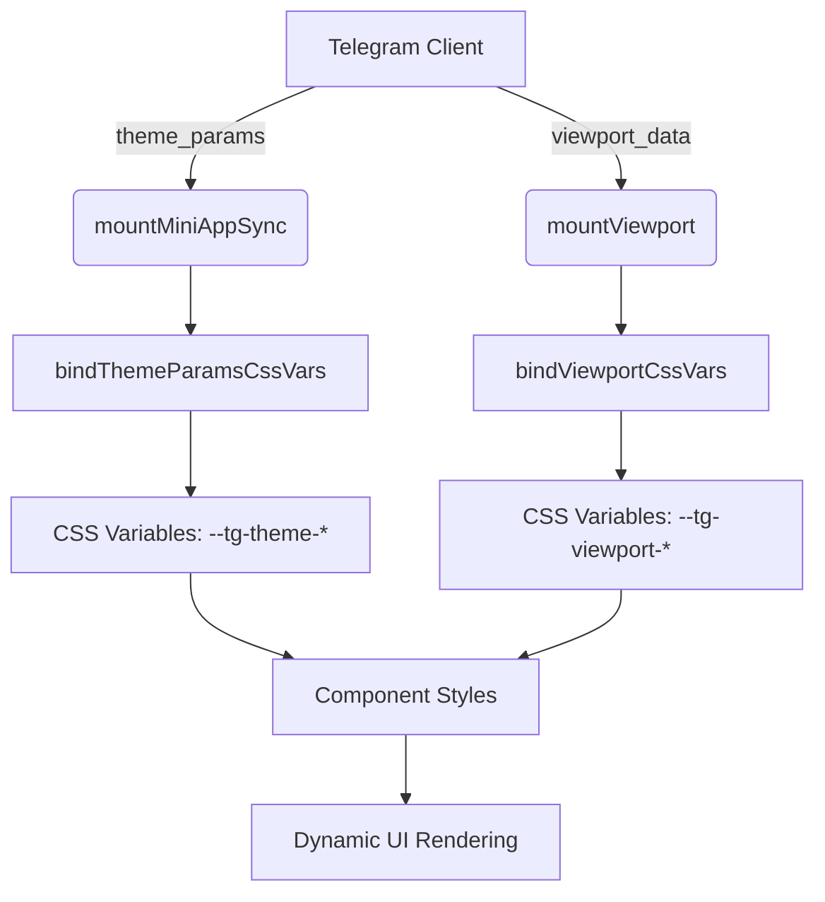
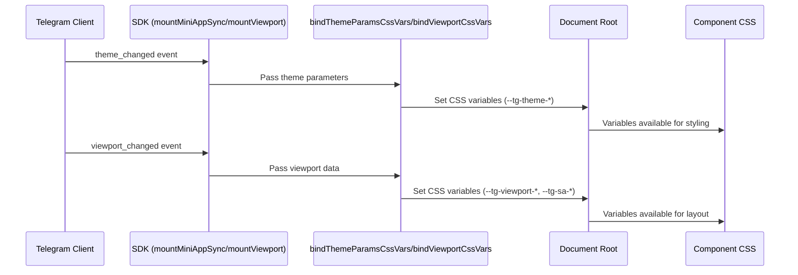
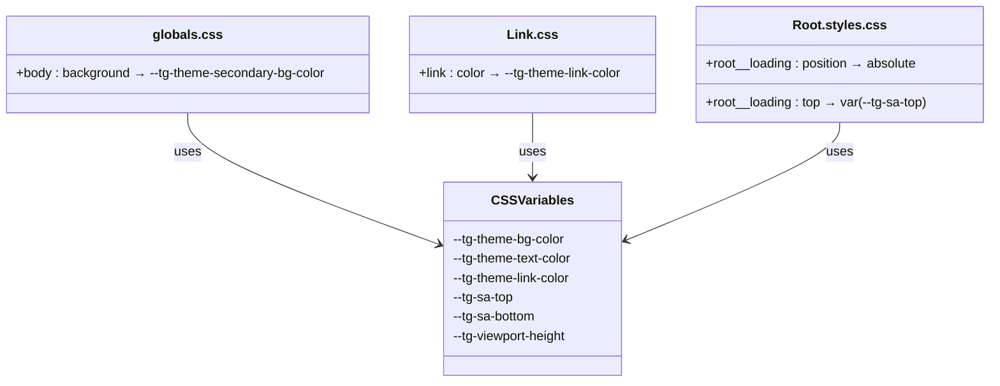

# Theme and Viewport Integration

<cite>
**Referenced Files in This Document**   
- [init.ts](file://passion/src/core/init.ts)
- [globals.css](file://passion/src/app/_assets/globals.css)
- [Link.css](file://passion/src/components/Link/Link.css)
- [styles.css](file://passion/src/components/Root/styles.css)
- [mockEnv.ts](file://passion/src/mockEnv.ts)
- [page.tsx](file://passion/src/app/theme-params/page.tsx)
</cite>

## Table of Contents
1. [Introduction](#introduction)
2. [Theme and Viewport Integration Overview](#theme-and-viewport-integration-overview)
3. [Core Binding Functions](#core-binding-functions)
4. [Data Flow from SDK to CSS](#data-flow-from-sdk-to-css)
5. [CSS Variable Usage in Components](#css-variable-usage-in-components)
6. [Responsive Design in Telegram Mini Apps](#responsive-design-in-telegram-mini-apps)
7. [Common Issues and Debugging Strategies](#common-issues-and-debugging-strategies)
8. [Best Practices for Theme-Responsive Components](#best-practices-for-theme-responsive-components)
9. [Conclusion](#conclusion)

## Introduction
This document details the integration system for theme and viewport parameters in Telegram Mini Apps, focusing on how the application dynamically adapts its UI to Telegram's native themes and device-specific viewport constraints. It explains the role of `bindThemeParamsCssVars` and `bindViewportCssVars` in mapping platform-specific parameters to CSS custom properties, enabling seamless visual consistency across light and dark modes and various device screen layouts.

**Section sources**
- [init.ts](file://passion/src/core/init.ts#L1-L83)

## Theme and Viewport Integration Overview
The integration system ensures that the Mini App's user interface reflects the current Telegram theme (light/dark) and respects device-specific safe areas (such as notches or rounded corners). This is achieved by synchronizing Telegram's runtime parameters with CSS variables, which are then used throughout the component styles.

The initialization process in `init.ts` orchestrates the mounting of key SDK components, including theme and viewport handlers. When available, `mountMiniAppSync` and `mountViewport` are invoked to establish real-time communication with the Telegram client, followed by binding functions that expose these parameters as CSS variables.



**Diagram sources**
- [init.ts](file://passion/src/core/init.ts#L72-L80)

**Section sources**
- [init.ts](file://passion/src/core/init.ts#L68-L82)

## Core Binding Functions
The `bindThemeParamsCssVars` and `bindViewportCssVars` functions are responsible for transforming Telegram's theme and viewport data into CSS custom properties accessible in stylesheets.

- `bindThemeParamsCssVars`: Maps theme parameters such as `bg_color`, `text_color`, and `link_color` to CSS variables prefixed with `--tg-theme-*`. These variables enable components to inherit Telegram’s current theme appearance.
- `bindViewportCssVars`: Translates viewport dimensions and safe area insets into `--tg-viewport-*` and `--tg-sa-*` CSS variables, allowing layout adjustments based on device screen characteristics.

These bindings are conditionally applied only when the corresponding SDK components are available, ensuring compatibility across different Telegram clients.

**Section sources**
- [init.ts](file://passion/src/core/init.ts#L74-L79)

## Data Flow from SDK to CSS
The data flow begins with the initialization sequence in `init.ts`, where `mountMiniAppSync` and `mountViewport` establish connections to Telegram's environment. Once mounted, the binding functions subscribe to theme and viewport updates, dynamically updating the document root's CSS variables.

For example:
- On theme change, `bindThemeParamsCssVars` updates variables like `--tg-theme-bg-color`.
- On viewport resize or expansion, `bindViewportCssVars` adjusts `--tg-viewport-height` and safe area variables like `--tg-sa-bottom`.

This reactive pipeline ensures that UI components automatically reflect changes without requiring manual re-renders or style recalculations.



**Diagram sources**
- [init.ts](file://passion/src/core/init.ts#L72-L80)

**Section sources**
- [init.ts](file://passion/src/core/init.ts#L72-L80)

## CSS Variable Usage in Components
Components leverage the bound CSS variables to maintain visual harmony with the Telegram interface. For instance:

- The `globals.css` file sets the body background using `var(--tg-theme-secondary-bg-color, white)`, falling back to white if the variable is undefined.
- The `Link.css` component uses `color: var(--tg-theme-link-color)` to ensure links match the native theme’s accent color.
- Layout containers can use `env()` or `var()` functions with safe area variables (e.g., `padding-bottom: max(env(safe-area-inset-bottom), var(--tg-sa-bottom))`) to avoid content overlap.

This approach eliminates hardcoded values and enables truly adaptive styling.



**Diagram sources**
- [globals.css](file://passion/src/app/_assets/globals.css#L1-L5)
- [Link.css](file://passion/src/components/Link/Link.css#L1-L4)
- [styles.css](file://passion/src/components/Root/styles.css#L1-L10)

**Section sources**
- [globals.css](file://passion/src/app/_assets/globals.css#L1-L5)
- [Link.css](file://passion/src/components/Link/Link.css#L1-L4)
- [styles.css](file://passion/src/components/Root/styles.css#L1-L10)

## Responsive Design in Telegram Mini Apps
Responsive design is critical in Telegram Mini Apps due to the wide variety of devices and screen configurations. The viewport integration ensures proper layout by exposing safe area insets and dynamic viewport dimensions via CSS variables.

By using `--tg-sa-*` variables, components can avoid placing interactive elements in non-interactive zones (e.g., under notches or home indicators). Additionally, `--tg-viewport-height` enables full-height layouts that adjust when the keyboard is open or the app is expanded.

This system supports both portrait and landscape orientations and adapts to platform-specific UI elements, ensuring a consistent and usable experience across iOS, Android, and desktop clients.

**Section sources**
- [init.ts](file://passion/src/core/init.ts#L77-L80)
- [mockEnv.ts](file://passion/src/mockEnv.ts#L25-L45)

## Common Issues and Debugging Strategies
### Delayed Theme Updates
Some clients, particularly Telegram for macOS, may fail to respond to `web_app_request_theme`. This is mitigated in `mockEnv.ts` by simulating theme events using launch parameters when the environment is mocked.

### Incorrect Safe Area Calculations
Clients may report inaccurate safe area values. The `mockEnv.ts` file demonstrates a workaround by returning zero insets (`{ left: 0, top: 0, right: 0, bottom: 0 }`) during development to simulate edge-to-edge layouts.

### Debugging Tips
- Enable debug mode in `init.ts` to log SDK events.
- Use `themeParams.state` in components (as shown in `theme-params/page.tsx`) to inspect current theme values.
- Test on real devices when possible, as mocked environments may not reflect actual behavior.

```mermaid
flowchart TD
A[Issue: Delayed Theme Update] --> B{Client is macOS?}
B --> |Yes| C[Use mockTelegramEnv to emit theme_changed]
B --> |No| D[Check SDK initialization order]
E[Issue: Incorrect Safe Area] --> F{Using Mock?}
F --> |Yes| G[Adjust noInsets in mockEnv.ts]
F --> |No| H[Test on physical device]
I[Debug Strategy] --> J[Enable setDebug(true)]
I --> K[Inspect themeParams.state]
I --> L[Test with real launchParams]
```

**Diagram sources**
- [init.ts](file://passion/src/core/init.ts#L39-L64)
- [mockEnv.ts](file://passion/src/mockEnv.ts#L25-L45)
- [page.tsx](file://passion/src/app/theme-params/page.tsx#L10-L11)

**Section sources**
- [init.ts](file://passion/src/core/init.ts#L39-L64)
- [mockEnv.ts](file://passion/src/mockEnv.ts#L25-L45)
- [page.tsx](file://passion/src/app/theme-params/page.tsx#L10-L11)

## Best Practices for Theme-Responsive Components
- Always use `var(--tg-theme-*)` variables for colors to ensure theme consistency.
- Combine `env(safe-area-inset-*)` with `var(--tg-sa-*)` for maximum compatibility.
- Avoid hardcoding colors or spacings that conflict with Telegram’s theme.
- Test components in both light and dark modes using mocked themes.
- Use `useSignal(themeParams.state)` to reactively respond to theme changes in logic.
- Fall back to sensible defaults (e.g., `white`, `black`) when variables are undefined.

Following these practices ensures a seamless integration with Telegram’s UI and enhances user experience across all platforms.

**Section sources**
- [globals.css](file://passion/src/app/_assets/globals.css#L2)
- [Link.css](file://passion/src/components/Link/Link.css#L2)
- [page.tsx](file://passion/src/app/theme-params/page.tsx#L10)

## Conclusion
The theme and viewport integration system in this Telegram Mini App enables dynamic, responsive UIs that adapt to both visual themes and device geometry. By leveraging `bindThemeParamsCssVars` and `bindViewportCssVars`, the application maintains visual consistency with Telegram while ensuring proper layout across diverse devices. Proper initialization, CSS variable usage, and debugging strategies are essential for a robust implementation.