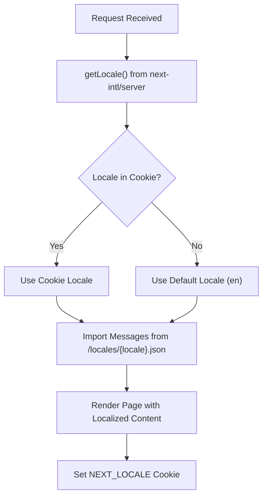

# Deployment

<cite>
**Referenced Files in This Document**   
- [next.config.ts](file://passion/next.config.ts)
- [package.json](file://passion/package.json)
- [config.ts](file://passion/src/core/i18n/config.ts)
- [i18n.ts](file://passion/src/core/i18n/i18n.ts)
- [layout.tsx](file://passion/src/app/layout.tsx)
- [README.md](file://passion/README.md)
</cite>

## Table of Contents
1. [Production Build Process](#production-build-process)
2. [Starting the Server](#starting-the-server)
3. [Deployment with Vercel](#deployment-with-vercel)
4. [Environment Variables Configuration](#environment-variables-configuration)
5. [SSL Certificate Requirements](#ssl-certificate-requirements)
6. [Telegram Mini App Deployment](#telegram-mini-app-deployment)
7. [i18n Routing Configuration](#i18n-routing-configuration)
8. [Troubleshooting Common Issues](#troubleshooting-common-issues)
9. [Monitoring and Maintenance](#monitoring-and-maintenance)

## Production Build Process

The production build process for this Next.js application is initiated using the `pnpm run build` command, which triggers Next.js's optimized build system. This process compiles and bundles the application for production deployment, including code minification, tree shaking, and static asset optimization. The build configuration is defined in the `next.config.ts` file, which integrates the `next-intl` plugin for internationalization support.

The build process generates optimized static assets and server-side rendered components, preparing the application for efficient deployment. During the build, Next.js analyzes the application structure, optimizes imports, and creates a production-ready output in the `.next` directory.

**Section sources**
- [package.json](file://passion/package.json#L8)
- [next.config.ts](file://passion/next.config.ts#L1-L9)

## Starting the Server

After building the application, the production server is started using the `pnpm run start` command. This command launches the Next.js server in production mode, serving the pre-built application from the `.next` directory. The server handles incoming requests, manages routing, and serves both static assets and server-side rendered content.

The start script is configured in the `package.json` file and is designed to work with the output of the build process. When deployed, this command should be used to run the application in the production environment.

**Section sources**
- [package.json](file://passion/package.json#L9)

## Deployment with Vercel

Vercel is the recommended platform for deploying this Next.js application, as it provides seamless integration with the Next.js framework and offers optimized performance for server-side rendered applications. The deployment process is streamlined through Vercel's platform, which automatically detects the Next.js configuration and applies appropriate build settings.

When deploying to Vercel, the platform automatically runs the `build` script defined in `package.json` and starts the server using the `start` command. Vercel's edge network ensures low-latency access to the application globally, making it an ideal choice for Telegram Mini Apps that require fast response times.

The project's `next.config.ts` file is properly configured for Vercel deployment, with the `next-intl` plugin correctly set up to handle internationalization during the build process.

**Section sources**
- [README.md](file://passion/README.md#L127-L135)
- [next.config.ts](file://passion/next.config.ts#L4)

## Environment Variables Configuration

Environment variables should be configured differently for production and development environments. In development, environment variables can be defined in `.env` files, but these files are not present in the repository as indicated by the search results. In production, environment variables should be configured through the deployment platform's interface (such as Vercel's environment variables settings) rather than being committed to the repository.

The application uses Next.js's built-in environment variable system, which securely handles sensitive data by prefixing variables with `NEXT_PUBLIC_` for client-side access or keeping them server-side only. This separation ensures that sensitive configuration remains secure while allowing necessary variables to be accessible to the client.

**Section sources**
- [README.md](file://passion/README.md#L127-L135)

## SSL Certificate Requirements

The self-signed SSL certificate approach, enabled by the `dev:https` script in `package.json`, is strictly for development purposes only. This script uses Next.js's `--experimental-https` flag to serve the application over HTTPS with a self-signed certificate, allowing developers to test HTTPS functionality locally.

In production deployments, valid SSL certificates are required. Platforms like Vercel automatically provision and manage valid SSL certificates for custom domains, ensuring secure HTTPS connections without additional configuration. When deploying a Telegram Mini App, a valid HTTPS URL with a trusted certificate is mandatory for registration with @BotFather.

**Section sources**
- [package.json](file://passion/package.json#L7)
- [README.md](file://passion/README.md#L98-L125)

## Telegram Mini App Deployment

Deploying a Telegram Mini App requires a public HTTPS URL that can be registered with @BotFather. After building and deploying the application, the production URL must be submitted to @BotFather to configure the Mini App. The application is designed to function both inside and outside Telegram, with the `useTelegramMock` hook providing environment simulation during development.

For production deployment, ensure that the application is accessible via a valid domain with HTTPS. The Telegram Mini App will inherit the appearance and behavior defined in the web application, with Telegram providing the container environment. The application's responsive design and Telegram UI components ensure consistent appearance across different Telegram clients.

**Section sources**
- [README.md](file://passion/README.md#L93-L125)

## i18n Routing Configuration

The application's internationalization (i18n) routing is configured through the `next-intl` plugin in `next.config.ts`. The plugin is initialized with the path to `i18n.ts`, which defines the request configuration for handling multiple languages. The supported locales are defined in `config.ts` as `['en', 'ru']`, with 'en' as the default locale.

The i18n configuration automatically handles locale detection from cookies (`NEXT_LOCALE`) and provides the appropriate messages from the JSON files in the `public/locales` directory. The `layout.tsx` file uses `getLocale()` to determine the current locale and set the HTML `lang` attribute accordingly, ensuring proper accessibility and SEO.

**Diagram sources**
- [next.config.ts](file://passion/next.config.ts#L4)
- [i18n.ts](file://passion/src/core/i18n/i18n.ts#L7-L17)
- [config.ts](file://passion/src/core/i18n/config.ts#L1-L5)
- [layout.tsx](file://passion/src/app/layout.tsx#L18)

**Section sources**
- [next.config.ts](file://passion/next.config.ts#L4)
- [i18n.ts](file://passion/src/core/i18n/i18n.ts#L3)
- [config.ts](file://passion/src/core/i18n/config.ts#L1-L5)

## Troubleshooting Common Issues

### Static Asset Loading
If static assets are not loading correctly in production, verify that the `public` directory structure is preserved during deployment. Ensure that assets referenced in code use the correct path prefix (e.g., `/locales/en.json` rather than relative paths).

### Environment Variable Access
When environment variables are not accessible, check that server-side variables do not use the `NEXT_PUBLIC_` prefix unless they need to be exposed to the client. Verify that all required environment variables are configured in the deployment platform's settings.

### Server-Side Rendering Compatibility
For server-side rendering issues, ensure that all components that rely on browser-specific APIs are conditionally rendered or wrapped in client components. The application's use of `use server` directives in server actions helps prevent client-side execution of server-only code.

**Section sources**
- [README.md](file://passion/README.md#L77-L85)
- [i18n.ts](file://passion/src/core/i18n/i18n.ts#L1-L2)

## Monitoring and Maintenance

For optimal application performance and reliability, implement monitoring solutions to track application health, error rates, and user engagement. Regular maintenance should include dependency updates, security audits, and performance optimization. The application's use of modern Next.js features and well-structured codebase facilitates ongoing maintenance and feature development.

Following Next.js deployment best practices and leveraging Vercel's built-in monitoring tools can help maintain a stable and performant Telegram Mini App. Regularly review the [Next.js deployment documentation](https://nextjs.org/docs/deployment) for updates and new features that can improve the deployment process.

**Section sources**
- [README.md](file://passion/README.md#L134-L135)