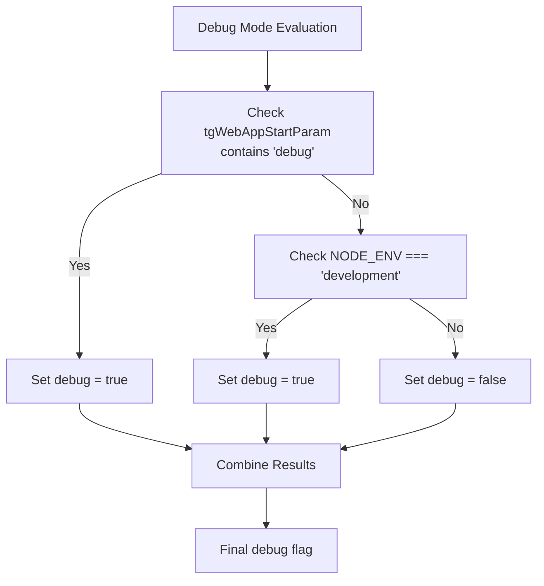
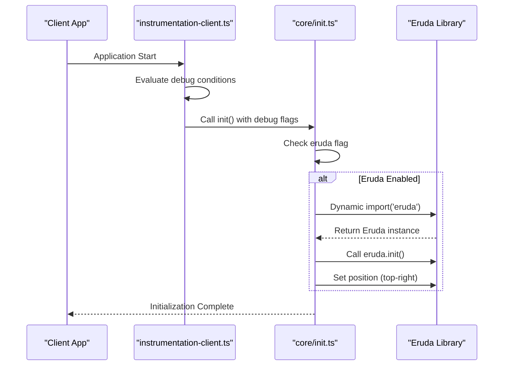
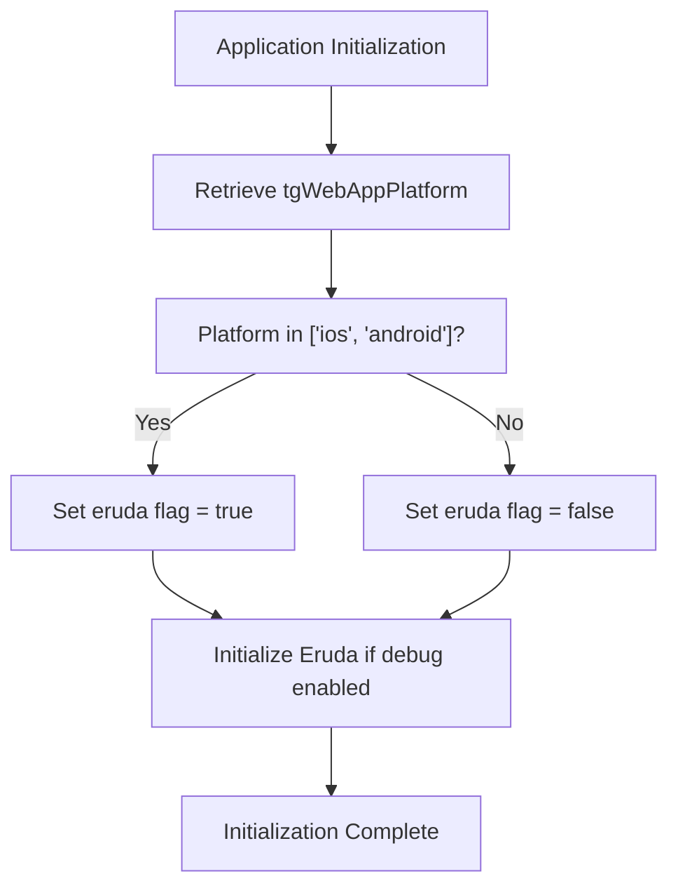

# Debugging Tools

<cite>
**Referenced Files in This Document**   
- [instrumentation-client.ts](file://passion/src/instrumentation-client.ts)
- [core/init.ts](file://passion/src/core/init.ts)
- [pnpm-lock.yaml](file://passion/pnpm-lock.yaml)
</cite>

## Table of Contents
1. [Introduction](#introduction)
2. [Debug Mode Detection](#debug-mode-detection)
3. [Eruda Initialization Flow](#eruda-initialization-flow)
4. [Platform-Specific Debugging](#platform-specific-debugging)
5. [Benefits of Mobile Debugging Console](#benefits-of-mobile-debugging-console)
6. [Limitations and Considerations](#limitations-and-considerations)
7. [Troubleshooting Guide](#troubleshooting-guide)

## Introduction
This document details the implementation of debugging tools in the Telegram Mini Apps framework, with a focus on Eruda integration. Eruda serves as a mobile debugging console that enables developers to inspect variables, monitor network requests, and view errors directly on iOS and Android devices. The system implements conditional loading logic to ensure debugging tools are only activated when appropriate, optimizing performance and user experience.

**Section sources**
- [instrumentation-client.ts](file://passion/src/instrumentation-client.ts#L1-L25)
- [core/init.ts](file://passion/src/core/init.ts#L1-L83)

## Debug Mode Detection
The debugging system determines debug mode through a dual-condition evaluation in `instrumentation-client.ts`. The debug flag is set to true when either of two conditions is met: the presence of 'debug' in the `tgWebAppStartParam` parameter or when `NODE_ENV` equals 'development'. This dual approach provides flexibility for both runtime parameter-based activation and environment-based development mode detection.

The implementation retrieves launch parameters using `retrieveLaunchParams()` from the Telegram Apps SDK, extracting the platform information and start parameters. This allows for dynamic debugging configuration based on both deployment environment and user-specific parameters, enabling targeted debugging scenarios without affecting production users.

**Diagram sources**
- [instrumentation-client.ts](file://passion/src/instrumentation-client.ts#L12-L14)

**Section sources**
- [instrumentation-client.ts](file://passion/src/instrumentation-client.ts#L8-L14)

## Eruda Initialization Flow
The Eruda initialization process follows a structured flow from parameter evaluation to conditional import. The debug and eruda flags are passed from `instrumentation-client.ts` to the `init` function in `core/init.ts`, where the actual Eruda integration occurs. This separation of concerns ensures that debug configuration is determined at the instrumentation level while the implementation details remain encapsulated within the core initialization module.

In `core/init.ts`, the eruda flag triggers a dynamic import of the Eruda library using a promise-based import statement. This approach prevents the debugging library from being bundled with the main application code when not needed, reducing bundle size and improving load performance. The conditional execution pattern `options.eruda && void import('eruda')` ensures that the import only occurs when the eruda flag is true, maintaining optimal performance in non-debug environments.

**Diagram sources**
- [instrumentation-client.ts](file://passion/src/instrumentation-client.ts#L17-L21)
- [core/init.ts](file://passion/src/core/init.ts#L29-L34)

**Section sources**
- [instrumentation-client.ts](file://passion/src/instrumentation-client.ts#L17-L21)
- [core/init.ts](file://passion/src/core/init.ts#L29-L34)

## Platform-Specific Debugging
The system implements platform-specific debugging by restricting Eruda initialization to mobile platforms (iOS and Android) only. This design decision prevents unnecessary overhead on desktop environments where standard browser developer tools are readily available. The platform check `['ios', 'android'].includes(platform)` ensures that the eruda flag is only set to true when running on supported mobile platforms, even if debug mode is otherwise enabled.

This selective activation strategy optimizes resource usage by avoiding the loading of debugging tools on platforms where they are not needed. Desktop users benefit from reduced bundle size and faster load times, while mobile developers gain access to essential debugging capabilities directly within the Telegram Mini App environment. The implementation leverages the `tgWebAppPlatform` parameter from Telegram's launch parameters to accurately detect the current platform.

**Diagram sources**
- [instrumentation-client.ts](file://passion/src/instrumentation-client.ts#L19)
- [core/init.ts](file://passion/src/core/init.ts#L29)

**Section sources**
- [instrumentation-client.ts](file://passion/src/instrumentation-client.ts#L11-L19)

## Benefits of Mobile Debugging Console
The integration of Eruda as an in-app console provides significant advantages for mobile development and debugging. Developers can inspect variables, monitor network requests, and view console errors directly on mobile devices without requiring physical connections to development machines. This capability is particularly valuable for debugging issues that are specific to mobile environments, such as touch interactions, screen size constraints, and mobile-specific browser behaviors.

The debugging console enhances productivity by enabling real-time inspection of application state and behavior within the actual user environment. This immediate feedback loop allows for faster identification and resolution of issues, reducing the development cycle time. The ability to position the console in the top-right corner of the screen (`eruda.position({ x: window.innerWidth - 50, y: 0 })`) ensures it remains accessible without obstructing the main application interface.

**Section sources**
- [core/init.ts](file://passion/src/core/init.ts#L31-L33)

## Limitations and Considerations
While the Eruda integration provides valuable debugging capabilities, several limitations and considerations must be acknowledged. The primary performance impact comes from the additional bundle size and runtime overhead of the debugging library, which is why it is restricted to mobile platforms and debug modes. In production builds, the conditional loading ensures Eruda is not included, preventing any performance degradation for end users.

Compatibility with different Telegram clients may vary, as some clients might have restrictions on script execution or DOM manipulation that could affect Eruda's functionality. Additionally, the visibility of debugging tools in production builds is prevented by the strict conditional loading logic, ensuring that debugging capabilities are only available when explicitly enabled through development environment settings or debug parameters.

**Section sources**
- [instrumentation-client.ts](file://passion/src/instrumentation-client.ts#L12-L14)
- [core/init.ts](file://passion/src/core/init.ts#L29-L34)

## Troubleshooting Guide
When encountering issues with Eruda integration, several common problems and solutions should be considered. If Eruda fails to load, verify that the debug conditions are properly met: either 'debug' is present in the start parameters or the environment is set to development mode. Additionally, confirm that the application is running on a supported mobile platform (iOS or Android).

For console overlay conflicts, check the positioning configuration in `core/init.ts` and adjust the coordinates if necessary to prevent obstruction of critical UI elements. When debugging in non-mobile environments, remember that Eruda is intentionally disabled on desktop platforms; use standard browser developer tools instead. Ensure that the Eruda package is properly installed and referenced in the project dependencies, as verified in the `pnpm-lock.yaml` file.

**Section sources**
- [instrumentation-client.ts](file://passion/src/instrumentation-client.ts#L8-L25)
- [core/init.ts](file://passion/src/core/init.ts#L29-L34)
- [pnpm-lock.yaml](file://passion/pnpm-lock.yaml#L20-L22)