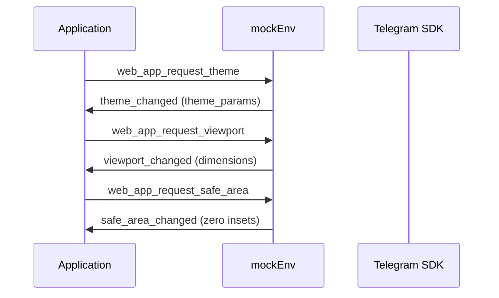
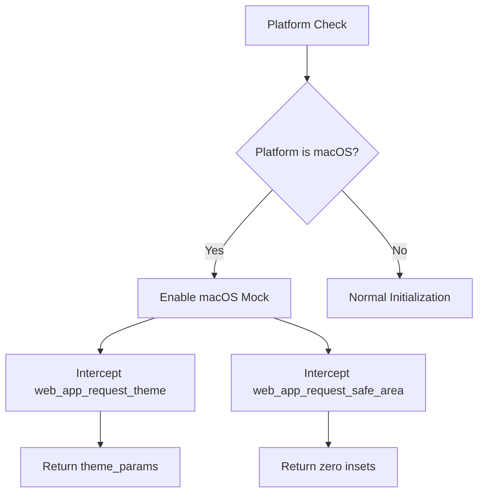
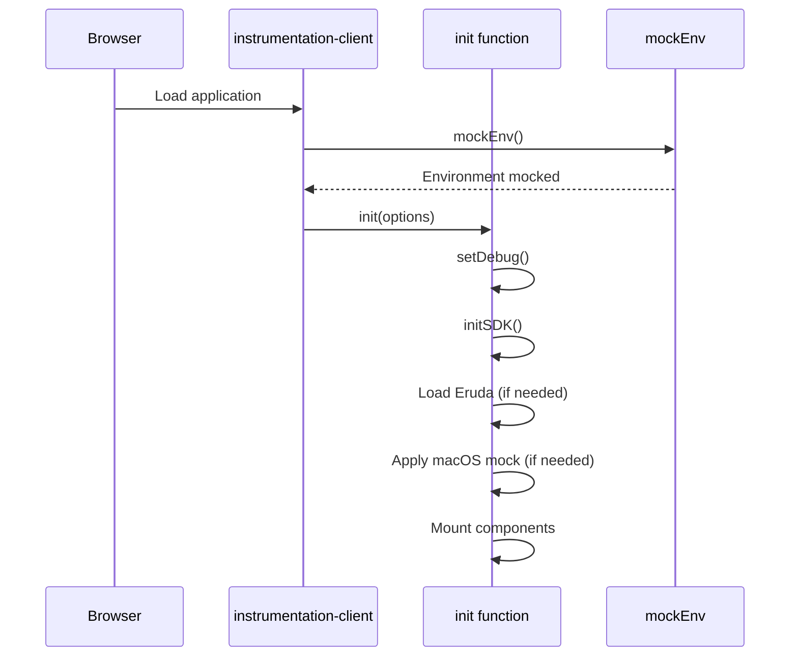

# Development Environment

<cite>
**Referenced Files in This Document**   
- [mockEnv.ts](file://passion/src/mockEnv.ts)
- [instrumentation-client.ts](file://passion/src/instrumentation-client.ts)
- [core/init.ts](file://passion/src/core/init.ts)
- [package.json](file://passion/package.json)
- [README.md](file://passion/README.md)
</cite>

## Table of Contents
1. [Mocking the Telegram Environment](#mocking-the-telegram-environment)
2. [Event Interception and Simulation](#event-interception-and-simulation)
3. [macOS Environment Simulation](#macos-environment-simulation)
4. [Initialization Control and Debugging](#initialization-control-and-debugging)
5. [HTTPS Development with Self-Signed Certificates](#https-development-with-self-signed-certificates)
6. [Development Limitations and Troubleshooting](#development-limitations-and-troubleshooting)

## Mocking the Telegram Environment

The development environment enables testing of Telegram Mini Apps outside the Telegram client through the `mockEnv` function in `src/mockEnv.ts`. This function conditionally activates only during development mode (`NODE_ENV === 'development'`) and uses `isTMA('complete')` to detect whether the app is running within a genuine Telegram environment. If not, it mocks the environment using `mockTelegramEnv` from `@telegram-apps/sdk-react`.

The mock environment simulates essential Telegram Mini App behaviors by providing predefined launch parameters and theme configurations. These include a comprehensive `themeParams` object that defines color schemes matching Telegram's dark theme, ensuring visual consistency during development. The mocked launch parameters include `tgWebAppThemeParams`, `tgWebAppData`, `tgWebAppVersion`, and `tgWebAppPlatform`, allowing the application to function as if it were launched from Telegram Desktop (`tdesktop`).

This mocking mechanism is tree-shaken during production builds, ensuring it does not affect the final bundle. A console warning is displayed during development to remind developers that the environment is being mocked and that this behavior should never be used in production.

**Section sources**
- [mockEnv.ts](file://passion/src/mockEnv.ts#L5-L80)

## Event Interception and Simulation

The `mockEnv` function intercepts and simulates key Telegram Mini App events through its `onEvent` handler. When the application requests specific environment information, the mock environment responds with simulated data:

- **Theme Requests**: When `web_app_request_theme` is called, the mock responds with a `theme_changed` event containing the predefined `themeParams`. This allows components to react to theme changes as they would in a real Telegram environment.
  
- **Viewport Requests**: The `web_app_request_viewport` event triggers a `viewport_changed` event with current window dimensions (`window.innerHeight`, `window.innerWidth`) and stable expansion state, enabling responsive layout testing.

- **Safe Area Requests**: Both `web_app_request_content_safe_area` and `web_app_request_safe_area` events are handled by returning zero insets (`{ left: 0, top: 0, bottom: 0, right: 0 }`), simplifying layout development by eliminating device-specific safe area complications during initial development phases.

This event interception mechanism allows developers to test SDK features like theme adaptation and responsive layouts without requiring a Telegram client, significantly accelerating the development workflow.

**Diagram sources**
- [mockEnv.ts](file://passion/src/mockEnv.ts#L27-L46)

**Section sources**
- [mockEnv.ts](file://passion/src/mockEnv.ts#L27-L46)

## macOS Environment Simulation

The application includes special handling for macOS through conditional logic in the `init` function located in `src/core/init.ts`. When `mockForMacOS` is enabled (determined by the platform being `macos`), additional mocking is applied to address known bugs in the Telegram for macOS client.

The macOS-specific mock addresses two critical issues:
1. **Theme Request Failures**: The macOS client sometimes fails to respond to `web_app_request_theme` requests. The mock ensures consistent theme delivery by either using launch parameters on the first request or retrieving the current theme state for subsequent requests.
2. **Incorrect Safe Area Events**: The macOS client generates incorrect `web_app_request_safe_area` events. The mock overrides this by always returning zero insets, providing predictable behavior during development.

The implementation uses a `firstThemeSent` flag to differentiate between initial and subsequent theme requests, ensuring proper initialization sequence. This targeted mocking allows developers to work around platform-specific bugs while maintaining compatibility with the broader Telegram ecosystem.

**Diagram sources**
- [core/init.ts](file://passion/src/core/init.ts#L39-L65)

**Section sources**
- [core/init.ts](file://passion/src/core/init.ts#L36-L65)
- [instrumentation-client.ts](file://passion/src/instrumentation-client.ts#L20)

## Initialization Control and Debugging

The `instrumentation-client.ts` file orchestrates the entire initialization process, determining when and how the application initializes based on the runtime environment. It first calls `mockEnv()` to establish the development environment, then retrieves launch parameters to configure initialization options.

The initialization process is controlled by three key parameters:
- **Debug Mode**: Enabled when the start parameter includes 'debug' or when in development mode
- **Eruda Debugger**: Conditionally loaded when debug mode is active and the platform is iOS or Android
- **macOS Mocking**: Activated when the platform is detected as 'macos'

Eruda, a mobile-friendly debugging console, is dynamically imported and initialized when appropriate. It's positioned in the top-right corner of the screen for easy access during mobile testing. This conditional loading ensures debugging tools are only included when needed, preventing performance impacts in production.

The initialization sequence follows a strict order: environment mocking → launch parameter retrieval → debug configuration → component mounting, ensuring all dependencies are properly established before the application becomes interactive.

**Diagram sources**
- [instrumentation-client.ts](file://passion/src/instrumentation-client.ts#L8-L21)
- [core/init.ts](file://passion/src/core/init.ts#L20-L27)

**Section sources**
- [instrumentation-client.ts](file://passion/src/instrumentation-client.ts#L8-L25)
- [core/init.ts](file://passion/src/core/init.ts#L20-L35)

## HTTPS Development with Self-Signed Certificates

For testing within Telegram, the application provides the `dev:https` script defined in `package.json`. This script uses Next.js's experimental HTTPS support to serve the application over HTTPS with self-signed certificates, which is required for Telegram to load Mini Apps.

The script enables developers to test the application in a real Telegram environment by serving it at `https://localhost:3000`. When accessing this URL, browsers display a security warning due to the self-signed certificate, which can be safely bypassed during development. The README explicitly instructs developers to use `https://127.0.0.1:3000` when configuring the bot with @BotFather, as `localhost` is not accepted.

This HTTPS capability bridges the gap between local development and real-world deployment, allowing developers to verify functionality in the actual Telegram client while maintaining the convenience of local development. The self-signed certificate approach eliminates the need for complex SSL configuration during the development phase.

**Section sources**
- [package.json](file://passion/package.json#L7)
- [README.md](file://passion/README.md#L98-L125)

## Development Limitations and Troubleshooting

While the mock environment provides extensive development capabilities, several limitations exist:

1. **Platform-Specific Behavior**: The mock cannot perfectly replicate all Telegram client behaviors, particularly around native integrations and hardware-specific features.
2. **Authentication Validation**: The mocked `tgWebAppData` uses placeholder values that won't pass server-side validation, requiring real init data for authentication testing.
3. **Performance Differences**: Development performance may differ significantly from the actual Telegram client, especially on mobile devices.

Common issues and their solutions include:

- **Failed Mock Initialization**: Ensure `NODE_ENV` is set to 'development'. The mock will not activate in production mode.
- **SSL Errors with dev:https**: Bypass the browser security warning by clicking "Proceed to localhost (unsafe)". Ensure you're using `127.0.0.1:3000` rather than `localhost:3000` when configuring @BotFather.
- **Missing Eruda Console**: Verify the platform is iOS or Android and debug mode is enabled. The console won't load on desktop platforms.
- **Theme Not Applying**: Check that `web_app_request_theme` events are being properly intercepted and that the theme parameters match expected formats.

Developers should regularly test in the actual Telegram client to catch environment-specific issues that the mock environment cannot replicate.

**Section sources**
- [mockEnv.ts](file://passion/src/mockEnv.ts#L6-L80)
- [README.md](file://passion/README.md#L77-L85)
- [core/init.ts](file://passion/src/core/init.ts#L36-L65)