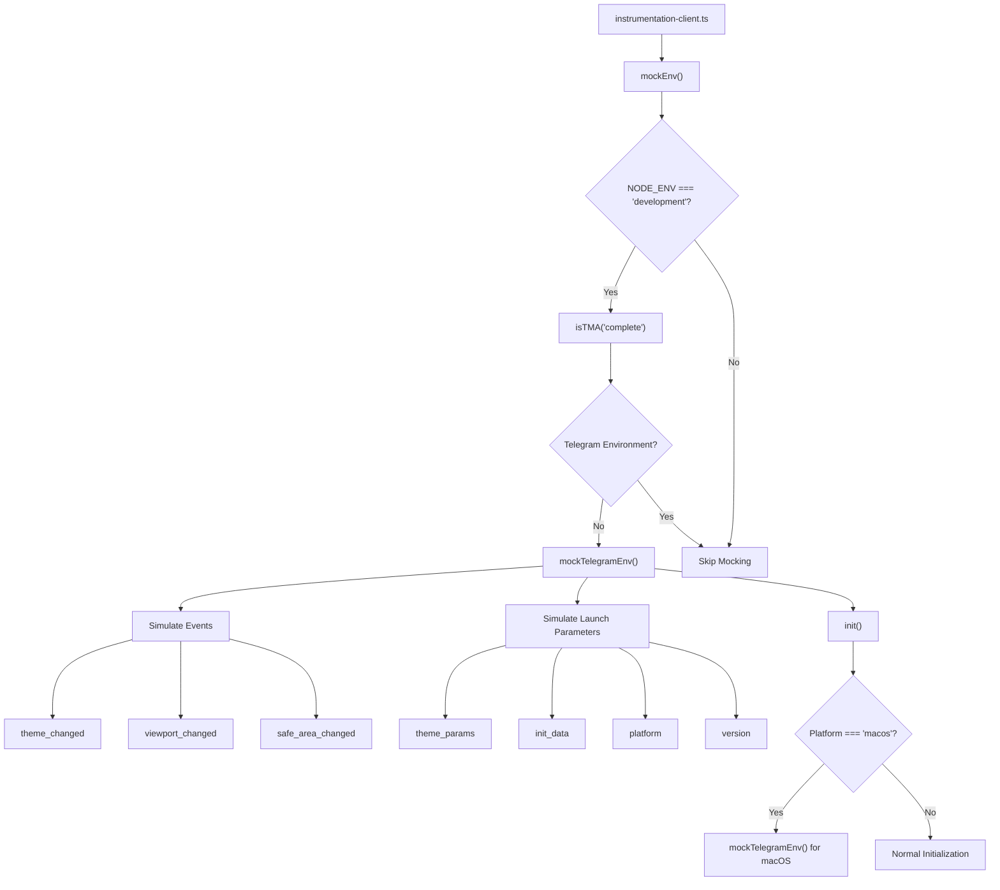
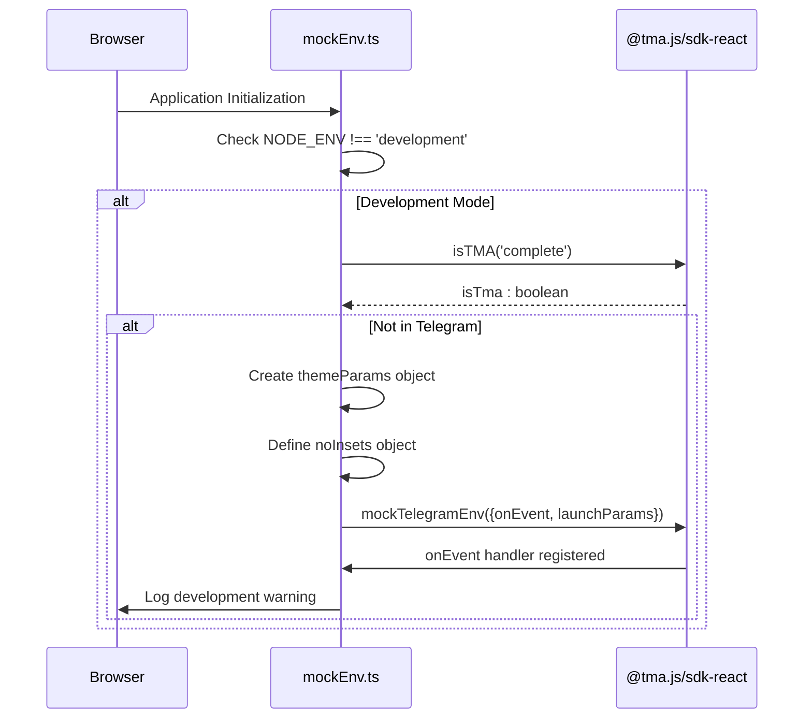
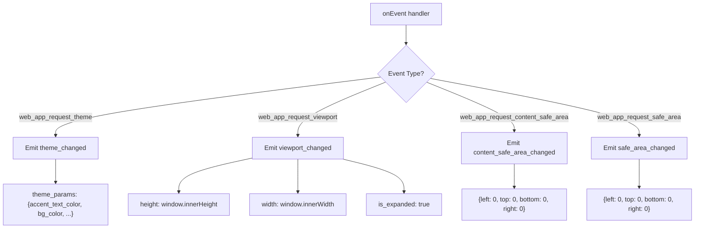
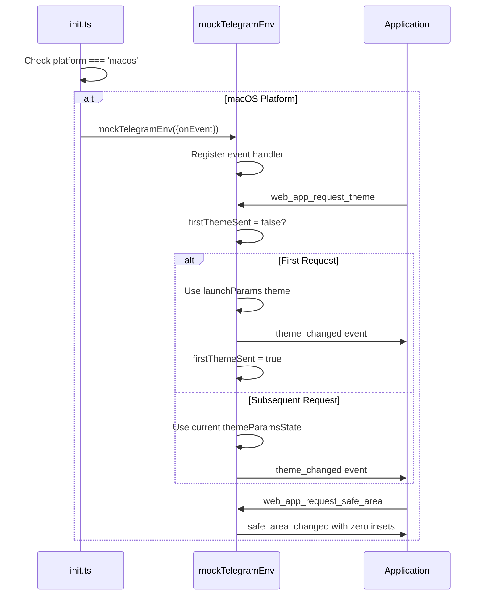
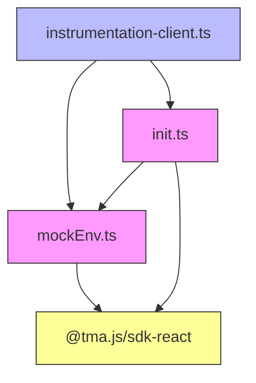

# Environment Mocking

<cite>
**Referenced Files in This Document**   
- [mockEnv.ts](file://passion/src/mockEnv.ts)
- [instrumentation-client.ts](file://passion/src/instrumentation-client.ts)
- [init.ts](file://passion/src/core/init.ts)
- [README.md](file://passion/README.md)
</cite>

## Table of Contents
1. [Introduction](#introduction)
2. [Core Components](#core-components)
3. [Architecture Overview](#architecture-overview)
4. [Detailed Component Analysis](#detailed-component-analysis)
5. [Dependency Analysis](#dependency-analysis)
6. [Troubleshooting Guide](#troubleshooting-guide)
7. [Conclusion](#conclusion)

## Introduction
The Environment Mocking sub-feature enables development and testing of Telegram Mini Apps outside the Telegram environment by simulating critical Telegram Mini Apps events and launch parameters. This capability is essential for efficient development workflows, allowing developers to build and debug applications in standard web browsers without requiring constant deployment to Telegram. The system leverages the `@tma.js/sdk-react` library's `mockTelegramEnv` function to intercept and respond to Telegram-specific events, creating a realistic simulation of the Telegram environment. This documentation details the implementation, integration, and usage patterns of the environment mocking system, focusing on how it enables seamless development while ensuring production safety through conditional execution.

## Core Components
The environment mocking system consists of three primary components: the `mockEnv` function that creates the simulated environment, the `instrumentation-client` that orchestrates initialization, and the `init` function that handles platform-specific mocking. These components work together to detect the execution environment, simulate Telegram events, and provide realistic launch parameters for development purposes. The system is designed to be transparent to the application logic while providing sufficient fidelity to accurately represent the Telegram Mini Apps environment during development.

**Section sources**
- [mockEnv.ts](file://passion/src/mockEnv.ts#L4-L80)
- [instrumentation-client.ts](file://passion/src/instrumentation-client.ts#L7-L24)
- [init.ts](file://passion/src/core/init.ts#L19-L81)

## Architecture Overview
The environment mocking architecture follows a layered initialization pattern where the mocking system is activated early in the application lifecycle. The process begins with the instrumentation client calling `mockEnv`, which conditionally activates the mock environment based on the `NODE_ENV` value. If the environment is not detected as Telegram-based, the system creates a comprehensive mock using `mockTelegramEnv` with predefined theme parameters, viewport dimensions, and launch parameters. The architecture ensures that mocking is only active in development mode, with the code being tree-shaken during production builds to prevent accidental activation.

**Diagram sources**
- [mockEnv.ts](file://passion/src/mockEnv.ts#L4-L80)
- [instrumentation-client.ts](file://passion/src/instrumentation-client.ts#L7-L24)
- [init.ts](file://passion/src/core/init.ts#L19-L81)

## Detailed Component Analysis

### mockEnv Function Analysis
The `mockEnv` function serves as the primary entry point for environment mocking, implementing conditional execution based on the `NODE_ENV` environment variable. This design ensures that mocking is only active during development, with the code being automatically removed during production builds through tree-shaking. The function uses `isTMA('complete')` to detect whether the application is running in a genuine Telegram environment, only activating the mock when this detection fails. This approach prevents conflicts when the application is legitimately running within Telegram, even during development.

The core of the mocking functionality is the `mockTelegramEnv` call, which intercepts specific Telegram Mini Apps events and responds with simulated data. The implementation handles four key events: `web_app_request_theme`, `web_app_request_viewport`, `web_app_request_content_safe_area`, and `web_app_request_safe_area`. For each intercepted event, the function emits the corresponding "changed" event with realistic mock data, allowing the application to respond as if it were receiving genuine Telegram events.

**Diagram sources**
- [mockEnv.ts](file://passion/src/mockEnv.ts#L4-L80)

**Section sources**
- [mockEnv.ts](file://passion/src/mockEnv.ts#L4-L80)

### Event Interception and Simulation
The event interception mechanism in `mockEnv.ts` demonstrates a sophisticated approach to simulating Telegram Mini Apps functionality. The `onEvent` handler within `mockTelegramEnv` acts as a middleware that intercepts outgoing Telegram API calls and provides simulated responses. This pattern allows the application to make standard Telegram API calls while receiving mock data during development.

For the `web_app_request_theme` event, the handler responds with a comprehensive `theme_params` object containing 13 color properties that simulate the Telegram app's dark theme. This detailed color scheme ensures that UI components render correctly with appropriate contrast and styling during development. The `web_app_request_viewport` event is handled by querying the browser's `window.innerHeight` and `window.innerWidth` properties, providing realistic viewport dimensions that adapt to the developer's browser window size.

The safe area events (`web_app_request_content_safe_area` and `web_app_request_safe_area`) are both handled by returning a `noInsets` object with zero values for all sides. This simplification assumes a standard desktop browser environment without physical notches or cutouts, which is appropriate for most development scenarios. The consistent response pattern across these events demonstrates a deliberate design choice to prioritize simplicity and reliability over complex device-specific simulations.

**Diagram sources**
- [mockEnv.ts](file://passion/src/mockEnv.ts#L27-L47)

**Section sources**
- [mockEnv.ts](file://passion/src/mockEnv.ts#L27-L47)

### Launch Parameters Simulation
The launch parameters simulation in `mockEnv.ts` creates a realistic representation of the data typically provided by Telegram when launching a Mini App. The implementation uses `URLSearchParams` to construct a query string that mimics the format of actual Telegram launch parameters. This approach ensures that the application can parse and utilize the mock data in the same way it would handle real launch parameters.

The simulated parameters include several key elements: `tgWebAppThemeParams` containing the JSON-stringified theme parameters, `tgWebAppData` with mock initialization data, `tgWebAppVersion` set to '8.4', and `tgWebAppPlatform` set to 'tdesktop'. The initialization data is particularly important, as it contains authentication information that applications often use for user identification and security validation. The mock implementation includes `auth_date`, `hash`, `signature`, and `user` fields, with the user object containing an ID and name.

A notable design consideration is the comment about init data formatting, which warns developers to preserve the exact order of parameters to avoid validation issues. This reflects the real-world constraint where Telegram's init data validation is sensitive to parameter ordering, emphasizing the importance of using real init data from a Telegram session when authenticity is required.

**Section sources**
- [mockEnv.ts](file://passion/src/mockEnv.ts#L48-L73)

### Platform-Specific Mocking
The system implements platform-specific mocking through the `mockForMacOS` flag in the `init` function, addressing known issues with Telegram for macOS. This targeted approach recognizes that certain platforms have unique bugs or inconsistencies in their implementation of the Telegram Mini Apps API. The macOS-specific mock handles two critical issues: the unreliable response to `web_app_request_theme` and incorrect events from `web_app_request_safe_area`.

The implementation uses a closure with a `firstThemeSent` flag to ensure that the initial theme request returns the launch parameters' theme, while subsequent requests return the current theme state. This pattern accommodates the macOS client's inconsistent behavior while maintaining a coherent theme state for the application. For the safe area, the mock consistently returns zero insets, overriding the potentially incorrect values from the macOS client.

**Diagram sources**
- [init.ts](file://passion/src/core/init.ts#L39-L65)

**Section sources**
- [init.ts](file://passion/src/core/init.ts#L39-L65)

## Dependency Analysis
The environment mocking system demonstrates a well-structured dependency graph with clear separation of concerns. The `instrumentation-client.ts` file serves as the integration point, importing and calling `mockEnv` before proceeding with application initialization. This sequential dependency ensures that the mocking environment is established before any Telegram SDK functionality is utilized.

The `mockEnv.ts` file depends on `@tma.js/sdk-react` for the `mockTelegramEnv`, `isTMA`, and `emitEvent` functions, creating a direct dependency on the Telegram SDK for its mocking capabilities. This design leverages the SDK's built-in mocking support rather than implementing a custom solution, ensuring compatibility and reducing maintenance overhead.

The `init.ts` file contains a conditional dependency on the mocking system through the `mockForMacOS` flag, demonstrating a targeted approach to platform-specific issues. This dependency is only activated when the platform is detected as macOS, minimizing the impact on other platforms.

**Diagram sources**
- [instrumentation-client.ts](file://passion/src/instrumentation-client.ts#L6-L7)
- [mockEnv.ts](file://passion/src/mockEnv.ts#L1-L2)
- [init.ts](file://passion/src/core/init.ts#L1-L15)

**Section sources**
- [instrumentation-client.ts](file://passion/src/instrumentation-client.ts#L6-L7)
- [mockEnv.ts](file://passion/src/mockEnv.ts#L1-L2)
- [init.ts](file://passion/src/core/init.ts#L1-L15)

## Troubleshooting Guide
When the environment mock fails to activate or Telegram SDK features behave unexpectedly in development, several common issues should be investigated. First, verify that `NODE_ENV` is correctly set to 'development', as the mock will not activate in other environments. Check the terminal or build configuration to ensure the environment variable is properly defined.

If init data validation fails, ensure that the mock init data in `mockEnv.ts` matches the expected format. The comment in the code emphasizes preserving the exact parameter order from real Telegram sessions to avoid validation issues. Consider replacing the mock init data with a real example copied from a Telegram session if authenticity is required.

For issues with event handlers not responding, verify that the `onEvent` function in `mockTelegramEnv` correctly matches the event names. The implementation is case-sensitive and requires exact string matching for `web_app_request_theme`, `web_app_request_viewport`, and other event types.

When developing for macOS, ensure that the `mockForMacOS` flag is correctly set in the `init` function call. This flag is automatically set based on the `tgWebAppPlatform` value, but can be manually overridden for testing purposes.

Finally, if the application crashes outside Telegram despite the mock being active, verify that the `isTMA('complete')` check is functioning correctly. This detection mechanism should prevent the mock from activating when the application is genuinely running within Telegram, but issues with the SDK or browser compatibility could affect its reliability.

**Section sources**
- [mockEnv.ts](file://passion/src/mockEnv.ts#L6-L80)
- [instrumentation-client.ts](file://passion/src/instrumentation-client.ts#L16-L21)
- [init.ts](file://passion/src/core/init.ts#L39-L65)

## Conclusion
The environment mocking system provides a robust solution for developing Telegram Mini Apps outside the Telegram ecosystem. By leveraging the `@tma.js/sdk-react` library's built-in mocking capabilities, the implementation creates a realistic simulation of Telegram events and launch parameters while maintaining production safety through conditional execution. The architecture demonstrates thoughtful design patterns, including tree-shaking compatibility, platform-specific handling, and realistic data simulation. This system enables efficient development workflows while ensuring that the application behaves correctly when deployed to the actual Telegram environment.