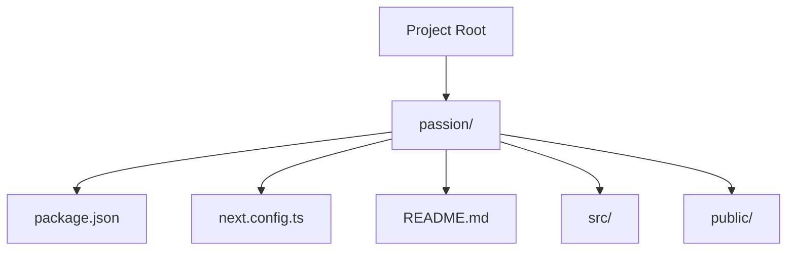
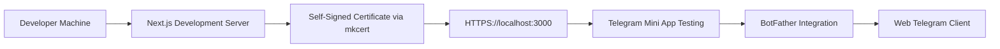
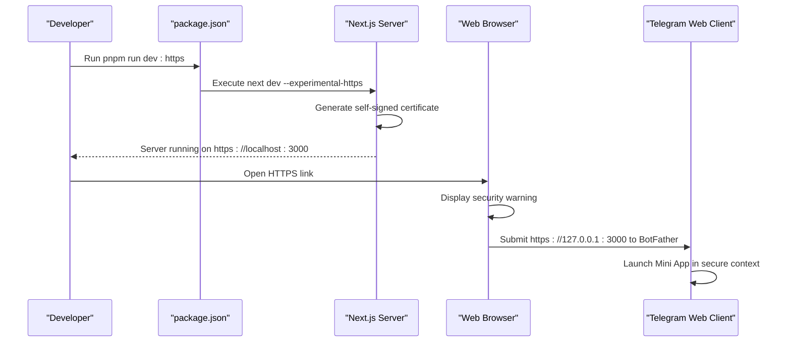
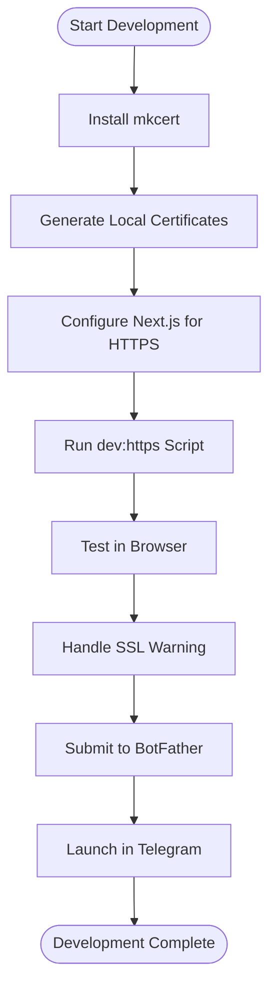
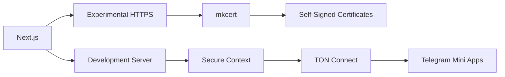

# HTTPS Development Server

<cite>
**Referenced Files in This Document**   
- [package.json](file://passion/package.json)
- [next.config.ts](file://passion/next.config.ts)
- [README.md](file://passion/README.md)
</cite>

## Table of Contents
1. [Introduction](#introduction)
2. [Project Structure](#project-structure)
3. [Core Components](#core-components)
4. [Architecture Overview](#architecture-overview)
5. [Detailed Component Analysis](#detailed-component-analysis)
6. [Dependency Analysis](#dependency-analysis)
7. [Performance Considerations](#performance-considerations)
8. [Troubleshooting Guide](#troubleshooting-guide)
9. [Conclusion](#conclusion)

## Introduction

This document provides comprehensive guidance on setting up and using the HTTPS Development Server for Telegram Mini Apps. The focus is on the `dev:https` script in package.json, which enables secure development testing by starting the Next.js development server with a self-signed SSL certificate using mkcert. This setup is essential for accurately testing features like TON Connect that require secure contexts, as well as meeting Telegram's security requirements for web apps.

**Section sources**
- [package.json](file://passion/package.json)
- [README.md](file://passion/README.md)

## Project Structure

The project follows a standard Next.js application structure with specific configurations for Telegram Mini Apps development. The key files relevant to HTTPS development are located in the root directory and include package.json for script definitions, next.config.ts for server configuration, and README.md for documentation.

**Diagram sources**
- [package.json](file://passion/package.json)
- [next.config.ts](file://passion/next.config.ts)
- [README.md](file://passion/README.md)

**Section sources**
- [package.json](file://passion/package.json)
- [next.config.ts](file://passion/next.config.ts)
- [README.md](file://passion/README.md)

## Core Components

The core components for HTTPS development include the `dev:https` npm script, which utilizes Next.js's experimental HTTPS feature, and the project's configuration files that support secure context testing. These components work together to enable developers to test their Telegram Mini Apps in a secure environment that mimics production conditions.

**Section sources**
- [package.json](file://passion/package.json)
- [next.config.ts](file://passion/next.config.ts)

## Architecture Overview

The architecture leverages Next.js's built-in development server with experimental HTTPS support to provide a secure testing environment. When the `dev:https` script is executed, it starts the server on HTTPS protocol, allowing developers to test features that require secure contexts such as TON Connect integration and other Telegram Mini Apps functionalities that are restricted to HTTPS environments.

**Diagram sources**
- [package.json](file://passion/package.json)
- [README.md](file://passion/README.md)

## Detailed Component Analysis

### HTTPS Development Script Analysis

The `dev:https` script is defined in package.json as "next dev --experimental-https". This command starts the Next.js development server with experimental HTTPS support, automatically generating a self-signed SSL certificate for localhost. This enables secure context testing required by Telegram's platform.

#### For API/Service Components:

**Diagram sources**
- [package.json](file://passion/package.json)
- [README.md](file://passion/README.md)

**Section sources**
- [package.json](file://passion/package.json)
- [README.md](file://passion/README.md)

### Conceptual Overview

The HTTPS development setup allows developers to test Telegram Mini Apps in a secure environment that closely mimics production conditions. This is particularly important for features like TON Connect, which require secure contexts to function properly.

## Dependency Analysis

The HTTPS development setup relies on several key dependencies and tools. The primary dependency is the Next.js framework itself, which provides the experimental HTTPS feature. Additionally, the mkcert tool is required for generating locally-trusted development certificates. The project also depends on @tonconnect/ui-react for TON Connect functionality, which requires secure contexts to operate.

**Diagram sources**
- [package.json](file://passion/package.json)
- [next.config.ts](file://passion/next.config.ts)

**Section sources**
- [package.json](file://passion/package.json)
- [next.config.ts](file://passion/next.config.ts)

## Performance Considerations

While the HTTPS development server introduces minimal performance overhead, it's important to note that the self-signed certificate generation and SSL handshake add slight latency to requests. However, this overhead is negligible for development purposes and ensures accurate testing of production-like conditions. The secure context enables proper testing of features like TON Connect that would otherwise be unavailable in HTTP environments.

## Troubleshooting Guide

Common issues with the HTTPS development server include SSL certificate errors, browser trust warnings, and device-specific connectivity problems. To resolve certificate generation failures, ensure mkcert is properly installed and the local CA is trusted. For port conflicts, verify that port 3000 is available. Mixed content warnings can be addressed by ensuring all resources are loaded over HTTPS. Always use https://127.0.0.1:3000 (not localhost) when submitting to BotFather, as localhost is considered invalid.

**Section sources**
- [README.md](file://passion/README.md)

## Conclusion

The HTTPS Development Server setup is essential for accurate testing of Telegram Mini Apps, particularly for features requiring secure contexts like TON Connect. By using the `dev:https` script with mkcert-generated certificates, developers can create a locally-trusted development environment that meets Telegram's security requirements. This setup enables comprehensive testing of all app functionalities before deployment, ensuring a smooth user experience in production.