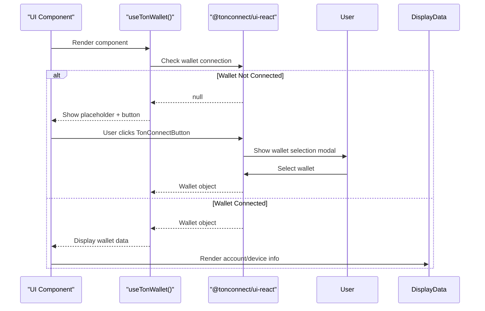
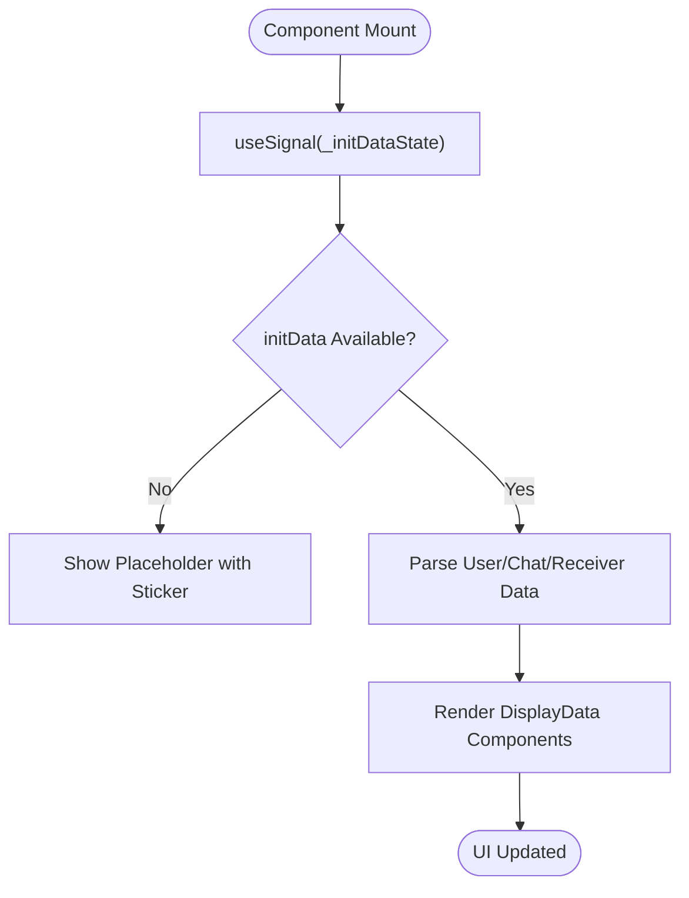
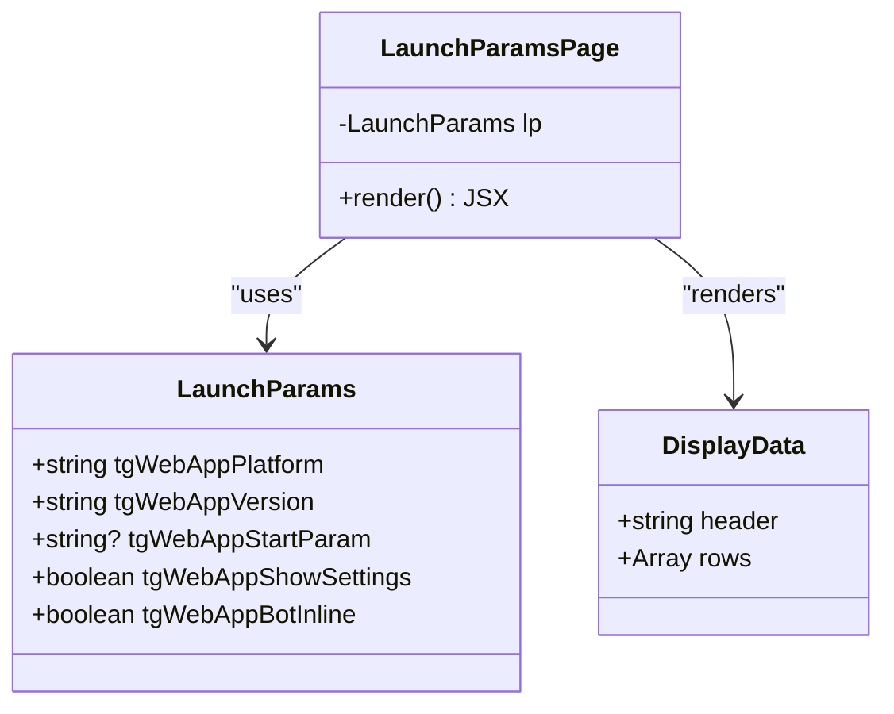
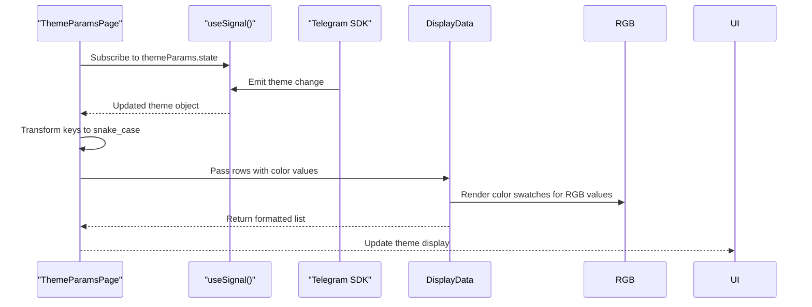
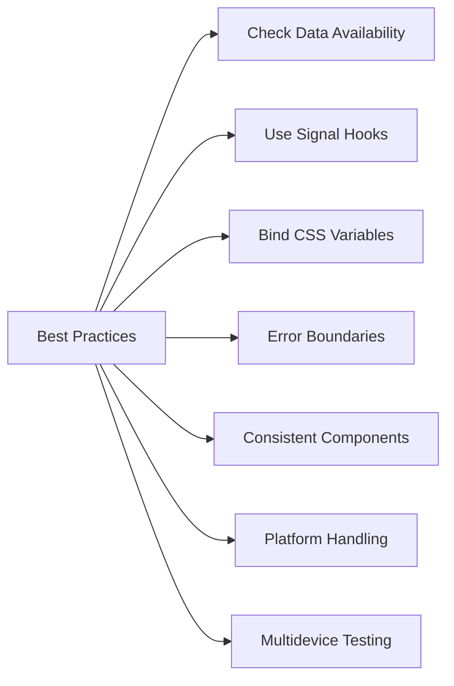

# Feature Guide

<cite>
**Referenced Files in This Document**   
- [ton-connect/page.tsx](file://passion/src/app/ton-connect/page.tsx)
- [init-data/page.tsx](file://passion/src/app/init-data/page.tsx)
- [launch-params/page.tsx](file://passion/src/app/launch-params/page.tsx)
- [theme-params/page.tsx](file://passion/src/app/theme-params/page.tsx)
- [DisplayData.tsx](file://passion/src/components/DisplayData/DisplayData.tsx)
- [Page.tsx](file://passion/src/components/Page.tsx)
- [core/init.ts](file://passion/src/core/init.ts)
</cite>

## Table of Contents
1. [Introduction](#introduction)
2. [TON Connect Integration](#ton-connect-integration)
3. [Init Data Access](#init-data-access)
4. [Launch Parameters](#launch-parameters)
5. [Theme Parameters](#theme-parameters)
6. [Common Issues and Best Practices](#common-issues-and-best-practices)

## Introduction
This guide provides a comprehensive overview of key features in the Telegram Mini App ecosystem, focusing on wallet integration, initialization data, launch parameters, and theme customization. Each feature is implemented as a dedicated page in the application, leveraging the @tma.js/sdk-react library to access native Telegram WebApp functionality. The UI is built using reusable components such as Page and DisplayData, ensuring consistency and maintainability across the app.

**Section sources**
- [page.tsx](file://passion/src/app/page.tsx#L1-L64)
- [layout.tsx](file://passion/src/app/layout.tsx#L1-L30)

## TON Connect Integration

The TON Connect integration enables users to connect their TON-compatible wallets directly within the Telegram Mini App. This feature uses the `@tonconnect/ui-react` library to provide a seamless wallet connection experience.

The implementation relies on the `useTonWallet()` hook from `@tonconnect/ui-react`, which returns wallet information when a connection is established. If no wallet is connected, the UI displays a placeholder with a `TonConnectButton` to initiate the connection flow.

Once connected, the component displays account details such as wallet address, public key, and chain identifier, along with device information including app name, version, platform, and supported features. The wallet's logo and name are displayed using the Telegram UI `Avatar` and `Cell` components, with navigation to the wallet's official page via `openLink()`.

The `DisplayData` component is used to render structured information in a consistent format, grouping related data under "Account" and "Device" sections.

**Diagram sources**
- [ton-connect/page.tsx](file://passion/src/app/ton-connect/page.tsx#L24-L107)

**Section sources**
- [ton-connect/page.tsx](file://passion/src/app/ton-connect/page.tsx#L24-L107)
- [TONConnectPage.css](file://passion/src/app/ton-connect/TONConnectPage.css#L1-L50)

## Init Data Access

The Init Data page demonstrates access to critical user and context information provided by Telegram at launch time. This includes user profile data, chat context, and authentication parameters.

The implementation uses two signals from `@tma.js/sdk-react`: `_initDataRaw` (the raw query string) and `_initDataState` (parsed data object). The `useSignal()` hook subscribes to changes in these values, ensuring real-time updates.

When initData is available, the component parses and displays:
- Raw initData string
- Parsed user data (id, first_name, last_name, username, etc.)
- Receiver information (if applicable)
- Chat context (chat_id, type, etc.)

Special handling is implemented for Date objects (converted to ISO strings) and nested objects. If initData is missing, a placeholder with a Telegram sticker is shown, indicating the app was launched outside Telegram or in an unsupported environment.

The `DisplayData` component dynamically renders user, receiver, and chat information only when present, maintaining a clean UI.

**Diagram sources**
- [init-data/page.tsx](file://passion/src/app/init-data/page.tsx#L23-L96)

**Section sources**
- [init-data/page.tsx](file://passion/src/app/init-data/page.tsx#L23-L96)
- [DisplayData.tsx](file://passion/src/components/DisplayData/DisplayData.tsx#L1-L61)

## Launch Parameters

The Launch Parameters page exposes platform-specific information passed by Telegram during app initialization. This data helps developers tailor the experience based on the user's environment.

Using the `useLaunchParams()` hook from `@tma.js/sdk-react`, the component retrieves:
- `tgWebAppPlatform`: Device platform (iOS, Android, macOS, etc.)
- `tgWebAppVersion`: Telegram app version
- `tgWebAppStartParam`: Optional start parameter for deep linking
- `tgWebAppShowSettings`: Whether settings button should be shown
- `tgWebAppBotInline`: Whether launched from inline bot menu

The UI presents these values in a `DisplayData` list, with special handling for navigation links to related pages (`/init-data`, `/theme-params`). This creates an interconnected feature exploration experience.

**Diagram sources**
- [launch-params/page.tsx](file://passion/src/app/launch-params/page.tsx#L9-L33)

**Section sources**
- [launch-params/page.tsx](file://passion/src/app/launch-params/page.tsx#L9-L33)
- [Page.tsx](file://passion/src/components/Page.tsx#L1-L31)

## Theme Parameters

The Theme Parameters page displays the current Telegram theme configuration, enabling developers to create visually consistent Mini Apps.

The implementation uses `useSignal(themeParams.state)` to subscribe to theme changes in real time. The theme parameters include color values such as:
- Background colors (`bg_color`, `secondary_bg_color`)
- Text colors (`text_color`, `hint_color`)
- Accent colors (`accent_text_color`, `link_color`)
- Button colors (`button_color`, `button_text_color`)

The component transforms camelCase property names to snake_case with "bg" abbreviations for display purposes. All values are rendered using the `DisplayData` component, which automatically formats RGB color values using the `RGB` component.

**Diagram sources**
- [theme-params/page.tsx](file://passion/src/app/theme-params/page.tsx#L9-L26)

**Section sources**
- [theme-params/page.tsx](file://passion/src/app/theme-params/page.tsx#L9-L26)
- [core/init.ts](file://passion/src/core/init.ts#L1-L83)

## Common Issues and Best Practices

### Missing Init Data in Development
A common issue during development is the absence of initData when testing outside Telegram. The app handles this gracefully by showing a descriptive placeholder with a humorous sticker. For testing, developers can:
- Use the Telegram app to launch the Mini App
- Implement mock initData in development mode using `mockTelegramEnv()`
- Set default values for critical user data

### Theme Parameter Inconsistencies
Theme parameters may vary across platforms (especially macOS) and may not update reliably. The app addresses this through:
- Using `bindThemeParamsCssVars()` in `init.ts` to automatically bind theme colors to CSS variables
- Implementing `mockForMacOS` option to simulate theme responses on problematic platforms
- Subscribing to real-time updates via `useSignal(themeParams.state)`

### Best Practices for Implementation
1. **Always check data availability** before rendering (e.g., `if (!initDataState) return placeholder`)
2. **Use signal hooks** (`useSignal`) for reactive updates to Telegram SDK state
3. **Leverage CSS variables** for theme consistency via `bindThemeParamsCssVars()`
4. **Implement proper error boundaries** and loading states
5. **Use consistent UI components** like `Page` and `DisplayData` for uniform presentation
6. **Handle platform differences** in UI layout and behavior
7. **Test on multiple devices** to ensure compatibility across iOS, Android, and desktop

**Diagram sources**
- [core/init.ts](file://passion/src/core/init.ts#L68-L82)
- [Root.tsx](file://passion/src/components/Root/Root.tsx#L1-L59)

**Section sources**
- [core/init.ts](file://passion/src/core/init.ts#L1-L83)
- [mockEnv.ts](file://passion/src/mockEnv.ts#L9-L23)
- [Root.tsx](file://passion/src/components/Root/Root.tsx#L1-L59)