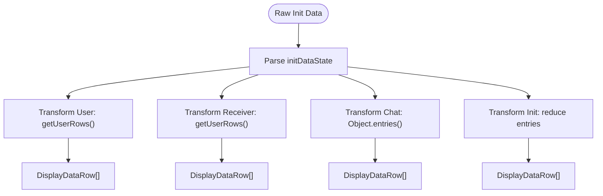

# Initialization Data Handling

<cite>
**Referenced Files in This Document**   
- [page.tsx](file://passion/src/app/init-data/page.tsx)
- [DisplayData.tsx](file://passion/src/components/DisplayData/DisplayData.tsx)
- [mockEnv.ts](file://passion/src/mockEnv.ts)
</cite>

## Table of Contents
1. [Introduction](#introduction)
2. [Accessing Initialization Data Using SDK Hooks](#accessing-initialization-data-using-sdk-hooks)
3. [Structure of Initialization Data](#structure-of-initialization-data)
4. [Data Transformation with useMemo](#data-transformation-with-usememo)
5. [Conditional Rendering and Fallback UI](#conditional-rendering-and-fallback-ui)
6. [Mocking Initialization Data in Development](#mocking-initialization-data-in-development)
7. [Best Practices for Secure Data Handling](#best-practices-for-secure-data-handling)
8. [Common Challenges and Debugging Tips](#common-challenges-and-debugging-tips)

## Introduction
The Initialization Data Handling feature in Telegram Mini Apps enables developers to securely access user authentication data, chat context, and receiver information provided by the Telegram platform upon app launch. This document details how the `@telegram-apps/sdk-react` hooks are used to retrieve and process this data, transform it into display-ready formats, and handle edge cases such as missing or malformed initialization data. It also covers development practices for mocking data and ensuring secure handling of sensitive user information.

**Section sources**
- [page.tsx](file://passion/src/app/init-data/page.tsx#L1-L97)

## Accessing Initialization Data Using SDK Hooks
Initialization data is accessed using the `useSignal` hook from `@telegram-apps/sdk-react`, which subscribes to reactive signals provided by the SDK. The `initDataRaw` signal contains the original string representation of the init data, while `initDataState` provides a parsed object with structured fields including user, receiver, and chat information. These signals are consumed in the `InitDataPage` component to enable real-time updates when the data changes.

**Diagram sources**
- [page.tsx](file://passion/src/app/init-data/page.tsx#L24-L25)

## Structure of Initialization Data
Initialization data includes several key components passed from Telegram:
- **User Profile**: Contains user identifiers such as `id`, `first_name`, `last_name`, `username`, `photo_url`, and `language_code`.
- **Receiver Information**: Represents another user involved in the interaction (e.g., in a chat), with the same structure as the user object.
- **Chat Context**: Includes chat-specific details like `id`, `type`, `title`, and `photo_url`.
- **Authentication Parameters**: Critical security fields including `auth_date` (timestamp), `hash` (cryptographic signature), and optionally `signature`.

These parameters are essential for verifying the authenticity of the data on the server side and must be preserved in their original order during validation.

**Section sources**
- [page.tsx](file://passion/src/app/init-data/page.tsx#L24-L25)

## Data Transformation with useMemo
The raw initialization data is transformed into display-ready rows using React’s `useMemo` hook to optimize performance. Three primary transformations occur:
- `initDataRows`: Maps top-level init data fields (excluding nested objects) into key-value pairs, converting dates to ISO strings.
- `userRows`: Extracts user profile properties into a list of displayable items.
- `receiverRows`: Similarly processes receiver data if present.
- `chatRows`: Transforms chat context into a structured format for rendering.

Each transformation is memoized based on dependencies (`initDataState`, `initDataRaw`) to prevent unnecessary recalculations.

**Diagram sources**
- [page.tsx](file://passion/src/app/init-data/page.tsx#L27-L66)

## Conditional Rendering and Fallback UI
The application conditionally renders data sections only when corresponding values are available. If `initDataRows` is undefined (indicating missing init data), a fallback `Placeholder` UI is displayed with an illustrative image and error message. Otherwise, the `DisplayData` component is rendered for each available dataset: init data, user, receiver, and chat.

This ensures a graceful user experience even when required data is absent, preventing crashes or undefined behavior.

**Diagram sources**
- [page.tsx](file://passion/src/app/init-data/page.tsx#L68-L96)

## Mocking Initialization Data in Development
During development, the `mockEnv.ts` file enables simulation of Telegram environment when running outside the app. The `mockEnv()` function checks if the environment is non-Telegram and injects mock launch parameters, including a sample `tgWebAppData` containing `auth_date`, `hash`, and a mock `user` object. This allows developers to test UI components without deploying to Telegram.

It is crucial to ensure mock data closely resembles real init data structure to avoid parsing issues during production.

**Diagram sources**
- [mockEnv.ts](file://passion/src/mockEnv.ts#L5-L81)

## Best Practices for Secure Data Handling
To securely handle initialization data:
- **Never trust client-side data**: Always validate `hash` on the server using your bot token.
- **Preserve parameter order**: Do not sort or modify the raw init data string before validation.
- **Avoid logging sensitive data**: Prevent accidental exposure of `hash` or user identifiers.
- **Use HTTPS in production**: Ensure all communications are encrypted.
- **Validate data freshness**: Check `auth_date` to reject stale sessions.

Server-side verification is mandatory to prevent spoofing attacks.

**Section sources**
- [mockEnv.ts](file://passion/src/mockEnv.ts#L50-L64)

## Common Challenges and Debugging Tips
Developers often face these challenges:
- **Missing init data**: Caused by launching app outside Telegram. Use `mockEnv()` to simulate.
- **Malformed JSON in user/receiver fields**: Ensure proper URL decoding before parsing.
- **Hash validation failures**: Caused by reordering parameters or incorrect encoding. Use exact string from Telegram.
- **Type inconsistencies**: Some fields may be missing or have unexpected types; always check for `undefined`.

Use browser developer tools and enable debug mode in `init.ts` to trace signal updates and inspect state changes.

**Section sources**
- [page.tsx](file://passion/src/app/init-data/page.tsx#L24-L25)
- [mockEnv.ts](file://passion/src/mockEnv.ts#L5-L81)