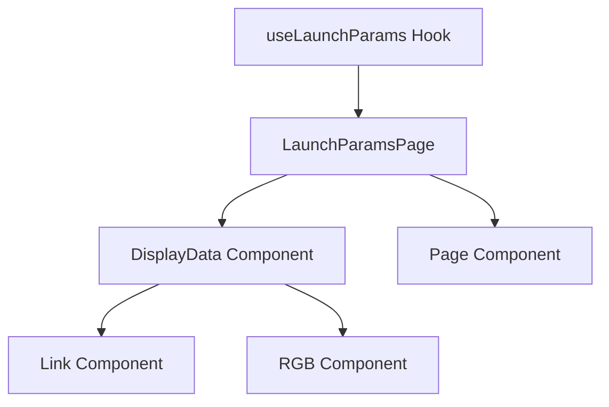
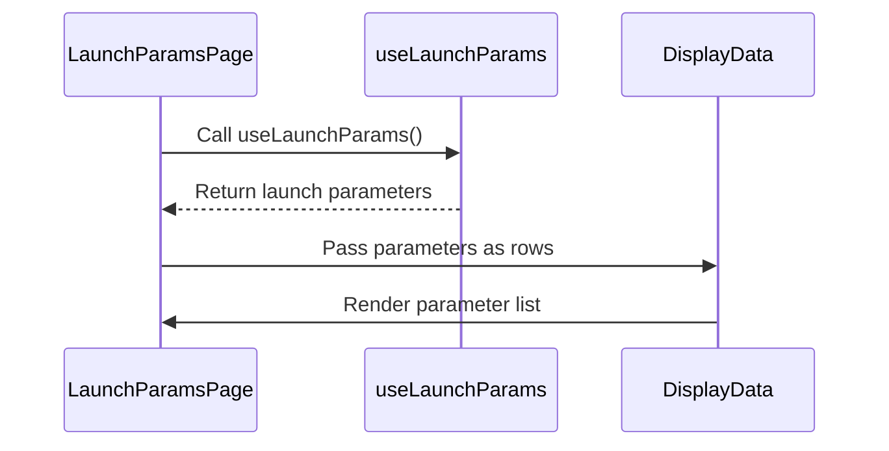
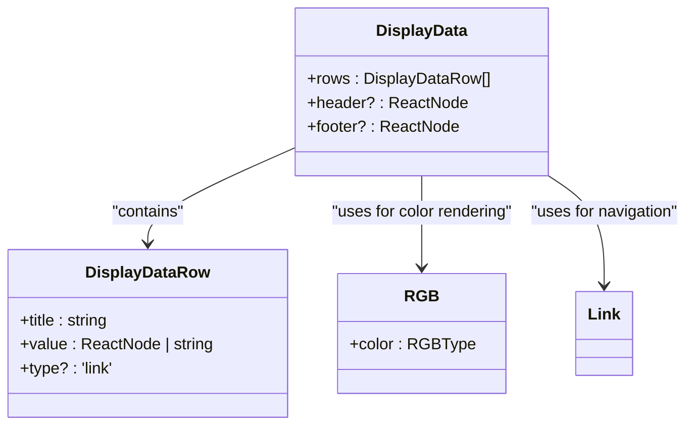
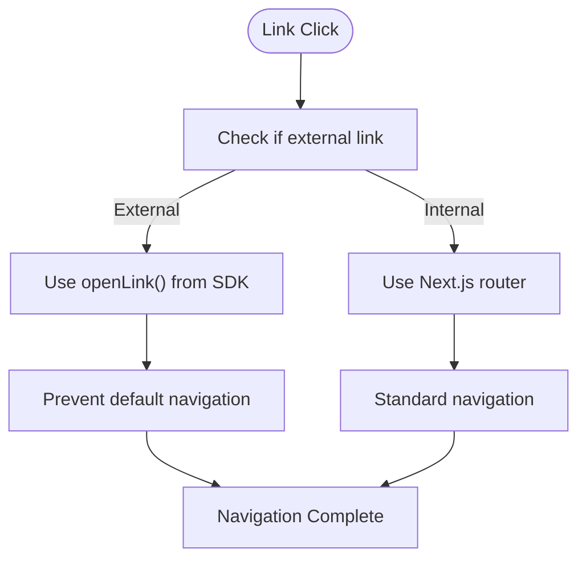
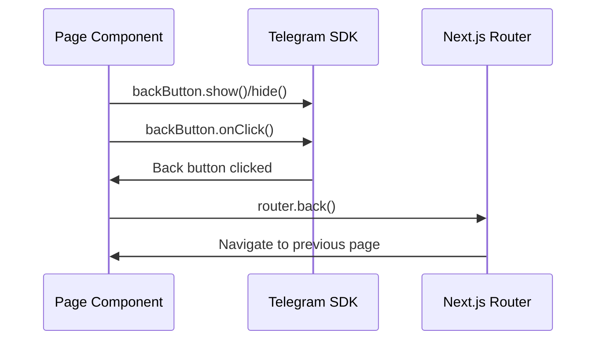

# Launch Parameters Access

<cite>
**Referenced Files in This Document**   
- [page.tsx](file://passion/src/app/launch-params/page.tsx)
- [DisplayData.tsx](file://passion/src/components/DisplayData/DisplayData.tsx)
- [Link.tsx](file://passion/src/components/Link/Link.tsx)
- [RGB.tsx](file://passion/src/components/RGB/RGB.tsx)
- [Page.tsx](file://passion/src/components/Page.tsx)
</cite>

## Table of Contents
1. [Introduction](#introduction)
2. [Core Components](#core-components)
3. [Launch Parameters Implementation](#launch-parameters-implementation)
4. [DisplayData Component Architecture](#displaydata-component-architecture)
5. [Navigation and Link Handling](#navigation-and-link-handling)
6. [Best Practices for Launch Parameters](#best-practices-for-launch-parameters)
7. [Common Issues and Solutions](#common-issues-and-solutions)

## Introduction

The Launch Parameters Access feature provides critical runtime information about the Telegram client environment, enabling developers to create responsive and adaptive web applications within the Telegram ecosystem. This document details how the `useLaunchParams` hook from `@telegram-apps/sdk-react` retrieves essential client information such as platform type, app version, and start parameters. The implementation demonstrates how this information is displayed and utilized within the application to enhance user experience through platform-specific adaptations and feature detection.

**Section sources**
- [page.tsx](file://passion/src/app/launch-params/page.tsx#L1-L34)

## Core Components

The Launch Parameters Access functionality is built upon several interconnected components that work together to retrieve, display, and navigate based on Telegram client information. The primary components include the `useLaunchParams` hook for data retrieval, the `DisplayData` component for presentation, and the `Link` component for navigation between related features.

**Diagram sources**
- [page.tsx](file://passion/src/app/launch-params/page.tsx#L3-L34)
- [DisplayData.tsx](file://passion/src/components/DisplayData/DisplayData.tsx#L1-L61)
- [Link.tsx](file://passion/src/components/Link/Link.tsx#L1-L59)

**Section sources**
- [page.tsx](file://passion/src/app/launch-params/page.tsx#L1-L34)
- [DisplayData.tsx](file://passion/src/components/DisplayData/DisplayData.tsx#L1-L61)
- [Link.tsx](file://passion/src/components/Link/Link.tsx#L1-L59)

## Launch Parameters Implementation

The `useLaunchParams` hook serves as the primary interface for accessing Telegram client runtime information. This hook provides access to several critical parameters that define the current execution context:

- `tgWebAppPlatform`: Identifies the operating system (iOS, Android, macOS, web, weba, unknown)
- `tgWebAppVersion`: Specifies the version of the Telegram application
- `tgWebAppStartParam`: Contains optional start parameters passed to the web app
- `tgWebAppShowSettings`: Indicates whether the Settings button should be shown
- `tgWebAppBotInline`: Specifies if the app was opened from an inline query

The implementation in `page.tsx` demonstrates how these parameters are retrieved and displayed using the `DisplayData` component, creating a comprehensive view of the current Telegram client environment.

**Diagram sources**
- [page.tsx](file://passion/src/app/launch-params/page.tsx#L9-L34)

**Section sources**
- [page.tsx](file://passion/src/app/launch-params/page.tsx#L9-L34)

## DisplayData Component Architecture

The `DisplayData` component is a versatile presentation component designed to display various types of data in a consistent format. It accepts an array of `DisplayDataRow` objects, each containing a title and value, with optional type specification for special rendering.

The component implements intelligent value rendering based on data type:
- **Strings**: Displayed directly, with special handling for RGB color values
- **Booleans**: Rendered as disabled checkboxes for visual indication
- **Links**: Converted to navigable elements using the `Link` component
- **Undefined values**: Displayed as "empty" with italic styling

The component also handles special cases such as RGB color values by utilizing the `isRGB` function from the SDK to detect color formats and render them with visual indicators.

**Diagram sources**
- [DisplayData.tsx](file://passion/src/components/DisplayData/DisplayData.tsx#L13-L61)
- [RGB.tsx](file://passion/src/components/RGB/RGB.tsx#L1-L21)

**Section sources**
- [DisplayData.tsx](file://passion/src/components/DisplayData/DisplayData.tsx#L13-L61)
- [RGB.tsx](file://passion/src/components/RGB/RGB.tsx#L1-L21)

## Navigation and Link Handling

The application implements a sophisticated navigation system through the `Link` component, which intelligently handles both internal and external navigation. When a link row is defined in the `DisplayData` component with `type: 'link'`, it creates navigation to related features such as init-data and theme-params pages.

The `Link` component uses Next.js routing for internal navigation while leveraging the Telegram SDK's `openLink` function for external URLs. It determines the navigation method by comparing the target URL with the current page's URL, ensuring proper handling of cross-origin links within the Telegram Mini App environment.

**Diagram sources**
- [Link.tsx](file://passion/src/components/Link/Link.tsx#L1-L59)
- [DisplayData.tsx](file://passion/src/components/DisplayData/DisplayData.tsx#L33-L34)

**Section sources**
- [Link.tsx](file://passion/src/components/Link/Link.tsx#L1-L59)

## Best Practices for Launch Parameters

### Platform Detection and Responsive Design

Launch parameters enable effective platform detection, allowing developers to implement platform-specific UI adjustments. The `tgWebAppPlatform` parameter can be used to detect whether the application is running on iOS, Android, or web, enabling:

- Platform-specific styling and layout adjustments
- Custom interaction patterns optimized for each platform
- Feature availability based on platform capabilities

### Version-Aware Feature Toggles

The `tgWebAppVersion` parameter allows for version-aware feature toggles, enabling gradual rollout of new features and graceful degradation for older clients. This approach supports:

- Progressive enhancement of functionality
- Targeted feature availability based on client capabilities
- Smooth migration paths for users on older versions

### Deep Linking and Referral Tracking

The `tgWebAppStartParam` parameter facilitates deep linking and referral tracking by allowing custom parameters to be passed when launching the web app. This enables:

- Personalized content delivery based on referral sources
- Context-aware application state initialization
- Analytics and user journey tracking

### Personalized Content Delivery

By combining launch parameters with user data, applications can deliver highly personalized experiences. Start parameters can carry user-specific information, campaign identifiers, or content preferences, allowing the application to:

- Pre-load relevant content
- Customize onboarding flows
- Implement targeted marketing campaigns

**Section sources**
- [page.tsx](file://passion/src/app/launch-params/page.tsx#L17-L21)

## Common Issues and Solutions

### Inconsistent Parameter Availability

Some launch parameters may not be consistently available across all Telegram clients or versions. To handle this:

- Always implement fallback values for optional parameters
- Use defensive programming techniques when accessing parameter values
- Provide clear user feedback when expected parameters are missing

### Optional Parameter Handling

The `tgWebAppStartParam` parameter is optional and may be empty or undefined. Best practices include:

- Always checking for undefined values before processing
- Implementing default behaviors when no start parameter is provided
- Using type guards like `isRGB` to validate parameter formats

### Back Navigation Management

The `Page` component demonstrates proper back navigation management by controlling the Telegram back button visibility and behavior. It uses the `backButton` SDK component to:

- Show or hide the back button based on page context
- Handle back button clicks by integrating with Next.js router
- Ensure consistent navigation behavior across the application

**Diagram sources**
- [Page.tsx](file://passion/src/components/Page.tsx#L1-L31)

**Section sources**
- [Page.tsx](file://passion/src/components/Page.tsx#L1-L31)