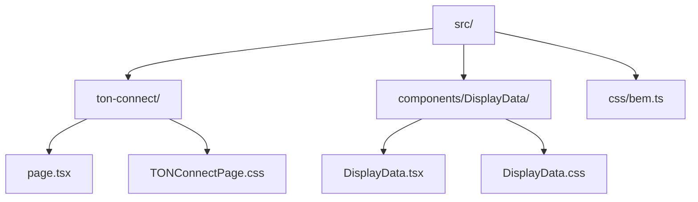
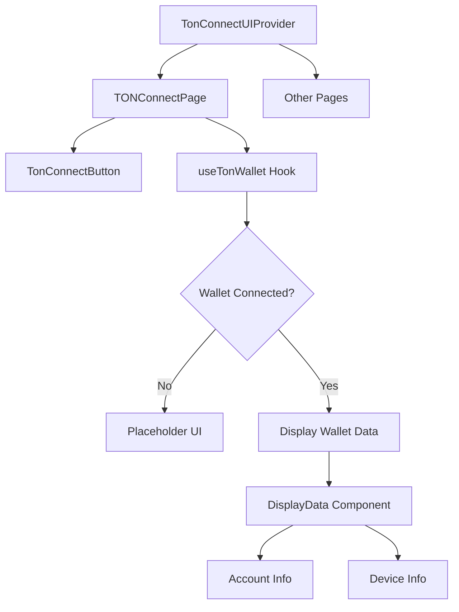
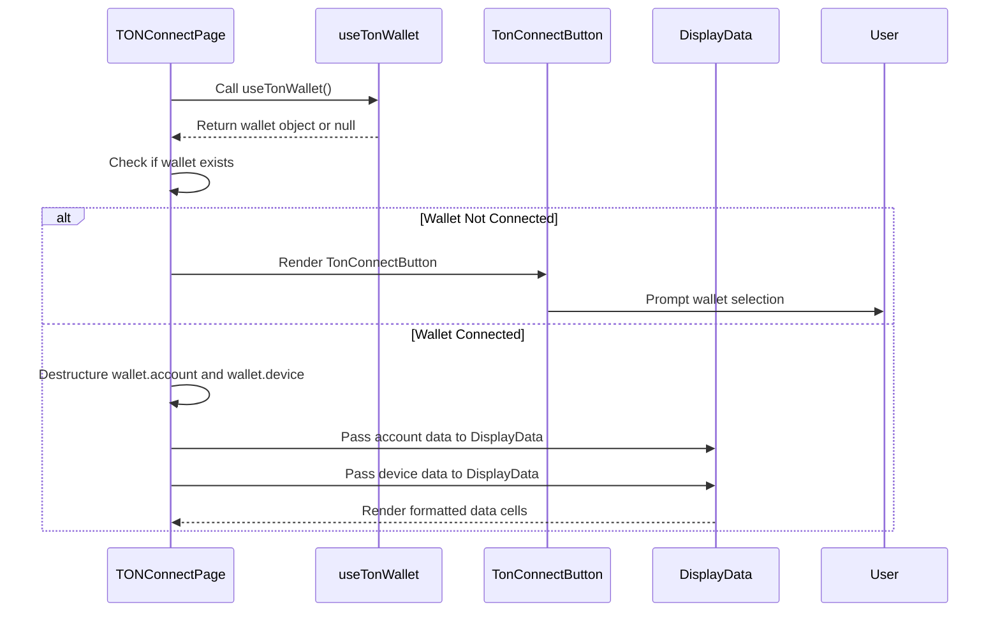
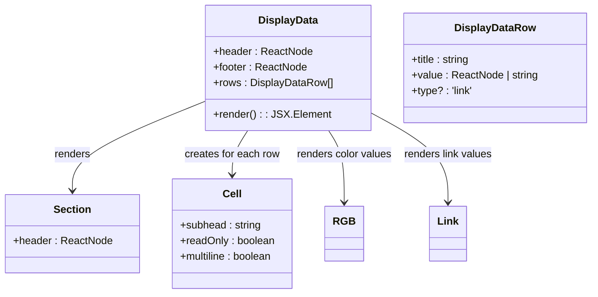

# TON Connect Integration

<cite>
**Referenced Files in This Document**   
- [page.tsx](file://passion/src/app/ton-connect/page.tsx)
- [bem.ts](file://passion/src/css/bem.ts)
- [DisplayData.tsx](file://passion/src/components/DisplayData/DisplayData.tsx)
- [DisplayData.css](file://passion/src/components/DisplayData/DisplayData.css)
- [TONConnectPage.css](file://passion/src/app/ton-connect/TONConnectPage.css)
- [Root.tsx](file://passion/src/components/Root/Root.tsx)
- [tonconnect-manifest.json](file://passion/public/tonconnect-manifest.json)
</cite>

## Table of Contents
1. [Introduction](#introduction)
2. [Project Structure](#project-structure)
3. [Core Components](#core-components)
4. [Architecture Overview](#architecture-overview)
5. [Detailed Component Analysis](#detailed-component-analysis)
6. [Dependency Analysis](#dependency-analysis)
7. [Performance Considerations](#performance-considerations)
8. [Troubleshooting Guide](#troubleshooting-guide)
9. [Conclusion](#conclusion)

## Introduction
This document provides a comprehensive overview of the TON Connect integration within a Telegram Mini App built using Next.js and React. It details how the `@tonconnect/ui-react` library enables seamless wallet connectivity, allowing users to authenticate and interact with decentralized applications (dApps) on the TON blockchain. The implementation leverages key components such as `TonConnectButton` and `useTonWallet`, manages UI state transitions between disconnected and connected states, and securely displays wallet and device information through reusable components like `DisplayData`. Special attention is given to styling practices using BEM methodology via the `bem.ts` utility, ensuring consistency and maintainability.

## Project Structure
The TON Connect feature is implemented under the `passion/src/app/ton-connect` directory, which contains the main page component and associated styles. The project follows a modular structure with clear separation between UI components, hooks, and utilities.



**Diagram sources**
- [page.tsx](file://passion/src/app/ton-connect/page.tsx)
- [DisplayData.tsx](file://passion/src/components/DisplayData/DisplayData.tsx)
- [bem.ts](file://passion/src/css/bem.ts)

**Section sources**
- [page.tsx](file://passion/src/app/ton-connect/page.tsx)
- [DisplayData.tsx](file://passion/src/components/DisplayData/DisplayData.tsx)

## Core Components
The core functionality of the TON Connect integration revolves around three main elements: the `TonConnectButton` for initiating wallet connection, the `useTonWallet` hook for accessing wallet state, and the `DisplayData` component for rendering structured data. These components work together to provide a smooth user experience from initial disconnection to full wallet integration.

**Section sources**
- [page.tsx](file://passion/src/app/ton-connect/page.tsx)
- [DisplayData.tsx](file://passion/src/components/DisplayData/DisplayData.tsx)

## Architecture Overview
The architecture follows a client-side React pattern where the `TonConnectUIProvider` wraps the application root, enabling wallet connectivity across all pages. The provider is configured with a manifest URL pointing to `tonconnect-manifest.json`, which defines the dApp's metadata.



**Diagram sources**
- [Root.tsx](file://passion/src/components/Root/Root.tsx)
- [page.tsx](file://passion/src/app/ton-connect/page.tsx)
- [tonconnect-manifest.json](file://passion/public/tonconnect-manifest.json)

## Detailed Component Analysis

### TON Connect Page Analysis
The `TONConnectPage` component conditionally renders UI based on the wallet connection status. When no wallet is connected, it displays a placeholder with the `TonConnectButton`. Upon connection, it extracts and displays account and device details.

#### For API/Service Components:


**Diagram sources**
- [page.tsx](file://passion/src/app/ton-connect/page.tsx)

**Section sources**
- [page.tsx](file://passion/src/app/ton-connect/page.tsx)

### DisplayData Component Analysis
The `DisplayData` component is a reusable UI element designed to display key-value pairs in a consistent format using Telegram UI's `Cell` and `Section` components. It supports various value types including strings, links, booleans, and RGB colors.

#### For Object-Oriented Components:


**Diagram sources**
- [DisplayData.tsx](file://passion/src/components/DisplayData/DisplayData.tsx)

**Section sources**
- [DisplayData.tsx](file://passion/src/components/DisplayData/DisplayData.tsx)

## Dependency Analysis
The TON Connect integration relies on several internal and external dependencies. The `@tonconnect/ui-react` library provides the core wallet connectivity features, while `@telegram-apps/sdk-react` and `@telegram-apps/telegram-ui` ensure compatibility with Telegram's platform and design language.

```mermaid
graph LR
A[TONConnectPage] --> B[@tonconnect/ui-react]
A --> C[@telegram-apps/telegram-ui]
A --> D[DisplayData]
D --> E[RGB]
D --> F[Link]
A --> G[bem]
B --> H[TonConnectUIProvider]
B --> I[TonConnectButton]
B --> J[useTonWallet]
```

**Diagram sources**
- [page.tsx](file://passion/src/app/ton-connect/page.tsx)
- [Root.tsx](file://passion/src/components/Root/Root.tsx)
- [bem.ts](file://passion/src/css/bem.ts)

**Section sources**
- [page.tsx](file://passion/src/app/ton-connect/page.tsx)
- [Root.tsx](file://passion/src/components/Root/Root.tsx)
- [bem.ts](file://passion/src/css/bem.ts)

## Performance Considerations
The implementation efficiently manages re-renders by leveraging React's signal-based state management from `@telegram-apps/sdk-react`. The `useTonWallet` hook provides a stable reference to the wallet object, minimizing unnecessary updates. The `DisplayData` component uses memoization patterns implicitly through its functional design, and the BEM-based class generation ensures minimal CSS recalculations.

## Troubleshooting Guide
Common issues in TON Connect integration include missing wallet connections during development and improper manifest configuration. Developers should ensure the `tonconnect-manifest.json` file is correctly placed in the public directory and contains valid `url`, `name`, and `iconUrl` fields. During development, mocking the Telegram environment using `mockTelegramEnv` can help simulate wallet connections. Always verify that `TonConnectUIProvider` is properly wrapped around the application root and that the `manifestUrl` points to the correct location.

**Section sources**
- [tonconnect-manifest.json](file://passion/public/tonconnect-manifest.json)
- [Root.tsx](file://passion/src/components/Root/Root.tsx)

## Conclusion
The TON Connect integration in this Telegram Mini App demonstrates a robust pattern for wallet connectivity using modern React practices. By combining `@tonconnect/ui-react` with Telegram's UI components and a well-structured component hierarchy, it delivers a seamless user experience. The use of BEM methodology via `bem.ts` ensures consistent styling, while the `DisplayData` component promotes reusability across the application. This implementation serves as a solid foundation for building dApps on the TON blockchain within the Telegram ecosystem.