# Theme Parameters Detection

<cite>
**Referenced Files in This Document**   
- [page.tsx](file://passion/src/app/theme-params/page.tsx)
- [DisplayData.tsx](file://passion/src/components/DisplayData/DisplayData.tsx)
- [RGB.tsx](file://passion/src/components/RGB/RGB.tsx)
- [mockEnv.ts](file://passion/src/mockEnv.ts)
</cite>

## Table of Contents
1. [Introduction](#introduction)
2. [Core Implementation](#core-implementation)
3. [Theme Parameter Processing](#theme-parameter-processing)
4. [Real-time Theme Updates](#real-time-theme-updates)
5. [Color Representation and Display](#color-representation-and-display)
6. [Development Environment Mocking](#development-environment-mocking)
7. [Best Practices for Theme-responsive Design](#best-practices-for-theme-responsive-design)
8. [Common Issues and Solutions](#common-issues-and-solutions)
9. [Conclusion](#conclusion)

## Introduction

The Theme Parameters Detection feature enables Telegram Mini Apps to seamlessly adapt their appearance to match the user's current Telegram client theme. This integration ensures a consistent visual experience by allowing the application to access and respond to the native theme settings in real time. The implementation leverages the `@telegram-apps/sdk-react` library, specifically the `useSignal` hook with `themeParams.state`, to provide reactive access to theme configuration. This document details how theme parameters are detected, processed, and displayed within the application, with a focus on the implementation in the theme-params page and related components.

**Section sources**
- [page.tsx](file://passion/src/app/theme-params/page.tsx#L1-L27)
- [mockEnv.ts](file://passion/src/mockEnv.ts#L1-L82)

## Core Implementation

The core implementation of theme parameter detection is centered around the `useSignal` hook from `@telegram-apps/sdk-react`, which provides reactive state management for Telegram's theme parameters. The `themeParams.state` signal is used to create a subscription to real-time theme updates, ensuring the application interface remains synchronized with the host client's appearance settings.

The implementation follows a React Server Components architecture where the theme parameters page is designated as a client component using the `'use client'` directive. This allows the use of React hooks and client-side interactivity while maintaining compatibility with Next.js server-side rendering patterns.

**Diagram sources**
- [page.tsx](file://passion/src/app/theme-params/page.tsx#L3-L27)

**Section sources**
- [page.tsx](file://passion/src/app/theme-params/page.tsx#L3-L27)

## Theme Parameter Processing

The theme parameter processing pipeline transforms the raw theme state object into a display-ready format through several key operations. The implementation uses `Object.entries()` to convert the theme parameters object into an array of key-value pairs, which are then mapped to create display rows.

A critical aspect of the processing is the transformation of parameter names from camelCase to snake_case format, which aligns with Telegram's official naming conventions. This is achieved through a two-step string replacement process: first replacing uppercase letters with their underscore-prefixed lowercase equivalents, and then specifically handling the "background" keyword to maintain consistency with Telegram's parameter naming.

The processed parameters include essential visual properties such as:
- Background colors (bg_color, secondary_bg_color)
- Text colors (text_color, hint_color)
- Button styling (button_color, button_text_color)
- Accent colors (accent_text_color, link_color)
- Section-specific colors (section_bg_color, header_bg_color)

```mermaid
flowchart LR
A["Raw Theme Object"] --> B["Object.entries()"]
B --> C["Key Transformation"]
C --> D["camelCase to snake_case"]
D --> E["background → bg"]
E --> F["Formatted Display Rows"]
```

**Diagram sources**
- [page.tsx](file://passion/src/app/theme-params/page.tsx#L16-L21)

**Section sources**
- [page.tsx](file://passion/src/app/theme-params/page.tsx#L16-L21)

## Real-time Theme Updates

The real-time theme update mechanism is powered by the reactivity system provided by the `useSignal` hook. When users change their Telegram client theme, the `themeParams.state` signal automatically updates, triggering a re-render of the component and reflecting the new theme values without requiring page refresh.

The reactivity is implemented through a subscription model where the component listens for changes to the theme parameters state. This ensures immediate visual feedback when theme changes occur, maintaining synchronization between the Mini App and the host application. The update process is optimized to minimize re-renders by only updating the specific components that depend on theme parameters.

In the development environment, theme changes are simulated through the mock environment setup, which emits theme change events when the `web_app_request_theme` method is called. This allows developers to test theme switching behavior without requiring access to the actual Telegram client.

**Section sources**
- [page.tsx](file://passion/src/app/theme-params/page.tsx#L10-L11)
- [mockEnv.ts](file://passion/src/mockEnv.ts#L30-L31)

## Color Representation and Display

The color representation system in the application provides both textual and visual feedback for color values. The `DisplayData` component, in conjunction with the `RGB` component, handles the rendering of color parameters with enhanced visual indicators.

When a theme parameter value is identified as a valid RGB color string (using the `isRGB` utility from `@telegram-apps/sdk-react`), it is rendered with an inline color swatch alongside the hexadecimal value. This visual representation helps users immediately understand the color being used in the theme.

The `RGB` component implements this visualization by creating a small inline element with a background color matching the parameter value, providing an intuitive color preview. For non-color parameters, the values are displayed as plain text or appropriate UI elements based on their data type (strings, booleans, etc.).

**Diagram sources**
- [DisplayData.tsx](file://passion/src/components/DisplayData/DisplayData.tsx#L1-L61)
- [RGB.tsx](file://passion/src/components/RGB/RGB.tsx#L1-L21)

**Section sources**
- [DisplayData.tsx](file://passion/src/components/DisplayData/DisplayData.tsx#L35-L38)
- [RGB.tsx](file://passion/src/components/RGB/RGB.tsx#L17-L18)

## Development Environment Mocking

The development environment includes comprehensive mocking capabilities for theme parameters through the `mockEnv.ts` file. This allows developers to test theme-responsive behavior without requiring deployment to the Telegram platform.

The mock implementation defines a complete theme configuration object with realistic color values representing a dark theme scheme. This mock theme is injected into the application environment when running in development mode, ensuring consistent testing conditions.

Key aspects of the mocking system include:
- Predefined theme parameter values with proper color contrast ratios
- Event emission for theme changes via `emitEvent('theme_changed')`
- Integration with launch parameters through `tgWebAppThemeParams`
- Conditional application only in development mode to prevent production interference

The mocking system also handles related events such as viewport changes and safe area adjustments, providing a comprehensive simulation of the Telegram Mini Apps environment.

**Diagram sources**
- [mockEnv.ts](file://passion/src/mockEnv.ts#L10-L23)
- [mockEnv.ts](file://passion/src/mockEnv.ts#L51-L51)

**Section sources**
- [mockEnv.ts](file://passion/src/mockEnv.ts#L10-L23)

## Best Practices for Theme-responsive Design

When implementing theme-responsive interfaces based on Telegram's theme parameters, several best practices should be followed to ensure optimal user experience and accessibility:

1. **CSS Variable Integration**: Map theme parameters to CSS custom properties to enable seamless styling across components. This allows for dynamic theme adaptation without requiring JavaScript-based style manipulation.

2. **Fallback Colors**: Always provide sensible fallback colors for cases where theme parameters might be missing or invalid. This ensures visual consistency even in edge cases or on platforms with incomplete theme support.

3. **Accessibility Considerations**: Verify that color combinations maintain adequate contrast ratios (minimum 4.5:1 for normal text) to ensure readability for users with visual impairments. The application should validate contrast between text_color and bg_color parameters.

4. **Performance Optimization**: Cache theme parameter values and minimize re-renders by using memoization techniques. Avoid expensive computations during theme updates to maintain smooth transitions.

5. **Platform Consistency**: Account for differences in theme parameter availability across Telegram clients (iOS, Android, Web, Desktop) by implementing graceful degradation for missing parameters.

6. **Dark Mode Synchronization**: Ensure that the Mini App's dark mode state remains synchronized with the host application by monitoring theme changes and updating UI elements accordingly.

**Section sources**
- [page.tsx](file://passion/src/app/theme-params/page.tsx)
- [mockEnv.ts](file://passion/src/mockEnv.ts)

## Common Issues and Solutions

Several common issues may arise when implementing theme parameter detection, along with their respective solutions:

**Delayed Theme Updates**: In some cases, theme changes may not be immediately reflected in the application. This can be addressed by ensuring proper subscription to the `themeParams.state` signal and verifying that the component is correctly re-rendering on state changes.

**Missing Parameters on Certain Platforms**: Some Telegram clients may not provide all theme parameters. The solution is to implement fallback mechanisms and default values for critical parameters like bg_color and text_color.

**Deprecated Parameter Names**: As Telegram's API evolves, parameter names may change. Applications should handle both current and deprecated parameter names to maintain backward compatibility.

**Color Format Inconsistencies**: While most color values are provided in hexadecimal format, some platforms may use different color representations. The `isRGB` utility should be used to validate color formats before rendering.

**Initial Load State**: The theme parameters may not be immediately available when the application first loads. Implement loading states or default themes to handle this initial period.

**Section sources**
- [page.tsx](file://passion/src/app/theme-params/page.tsx)
- [mockEnv.ts](file://passion/src/mockEnv.ts)

## Conclusion

The Theme Parameters Detection feature provides a robust mechanism for Telegram Mini Apps to maintain visual consistency with the host application's theme. By leveraging the `useSignal` hook with `themeParams.state`, developers can create interfaces that dynamically adapt to user preferences, enhancing the overall user experience.

The implementation demonstrates effective patterns for reactive state management, data transformation, and visual representation of theme parameters. The development environment mocking system enables comprehensive testing of theme-responsive behavior, while the component architecture provides a clean separation of concerns between data processing and presentation.

By following the best practices outlined in this document, developers can create Mini Apps that seamlessly integrate with Telegram's native appearance, providing users with a cohesive and visually consistent experience across the platform.

**Section sources**
- [page.tsx](file://passion/src/app/theme-params/page.tsx)
- [mockEnv.ts](file://passion/src/mockEnv.ts)