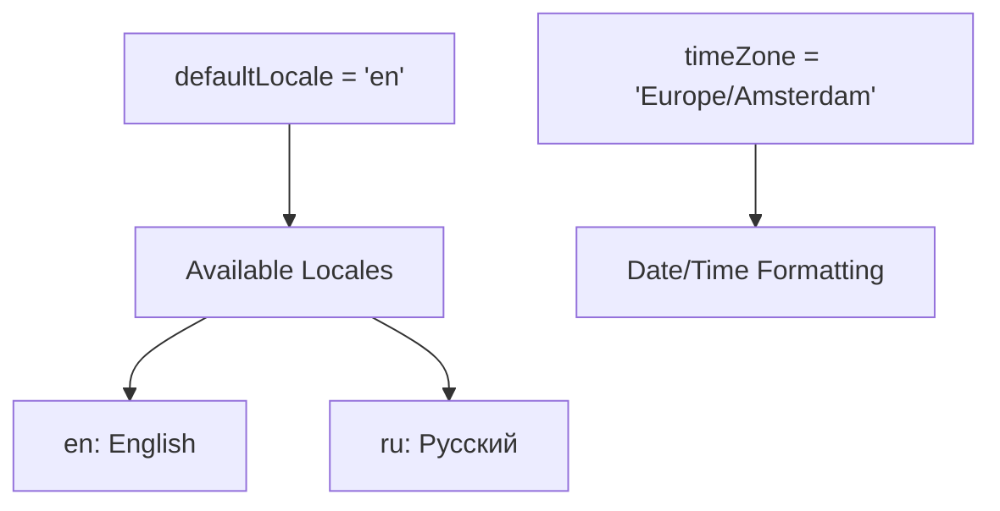
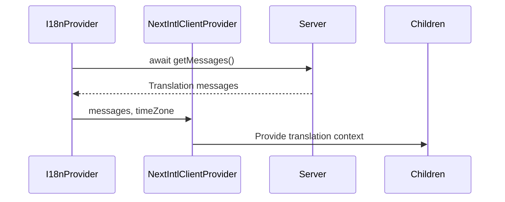
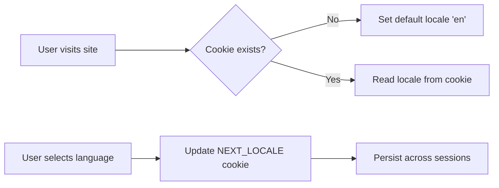
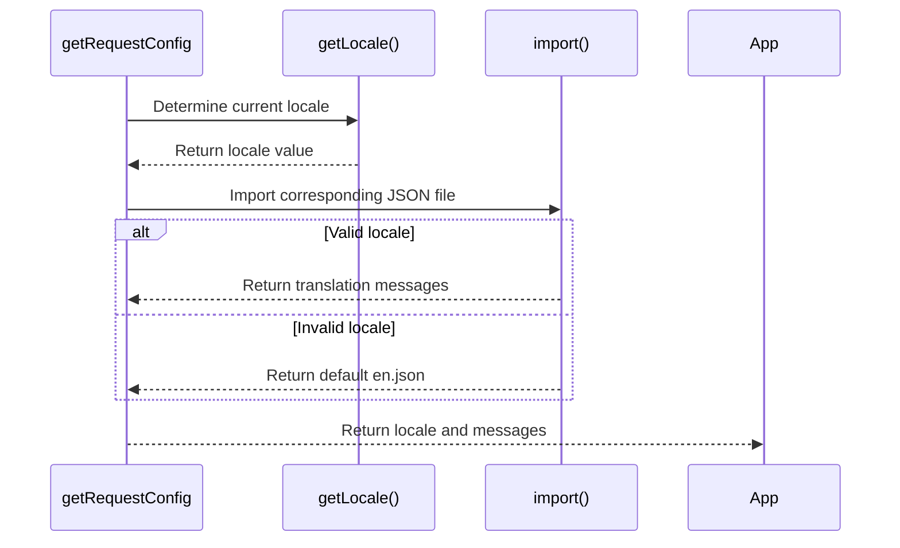
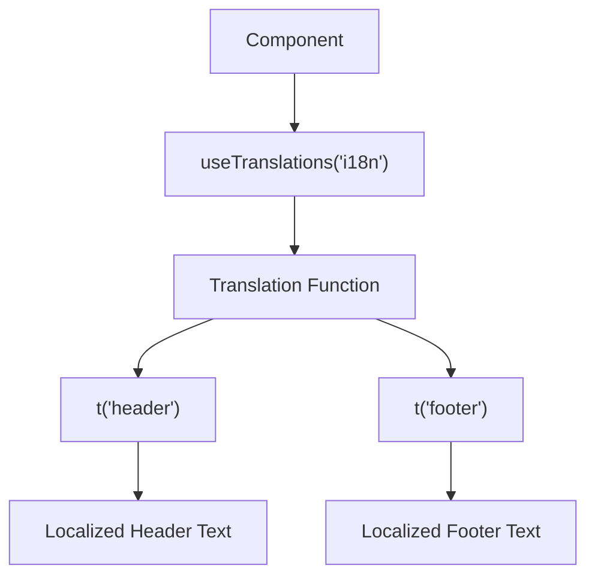
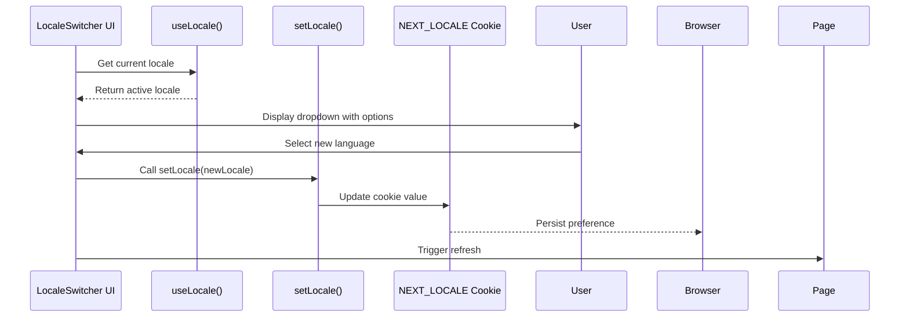
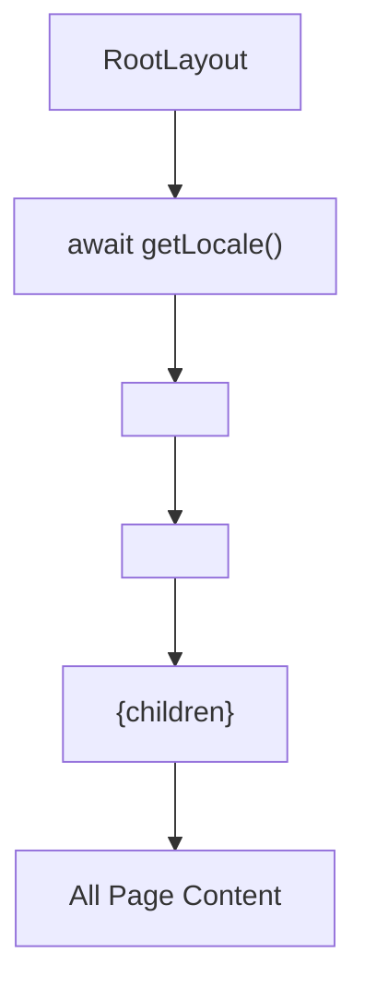

# Internationalization

<cite>
**Referenced Files in This Document**   
- [config.ts](file://passion/src/core/i18n/config.ts)
- [provider.tsx](file://passion/src/core/i18n/provider.tsx)
- [en.json](file://passion/public/locales/en.json)
- [ru.json](file://passion/public/locales/ru.json)
- [types.ts](file://passion/src/core/i18n/types.ts)
- [i18n.ts](file://passion/src/core/i18n/i18n.ts)
- [locale.ts](file://passion/src/core/i18n/locale.ts)
- [LocaleSwitcher.tsx](file://passion/src/components/LocaleSwitcher/LocaleSwitcher.tsx)
- [layout.tsx](file://passion/src/app/layout.tsx)
- [page.tsx](file://passion/src/app/page.tsx)
</cite>

## Table of Contents
1. [Introduction](#introduction)
2. [Core Configuration](#core-configuration)
3. [Translation Storage](#translation-storage)
4. [I18n Provider Implementation](#i18n-provider-implementation)
5. [Locale Management](#locale-management)
6. [Type Safety and Definitions](#type-safety-and-definitions)
7. [Initialization Process](#initialization-process)
8. [Translation Usage in Components](#translation-usage-in-components)
9. [Locale Switcher Component](#locale-switcher-component)
10. [Root Layout Integration](#root-layout-integration)
11. [Adding New Languages](#adding-new-languages)
12. [Best Practices and Guidelines](#best-practices-and-guidelines)

## Introduction

The internationalization (i18n) system in this Next.js application is built using the `next-intl` library to provide multilingual support for English and Russian languages. The implementation follows a structured approach with type safety, server-side locale detection, and client-side language switching capabilities. This documentation details the architecture, components, and workflows that enable seamless language localization across the application.

**Section sources**
- [config.ts](file://passion/src/core/i18n/config.ts#L1-L11)
- [provider.tsx](file://passion/src/core/i18n/provider.tsx#L1-L19)

## Core Configuration

The i18n system is configured through `config.ts`, which defines the default locale, available locales, and timezone settings. The configuration establishes 'en' as the default language with 'ru' as the additional supported locale. The `locales` array is defined as a constant tuple to ensure type safety, while the `localesMap` provides human-readable titles for each language option in the user interface.



**Diagram sources **
- [config.ts](file://passion/src/core/i18n/config.ts#L1-L11)

**Section sources**
- [config.ts](file://passion/src/core/i18n/config.ts#L1-L11)

## Translation Storage

Translations are stored in JSON format within the `public/locales/` directory, following the convention of `locale.json` (e.g., `en.json`, `ru.json`). Each translation file contains nested objects with keys representing different sections of the application. The current implementation includes an "i18n" section with "header" and "footer" keys for the main page content. This structure allows for organized grouping of translation strings by feature or component.

```mermaid
erDiagram
en.json {
string i18n.header
string i18n.footer
}
ru.json {
string i18n.header
string i18n.footer
}
en.json ||--|| ru.json : "Parallel Structure"
```

**Diagram sources **
- [en.json](file://passion/public/locales/en.json#L1-L6)
- [ru.json](file://passion/public/locales/ru.json#L1-L6)

**Section sources**
- [en.json](file://passion/public/locales/en.json#L1-L6)
- [ru.json](file://passion/public/locales/ru.json#L1-L6)

## I18n Provider Implementation

The `I18nProvider` component wraps the application to provide translation context to all child components. Implemented in `provider.tsx`, it uses `NextIntlClientProvider` from `next-intl` to deliver messages and timezone configuration. The provider asynchronously fetches translation messages using `getMessages()` and passes them along with the configured timezone to ensure consistent date and time formatting across locales.



**Diagram sources **
- [provider.tsx](file://passion/src/core/i18n/provider.tsx#L1-L19)

**Section sources**
- [provider.tsx](file://passion/src/core/i18n/provider.tsx#L1-L19)

## Locale Management

Locale persistence is handled through HTTP cookies using Next.js server actions. The `locale.ts` file exports two functions: `getLocale()` and `setLocale()`. The system reads the current locale from a cookie named `NEXT_LOCALE`, defaulting to 'en' if no preference is set. When users change languages via the LocaleSwitcher, `setLocale()` updates the cookie value, ensuring the preference persists across sessions and page reloads.



**Diagram sources **
- [locale.ts](file://passion/src/core/i18n/locale.ts#L1-L22)

**Section sources**
- [locale.ts](file://passion/src/core/i18n/locale.ts#L1-L22)

## Type Safety and Definitions

The i18n system maintains type safety through `types.ts`, which defines the `Locale` type based on the available locales in `config.ts`. By using TypeScript's `typeof` and tuple types, the system ensures that only valid locale values can be used throughout the application. This prevents runtime errors from invalid locale strings and provides autocomplete support in development environments.

```mermaid
classDiagram
class types {
+Locale : 'en' | 'ru'
}
class config {
+defaultLocale : 'en'
+locales : ['en', 'ru']
+localesMap : {key, title}[]
}
types --> config : "derives from"
```

**Diagram sources **
- [types.ts](file://passion/src/core/i18n/types.ts#L1-L6)
- [config.ts](file://passion/src/core/i18n/config.ts#L1-L11)

**Section sources**
- [types.ts](file://passion/src/core/i18n/types.ts#L1-L6)

## Initialization Process

The i18n initialization is configured in `i18n.ts` using `getRequestConfig` from `next-intl/server`. This function determines the active locale by calling `getLocale()` and then dynamically imports the corresponding translation file from `public/locales/`. The system includes fallback logic to default to English if an invalid or unsupported locale is detected, ensuring the application remains functional under all circumstances.



**Diagram sources **
- [i18n.ts](file://passion/src/core/i18n/i18n.ts#L1-L20)

**Section sources**
- [i18n.ts](file://passion/src/core/i18n/i18n.ts#L1-L20)

## Translation Usage in Components

Components access translations using the `useTranslations` hook from `next-intl`. As demonstrated in `page.tsx`, the hook is called with a namespace parameter (e.g., 'i18n') to scope the translations. The returned function allows components to retrieve localized strings by key, such as `t('header')` and `t('footer')`. This approach provides a clean, functional interface for accessing translations while maintaining type safety.



**Diagram sources **
- [page.tsx](file://passion/src/app/page.tsx#L1-L64)

**Section sources**
- [page.tsx](file://passion/src/app/page.tsx#L1-L64)

## Locale Switcher Component

The `LocaleSwitcher` component provides a user interface for changing languages. Implemented as a select dropdown using Telegram UI components, it displays the available languages from `localesMap`. When a user selects a different language, the `onChange` handler calls `setLocale()` to update the cookie and trigger a page refresh. The component uses `useLocale()` to display the currently active language as the selected option.



**Diagram sources **
- [LocaleSwitcher.tsx](file://passion/src/components/LocaleSwitcher/LocaleSwitcher.tsx#L1-L27)

**Section sources**
- [LocaleSwitcher.tsx](file://passion/src/components/LocaleSwitcher/LocaleSwitcher.tsx#L1-L27)

## Root Layout Integration

The i18n system is integrated at the root level through `layout.tsx`, ensuring all pages inherit the localization context. The `RootLayout` component asynchronously retrieves the current locale and sets it as the `lang` attribute on the HTML element. The `I18nProvider` wraps the entire application content, making translation functions available to all components. This top-down approach guarantees consistent language handling across the entire application.



**Diagram sources **
- [layout.tsx](file://passion/src/app/layout.tsx#L1-L30)

**Section sources**
- [layout.tsx](file://passion/src/app/layout.tsx#L1-L30)

## Adding New Languages

To add a new language to the application, follow these steps:
1. Add the locale code to the `locales` array in `config.ts`
2. Create a new JSON file in `public/locales/` with the corresponding locale name
3. Add the language to `localesMap` with a human-readable title
4. Populate the new translation file with all required keys

The type system will automatically recognize the new locale through the `Locale` type definition, ensuring type safety throughout the codebase. After adding a new language, it will immediately appear in the LocaleSwitcher component without requiring additional configuration.

**Section sources**
- [config.ts](file://passion/src/core/i18n/config.ts#L1-L11)
- [en.json](file://passion/public/locales/en.json#L1-L6)

## Best Practices and Guidelines

When working with the i18n system, follow these best practices:
- Use consistent key naming conventions across translation files
- Group related strings under logical namespaces
- Include comments for ambiguous or context-dependent translations
- Test all UI components with different language lengths
- Consider RTL (right-to-left) language support for future expansion
- Use dynamic imports for large translation files to optimize bundle size
- Implement proper error boundaries for translation loading failures

The current implementation demonstrates effective use of Next.js server components for locale detection and client components for interactive language switching, providing a robust foundation for multilingual applications.

**Section sources**
- [config.ts](file://passion/src/core/i18n/config.ts#L1-L11)
- [provider.tsx](file://passion/src/core/i18n/provider.tsx#L1-L19)
- [locale.ts](file://passion/src/core/i18n/locale.ts#L1-L22)