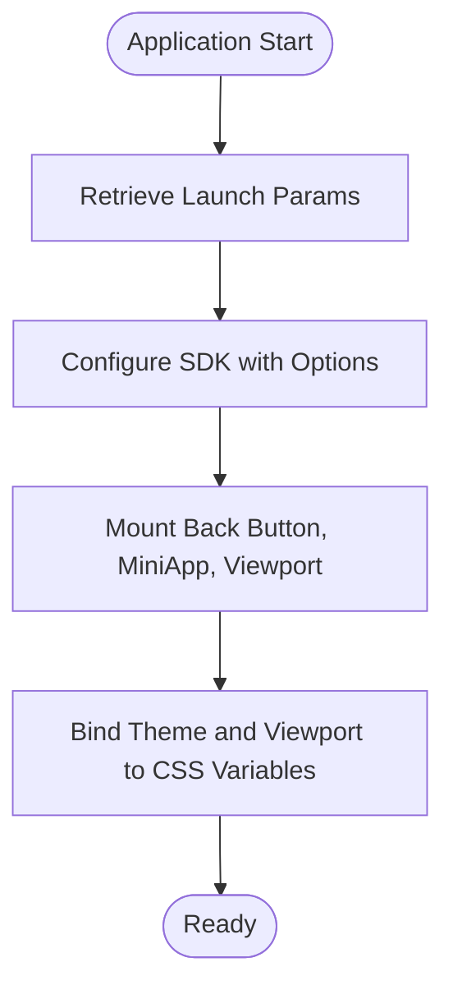

# Project Overview

<cite>
**Referenced Files in This Document**   
- [README.md](file://passion/README.md)
- [instrumentation-client.ts](file://passion/src/instrumentation-client.ts)
- [init.ts](file://passion/src/core/init.ts)
- [mockEnv.ts](file://passion/src/mockEnv.ts)
- [Root.tsx](file://passion/src/components/Root/Root.tsx)
- [layout.tsx](file://passion/src/app/layout.tsx)
- [provider.tsx](file://passion/src/core/i18n/provider.tsx)
- [next.config.ts](file://passion/next.config.ts)
- [config.ts](file://passion/src/core/i18n/config.ts)
- [page.tsx](file://passion/src/app/page.tsx)
- [ton-connect/page.tsx](file://passion/src/app/ton-connect/page.tsx)
- [theme-params/page.tsx](file://passion/src/app/theme-params/page.tsx)
- [launch-params/page.tsx](file://passion/src/app/launch-params/page.tsx)
- [init-data/page.tsx](file://passion/src/app/init-data/page.tsx)
</cite>

## Table of Contents
1. [Introduction](#introduction)
2. [Technology Stack](#technology-stack)
3. [Architectural Style](#architectural-style)
4. [Key Features](#key-features)
5. [Development Environment Simulation](#development-environment-simulation)
6. [Core Initialization Process](#core-initialization-process)
7. [Multi-Language Support](#multi-language-support)
8. [Use Cases for Developers](#use-cases-for-developers)

## Introduction

The Passion-bot-2 project is a Next.js-based template designed to streamline the development of Telegram Mini Apps with integrated TON Connect wallet functionality. It serves as a comprehensive starting point for developers aiming to build interactive web applications within the Telegram ecosystem. The template demonstrates best practices for integrating with Telegram's platform, handling initialization data, accessing launch and theme parameters, and supporting multiple languages. By leveraging modern web technologies and official SDKs, this project enables rapid prototyping and deployment of feature-rich Telegram Mini Apps.

**Section sources**
- [README.md](file://passion/README.md#L1-L141)

## Technology Stack

Passion-bot-2 is built using a modern technology stack that combines robust frameworks with specialized libraries for Telegram integration. The core technologies include:

- **TypeScript**: Provides type safety and enhances code maintainability.
- **Next.js**: Enables server-side rendering, routing, and seamless deployment workflows.
- **@telegram-apps/sdk-react**: Facilitates interaction with Telegram's Mini App features such as theme parameters, launch data, and UI components.
- **@tonconnect/ui-react**: Integrates TON blockchain wallet connectivity, allowing users to connect and interact with their TON wallets directly within the app.
- **next-intl**: Implements internationalization support for multi-language applications.
- **Tailwind CSS**: Offers utility-first styling for responsive and consistent design.

This combination ensures a scalable, maintainable, and user-friendly development experience.

**Section sources**
- [README.md](file://passion/README.md#L6-L10)
- [package.json](file://passion/package.json)

## Architectural Style

The application follows the Next.js App Router architecture, organizing routes and components in a hierarchical structure under the `app/` directory. This approach enables efficient code splitting, server-side rendering, and simplified routing logic. React components are used extensively throughout the project, with client-side rendering applied where necessary to access Telegram-specific APIs.

The root component (`Root.tsx`) manages the application state and initializes critical dependencies, including error boundaries and internationalization providers. The layout is defined in `layout.tsx`, which wraps all pages with essential providers such as `I18nProvider` and `Root`, ensuring consistent behavior across the application.


**Diagram sources**
- [layout.tsx](file://passion/src/app/layout.tsx#L1-L30)
- [Root.tsx](file://passion/src/components/Root/Root.tsx#L1-L59)

**Section sources**
- [layout.tsx](file://passion/src/app/layout.tsx#L1-L30)
- [Root.tsx](file://passion/src/components/Root/Root.tsx#L1-L59)

## Key Features

### TON Connect Integration
The template includes a dedicated page (`/ton-connect`) that demonstrates how to integrate the TON Connect wallet using `@tonconnect/ui-react`. Users can connect their wallets, view account details, and access device information through an intuitive interface.

### Launch and Theme Parameter Access
Pages under `/launch-params` and `/theme-params` showcase how to retrieve and display launch parameters and theme settings from Telegram. These values are essential for customizing the app's appearance and behavior based on the user's environment.

### Initialization Data Handling
The `/init-data` page illustrates how to access and parse initialization data, including user information, chat context, and receiver details. This data is crucial for personalizing the user experience and validating session authenticity.

### Multi-Language Support
Built-in internationalization allows the app to support multiple languages (currently English and Russian). Language preferences are automatically detected from the user's Telegram profile and applied dynamically.

**Section sources**
- [page.tsx](file://passion/src/app/page.tsx#L1-L64)
- [ton-connect/page.tsx](file://passion/src/app/ton-connect/page.tsx#L1-L108)
- [theme-params/page.tsx](file://passion/src/app/theme-params/page.tsx#L1-L27)
- [launch-params/page.tsx](file://passion/src/app/launch-params/page.tsx#L1-L34)
- [init-data/page.tsx](file://passion/src/app/init-data/page.tsx#L1-L97)

## Development Environment Simulation

To facilitate development outside the Telegram app, the project uses `mockEnv.ts` to simulate the Telegram environment. This file intercepts requests for theme, viewport, and safe area data, providing mock responses that mimic real Telegram behavior. The simulation is only active during development mode (`NODE_ENV === 'development'`) and is automatically excluded in production builds.

The `instrumentation-client.ts` file orchestrates this process by calling `mockEnv()` before initializing the SDK. This ensures that developers can test the app in a browser without requiring constant deployment to Telegram.


**Diagram sources**
- [mockEnv.ts](file://passion/src/mockEnv.ts#L1-L82)
- [instrumentation-client.ts](file://passion/src/instrumentation-client.ts#L1-L26)

**Section sources**
- [mockEnv.ts](file://passion/src/mockEnv.ts#L1-L82)
- [instrumentation-client.ts](file://passion/src/instrumentation-client.ts#L1-L26)

## Core Initialization Process

Application initialization is managed through `init.ts`, which configures the `@telegram-apps/sdk-react` library and mounts essential components such as the back button, mini app interface, and viewport handler. The `init()` function accepts configuration options including debug mode and Eruda console injection for mobile debugging.

The initialization sequence ensures that all Telegram-specific features are properly bound to CSS variables and React signals, enabling real-time updates when the user changes themes or resizes the app window.



**Diagram sources**
- [init.ts](file://passion/src/core/init.ts#L1-L83)

**Section sources**
- [init.ts](file://passion/src/core/init.ts#L1-L83)
- [instrumentation-client.ts](file://passion/src/instrumentation-client.ts#L1-L26)

## Multi-Language Support

Internationalization is implemented using `next-intl`, configured via `next.config.ts` to load locale files from `public/locales/`. The `i18n` module in `src/core/i18n/` manages language detection, message loading, and dynamic locale switching.

The `LocaleSwitcher` component allows users to manually change the language, while the system automatically sets the default based on the user's Telegram language code. Supported locales are defined in `config.ts`, currently including English (`en`) and Russian (`ru`).

```mermaid
graph TB
A[User Opens App] --> B{Language Detected?}
B --> |Yes| C[Set Locale from initData]
B --> |No| D[Use Default Locale (en)]
C --> E[Load Messages from /locales/*.json]
D --> E
E --> F[Render Translated UI]
```

**Diagram sources**
- [config.ts](file://passion/src/core/i18n/config.ts#L1-L11)
- [provider.tsx](file://passion/src/core/i18n/provider.tsx#L1-L19)

**Section sources**
- [config.ts](file://passion/src/core/i18n/config.ts#L1-L11)
- [provider.tsx](file://passion/src/core/i18n/provider.tsx#L1-L19)
- [next.config.ts](file://passion/next.config.ts#L1-L9)

## Use Cases for Developers

This template is ideal for developers building Telegram Mini Apps that require:
- Wallet integration (e.g., cryptocurrency transactions, NFT displays)
- Personalized user experiences based on Telegram profile data
- Dynamic theming that matches the user's Telegram interface
- Multi-language support for global audiences
- Debugging tools and development workflows outside Telegram

By providing a ready-to-use foundation, Passion-bot-2 reduces boilerplate code and accelerates time-to-market for new Mini Apps.

**Section sources**
- [README.md](file://passion/README.md#L45-L141)
- [page.tsx](file://passion/src/app/page.tsx#L1-L64)